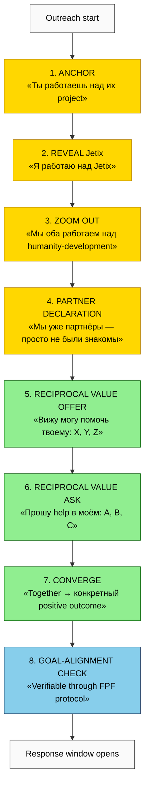
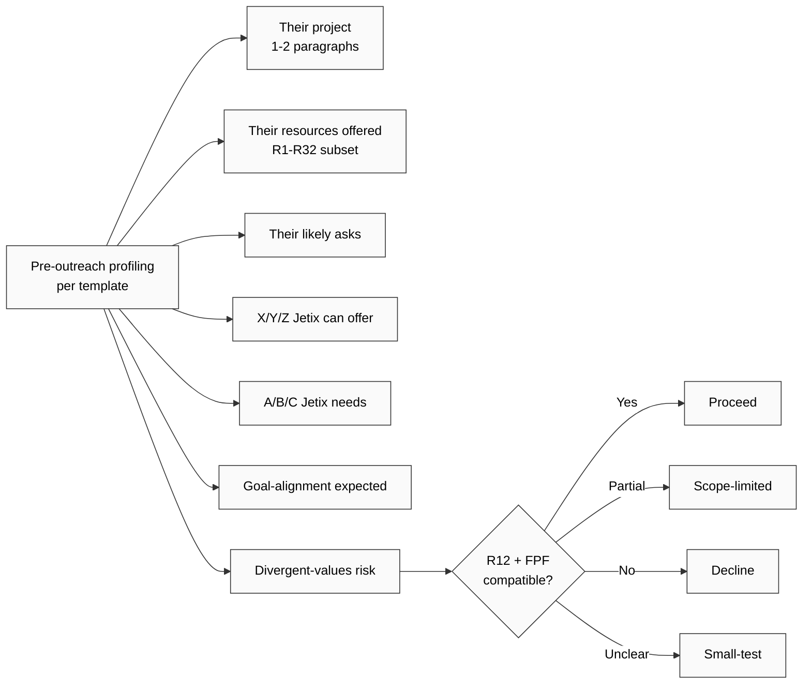
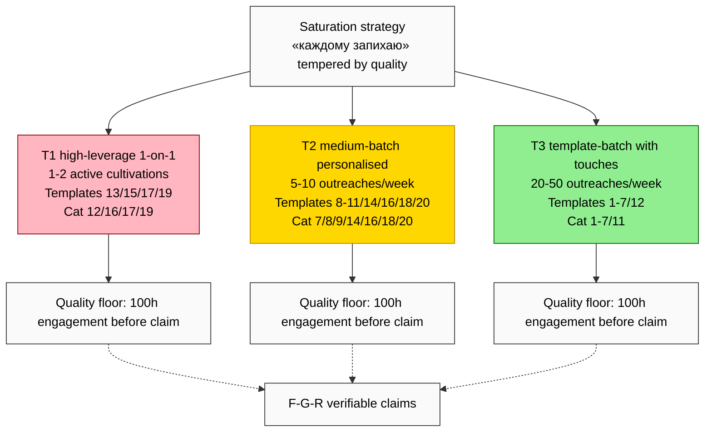
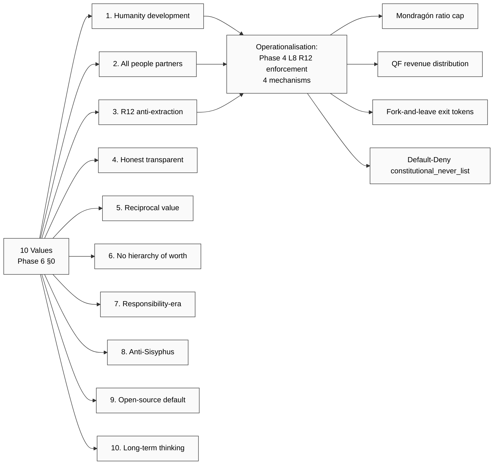

# Diagram 6 — Partner-Framing Reveal Pattern (text_011 thesis operationalised)

## 8-step reveal sequence

## Pre-meeting profiling required (FPF discipline)

## Saturation discipline (3-tier)

## 10 values × 22 categories × R12 alignment

**Cross-link:** Phase 6 §11 reveal pattern + §12 10 base templates + §14 saturation; Phase 8 20 operationalised templates; Phase 4 R12 enforcement.

---

*Mermaid Diagram 6 of 7. Phase 6 visualisation. 8-step reveal + pre-meeting profiling + saturation discipline + values × enforcement.*
