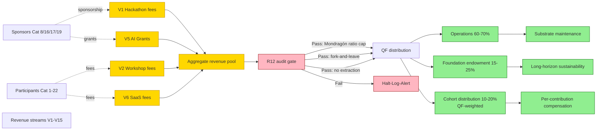
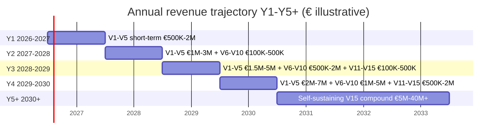
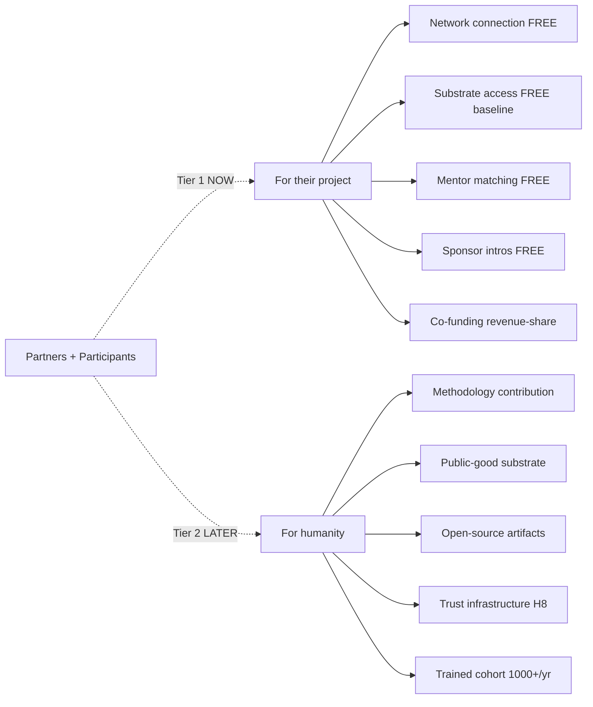

# Diagram 7 — Monetization Variants × Horizon × Revenue Flow

## 15 variants × 3 horizons (breadth NOT selection)

```mermaid
graph TD
    JETIX[Jetix Substrate<br/>15 monetization variants surfaced]

    JETIX --> SHORT[Short-term Q3-Q4 2026<br/>V1-V5]
    JETIX --> MID[Mid-term 2026-2027<br/>V6-V10]
    JETIX --> LONG[Long-term 2027+<br/>V11-V15]

    SHORT --> V1[V1 Hackathon sponsorship]
    SHORT --> V2[V2 Workshop training fees]
    SHORT --> V3[V3 Consulting]
    SHORT --> V4[V4 Quick-money P1 AI]
    SHORT --> V5[V5 AI Grant non-dilutive]

    MID --> V6[V6 SaaS Platform fees]
    MID --> V7[V7 Tokenized governance]
    MID --> V8[V8 SBT issuance]
    MID --> V9[V9 M&A advisory]
    MID --> V10[V10 Curriculum licensing]

    LONG --> V11[V11 Network State residency]
    LONG --> V12[V12 QF revenue pool]
    LONG --> V13[V13 Royalty derived products]
    LONG --> V14[V14 Foundation endowment]
    LONG --> V15[V15 Self-sustaining compound]

    classDef now fill:#90EE90,stroke:#006400
    classDef mid fill:#FFD700,stroke:#B8860B
    classDef future fill:#87CEEB,stroke:#1E3A5F

    class V1,V2,V3,V4,V5 now
    class V6,V7,V8,V9,V10 mid
    class V11,V12,V13,V14,V15 future
```

## Revenue flow + R12 enforcement

## Annual revenue trajectory Y1-Y5+ (illustrative)

## 2-tier value framing (per Ruslan text_010)

**Cross-link:** Phase 7 §1-§10 detailed; Phase 4 L8 R12 enforcement substrate; Phase 5 IP-1 (Ruslan selects mix); breadth NOT selection.

---

*Mermaid Diagram 7 of 7. Phase 7 visualisation. 15 variants × 3 horizons + revenue flow + R12 audit + Y1-Y5+ trajectory + 2-tier value.*
