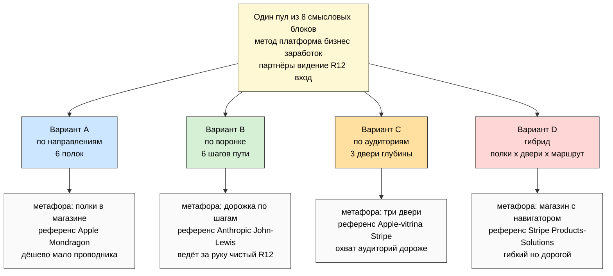
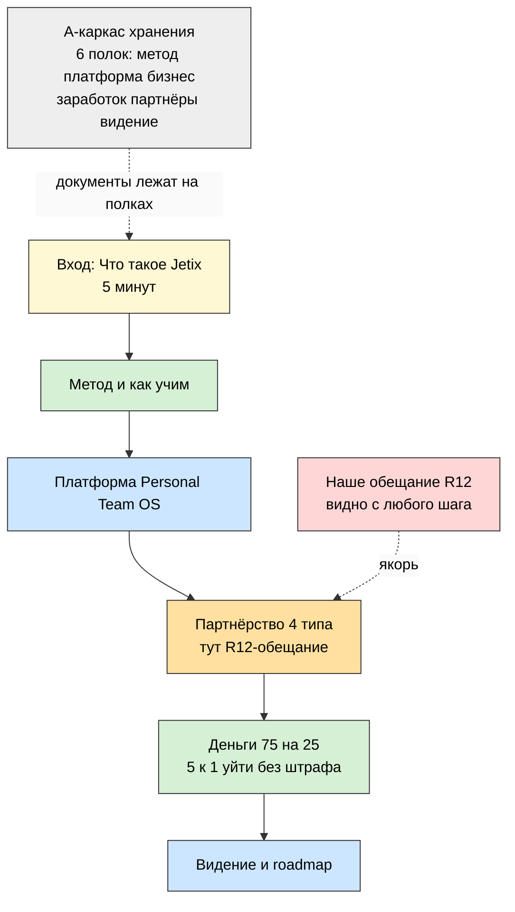
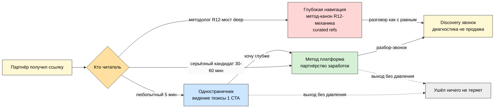
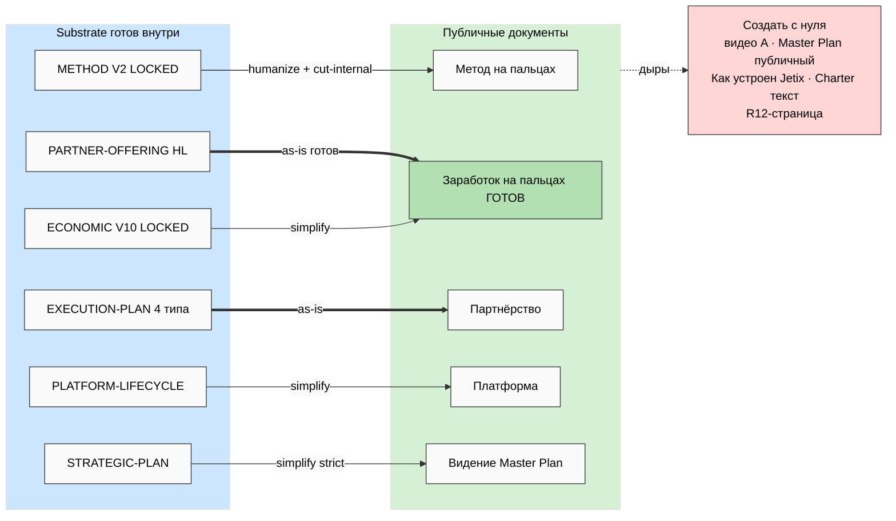
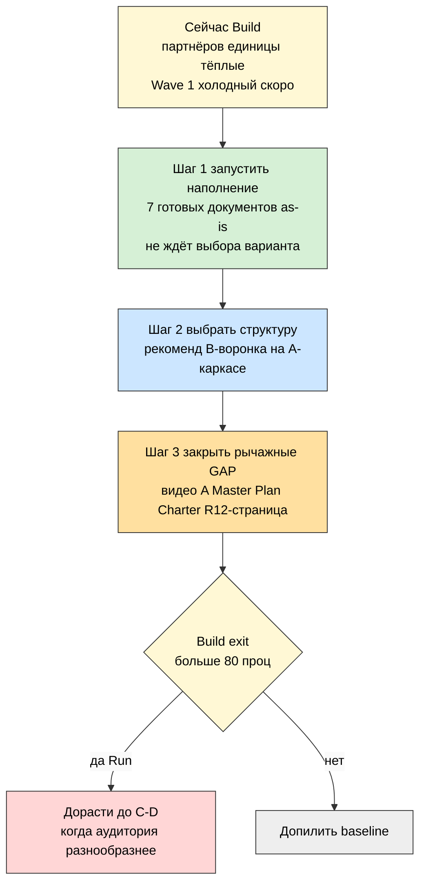

# 🎨 Mermaid INDEX — META-1..META-5

> 5 схем метаплана. Все — light-theme (чёрный текст). META-1 и META-2 встроены inline в main
> (`decisions/strategic/JETIX-PUBLIC-DOCS-METAPLAN-2026-05-25.md`); все 5 — здесь.

---

## META-1 — Три варианта обзором (по чему разбиваем)

---

## META-2 — Рекомендованная структура (B-воронка на A-каркасе)

---

## META-3 — Поток партнёра по аудиториям (3 входа)

---

## META-4 — Substrate mapping (94 docs → публичные документы)

---

## META-5 — Последовательность реализации (этап решает структуру)

---

*INDEX closure. 5 схем META-1..META-5 (light-theme): варианты обзором / рекомендованная
структура B-на-A / поток по 3 аудиториям / substrate mapping / последовательность реализации.
R1 surface — рекомендация = surface, выбор твой. IP-1 STRICT.*
