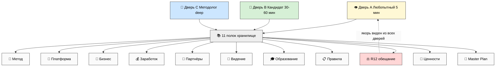
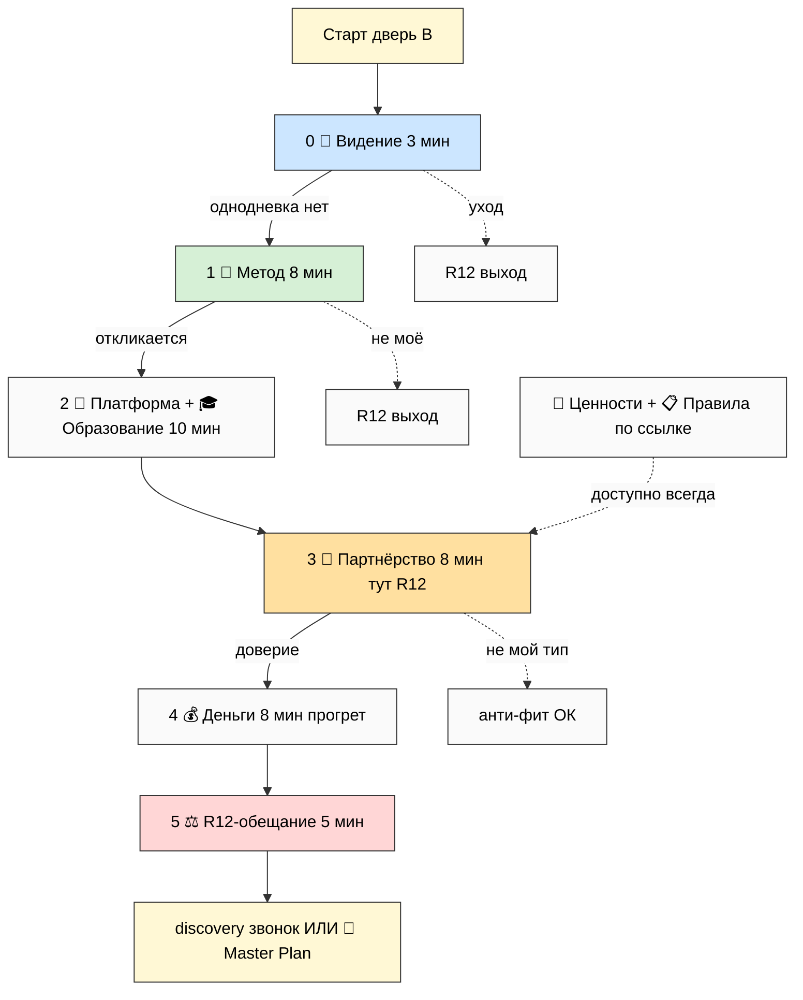
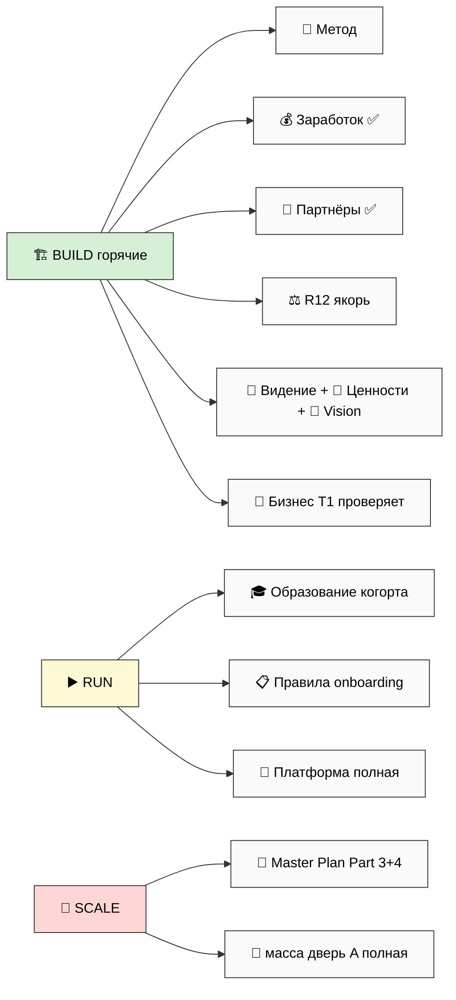
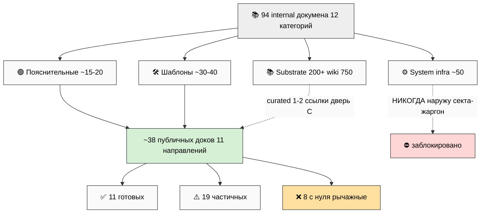
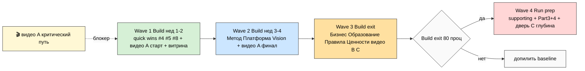
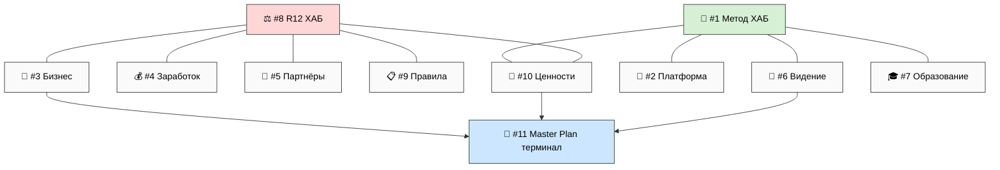
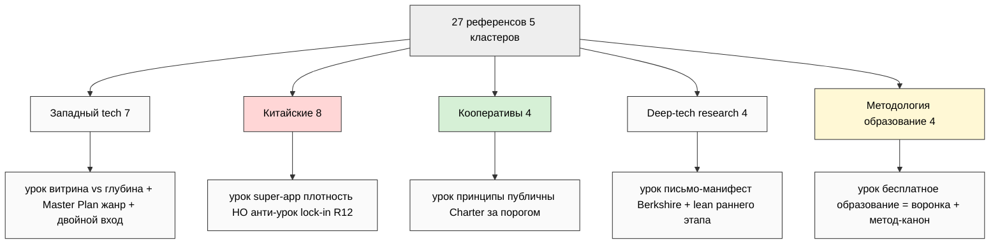
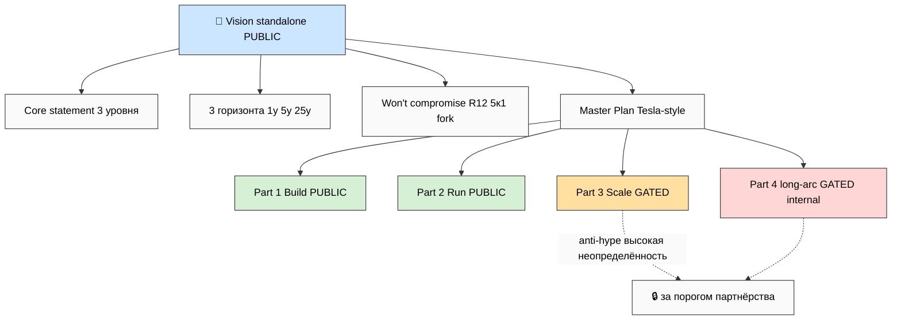
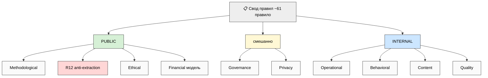
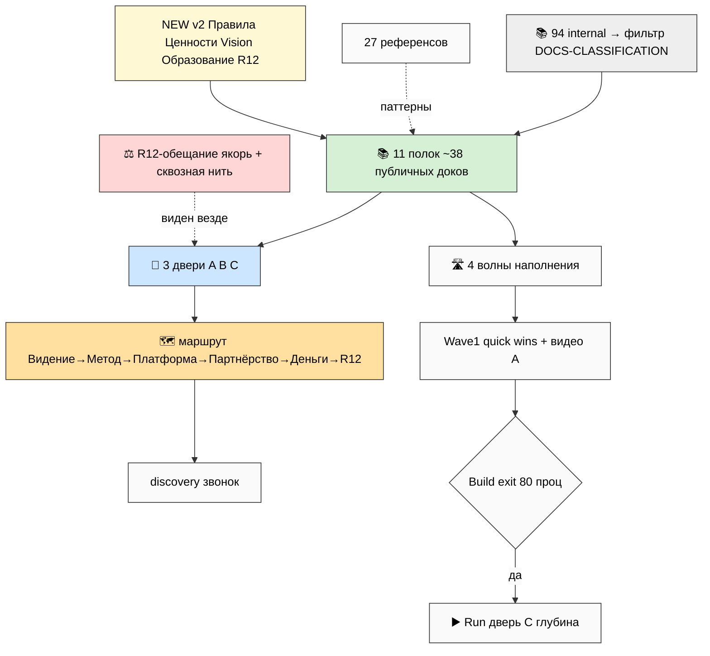

# 📊 Phase 10 — Mermaid suite META-V2-1..META-V2-10

> **Что это.** 10 схем, визуализирующих всю архитектуру v2. Light bg, ≥10-15 узлов каждая. Каждая
> с одной строкой «что показывает». Используются inline в main (Phase 11 §11) + INDEX в `diagrams/`.

---

## META-V2-1 — 11 направлений × 3 двери (Variant D Hybrid expanded)

*Показывает: каркас D — 11 полок (хранилище) входятся через 3 двери (витрина).*

---

## META-V2-2 — Мастер-маршрут (route через направления)

*Показывает: тропа двери B с decision-точками и R12-выходами на каждом шаге.*

---

## META-V2-3 — Audience × Direction heat map (этап-приоритет)

*Показывает: какие направления горячи на Build (готовить первыми) vs Run/Scale.*

---

## META-V2-4 — Substrate mapping (94 internal → ~38 public)

*Показывает: как 94 internal-дока в 4 категориях фильтруются в публичный набор.*

---

## META-V2-5 — Implementation timeline (4 волны)

*Показывает: последовательность наполнения, привязка к Build/Run, критический путь видео A.*

---

## META-V2-6 — Cross-direction relations + dependencies

*Показывает: хабы (#8 R12, #1 Метод) и лестницы глубины (#6→#11).*

---

## META-V2-7 — Reference corps comparison (5 кластеров)

*Показывает: 5 кластеров референсов и главный урок каждого для Jetix.*

---

## META-V2-8 — Vision + Master Plan structure (4 части)

*Показывает: Vision standalone + 4 части Master Plan с public/gated split.*

---

## META-V2-9 — Rules document 10 углов tree

*Показывает: 10 углов свода правил + public/internal разметка.*

---

## META-V2-10 — Master synthesis (вся архитектура)

*Показывает: всё вместе — пул → 11 полок → 3 двери → маршрут → R12-якорь → roadmap.*

---

## §Сводка mermaid suite

| Схема | Что показывает | Узлов | Inline в main |
|---|---|---|---|
| META-V2-1 | 11 полок × 3 двери (каркас D) | ~17 | §2 |
| META-V2-2 | мастер-маршрут + R12-выходы | ~13 | §7 |
| META-V2-3 | этап-приоритет heat (Build/Run/Scale) | ~14 | §7 |
| META-V2-4 | 94 → 38 substrate фильтр | ~12 | §8 |
| META-V2-5 | 4 волны timeline + видео A | ~10 | §10 |
| META-V2-6 | cross-direction хабы + терминал | ~14 | §1 |
| META-V2-7 | 5 кластеров референсов | ~13 | §9 |
| META-V2-8 | Vision + Master Plan 4 части | ~12 | §5 |
| META-V2-9 | 10 углов правил tree | ~15 | §3 |
| META-V2-10 | master synthesis (всё) | ~16 | §0/§2 |

Все light bg (theme base + primaryColor #fafafa + явные style fill светлые). Все ≥10 узлов.

---

*Phase 10 closure. 10 mermaid META-V2-1..10: каркас D (полки×двери) / маршрут / heat-этапы /
substrate-фильтр / timeline 4 волны / cross-direction хабы / 5 кластеров референсов / Vision+
Master Plan / 10 углов правил / master synthesis. Все light bg, ≥10 узлов. Сводка + inline-привязка
к main §. INDEX в diagrams/_INDEX.md. R11 — визуализация структуры, не контент. IP-1. Pool result.*
