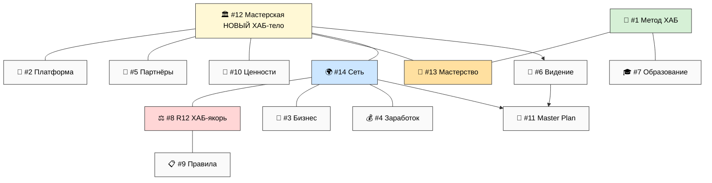

# Интеграция с 11 направлениями метаплана-v2

> **Что это.** Карта, где 3 новых направления (#12 Мастерская / #13 Мастерство / #14 Сеть)
> добавляют ценность к существующим 11. Итог: 11 → **14 направлений**. Метаплан-v2 **НЕ
> модифицируется** (append-only) — это карта связей поверх него; финальная интеграция в
> metaplan-v3 = отдельная итерация (R1, запускает Руслан).

---

## §1 Per-direction: где workshop-метафора добавляет ценность

11 направлений из метаплана-v2 §1: 1 Метод · 2 Платформа · 3 Бизнес · 4 Заработок · 5 Партнёры ·
6 Видение · 7 Образование · 8 R12/Обещание · 9 Правила · 10 Ценности · 11 Master Plan.

| # существ. | Что добавляет Workshop/Mastery/Network | Главная связь |
|---|---|---|
| **1 🧪 Метод** | Метод-метод (Method §J) = **педагогика Мастерства** (#13). Мастерская = место, где метод применяют руками (tacit). | #13 §C наследует Method V2 §J целиком |
| **2 🚀 Платформа** | Platform = **технический слой Мастерской** (#12 стена инструментов §B). Personal/Team OS = инструменты на полке. | #12 §B = Platform tools materialized |
| **3 💼 Бизнес** | «Как устроен Jetix» = **кооператив Сети** (#14). Бизнес-модель = mesh + 75/25 + 5:1. | #14 §A топология = бизнес-структура |
| **4 💰 Заработок** | 75/25 + triple-role + 5:1 + fork-and-leave = **экономика Сети** (#14 §F/§J). Tier L7 = Workshop users. | #14 наследует PARTNER-OFFERING целиком |
| **5 👥 Партнёры** | 4 типа партнёров = **роли в Мастерской/Сети** (#12 §D / #14 §E). Archetypes → roles map (Phase 4 §4). | #12/#14 роли = партнёр-типы materialized |
| **6 🎯 Видение** | Workshop = **тело Видения** (Phase 4). #6 короткий обзор теперь = «вот мастерская». | Phase 4 Vision expansion |
| **7 🎓 Образование** | 7 ступеней Bloom = **прогрессия в Мастерстве** (#13 §D / #12 §D вертикаль ролей). | #13 §G mass upliftment + школа #14 §G |
| **8 ⚖️ R12/Обещание** | R12 = **primary surface Сети** (#14 §I anti-patterns). «Не доим/не запираем» материализуется в pooling/exit. | #14 §F/§I R12 paired-frame STRICT |
| **9 📋 Правила** | Правила = **операционка Мастерской/Сети** (как ставить станок, как пулить ресурс, как форкнуть cell). | #12 §B / #14 §F mechanics = правила |
| **10 💎 Ценности** | Триада O-138 = **направление Сети** (#14 §H) + спортзал/медитация Мастерской (#12 §B6/B7). Adequate intellect = anti-cheating Мастерства (#13 §E). | #12 §B + #13 §E + #14 §H |
| **11 📜 Master Plan** | Master Plan = **дуга Сети online→offline** (#14 §B + Phase 4 §8). Build/Run/Scale/Mature = 4 части. | Phase 4 §8 Master Plan expansion |

**Вывод:** 3 новых направления — не «добавка сбоку», а **тело**, в которое встраиваются 11
существующих. Метод/Платформа/Бизнес/Заработок/Партнёры/Образование/R12/Правила/Ценности — это
**детали внутри мастерской**, а Видение/Master Plan — её **дуга**. Workshop переводит абстрактные
направления в человеческий опыт места.

---

## §2 Cross-reference map (хабы связей)

Метаплан-v2 имел 2 хаба: #8 R12 (якорь) и #1 Метод. С новыми направлениями появляется **третий
хаб** — #12 Мастерская:



**3 хаба:** #1 Метод (педагогика) · #8 R12 (этика) · #12 Мастерская (тело). #14 Сеть = терминал
масштаба; #11 Master Plan = терминал глубины.

---

## §3 Обновления, нужные в существующих скелетах (R1 — для metaplan-v3)

Это **предложения**, не auto-применённые правки (append-only; метаплан-v2 не трогается):

- **#6 Видение** — Hero переписать с workshop-метафорой (Phase 4 §1 уровень 1-2); добавить
  «вот мастерская» как первый визуал.
- **#5 Партнёры** — добавить mapping «4 типа → роли в мастерской» (Phase 4 §4).
- **#4 Заработок** — пометить L7 «Workshop users» как явную связь с Мастерской.
- **#2 Платформа** — переформулировать «инструменты» как «станки на стене мастерской» (#12 §B).
- **#11 Master Plan** — 4 части привязать к 4 фазам online→offline (Phase 4 §8).
- **#7 Образование** — 7 ступеней Bloom привязать к вертикали ролей Мастерской (Visitor→Master).
- **Новый сквозной visual:** карта мастерской (зоны) как entry-point всего набора (дверь A).

---

## §4 Master narrative integration (где партнёр встречает workshop-метафору первой)

Маршрут двери B (метаплан-v2 §7) с workshop-метафорой как входом:

```
Старт двери B
  → 0. 🏛️ Мастерская (3 мин) ← ПЕРВОЕ: «вот место, вот зоны, вот кем станешь»  [НОВЫЙ вход]
  → 1. 🎯 Видение (2 мин) ← «вот дуга: одна мастерская → сеть мастерских»
  → 2. 🧪 Метод + 🎯 Мастерство (8 мин) ← «вот как прокачиваешься: метод-метод»
  → 3. 🚀 Платформа (5 мин) ← «вот станки на стене»
  → 4. 👥 Партнёрство (8 мин, R12) ← «вот роли, вот кого зовём»
  → 5. 💰 Деньги (8 мин) ← «75/25, 5:1, fork-and-leave»
  → 6. 🌍 Сеть (5 мин) ← «вот как это растёт online→offline»
  → 7. ⚖️ R12-обещание (5 мин) ← «не доим, не запираем»
  → discovery ИЛИ 📜 Master Plan
  (выход на каждом шаге = R12 off-ramp)
```

**Ключевое изменение нарратива:** до workshop'а маршрут начинался с абстрактного «Видения».
Теперь он начинается с **конкретного места** — «вот мастерская, вот что ты в ней делаешь». Это
снимает риск «звучит эзотерично» (метаплан-v2 риск #1 Метода): человек сначала видит место и
людей, потом узнаёт про метод-метод. Тело раньше абстракции.

---

## §5 Итог: 11 → 14 направлений

| Группа | Направления |
|---|---|
| **Тело (NEW)** | #12 Мастерская · #13 Мастерство · #14 Сеть |
| **Педагогика** | #1 Метод · #7 Образование |
| **Инфраструктура** | #2 Платформа · #3 Бизнес · #4 Заработок |
| **Люди** | #5 Партнёры |
| **Этика** | #8 R12 · #9 Правила · #10 Ценности |
| **Дуга** | #6 Видение · #11 Master Plan |

Карта полная: 14 направлений, 3 хаба (#1/#8/#12), один маршрут с workshop-входом. Финальная
интеграция в metaplan-v3 = отдельная итерация (R1).

---

*Phase 6 closure. Интеграция 3 новых направлений с 11 существующими: per-direction value-add,
cross-reference map (3 хаба, #12 Мастерская = новый хаб-тело), предложения обновлений скелетов
(R1), master narrative с workshop-входом. Метаплан-v2 не модифицируется (append-only). Переход к
Phase 7 — worked examples.*
