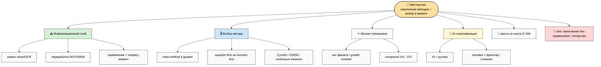
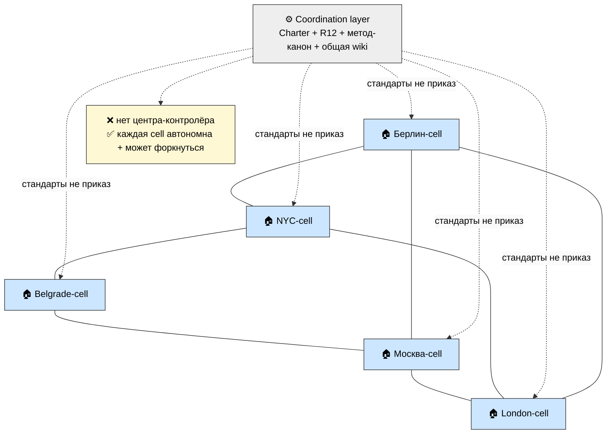
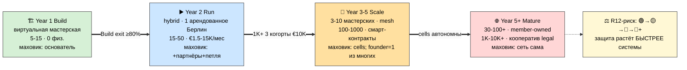
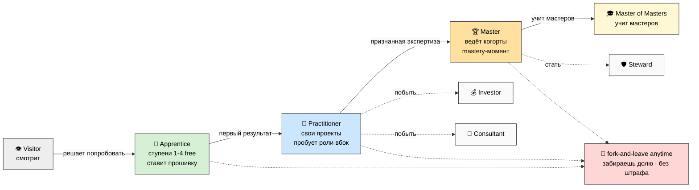
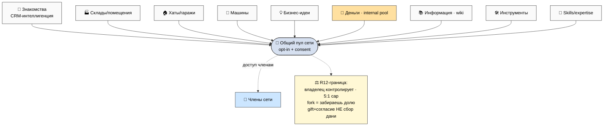
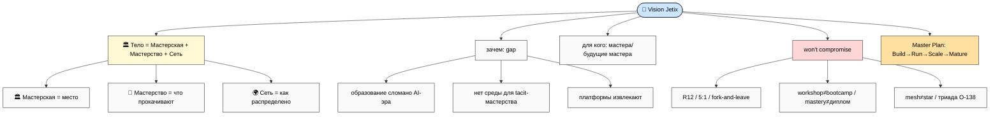
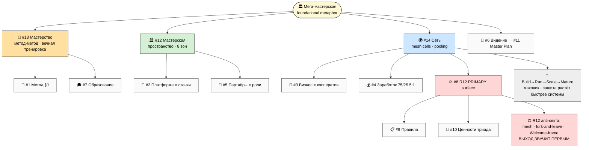

# Mermaid suite WK-1..WK-8

> **Что это.** 8 схем, визуализирующих концепцию Мастерская + Мастерство + Сеть. Все — light
> background (themeVariables с чёрным текстом для читаемости при копировании в Notion/PDF), ≥10
> узлов каждая. Каталог — `diagrams/_INDEX.md`. Схемы встраиваются inline в main (§9).

| # | Показывает | Главная мысль |
|---|---|---|
| WK-1 | Мастерская overview (зоны/активности/роли) | мастерская = пространство из 8 зон |
| WK-2 | Мастерство tree (информация/выбор/тренировка) | мастерство = накопление + выбор в момент |
| WK-3 | Топология сети (mesh с cells) | mesh не star (R12) |
| WK-4 | Online→Offline timeline | 4 фазы по «кто крутит маховик» |
| WK-5 | Member journey (Visitor→Master Mentor) | прогрессия без диплома |
| WK-6 | Resources pooling | 9 ресурсов в общий пул (opt-in + consent) |
| WK-7 | Vision expansion | workshop = тело Vision'а |
| WK-8 | Master synthesis | вся концепция одной плотной схемой |

---

## WK-1 — Мастерская overview (зоны / активности / роли)

```mermaid
%%{init: {'theme':'base','themeVariables':{'primaryTextColor':'#000','textColor':'#000','lineColor':'#333','primaryBorderColor':'#333','primaryColor':'#fafafa','noteBkgColor':'#fff8d5'}}}%%
graph TB
    WS([🏛️ Мастерская])
    WS --> ZONES[Зоны]
    WS --> ACTS[Активности]
    WS --> ROLES[Роли]
    ZONES --> Z1[🛠️ Стена инструментов<br/>улучшай / ставь станок]
    ZONES --> Z2[🔬 Исследовательский центр]
    ZONES --> Z3[🎯 Зона мастерства]
    ZONES --> Z4[🤝 Зона встреч / клуб]
    ZONES --> Z5[🏋️ Тренировочный + 💪 спортзал]
    ZONES --> Z6[🧘 Медитация + 🌴 отдых]
    ACTS --> A1[нарабатывать / создавать / изобретать]
    ACTS --> A2[встречать людей / побыть в роли]
    ACTS --> A3[соревнования / учить / создавать сообщества]
    ROLES --> R1[вертикаль: Visitor→Master of Masters]
    ROLES --> R2[горизонталь: Investor/Partner/Consultant/Researcher/Steward]
    style WS fill:#fff8d5,color:#000
    style ZONES fill:#d6f0d6,color:#000
    style ACTS fill:#cce6ff,color:#000
    style ROLES fill:#ffe0a0,color:#000
```

*Мастерская = пространство из 8+ зон, где живут 9 активностей и две оси ролей. «Всё что только
можно натянуть».*

---

## WK-2 — Мастерство tree (информация / выбор / тренировка / активности)

*Мастерство = информация (захват→переработка→применение) + выбор (meta-method уровень 3) + вечная
тренировка + AI-стратификация; для массы, не элиты.*

---

## WK-3 — Топология сети (mesh с cells)

*Mesh: cells равноправны и связаны напрямую; coordination layer даёт стандарты (Charter+R12), не
приказы. Нет центра = нет точки extraction/диктатуры (R12).*

---

## WK-4 — Online → Offline transition timeline

*4 фазы по «кто крутит маховик»; первое физ. место = арендованное при подтверждённой Run-петле;
цифры сценарные.*

---

## WK-5 — Member journey (Visitor → Master Mentor)

*Прогрессия без диплома (по репутации); горизонтальные роли примеряются на любом уровне; выход
открыт на каждом шаге (R12).*

---

## WK-6 — Resources pooling

*9 типов ресурсов в общий пул; каждый opt-in, с согласия, под контролем владельца; пул = gift +
consent, не сбор дани (R12).*

---

## WK-7 — Vision expansion (workshop = тело Vision'а)

*Vision получает тело: не «платформа», а мега-мастерская мирового уровня + сеть; gap + для кого +
won't-compromise + Master Plan 4 части.*

---

## WK-8 — Master synthesis (вся концепция одной плотной схемой)

*Вся концепция: мега-мастерская = тело, в которое встроены 14 направлений; 3 хаба (#1 Метод / #8
R12 / #12 Мастерская); lifecycle-дуга; R12 = primary surface Сети с анти-секта защитой.*

---

*Phase 9 closure. 8 mermaid WK-1..WK-8 (все light-bg, ≥10 узлов), каталог в diagrams/_INDEX.md.
Переход к Phase 10 — Main + SUMMARY + INDEX.*
