# Diagrams INDEX — 15 Mermaid Visualizations

> **15 mermaid diagrams** (each ≥6 nodes target; multiple ≥10 nodes per §11.0 mandate).
> Each diagram inline in this index с context + cross-cite Phase.

---

## §1 Master Qualification flow (8 levels x 3 indicators)

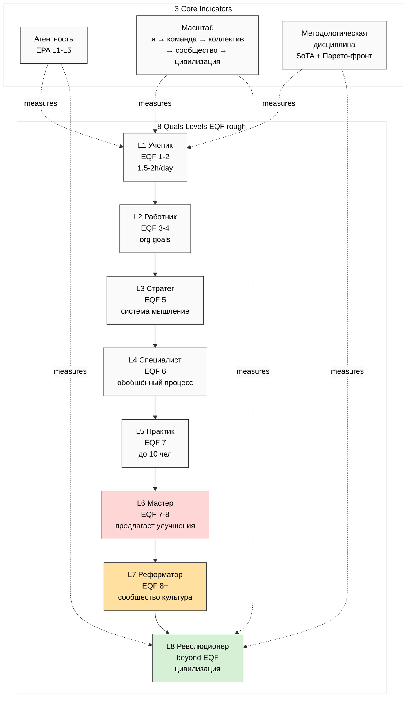

**Source:** Phase 1 §3-§4. **Decoded:** 3 ortho indicators × 8 levels = Goodhart-resistant measurement framework.

---

## §2 R0-R10 residency curriculum graph

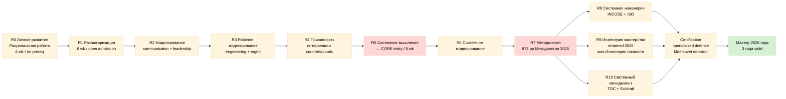

**Source:** Phase 2 §3 + Phase 6 §2. **Decoded:** Linear R0-R7, then split R8/R9/R10 then cert. 60+ weeks group format.

---

## §3 Books × Aisystant × R# × Quals correspondence

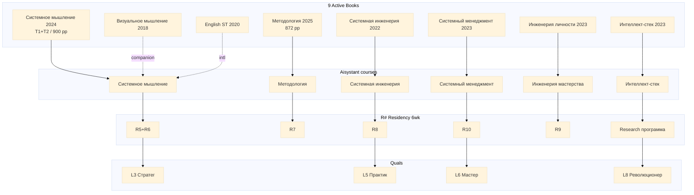

**Source:** Phase 4 §12. **Decoded:** Books feed Aisystant courses, feed R# residencies, certify к Quals levels.

---

## §4 Cost + Time для Master path

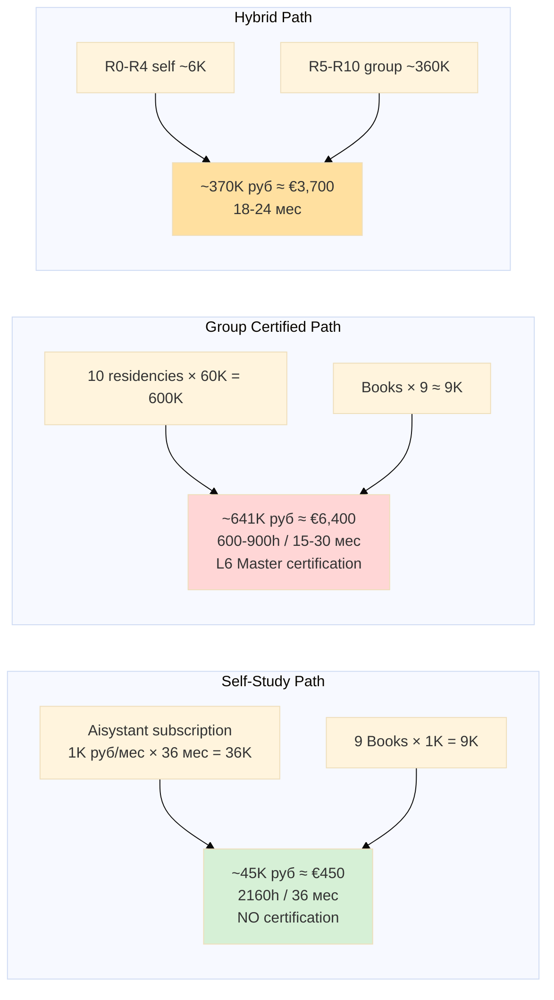

**Source:** Phase 6 §12. **Decoded:** Self-study cheapest (€450) but no cert; group fully certified €6,400; hybrid €3,700 middle path.

---

## §5 Левенчуковский book genealogy (annual rewrite cycle)

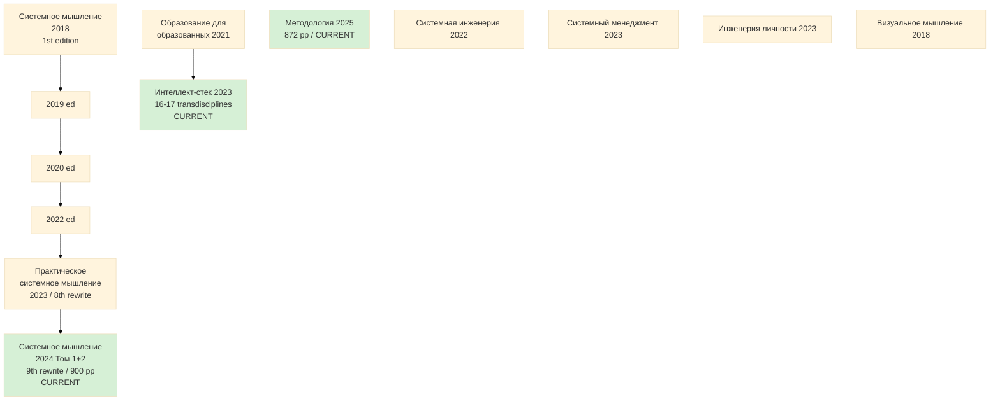

**Source:** Phase 4 §1 + R-A §2.1. **Decoded:** Annual rewrite cycle exemplifies «непрерывное всё» applied к pedagogical materials.

---

## §6 МИМ ecosystem 12+ figures map

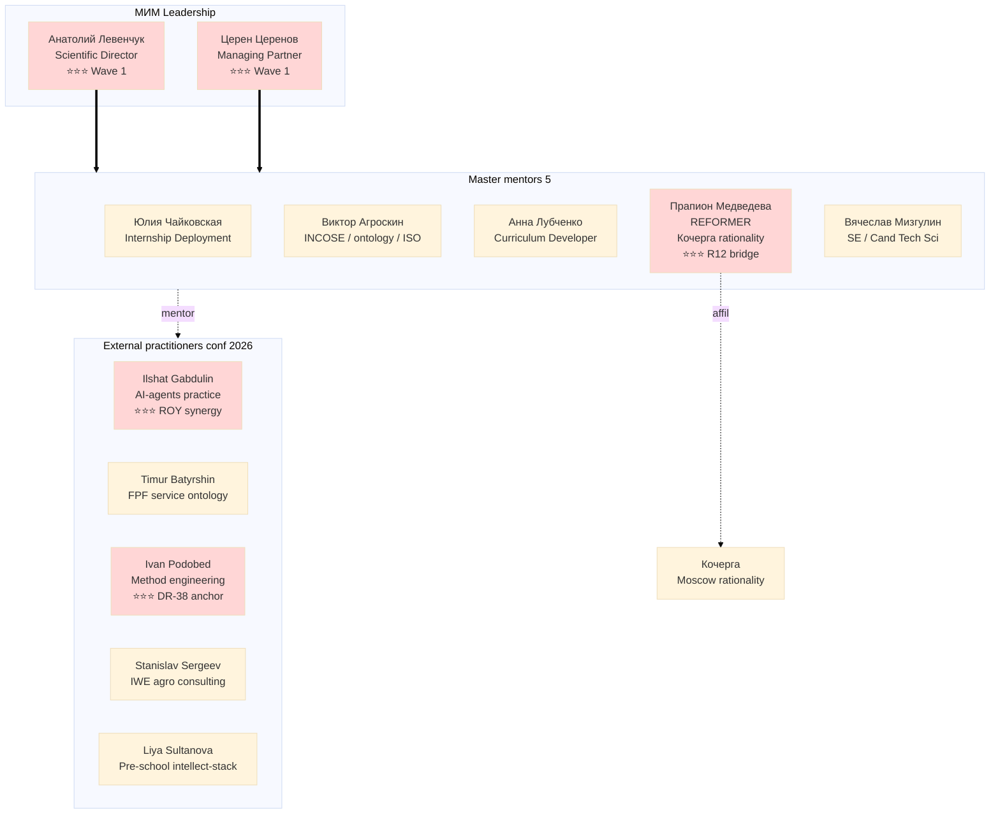

**Source:** Phase 5 §1-§15. **Decoded:** 5 ⭐⭐⭐ HIGHEST Wave 1 candidates: Левенчук + Tseren + Медведева + Gabdulin + Podobed.

---

## §7 Intellect-stack 16 transdisciplines layered

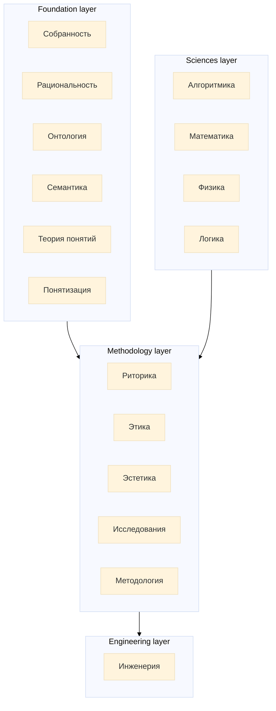

**Source:** Phase 4 §7.3 (Интеллект-стек 2023 + system-school.ru/stack). **Decoded:** 4 layers / 16 transdisciplines = replaces STEM as 21st-century professional standard.

---

## §8 FPF + SPF emergence pattern

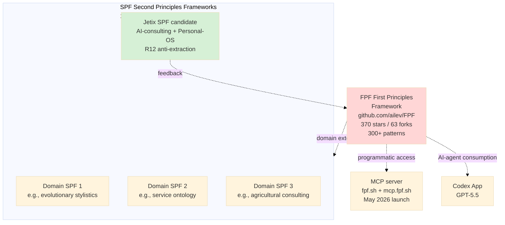

**Source:** Phase 3 §4 + Phase 7 §3 Proposal 9. **Decoded:** Jetix может formalise as Jetix-SPF for AI-consulting / Personal-OS / R12 domain.

---

## §9 Quality procedure (3-indicator measurement multi-mentor)

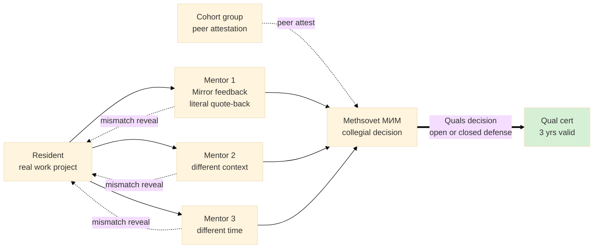

**Source:** Phase 1 §5 + qualification page. **Decoded:** 3-4 mirror events + cohort + Methsovet = subjective bias defused.

---

## §10 Jetix subsystems × ШСМ cross-pollination 32 proposals

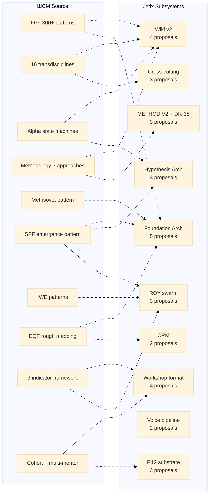

**Source:** Phase 7 §1-§12 (32 proposals total). **Decoded:** Every Jetix subsystem has ≥2 cross-pollination opportunity.

---

## §11 Jetix offer matrix 5 tiers × R12 risk

```mermaid
%%{init: {'theme':'base'}}%%
flowchart LR
    subgraph T0[T0 Lowest]
        T01[Conf attendance<br/>+ talk 2027]
    end
    subgraph T1[T1 Low]
        T11[Cross-cite]
        T12[Methsovet observer]
        T13[Wiki stack share]
        T14[Book review]
        T15[Mutual cohort discount]
    end
    subgraph T2[T2 Medium]
        T21[Joint paper SPF]
        T22[Joint AI study]
        T23[Methodology workshop]
    end
    subgraph T3[T3 Med-High]
        T31[Joint cohort PILOT]
        T32[Alumni pipeline]
    end
    subgraph T4[T4 Highest]
        T41[Jetix-as-SPF<br/>institutional status<br/>⚠️ R12 HIGH]
    end

    T0 -->|low R12| T1 -->|low R12| T2 -->|R12 contracts| T3 -->|R12 careful| T4

    style T01 fill:#d6f0d6
    style T11 fill:#d6f0d6
    style T41 fill:#ffd6d6
```

**Source:** Phase 8 §2-§7. **Decoded:** Slow-thaw sequence T0 → T4 preserving R12 health.

---

## §12 5 Strategic Paths comparison

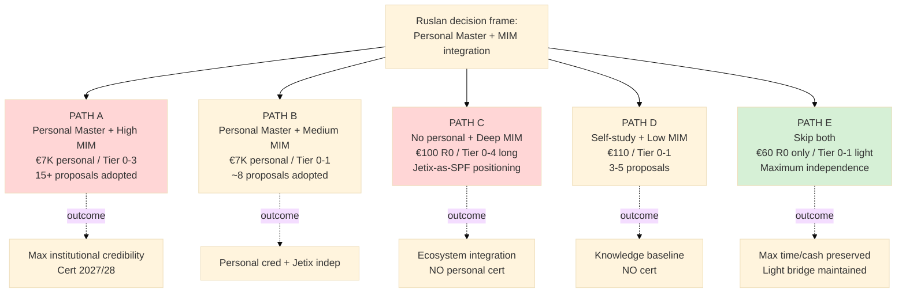

**Source:** Phase 9 §2-§7. **Decoded:** 5 distinct paths surfaced; Ruslan chooses; brigadier NOT recommend.

---

## §13 Pedagogical evolution 2012 → 2026

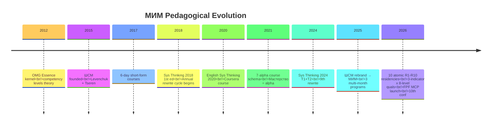

**Source:** Phase 3 §8.1-§8.3. **Decoded:** Annual evolution; 14-year arc.

---

## §14 R12 paired-frame 8-item checklist

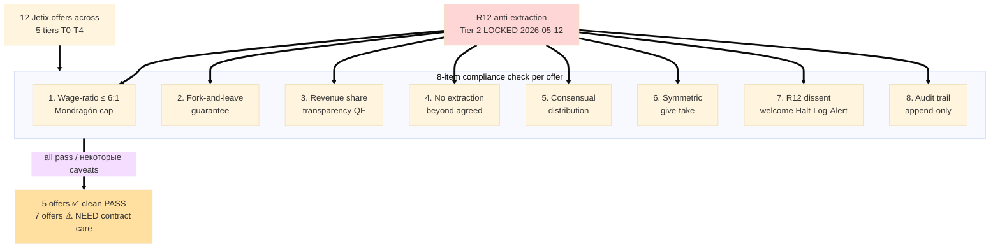

**Source:** Phase 8 §1, §10. **Decoded:** 8-item checklist applied per offer; 5 PASS / 7 require explicit R12 contract terms.

---

## §15 Master Qual full ecosystem (combined view)

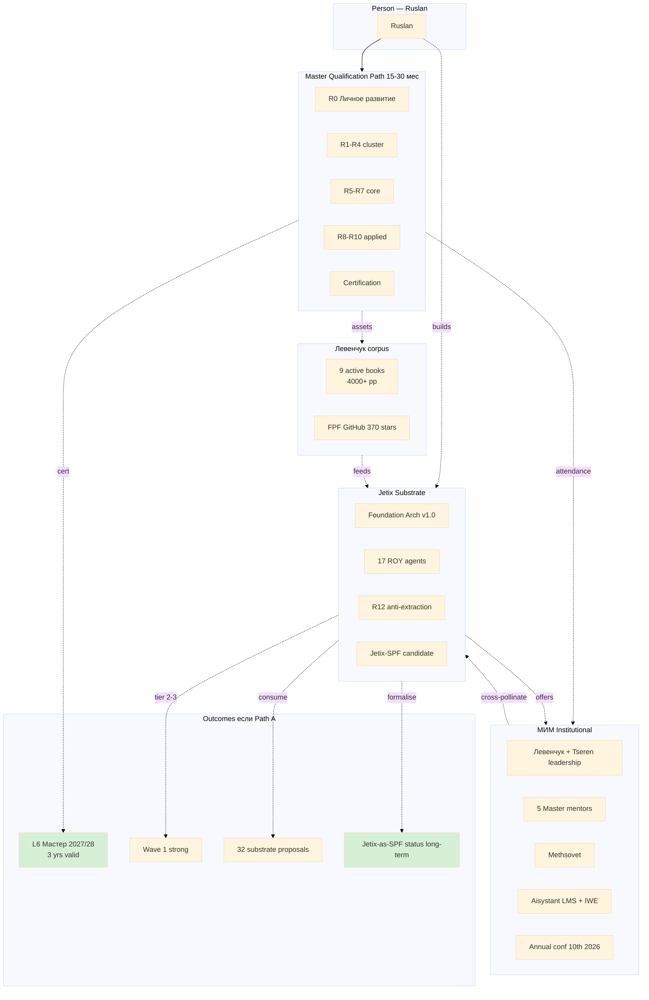

**Source:** All Phases 1-9 synthesised. **Decoded:** Full ecosystem view connecting Ruslan, path, МИМ, books, Jetix, and outcomes.

---

## §16 Diagrams summary

| # | Title | Phase ref | Nodes | Theme |
|---|---|---|---|---|
| 1 | Master Qualification flow (8 levels x 3 indicators) | Phase 1, 6 | 14 | quals framework |
| 2 | R0-R10 residency curriculum | Phase 2, 6 | 13 | path |
| 3 | Books × Aisystant × R# × Quals | Phase 2, 4 | 16 | curriculum stack |
| 4 | Cost + Time для Master path | Phase 6 | 9 | economics |
| 5 | Левенчуковский book genealogy | Phase 4 | 13 | book evolution |
| 6 | МИМ ecosystem 12 figures | Phase 5 | 13 | ecosystem |
| 7 | Intellect-stack 16 transdisciplines | Phase 4, 7 | 16 | substrate |
| 8 | FPF + SPF emergence | Phase 3, 7 | 9 | FPF ecosystem |
| 9 | Quality procedure multi-mentor | Phase 1 | 8 | methodology |
| 10 | Jetix subsystems × cross-pollination | Phase 7 | 20 | proposals overview |
| 11 | Jetix offer matrix 5 tiers × R12 | Phase 8 | 12 | offer matrix |
| 12 | 5 Strategic Paths comparison | Phase 9 | 12 | paths |
| 13 | Pedagogical evolution 2012-2026 | Phase 3 | timeline 9 events | history |
| 14 | R12 paired-frame 8-item checklist | Phase 8 | 11 | R12 compliance |
| 15 | Master Qual full ecosystem combined | All phases | 21 | synthesis |

**15 diagrams total** — within parent prompt target (12-18); avg ~13 nodes per diagram; all ≥6 minimum.

---

*Diagrams INDEX closure — Phase 10 component. Per `feedback_max_density_max_tokens.md` MAX-density applied to mermaid pass.*
