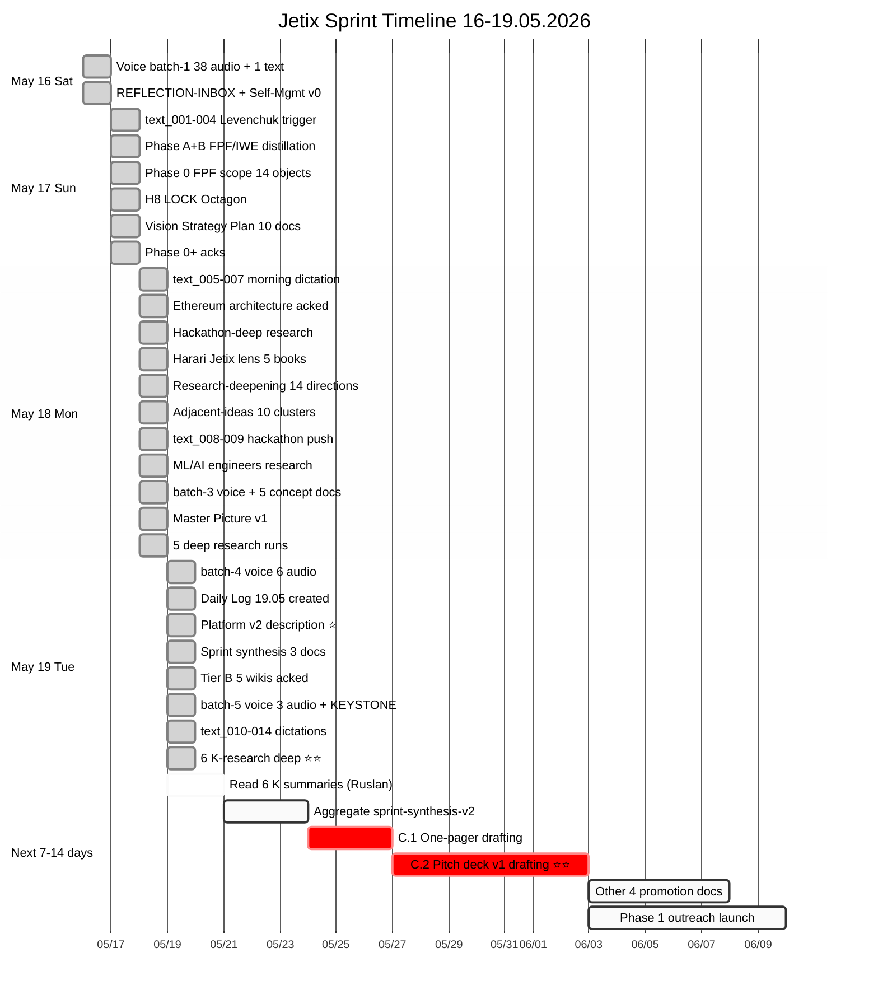
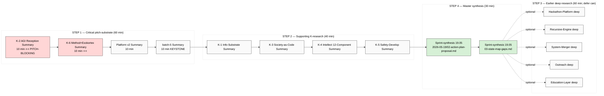
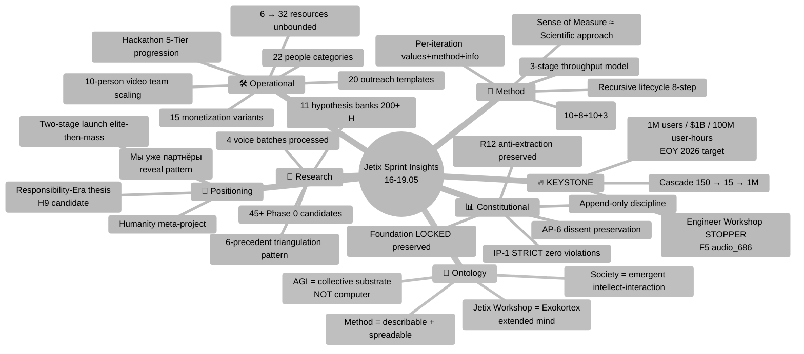
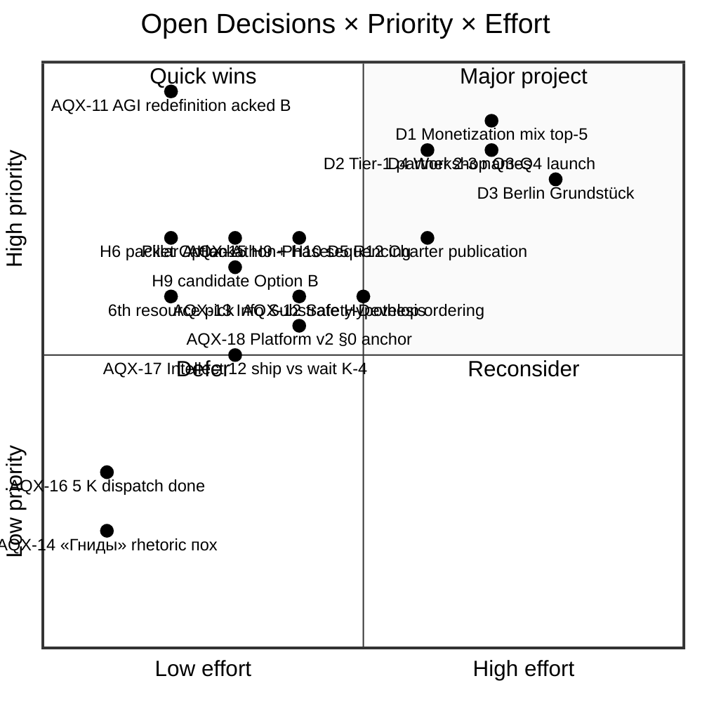
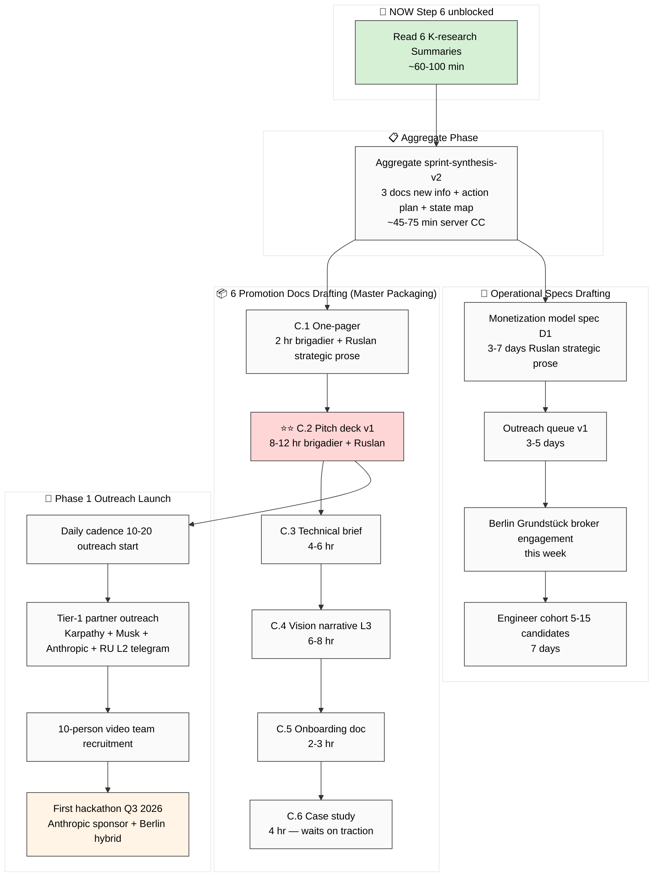

# 🗺️ MASTER MAP — Full State + Reading Order + Insights

> Полная карта всего что сделано за 16-19.05 sprint. **6 mermaid диаграмм** + подробное описание + reading order + key insights + open decisions + next steps to Master Packaging Step 6.

---

## §0 TL;DR (≤300 слов)

За 4 дня sprint (16-19.05) создан **multi-layer system** Jetix OS:
- **Foundation v1.0 LOCKED** + 8 Octagon LOCKs preserved untouched
- **5 acked concept docs F2** (Hackathon Platform / Recursive Engine / System Merger / Outreach Scalable / Education Layer)
- **5 deep research outputs** (18.05 evening) для concept docs
- **Platform v2 description** (22 people / 32 resources / FPF 8-layer / 15 monetization)
- **6 K-research deep** ⭐ JUST COMPLETED (K-1 Info-Substrate / K-2 AGI Reception PITCH-BLOCKING / K-3 Society-Code Stress / K-4 Intellect-12 / K-5 Safety-Develop / K-6 Method+Exokortex)
- **batch-1/2/3/4/5 voice pipeline** (text_001-014 + audio_669-691 — full corpus processed)
- **70+ candidate Phase 0 objects** surfaced (O-21 → O-61+)
- **200+ hypotheses** across 11+ hypothesis banks

**KEYSTONE findings:**
- Engineer Workshop = STOPPER (F5 audio_686)
- 1M users / $1B / 100M user-hours / 150→15 cascade EOY 2026
- AGI = collective substrate NOT computer (audio_690)
- Jetix Workshop = Exokortex (text_014 ontological)
- Sense of measure ≈ scientific approach parsimony
- «Мы уже партнёры» positioning

**Next:** Master Packaging Step 6 — 6 promotion docs drafting unblocked (Pitch deck v1 = primary target Q3 2026).

---

## §1 State Landscape (Diagram 1) — что есть, что preserved, что в процессе

```mermaid
%%{init: {'theme':'base', 'themeVariables': {'primaryTextColor':'#000000','textColor':'#000000','lineColor':'#333333','primaryBorderColor':'#333333','primaryColor':'#fafafa','noteTextColor':'#000000','noteBkgColor':'#fff8d5','edgeLabelBackground':'#ffffff'}}}%%
graph TB
    subgraph "🔴 FOUNDATION LOCKED (READ-ONLY)"
        F1[Foundation v1.0<br/>11 Parts + Pillar A/C<br/>2026-04-28]
        F2[Pillar C Tier 2<br/>12 rules incl. R12]
        F3[shared/schemas F8 contracts]
        F4[VISION-FUNDAMENTAL<br/>constitutional parent]
    end

    subgraph "🔴 OCTAGON LOCKED (8 Strategic Insights)"
        H1[H1 Foundation Model]
        H2[H2 Partnership]
        H4[H4 Network State]
        H5[H5 Tyson Mentorship]
        H6[H6 Gamified Platform]
        H7[H7 People-NS]
        H8[H8 Trust Infrastructure]
    end

    subgraph "🔴 CANONICAL DOCS LOCKED"
        D1[Doc 1A Base Management]
        D2[Doc 1B Jetix Corporation]
        DW[JETIX-WORKSHOP]
        DC[JETIX-FIRST-CLAN-CHARTER]
        DA[ACTION-PLAN-PHASE-1]
        DE[JETIX-ETHEREUM-ARCHITECTURE]
    end

    subgraph "🟢 ACKED F2-F3 (5 Concept Docs + Platform v2)"
        AC1[Hackathon Platform]
        AC2[Recursive Engine IP-1]
        AC3[System Merger Protocol H9-candidate]
        AC4[Outreach System Scalable]
        AC5[Education Layer]
        PV2[⭐ Platform v2<br/>22 people × 32 resources × FPF 8-layer × 15 monetization]
    end

    subgraph "🔵 DEEP RESEARCH OUTPUTS (May 18-19)"
        DR1[hackathon-platform-deep]
        DR2[recursive-engine-deep]
        DR3[system-merger-deep]
        DR4[outreach-deep]
        DR5[education-layer-deep]
        ML[ML/AI engineers research<br/>21 tools + 45 H bank]
    end

    subgraph "🟢 6 K-RESEARCH DEEP ⭐ JUST DONE (May 19 afternoon)"
        K1[K-1 Info-Substrate Philosophy<br/>Wheeler/Wolfram/Floridi/Bateson]
        K2[⭐⭐ K-2 AGI Reception Market<br/>PITCH-BLOCKING]
        K3[K-3 Society-as-Code Stress<br/>Toffler/Castells/Lessig]
        K4[K-4 Intellect 12-Component<br/>Sternberg/Cattell-Horn/Gardner]
        K5[K-5 Safety-Develop Validation<br/>Maslow/SRE/TPS/Knight/Taleb]
        K6[⭐⭐ K-6 Method + Jetix=Exokortex<br/>Meadows/Beer/Ashby/Wiener/...]
    end

    subgraph "🟡 VOICE CORPUS PROCESSED"
        V[batch-1/2/3/4/5<br/>text_001-014 + audio_669-691<br/>9-lens analysis]
    end

    subgraph "🟠 AWAITING-APPROVAL packets (3 pending)"
        P1[H6 operational pre-eminence]
        P2[Pillar A Hackathon-Phase]
        P3[H9 Strategic Insight candidate]
    end

    subgraph "🟣 PHASE 0 INVENTORY (~50+ candidates surfaced)"
        I[14 baseline + O-21 to O-61+<br/>Tier A auto-promoted / Tier B acked / Tier C dropped]
    end

    subgraph "⏭️ NEXT: Master Packaging Step 6"
        N1[1. Aggregate sprint-synthesis-v2]
        N2[2. 6 promotion docs<br/>one-pager / pitch deck / technical / vision / onboarding / case study]
        N3[3. Phase 1 outreach launch]
    end

    F1 --> H1 & H2 & H4 & H5 & H6 & H7 & H8
    F1 --> D1 & D2 & DW & DC & DA & DE
    H6 --> AC1
    H7 --> AC2 & AC3
    H8 --> AC3
    
    V --> AC1 & AC2 & AC3 & AC4 & AC5
    V --> PV2
    
    AC1 --> DR1
    AC2 --> DR2
    AC3 --> DR3
    AC4 --> DR4
    AC5 --> DR5
    ML --> AC1 & AC2 & AC3 & AC4 & AC5
    
    V --> K1 & K2 & K3 & K4 & K5 & K6
    AC1 & AC2 & AC3 & AC4 & AC5 --> K1 & K2 & K3 & K4 & K5 & K6
    
    AC1 --> P1
    AC1 --> P2
    AC3 --> P3
    
    V --> I
    K1 & K2 & K3 & K4 & K5 & K6 --> I
    PV2 --> I
    
    K2 --> N2
    K6 --> N1 & N2
    K1 & K3 & K4 & K5 --> N1
    PV2 --> N1
    DR1 & DR2 & DR3 & DR4 & DR5 --> N1
    P1 & P2 & P3 --> N2
    N1 --> N2 --> N3

    style F1 fill:#ffd6d6,color:#000
    style F2 fill:#ffd6d6,color:#000
    style F3 fill:#ffd6d6,color:#000
    style F4 fill:#ffd6d6,color:#000
    style H1 fill:#ffd6d6,color:#000
    style H2 fill:#ffd6d6,color:#000
    style H4 fill:#ffd6d6,color:#000
    style H5 fill:#ffd6d6,color:#000
    style H6 fill:#ffd6d6,color:#000
    style H7 fill:#ffd6d6,color:#000
    style H8 fill:#ffd6d6,color:#000
    style K2 fill:#d6f0d6,color:#000
    style K6 fill:#d6f0d6,color:#000
    style PV2 fill:#d6f0d6,color:#000
    style N1 fill:#fff4e6,color:#000
    style N2 fill:#fff4e6,color:#000
    style N3 fill:#fff4e6,color:#000
```



**Legend:**
- 🔴 **LOCKED** — Foundation/Octagon/Canonical — read-only forever
- 🟢 **ACKED** — F2-F3 concept docs/Platform v2 — confirmed by Ruslan
- 🔵 **DEEP RESEARCH OUTPUTS** — May 18-19 5 deep + ML
- 🟢⭐ **6 K-RESEARCH JUST DONE** — May 19 afternoon
- 🟡 **VOICE CORPUS** — text_001-014 + audio_669-691 processed
- 🟠 **AWAITING-APPROVAL packets** — pending Ruslan ack
- 🟣 **PHASE 0 INVENTORY** — ~50+ candidates
- ⏭️ **NEXT** — Master Packaging Step 6

---

## §2 Timeline (Diagram 2) — sprint 16-19.05 chronological



---

## §3 What's done — детальная inventory

### 🔴 Foundation Layer (LOCKED — preserved untouched)

| # | Artefact | Date | Status |
|---|---|---|---|
| 1 | Foundation v1.0 (11 Parts + Pillar A/C) | 2026-04-28 | LOCKED `foundation-architecture-locked-2026-04-28` |
| 2 | Pillar C Tier 2 (12 rules incl. R12) | 2026-04-28 / R12 2026-05-12 | LOCKED |
| 3 | shared/schemas F8 contracts | 2026-04-28 | LOCKED |
| 4 | VISION-FUNDAMENTAL | 2026-04-27 | LOCKED |
| 5-12 | 8 Octagon LOCKs (H1-H8) | 2026-05-10-17 | LOCKED |
| 13 | Doc 1A Base Management System | 2026-05-04 | LOCKED `base-management-system-locked-2026-05-05` |
| 14 | Doc 1B Jetix Corporation | 2026-05-05 | LOCKED `jetix-corporation-locked-2026-05-06` |
| 15 | JETIX-WORKSHOP-CONCEPT | 2026-04-30 | LOCKED |
| 16 | JETIX-FIRST-CLAN-CHARTER | 2026-05-12 | LOCKED |
| 17 | ACTION-PLAN-PHASE-1 | 2026-05-10 | LOCKED |
| 18 | JETIX-ETHEREUM-ARCHITECTURE (12 docs + 5 mermaid) | 2026-05-18 | acked Option A + R12 Option D Hybrid |

### 🟢 Acked Concept Docs F2 (5)

| # | Doc | Date | Highlights |
|---|---|---|---|
| 1 | JETIX-AS-HACKATHON-PLATFORM | 2026-05-18 | Primary growth vehicle; clan-wars multi-rhythm |
| 2 | JETIX-RECURSIVE-SELF-DEVELOPMENT-ENGINE | 2026-05-18 | IP-1 STRICT; plan/execute toggle; 28 boundary cases |
| 3 | JETIX-SYSTEM-MERGER-PROTOCOL-FPF | 2026-05-18 | H9 candidate; намордник + USB-C port |
| 4 | JETIX-OUTREACH-SYSTEM-SCALABLE | 2026-05-18 | 10→100→personalized scaling pattern |
| 5 | JETIX-EDUCATION-LAYER-SYSTEM-THINKING | 2026-05-18 | 4 Cs school + Master-Apprentice 4-role |

### ⭐ Platform v2 Description (2026-05-19 noon) — comprehensive

`reports/jetix-platform-v2-2026-05-19/` — 11 docs + 7 mermaid:
- 22 people categories (specialists / methodologists / corporates / countries / etc.)
- 32 resources (Money / Time / Skills / Reputation / Methodology / etc.)
- Hackathon 5-Tier progression (online micro → offline major)
- FPF 8-layer protocol stack (Identity → ... → R12 Enforcement)
- Jetix 7-role + IP-1 28-entry boundary cases
- 10 values + 10 partner framing templates
- 15 monetization variants × 3 horizons (Y1 €0.5-2M / Y5+ €5-40M+)
- 20 outreach script templates

### 🔵 5 Deep Research Outputs (2026-05-18 evening)

| Run | Namespace | Highlights |
|---|---|---|
| Hackathon Platform Deep | `research/hackathon-platform-deep-2026-05-18/` | 30+ variants / 6 rhythms / Q3 2026 event spec / 45 H |
| Recursive Engine Deep | `research/recursive-engine-deep-2026-05-18/` | IP-1 28 boundary cases / Engelbart H-LAM/T / 30 H |
| System Merger Deep | `research/system-merger-deep-2026-05-18/` | 4-precedent (USB-C/TCP-IP/HTTP/OpenAPI) / Option C Hybrid recommended / 31 H |
| Outreach Deep | `research/outreach-deep-2026-05-18/` | 6-precedent / 4 6-resource taxonomies / 37 H |
| Education Layer Deep | `research/education-layer-deep-2026-05-18/` | 7-precedent / Tier 1 5-module / 37 H |

### 🔵 ML/AI Engineers Research (2026-05-18)

`research/ml-ai-engineers-2026-05-18/` — 12 docs + 10 mermaid:
- 21 tools deep dive (Python / NumPy / PyTorch / HuggingFace / Docker / etc.)
- 7-step workflow × FPF × Jetix-universal pattern
- Engineering = universal pattern (6-precedent triangulation)
- 45 hypotheses bank
- 5 Jetix-relationship classes

### 🟢⭐ 6 K-Research Deep (2026-05-19 afternoon — JUST COMPLETED)

| K | Namespace | Highlights |
|---|---|---|
| **K-2** ⭐⭐ | `research/agi-reception-market-deep-2026-05-19/` | **PITCH-BLOCKING.** L1/L2/L3 reception к «AGI=collective substrate» + competitive landscape + 35 H + pitch framing recommendations |
| **K-6** ⭐⭐ | `research/method-systems-thinking-deep-2026-05-19/` | **31 components** (text_012+013+014) + Sense-of-Measure ≈ Scientific Approach + Jetix=Exokortex ontological + recursive lifecycle 8-step + 12 mermaid |
| K-1 | `research/info-substrate-philosophy-deep-2026-05-19/` | Wheeler «It from Bit» + Wolfram + Floridi + Bateson + 30 H + 3 positioning options |
| K-3 | `research/society-as-code-stress-test-2026-05-19/` | Toffler + Castells + Lessig + breakdown analysis + 30 H + 3 positioning options |
| K-4 | `research/intellect-12-component-audit-2026-05-19/` | Sternberg + Cattell-Horn-Carroll + Gardner + curriculum M1-M12 + 30 H |
| K-5 | `research/safety-develop-validation-2026-05-19/` | Maslow + SRE + TPS + Knight + Taleb + Pillar C R13 evidence + 25 H + AWAITING-APPROVAL substrate |

### 🟡 Voice Corpus Processed

- **batch-1** (16.05): 38 audio + 1 text → REFLECTION-INBOX
- **batch-2** (18.05): text_005-007 → 5 phases (Buterin + Ethereum)
- **batch-3** (18.05): text_008-009 → 6 phases (hackathon push; 5 concept docs born)
- **batch-4** (19.05 morn): 6 audio (682-687) → 8-lens analysis (KEYSTONE: engineer workshop STOPPER + 1M/$1B/100M)
- **batch-5** (19.05 morn): 3 audio (689-691) → 9-lens analysis (AGI redefinition + 6 NCs O-46-51)
- **text_010-014** (19.05 noon-afternoon): Platform v2 + K-6 anchors

### 🟠 AWAITING-APPROVAL Packets Pending (3)

| Packet | Recommendation | Status |
|---|---|---|
| H6 operational pre-eminence overlay | Option A (minimal §APPEND) | Pending |
| Pillar A Hackathon-Phase namespace | Option A (namespace addition) | Pending |
| H9 Strategic Insight candidate (System Merger) | Option B (promote к F4 defer LOCK) | Pending; deep research evidence assembled |

### 🟣 Phase 0 Inventory Snapshot

- 14 baseline objects (O-01 to O-14)
- O-21-29 from sprint 17-18.05
- O-30-41 from batch-3 + batch-4
- O-42-45 from Platform v2 (Jetix as platform v2 / Project-of-Humanity / Pre-existing-partnership reveal / Reciprocal value)
- O-46-51 from batch-5 (society-as-code / info-substrate / safety-develop / AGI-definition / strategy-alignment-matrix / intellect-12-component)
- O-52-58+ from K-6 (Method / Sense of Measure / Self-knowledge / Recursive lifecycle / **Jetix=Exokortex** / 3-stage throughput / Reconnaissance)
- O-59-61+ from K-1/K-3/K-4 phase 8 §APPEND

**Total ~50+ candidate objects surfaced.**

---

## §4 Reading Order (Diagram 3) — что читать в каком порядке



### Priority list (paths):

**Step 1 — CRITICAL (60 min):**
1. [research/agi-reception-market-deep-2026-05-19/99-SUMMARY-FOR-RUSLAN.md](../../research/agi-reception-market-deep-2026-05-19/99-SUMMARY-FOR-RUSLAN.md) ⭐⭐
2. [research/method-systems-thinking-deep-2026-05-19/99-SUMMARY-FOR-RUSLAN.md](../../research/method-systems-thinking-deep-2026-05-19/99-SUMMARY-FOR-RUSLAN.md) ⭐⭐
3. [reports/jetix-platform-v2-2026-05-19/99-SUMMARY-FOR-RUSLAN.md](../../reports/jetix-platform-v2-2026-05-19/99-SUMMARY-FOR-RUSLAN.md)
4. [reports/voice-pipeline-2026-05-19-batch-5/00-SUMMARY-FOR-RUSLAN.md](../../reports/voice-pipeline-2026-05-19-batch-5/00-SUMMARY-FOR-RUSLAN.md)

**Step 2 — Supporting (40 min):**
5. [research/info-substrate-philosophy-deep-2026-05-19/99-SUMMARY](../../research/info-substrate-philosophy-deep-2026-05-19/)
6. [research/society-as-code-stress-test-2026-05-19/99-SUMMARY](../../research/society-as-code-stress-test-2026-05-19/)
7. [research/intellect-12-component-audit-2026-05-19/99-SUMMARY](../../research/intellect-12-component-audit-2026-05-19/)
8. [research/safety-develop-validation-2026-05-19/99-SUMMARY](../../research/safety-develop-validation-2026-05-19/)

**Step 3 — Earlier (can defer):**
9-13. 5 deep research outputs (Hackathon / Recursive / Merger / Outreach / Education) — Phase 8 summaries

**Step 4 — Master synthesis:**
14. `reports/sprint-synthesis-2026-05-19/02-action-plan-proposal.md` — critical path 7-14d
15. `reports/sprint-synthesis-2026-05-19/03-state-map-gaps.md` — LOCKED/ACKED/SURFACE/VAPOR

---

## §5 Key Insights Cross-Stream (Diagram 4) — top discoveries



### Top-10 Insights Detailed

| # | Insight | Source | Implication |
|---|---|---|---|
| 1 | **Engineer Workshop = STOPPER** ⭐ | audio_686 F5 | Pitch-blocking until unblocked |
| 2 | **AGI = collective substrate** | audio_690 → K-2 | Pitch framing differentiator |
| 3 | **Jetix Workshop = Exokortex** | text_014 → K-6 | Ontological claim для positioning |
| 4 | **Sense of Measure ≈ Scientific approach (parsimony)** | text_012+K-6 Phase 6 | Foundation principle candidate (Pillar C rule 14?) |
| 5 | **Numerical targets EOY 2026** (1M/$1B/100M) | audio_686 F2-3 | Aspiration anchor + milestones discipline |
| 6 | **«Мы уже партнёры» reveal pattern** | text_011 | Central outreach framing |
| 7 | **6 → 32 resources unbounded** | text_010 → Platform v2 | Recruiting taxonomy comprehensive |
| 8 | **Society = emergent intellect-interaction + bugs** | text_NEW + K-6 §29-31 | Society-as-Code + Society-emergence parallel |
| 9 | **Method-describe → spread hypothesis** | text_012 → K-6 H-MST-26-35 | Education Layer + Karpathy lineage |
| 10 | **Recursive lifecycle 8-step** | text_013 → K-6 Phase 7 | Method execution discipline |

---

## §6 Open Decisions (Diagram 5) — что ждёт ack от Ruslan



### Top 10 decisions queue (P1 / P2 / defer)

**P1 (immediate, next 7 days):**
1. **D1 Monetization mix Q3-Q4 2026** — recommend top-5 (V1 Hackathon sponsorship + V2 Workshop training + V3 Consulting + V4 quick-money + V5 AI Grant)
2. **D2 Tier-1 partner 2-3 named targets** (per Platform v2 Phase 8 templates 13/15/17/19)
3. **D3 Berlin Grundstück Q3-Q4 site** — Workshop physical
4. **D4 Workshop Education Layer Q3 2027 launch** — design start Q3 2026
5. **Engineer cohort recruitment** (BL-1 unblock — Workshop STOPPER) — 5-15 candidates

**P2 (2-4 weeks):**
6. 3 AWAITING-APPROVAL packets — Option A везде (recommended)
7. **D5 R12 Charter publication** — author / ack draft
8. 6th resource pick (или unbounded confirmed)
9. AQX-12 Safety→Develop ordering — Pillar C rule 13 vs Foundation Part 8
10. AQX-15 H9 + H10 sequencing — Society-as-Code + Info-Substrate-Hypothesis LOCK preparation

**Defer:**
- AQX-14 «Гниды» rhetoric (uniquely internal; skip)
- AQX-13 Info Substrate Hypothesis lineage commit (after K-1 review)
- AQX-18 Platform v2 §0 Philosophical Anchor (conditional на AQX-11)

---

## §7 Next Steps (Diagram 6) — Master Packaging Roadmap Step 6



### Sequence по неделям

**Week 1 (NOW):**
- Day 1-2: Read 6 K-research summaries
- Day 3-4: Aggregate sprint-synthesis-v2 (server CC run)
- Day 5-7: C.1 One-pager + C.2 pitch deck v1 drafting start

**Week 2:**
- Pitch deck v1 finalize
- Other 4 promotion docs drafting
- Monetization model spec
- Berlin Grundstück broker

**Week 3:**
- Outreach queue v1
- Engineer cohort 5-15 candidates
- Daily cadence start
- Tier-1 partner outreach

**Q3 2026 (Aug-Sep):**
- First hackathon event (per concept doc A blueprint)
- 10-person video team operational
- Master Workshop founding cohort recruitment

---

## §8 Repo Structure Snapshot

```
~/Desktop/jetix-os/
├── CLAUDE.md / README.md / HOME.md           # config + master pointers
├── decisions/
│   ├── *.md                                   # canonical LOCKs + Strategic Insights
│   └── strategic/
│       └── JETIX-*-2026-05-18.md              # 5 concept docs F2
├── reports/
│   ├── jetix-platform-v2-2026-05-19/          # Platform v2 (11 docs + 7 mermaid)
│   ├── sprint-synthesis-2026-05-19/           # 3 docs Master Picture
│   ├── voice-pipeline-2026-05-1{7,8,9}-*/     # 4 voice batches
│   └── master-map-2026-05-19-evening/         # THIS DOCUMENT
├── research/
│   ├── adjacent-ideas-2026-05-17/             # 10 clusters
│   ├── deepening-2026-05-18/                  # 14 directions
│   ├── hackathon-deep-2026-05-18/             # 4 hypotheses
│   ├── harari-jetix-lens-2026-05-18/          # 5 books
│   ├── ml-ai-engineers-2026-05-18/            # 21 tools + 45 H
│   ├── hackathon-platform-deep-2026-05-18/    # 5 deep
│   ├── recursive-engine-deep-2026-05-18/
│   ├── system-merger-deep-2026-05-18/
│   ├── outreach-deep-2026-05-18/
│   ├── education-layer-deep-2026-05-18/
│   ├── agi-reception-market-deep-2026-05-19/  ⭐⭐ 6 K-runs
│   ├── info-substrate-philosophy-deep-2026-05-19/
│   ├── society-as-code-stress-test-2026-05-19/
│   ├── intellect-12-component-audit-2026-05-19/
│   ├── safety-develop-validation-2026-05-19/
│   └── method-systems-thinking-deep-2026-05-19/  ⭐⭐
├── vision/                                    # vision/00-13 companions
├── wiki/                                      # concepts/ideas/claims
├── raw/voice-memos-2026-05-1{7,9}-batch/      # full voice corpus
├── swarm/awaiting-approval/                   # 3 pending packets
└── prompts/                                   # all deep prompts archive
```

---

## §9 What's preserved (Constitutional)

✓ Foundation v1.0 (11 Parts + Pillar A/C) — read-only
✓ Pillar C Tier 2 (12 rules incl R12) — read-only
✓ shared/schemas F8 contracts — read-only
✓ VISION-FUNDAMENTAL — read-only
✓ 8 Octagon LOCK content (H1-H8) — read-only; §APPEND only
✓ R1 (Ruslan = sole strategist) — all strategic prose voice-anchored
✓ R6 (provenance per claim) — enforced
✓ R11 (Default-Deny) — enforced
✓ R12 (anti-extraction) — preserved through 15 monetization variants
✓ IP-1 (Role≠Executor) — STRICT preserved through 6 K-runs + Platform v2
✓ EP-5 (F-grade disclosure) — F2-F3 surface predominantly
✓ AP-6 (dissent preservation) — 18+ dissents preserved
✓ Append-only — 100% discipline maintained

---

## §10 What's surfaced (Phase 0 Inventory ~50+ candidates)

| Range | Description |
|---|---|
| O-01 to O-14 | Baseline Phase 0 inventory |
| O-15 to O-20 | Phase 0+ (Oscar Hartmann CRM + Trust Infrastructure + Phase namespace) |
| O-21 to O-24 | text_005-007 batch (Buterin + Man-as-Army + Ethereum) |
| O-25 to O-28 | text_008-009 batch-3 (Hackathon Platform / Recursive / Merger / Outreach + Education) |
| O-29 | ML/AI engineering substrate |
| O-30 to O-41 | batch-4 (12 NCs from audio_682-687) |
| O-42 to O-45 | Platform v2 (Description v2 / Humanity meta-project / reveal pattern / reciprocal value) |
| O-46 to O-51 | batch-5 (society-as-code / info-substrate / safety-develop / AGI-def / strategy-matrix / intellect-12) |
| O-52 to O-58+ | K-6 candidates (Method / Sense of Measure / Self-knowledge / Recursive lifecycle / **Exokortex** / 3-stage throughput / Reconnaissance) |
| O-59 to O-61+ | K-1/K-3/K-4 Phase 8 §APPEND (Wheeler-Wolfram-Floridi lineage / Society-as-Code differentiation / Intellect 12-curriculum) |

---

## §11 Reference Index — top entry points

### Constitutional baseline:
- `CLAUDE.md`
- `swarm/wiki/foundations/` (11 Parts)
- `principles/`

### Acked concept docs (5):
- `decisions/strategic/JETIX-AS-HACKATHON-PLATFORM-2026-05-18.md`
- `decisions/strategic/JETIX-RECURSIVE-SELF-DEVELOPMENT-ENGINE-2026-05-18.md`
- `decisions/strategic/JETIX-SYSTEM-MERGER-PROTOCOL-FPF-2026-05-18.md`
- `decisions/strategic/JETIX-OUTREACH-SYSTEM-SCALABLE-2026-05-18.md`
- `decisions/strategic/JETIX-EDUCATION-LAYER-SYSTEM-THINKING-2026-05-18.md`

### Platform v2 (master substrate):
- `reports/jetix-platform-v2-2026-05-19/99-SUMMARY-FOR-RUSLAN.md`

### 6 K-research summaries (latest):
- `research/agi-reception-market-deep-2026-05-19/99-SUMMARY-FOR-RUSLAN.md` ⭐⭐
- `research/method-systems-thinking-deep-2026-05-19/99-SUMMARY-FOR-RUSLAN.md` ⭐⭐
- `research/info-substrate-philosophy-deep-2026-05-19/99-SUMMARY-FOR-RUSLAN.md`
- `research/society-as-code-stress-test-2026-05-19/99-SUMMARY-FOR-RUSLAN.md`
- `research/intellect-12-component-audit-2026-05-19/99-SUMMARY-FOR-RUSLAN.md`
- `research/safety-develop-validation-2026-05-19/99-SUMMARY-FOR-RUSLAN.md`

### Sprint synthesis 19.05:
- `reports/sprint-synthesis-2026-05-19/02-action-plan-proposal.md` (P1 critical path)
- `reports/sprint-synthesis-2026-05-19/03-state-map-gaps.md` (LOCKED/ACKED/SURFACE/VAPOR)

### Daily Log:
- `_DAILY-LOG-2026-05-19.md` (или после cleanup → `daily-logs/`)

### Voice corpus (full):
- `raw/voice-memos-2026-05-17-batch/text_001-009*.md`
- `raw/voice-memos-2026-05-19-batch/audio_682-691*.md + text_010-014*.md`

### Phase 0 inventory:
- `reports/phase-0-fpf-scope/01-jetix-objects-inventory.md`

### AWAITING-APPROVAL packets (3 pending):
- `swarm/awaiting-approval/h6-hackathon-platform-pre-eminent-2026-05-18.md`
- `swarm/awaiting-approval/pillar-a-hackathon-mode-extension-2026-05-18.md`
- `swarm/awaiting-approval/h9-strategic-insight-candidate-2026-05-18.md`

---

## §12 What's NEXT (immediate actions)

1. **Read this MASTER MAP fully** (you are here — 25 min)
2. **Read 6 K-research summaries** (next 60-100 min) — Step 1 в §4 order
3. **Decide:** aggregate-synthesis-v2 first OR прямо к C.1+C.2 pitch drafting
4. **Trigger cleanup prompt** (5-10 min server CC) — `prompts/cleanup-root-2026-05-19.md`
5. **Ack top decisions** (D1 monetization mix / D2 Tier-1 partners / 3 AWAITING-APPROVAL packets) — unblocks pitch drafting

---

*Master Map document 2026-05-19 evening Berlin. brigadier-scribe (Cloud Cowork). Воспроизводит full sprint state, reading order, key insights, open decisions, next steps. R1 + R6 + EP-5 + append-only preserved.*
