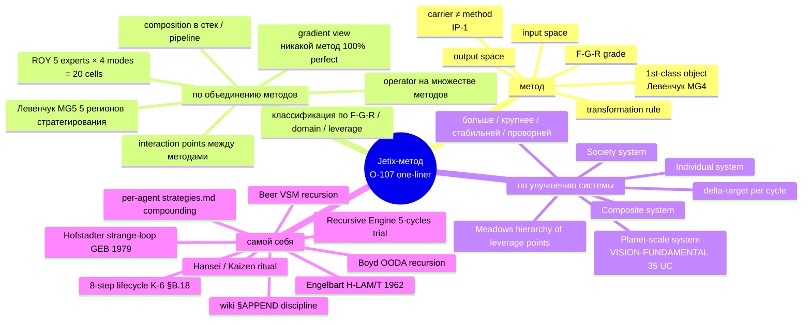
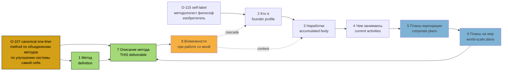

# Phase 1 — Canonical definition

> Что такое Jetix-метод. Канонический one-liner (O-107), unpacking каждого
> слова, 8-doc inventory anchor (O-114 audio_709 claim 1), 5 building-block
> frames, Ruslan author identity (O-115). R1 brigadier scribe surface only.

---

## §1 Canonical one-liner — O-107 (audio_712 verbatim)

> **«метод по объединению методов по улучшению системы самой себя»**
> [src: O-107 audio_712@2026-05-19_evening verbatim; surface-acked Ruslan voice 21.05]

Это — единственная каноническая дефиниция Jetix-метода, произнесённая Ruslan'ом голосом в evening 19.05. Все остальные формулировки (5 building-block frames в §3 ниже; 31-component breakdown в Phase 2; 10-layer stack в Phase 3) — это **expansion / operationalisation** этого one-liner, не альтернативы.

Дефиниция self-referential в трёх местах одновременно:
1. «метод по объединению методов» — meta-методологический move; метод о методах
2. «улучшение системы» — system-level intervention target
3. «самой себя» — closed-loop / strange-loop dynamics (Hofstadter GEB 1979)

Это не три отдельных свойства — это одна структура, выраженная в трёх позициях фразы. См. unpacking ниже (§2).

---

## §2 Unpacking каждого слова

### §2.1 «метод»

**Метод как 1st-class object** — per Левенчук «Методология» 2025 Глава 4 (MG4 ⭐⭐⭐) [src: `research/levenchuk-books-distillation-2026-05-20/03-metodologiya-2025-toc-highlights.md` Гл. 4]. Метод — не attribute деятельности, не «способ как делать», а **самостоятельная сущность**, у которой есть:

- input space (что приходит на вход)
- transformation rule (как преобразуется)
- output space (что получается)
- F-G-R grade (formality / group-scope / reliability per Part 6a §I.1 schema)
- carrier roles (кто исполняет — но carrier ≠ метод, per IP-1)

**Метод vs Method-instance vs Carrier:** метод = abstract pattern (роль исполнителя U.Episteme); method-instance = конкретное применение в конкретном цикле; carrier = тот, кто физически исполняет (per RUSLAN-LAYER executor-binding). [src: design/JETIX-FPF.md IP-1 + Bundle 1 D-1 anti-conflation; CLAUDE.md §4.1 rule 4]

**Pre-Jetix состояние:** методы существуют, но не описаны как 1st-class objects; carrier ↔ method ↔ instance смешаны. **Jetix-claim:** explicit 1st-class articulation → adoption faster, development efficiency higher. [src: `wiki/concepts/method-systems-thinking.md` §1 + text_012 «Jetix как раз вот этот метод сейчас описывает»]

### §2.2 «по объединению методов»

**Meta-методологический move.** Jetix-метод не просто новый отдельный метод (рядом с TPS, Lean, OODA, VSM, Agile, OMG Essence). Jetix-метод — **operator на множестве существующих методов**, который:

- классифицирует методы по F-G-R / domain / leverage point
- идентифицирует interaction points между методами (где один метод использует output другого)
- composes методы в стек / pipeline / orchestration
- gradient-views (никакой метод 100% perfect — text_013 §2.16 [src: K-6 component 16])

Это reflects K-6 component 3 «Methods of processing information» + component 17 «Parts decomposition». [src: `research/method-systems-thinking-deep-2026-05-19/06-31-method-components-synthesis.md` §A.3 + §B.17]

**Operational embodiment:** ROY swarm 5 experts × 4 modes = 20-cell parallel processing где каждая cell = композиция методов одной экспертной области. Левенчук Гл. 5 5 регионов стратегирования (MG5) — аналог объединения 5 методов одного объекта. [src: CLAUDE.md `## Active ROY Swarm`; Левенчук distillation 03 §1.5]

### §2.3 «по улучшению системы»

**System-level intervention target.** Не improvement отдельного процесса, отдельного skill'а, отдельного output'а — а **системы как целого** (с её feedback loops, paradigm, rules, structure, flows, stocks — Meadows hierarchy of leverage points). [src: `research/method-systems-thinking-deep-2026-05-19/02-foundation-meadows-ashby-wiener-deep.md` §2]

**Что значит «улучшение»:** delta-target per cycle — больше / крупнее / стабильней / проворней (K-6 component 14 verbatim Ruslan text_013) [src: K-6 §B.14]. Не «сделать лучше» абстрактно; explicit delta-axis + post-hoc verification (K-6 test design).

«Система» здесь имеет 4 уровня вложенности:
1. **Individual system** (один agent, один project, один skill, один cycle)
2. **Composite system** (Jetix swarm как целое; partner constellation; Workshop cohort)
3. **Society system** (R12 anti-extraction substrate; Network State analog; H7 People-NS LOCK 2026-05-12)
4. **Planet-scale system** (Jetix Vision FUNDAMENTAL §1-12 35 UC × 12 categories)

[src: `decisions/JETIX-VISION-FUNDAMENTAL-2026-04-27.md` 35 UC × 12 cats; K-6 components 29-31 society-emergence]

### §2.4 «самой себя»

**Self-referential / recursive engine.** Это — критическая компонента. Метод не описывает «как улучшать что-то снаружи», а «как система улучшает **саму себя**». [src: O-107 verbatim]

**Прецеденты:**
- Hofstadter «Gödel, Escher, Bach» 1979 — strange-loop, self-reference
- Engelbart «H-LAM/T» 1962 — human + language + augmentation + tools, co-evolving
- Boyd OODA recursion — каждый цикл O→O→D→A обновляет сам себя
- Beer VSM recursion — каждый S1 = own VSM
[src: `research/method-systems-thinking-deep-2026-05-19/05-cross-stream-bertalanffy-boyd-bateson-hofstadter-deep.md` + 04-senge-sterman §5.3]

**8-step recursive lifecycle (K-6 component 18 verbatim text_013):**
> «Создали метод → по методу описали план улучшить себя → описали план улучшить планету → воплотили план → новые вопросы → по методу обработали → continue → развивается в хорошем ключе»

[src: K-6 §B.18 voice text_013 verbatim]

**Operational embodiment в Jetix:** `decisions/strategic/JETIX-RECURSIVE-SELF-DEVELOPMENT-ENGINE-2026-05-18.md` — 5-cycles trial design; per-agent strategies.md compounding (Foundation Part 5 compound learning); wiki §APPEND discipline; Hansei/Kaizen ritual.

---

## §3 5 building-block frames

Полная декомпозиция Jetix-метода на 5 «несущих» фреймов. Это не альтернативы one-liner'у — это его операционные слои.

### §3.1 Frame 1 — Method as 1st-class object (Левенчук MG4)

Метод explicit; обоснован; gradient-viewable. См. §2.1.

[src: Левенчук «Методология» 2025 Гл. 4 MG4 ⭐⭐⭐; distillation 03 §1.4 + 06 §3]

### §3.2 Frame 2 — FPF universal language

**FPF (Formal Practice Framework)** — universal articulation language для каждого acked-claim. F-G-R triple mandatory:
- **F** — Formality grade (F2-F8 ladder)
- **G** — Group-scope (universal / role-specific / context-specific)
- **R** — Reliability (R-low / R-medium / R-high)

Testing thesis: «conveyance of colossal idea в 30-60 min» (Phase 7 deep dive).

[src: `design/JETIX-FPF.md` 3758 lines IP-1/IP-2/IP-3/IP-7 + A.6.B + A.14 + B.3; CLAUDE.md F8 schemas]

### §3.3 Frame 3 — ROY swarm 5 experts × 4 modes

**Hub-and-spoke orchestration** для method delivery:
- brigadier = sole dispatcher (IP-1 strict)
- 5 ROY experts: engineering / investor / mgmt / philosophy / systems
- 4 invocation modes per expert
- 20-cell parallel processing capacity

Plus 4 sub-brigadiers (project-brigadier template + quick-money + levenchuk + др.).

[src: CLAUDE.md `## Active ROY Swarm`; `swarm/lib/routing-table.yaml`; `.claude/agents/*-expert.md`]

### §3.4 Frame 4 — Hypothesis arch 7-layer (falsifiability discipline)

**First-class hypothesis architecture** — overnight build 20.05; 9 canonical skills (`/hypothesis-{add,update,close,dash,search,stuck,link,build-table,alpha-state}`); CRM-style overlay + Excel/CSV table; FPF F-G-R mandatory frontmatter; OMG Essence alpha-machinery integration.

Каждый method-claim falsifiable via hypothesis lifecycle: backlog → active → testing → confirmed/refuted/paused.

[src: `hypotheses/docs/architecture-overview.md`; `hypotheses/docs/fpf-integration.md`; `hypotheses/docs/alpha-machinery-guide.md`]

### §3.5 Frame 5 — R12 anti-extraction sustainable ecosystem

**R12** — 12-я hard rule (Pillar C Tier 2, добавлена 2026-05-12) — «No extraction beyond agreed share».

Paired-frame discipline: any описание метода включает explicit anti-extraction guarantee (Mondragón 5:1 wage ratio cap + QF revenue distribution + fork-and-leave exit tokens). Method = sustainable не только operationally но и **distributionally** — value goes to participants, не к single owner / extractor.

[src: CLAUDE.md §4.1 rule 12; H7 People-NS LOCK 2026-05-12; R12 programmable Ethereum Option D Hybrid 2026-05-18 ack; `swarm/awaiting-approval/r12-anti-extraction-2026-05-12.md`]

---

## §4 8-doc inventory anchor (O-114 audio_709 claim 1)

Ruslan voiced canonical 8-doc inventory:

| # | Doc | Канонический наклон | Аудитория |
|---|-----|-----|---------|
| 1 | **Метод** (definition) | Это deliverable + supporting `wiki/concepts/method-systems-thinking.md` | universal |
| 2 | **Кто я** (founder profile) | O-115 self-label + bio | bio recipients |
| 3 | **Наработки** (accumulated body of work) | Master Map + Sprint-Synthesis-v2 | technical |
| 4 | **Чем занимаюсь** (current activities) | Daily Logs + Toggl + AW exports | curious recipients |
| 5 | **Планы корпорации** (corporate plans) | `DEVELOPMENT-PLAN-2026-05-21` §1-3 | partners / investors |
| 6 | **Планы на мир** (world-scale plans) | `DEVELOPMENT-PLAN-2026-05-21` §4-5 + VISION-FUNDAMENTAL | philosophical / institutional |
| 7 | **Описание метода** (this) | This Method Deep-Description = primary | universal |
| 8 | **Возможности при работе со мной** (collaboration opportunities) | `DISTRIBUTION-PLAN-2026-05-20` §3 + KA-03 CRM 14 Tier-1 ack queue | first-cohort candidates |

[src: O-114 audio_709 claim 1 verbatim; Phase 5 deliverable comprehensive expansion]

Полная expansion → Phase 5 deliverable (`05-8-doc-inventory.md`).

---

## §5 Author identity — O-115 «методологист философ изобретатель»

Ruslan public self-label (O-115):

> **«методологист философ изобретатель»**

Три позиции:
- **Методологист** — operator на множестве методов (Frame 1 + Frame 2 + Левенчук MG4)
- **Философ** — values / paradigm layer (Meadows leverage #2; Pillar A + Pillar C; Vision FUNDAMENTAL)
- **Изобретатель** — invention as 1st-class output (artefacts: Foundation Architecture, Hypothesis arch, R12 paired-frame, KA-03 CRM, Workshop concept)

Это identity-anchor для §3.5 R12 frame — изобретатель — это не extractor (R12 anti-extraction); это designer + builder + open-share patterns. [src: O-115 voice surface; O-107 sibling; CLAUDE.md §4.1 rule 5 «AI does NOT claim skin-in-the-game» — owner-only claim]

---

## §6 Что Jetix-метод НЕ есть (anti-claims)

Для clarity (Левенчук MG4 «метод как 1st-class object» discipline):

- ❌ **НЕ** generic «system thinking» training (это substrate, не deliverable)
- ❌ **НЕ** «ещё одна methodology» в стиле TPS / Agile / Lean (хотя на них опирается)
- ❌ **НЕ** prescriptive «делай так» template (это deny-list + gradient view per K-6 §B.16)
- ❌ **НЕ** AI-consulting commodity (R12 anti-extraction; Workshop ≠ services-firm)
- ❌ **НЕ** Tier-1 universal applicability (G group-scope explicit per claim; некоторые методы role-specific)
- ❌ **НЕ** finished product (gradient view: «процесс not circle» K-6 §C.26 + Hofstadter strange-loop self-improvement)

---

## §7 Phase 1 sign-off

**Word count:** ~1100w (target 800-1200w ✅)

**Constitutional checks:**
- ✅ O-107 verbatim canonical one-liner cited [src: audio_712]
- ✅ Unpacking 4 components (метод / объединение / улучшение / самой себя)
- ✅ 8-doc inventory anchor present (Table §4)
- ✅ 5 building-block frames present (§3.1-3.5)
- ✅ O-115 Ruslan self-label cited
- ✅ Anti-claims surface (§6)
- ✅ R1 surface only (no strategic prose authoring)
- ✅ R6 [src: ...] inline
- ✅ IP-1 STRICT (method vs carrier vs instance disambiguated §2.1)
- ✅ Append-only — wiki / Foundation / decisions NOT modified
- ✅ SKIP-list integrity

**Diagrams (planned for §8 below — D1, D2):**

### §8 Diagram D1 — Canonical one-liner mindmap (parent prompt §13)

### §9 Diagram D2 — 8-doc inventory connecting map

[src: O-114 audio_709 claim 1 verbatim; cross-link Phase 5 deliverable]

---

*Phase 1 brigadier-scribe sign-off 2026-05-21. R1 surface only; Ruslan strategic prose authoring deferred per Pillar C Tier 2 rule 1.*
