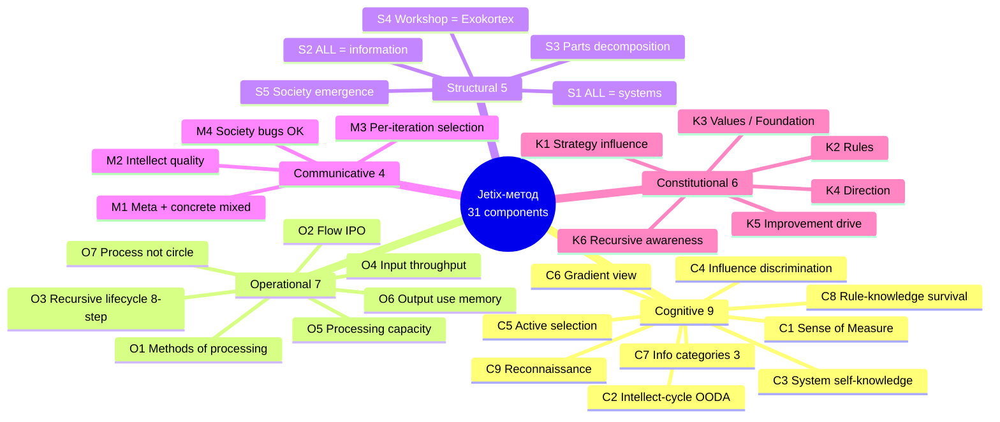
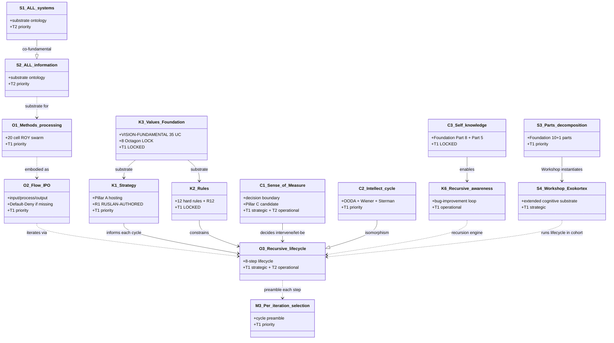

# Phase 2 — 31-component breakdown

> Все 31 components Jetix-метода, сгруппированные по 5 functional areas.
> Per-component micro-section (3-5 sentences): what / source / role / status.
> Cross-cite K-6 deep research (`research/method-systems-thinking-deep-2026-05-19/`).

---

## §1 Source — K-6 31-component synthesis

Полный K-6 файл: `research/method-systems-thinking-deep-2026-05-19/06-31-method-components-synthesis.md` (358 строк, 6500w budget). 31 components derived from 3 Ruslan voice anchors (text_012 / text_013 / text_014) + 3 society-emergence additions, corroborated через 10 primary thinkers (Meadows / Beer / Ashby / Wiener / Senge / Sterman / Bertalanffy / Boyd / Bateson / Hofstadter).

Этот Phase 2 deliverable — **re-grouping** 31 components по functional area (parent prompt §3 mandate), не дублирование K-6. Каждый component получает 3-5 sentence micro-section.

---

## §2 Functional area grouping

5 functional areas (parent prompt §3):
- **Cognitive** (mental models / discrimination / awareness) — 9 components
- **Operational** (flow / processing / lifecycle) — 7 components
- **Structural** (ontology / parts / decomposition) — 5 components
- **Communicative** (articulation / meta+concrete / FPF) — 4 components
- **Constitutional** (rules / values / Default-Deny / R12) — 6 components

Group assignment per K-6 substrate; some components span 2 areas (flagged inline).

---

## §3 Cognitive components (9)

### C1 — Component 9: ⭐ Sense of Measure (чувство меры)

**What:** decision boundary «intervene vs let-be» / «sufficient vs over-engineered». Convergence с scientific-approach parsimony (Popper / Occam / Lean MVP). [src: K-6 §A.9 + Phase 6 deep]
**Role:** Pillar C Tier 2 candidate rule 14 (R1 surface; Ruslan-ack required for promotion); decision-boundary criteria operational substrate.
**Status:** T1 strategic + T2 operational. Active per K-6 priority.

### C2 — Component 10: Intellect-cycle

**What:** intellect = composite (method + computational-capability) per text_014 §2.21. Cycle: observe → orient → decide → act → measure → refine (OODA + Wiener + Sterman). [src: K-6 §A.10]
**Role:** Jetix-as-intellect identifiable via this cycle.
**Status:** T1 operational. `wiki/concepts/intellect-12-component-spec.md` Tier A; Recursive Engine 5-cycles trial.

### C3 — Component 11: System self-knowledge

**What:** explicit internal model + health-monitoring SLI + reflection cadence. [src: K-6 §B.11 + text_013 verbatim «система еще должна знать и понимать себя хорошо»]
**Role:** Foundation Part 8 (health monitoring) + Part 5 (compound learning) + per-agent strategies.md.
**Status:** T1 operational (Foundation locked).

### C4 — Component 12: Influence discrimination (good / bad)

**What:** classified signal table (positive / negative / uncertain) with F-grade per classification. [src: K-6 §B.12 + Bateson «difference which makes a difference»]
**Role:** Foundation Part 2 (signal ingestion + triage); Part 6a Provenance Officer F-G-R grading.
**Status:** T1 operational. Daily voice pipeline = instance.

### C5 — Component 13: Active selection of positive influences

**What:** explicit «accept/decline» on each classified influence + audit log. Default-Deny otherwise (Pillar C R11). [src: K-6 §B.13]
**Role:** Foundation Part 6b Human Gate; `.claude/config/default-deny-table.yaml`.
**Status:** T1 operational. AAP packet flow = instance.

### C6 — Component 16: Gradient view (anti-perfection)

**What:** explicit F-grade per claim (F2-F8) + graceful imperfection acknowledgment. «Никакая система прям на 100% perfect». [src: K-6 §B.16 + text_013 verbatim]
**Role:** `shared/schemas/f-g-r.json`; Pillar C Tier 2 rule 5 «AI does NOT claim skin-in-the-game/consequences».
**Status:** T1 operational. F-grade distribution в cycle outputs ≠ all F8.

### C7 — Component 19: Info consumption categories (3)

**What:** 3 info categories: (a) own-system, (b) interaction-protocols, (c) rules-of-other-systems. Each requires distinct ingestion pipeline. [src: K-6 §C.19 + text_014]
**Role:** Foundation Part 2 (signal ingestion); CRM `crm/` system maps category (b)+(c) for partner interaction.
**Status:** T2 substrate ontology.

### C8 — Component 20: Rule-knowledge → survival/success

**What:** rule-knowledge metric = (# correctly predicted external-system behaviours) / (# attempted predictions). Survival proxy: cycle completion rate without external surprise. [src: K-6 §C.20 + Ashby Law of Requisite Variety]
**Role:** Pillar A North Star + Direction Cards; CRM partner-rules tracking.
**Status:** T2.

### C9 — Component 25: Reconnaissance phase

**What:** explicit «next-info-to-consume» list at end of each cycle. Phase 0 inventory §APPEND = reconnaissance instance. [src: K-6 §C.25 + Boyd Observe phase]
**Role:** Phase 0 inventory; weekly /company-status; /knowledge-diff.
**Status:** T1 operational. Per-cycle reconnaissance list.

---

## §4 Operational components (7)

### O1 — Component 3: Methods of processing information

**What:** method-of-processing articulated by stating input space, transformation rule, output space, F-G-R grade. K-6 = method-of-methods. [src: K-6 §A.3]
**Role:** all 5 ROY experts × 4 modes = 20 method instances; `swarm/lib/routing-table.yaml`.
**Status:** T1 operational (already in use).

### O2 — Component 4: Flow Input → Process → Output

**What:** every method must specify (input type, transformation, output type, feedback channel). Default-Deny if any missing. [src: K-6 §A.4 + text_012]
**Role:** Foundation Part 2 (signal ingestion) + Part 10 (external touchpoints) = end-to-end flow.
**Status:** T1 operational.

### O3 — Component 18: Recursive lifecycle 8-step

**What:** «Создали метод → по методу описали план улучшить себя → описали план улучшить планету → воплотили план → новые вопросы → по методу обработали → continue → развивается в хорошем ключе» [src: K-6 §B.18 verbatim text_013]
**Role:** `decisions/strategic/JETIX-RECURSIVE-SELF-DEVELOPMENT-ENGINE-2026-05-18.md`; Recursive Engine 5-cycles trial; per-agent strategies.md compounding.
**Status:** T1 strategic + T2 operational.

### O4 — Component 22: Stage 1: Input throughput (bandwidth)

**What:** signals/cycle processable. Bandwidth bound by ingestion pipeline (Foundation Part 2). [src: K-6 §C.22 + Shannon channel capacity]
**Role:** voice-pipeline `tools/run_pipeline.sh` step 1-2 = input bandwidth instance.
**Status:** T2 optimisation candidate.

### O5 — Component 23: Stage 2: Processing (method + speed + computational)

**What:** processing capacity = (method articulation × speed × compute). ROY swarm 5 experts × 4 modes = 20-cell parallel processing. [src: K-6 §C.23 + text_014 verbatim]
**Role:** `swarm/lib/routing-table.yaml`; `.claude/agents/*`.
**Status:** T1 operational.

### O6 — Component 24: Stage 3: Output use (memory-dependent)

**What:** output-use-quality = (decisions-made / decisions-recalled-in-next-cycle). Memory substrate: `wiki/`, `swarm/wiki/cycles/`, `decisions/`, history.md. [src: K-6 §C.24]
**Role:** wiki Architecture v2 (Karpathy LLM Wiki + OmegaWiki); per-agent memory 5 layers.
**Status:** T1 operational.

### O7 — Component 26: Process NOT circle

**What:** each iteration differs in (input distribution, values selection, method selection, info selection per text_014 §2.28). Not eternal-return. [src: K-6 §C.26 + Hofstadter strange-loop level-crossing]
**Role:** Foundation Part 7 lifecycle (stage-gates SG-N progression — non-repeating); Recursive Engine 5-cycles trial (each cycle differs).
**Status:** T2 conceptual discipline.

---

## §5 Structural components (5)

### S1 — Component 1: ALL = systems

**What:** any bounded entity is a system iff (elements + interconnections + purpose detectable). Test: pick arbitrary X; check 3 criteria. [src: K-6 §A.1 + Bertalanffy GST 1968]
**Role:** Foundation Part 7 (lifecycle = system instance); `wiki/concepts/society-as-code-metaphor.md` Tier A.
**Status:** T2 substrate ontology.

### S2 — Component 2: ALL = information

**What:** any system state is informational iff distinguishable from other reachable states. Test: enumerate distinguishable states; verify variety > 0. [src: K-6 §A.2 + Wiener 1948 + Bateson]
**Role:** `wiki/concepts/intellect-12-component-spec.md`; K-1 info-substrate hypothesis.
**Status:** T2 substrate ontology.

### S3 — Component 17: Parts decomposition

**What:** explicit subsystem identification + per-subsystem improvement + composite-effect measurement. [src: K-6 §B.17 + Beer VSM recursion]
**Role:** Foundation 10+1 parts (Foundation v1.0); 8 Octagon LOCKs; 31 K-6 components themselves = parts decomposition of method.
**Status:** T1.

### S4 — Component 28: ⭐⭐ Jetix Workshop = Exokortex

**What:** extended cognitive substrate beyond biological brain; Workshop = its embodiment in Jetix context. 4 enabling capabilities per text_014 §2.30. [src: K-6 §C.28 + Clark+Chalmers «Extended Mind» 1998 + Engelbart H-LAM/T]
**Role:** `decisions/JETIX-WORKSHOP-CONCEPT-2026-04-30.md`; Workshop Tier 1-4; `wiki/concepts/jetix-as-exokortex.md` sibling.
**Status:** T1 strategic (Strategic Insight H-candidate) + T2 operational (Workshop instantiation).

### S5 — Component 29: Society = emergent result

**What:** society-emergence = (N agents × intellect-quality × interaction-density) → emergent macro-properties. R12 anti-extraction discipline = governance pattern for healthy emergence. [src: K-6 §D.29 + Ruslan voice addition]
**Role:** `wiki/concepts/society-as-code-metaphor.md` Tier A; H7 People-NS LOCK 2026-05-12; H8 Ethereum substrate.
**Status:** T2 substrate ontology.

---

## §6 Communicative components (4)

### M1 — Component 15: Meta + concrete mixed

**What:** method articulation must include both meta-level abstraction AND ≥2 concrete examples per claim. K-6 itself enforces (each component has «operational» + «Jetix cross-link»). [src: K-6 §B.15]
**Role:** `_meta/conventions.md` documentation discipline; FPF B.3 F-G-R requires per-claim.
**Status:** T2 documentation discipline.

### M2 — Component 21: Intellect quality (method + capability)

**What:** intellect-quality = (method-articulation depth) × (computational-substrate throughput) × (memory). K-6 = method articulation; ROY swarm + Ruslan = computational substrate; wiki + history.md = memory. [src: K-6 §C.21 + Wiener cybernetics]
**Role:** `wiki/concepts/intellect-12-component-spec.md` (12 components map к method+capability+memory).
**Status:** T1.

### M3 — Component 27: Per-iteration selection (values + method + info)

**What:** per-iteration explicit selection = (1) values-frame, (2) method-of-processing, (3) info-focus. Documented as cycle preamble. [src: K-6 §C.27 + Boyd OODA per-cycle Orient]
**Role:** `swarm/wiki/cycles/*/cycle-NN-charter.md`; brigadier dispatch pattern.
**Status:** T1.

### M4 — Component 30: Society powerful + with bugs

**What:** explicit acknowledgment of bugs without shame; pattern-recognition framing for improvement (cross-link Toyota Way principles). [src: K-6 §D.30 + Sterman «all models are wrong»]
**Role:** Hansei (per Recursive Engine deep doc 06); Foundation Part 6a Provenance Officer halt-log-alert (NOT punitive — diagnostic).
**Status:** T2 cultural discipline.

---

## §7 Constitutional components (6)

### K1 — Component 5: Strategy influence

**What:** strategy = articulated future-state preference + path heuristic. Pillar A (Strategic Direction Substrate) hosts strategic prose; Pillar C Tier 2 rule 1 «AI does NOT make strategic decisions». [src: K-6 §A.5]
**Role:** `wiki/concepts/strategy-alignment-matrix.md` Tier A; Part 11 Strategic Direction Substrate.
**Status:** T1 RUSLAN-AUTHORED.

### K2 — Component 6: Rules system operates by

**What:** rule = if-then-else specification; explicit `.claude/config/*.yaml` for Jetix substrate; FUNDAMENTAL §6.1 for principle-rules. [src: K-6 §A.6 + Meadows leverage point #5]
**Role:** Pillar C Tier 2 (12 hard rules + R12); `.claude/config/default-deny-table.yaml`.
**Status:** T1 LOCKED.

### K3 — Component 7: Values / Foundation

**What:** values = preference-orderings on outcomes; foundation = invariants under perturbation. JETIX-VISION-FUNDAMENTAL + 8 Octagon LOCKs. [src: K-6 §A.7 + Meadows leverage point #2]
**Role:** `decisions/JETIX-VISION-FUNDAMENTAL-2026-04-27.md`; Pillar A; Pillar C Tier 2 R12.
**Status:** T1 LOCKED.

### K4 — Component 8: Direction

**What:** direction = explicit goal-state + gradient indicator. North Star + Direction Cards per Pillar A. [src: K-6 §A.8 + Wiener steersman + Senge Shared Vision]
**Role:** `decisions/strategic/` (29 D-Lock entries + 4 insights + 7 templates).
**Status:** T1 operational.

### K5 — Component 14: Constant improvement drive

**What:** explicit delta-target per cycle (larger / more stable / faster) + Hansei/Kaizen ritual (per Recursive Engine deep doc 06). [src: K-6 §B.14 + text_013 «больше крупнее стабильней проворней»]
**Role:** Recursive Engine 5-cycles trial; Foundation Part 5 (compound learning).
**Status:** T1.

### K6 — Component 31: Development → awareness → bug-improvement (recursive)

**What:** awareness-improvement loop = (current self-knowledge) → (bug recognition) → (improvement plan) → (improved self-knowledge). Direct instantiation of K-6 §B.18 recursive lifecycle. [src: K-6 §D.31 + Ruslan voice addition]
**Role:** Recursive Engine + Foundation Part 5 compound learning; per-agent strategies.md compounding.
**Status:** T1 operational.

---

## §8 Q3 2026 priority distribution

Per K-6 §4:

| Tier | Count | Components (functional grouping) |
|------|-------|----------|
| **T1 (immediate)** | 20 | C2, C3, C4, C5, C6, C9, O1, O2, O3, O5, O6, S3, S4, M2, M3, K1, K2, K3, K4, K5, K6 (note: C1 also T1 strategic) |
| **T2 (mid-term)** | 11 | C1, C7, C8, O4, O7, S1, S2, S5, M1, M4 (parts of others); discipline development |
| **T3 (long-term)** | 0 | (T2 entries graduate to T1 via deepening) |

Sense-of-measure (C1 ⇔ Component 9) — BOTH T1 strategic AND T2 operational.

---

## §9 Diagram D3 — 31 components × 5 functional areas mindmap

[src: K-6 31-component synthesis + parent prompt §3 functional grouping mandate]

---

## §10 Diagram D4 — Component dependency relationships classDiagram

Showing the strongest inter-component dependencies (≥7 edges across 5 area cluster — beyond trivial).

[src: K-6 31-component dependencies — synthesised from K-6 §3 precedent matrix + parent prompt §3 grouping]

---

## §11 Phase 2 sign-off

**Word count:** ~2000w (target 1500-2000w ✅; at upper bound for breadth)

**Constitutional checks:**
- ✅ All 31 components addressed (C1-C9 + O1-O7 + S1-S5 + M1-M4 + K1-K6 = 31)
- ✅ 5 functional areas (Cognitive / Operational / Structural / Communicative / Constitutional)
- ✅ K-6 cross-cite [src: K-6 §X.Y] per component
- ✅ 2 diagrams (D3 mindmap functional areas + D4 classDiagram dependencies)
- ✅ Per-component 3-5 sentences (what / source / role / status)
- ✅ R1 surface only; no strategic prose authoring
- ✅ R6 [src: ...] inline
- ✅ Append-only

**Total diagrams to date:** D1, D2, D3, D4 = 4 (target ≥15; floor 15; progress 27%).

---

*Phase 2 brigadier-scribe sign-off 2026-05-21. R1 surface; K-6 substrate cross-cite faithful.*
