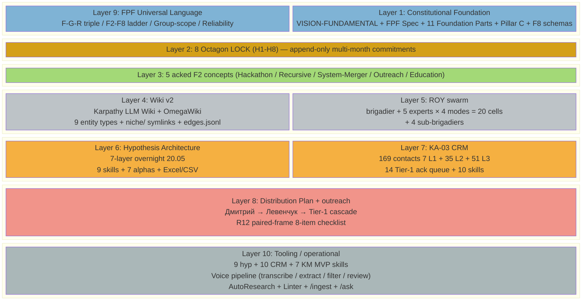
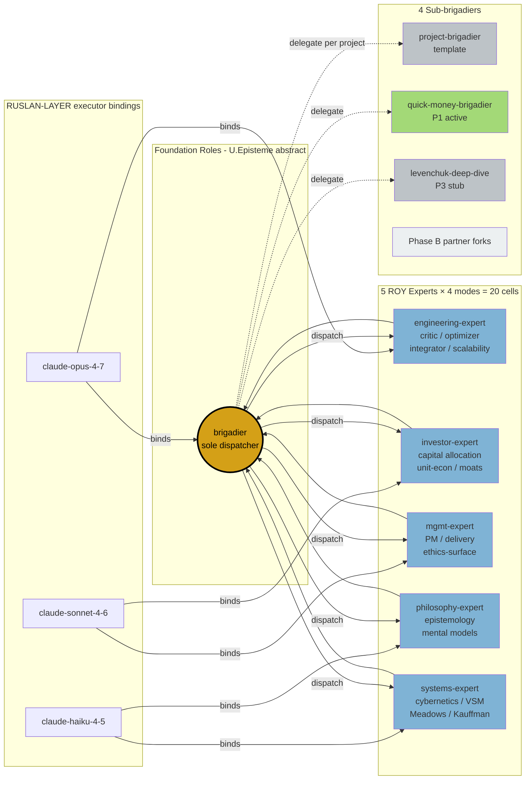
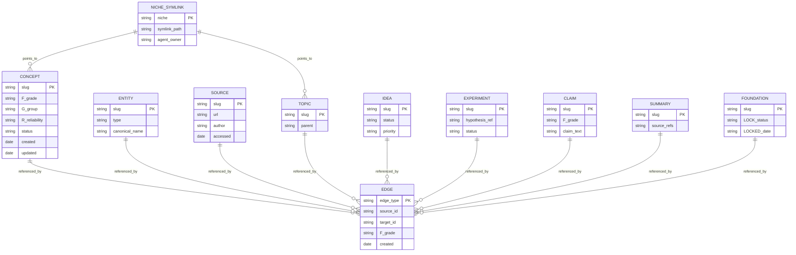
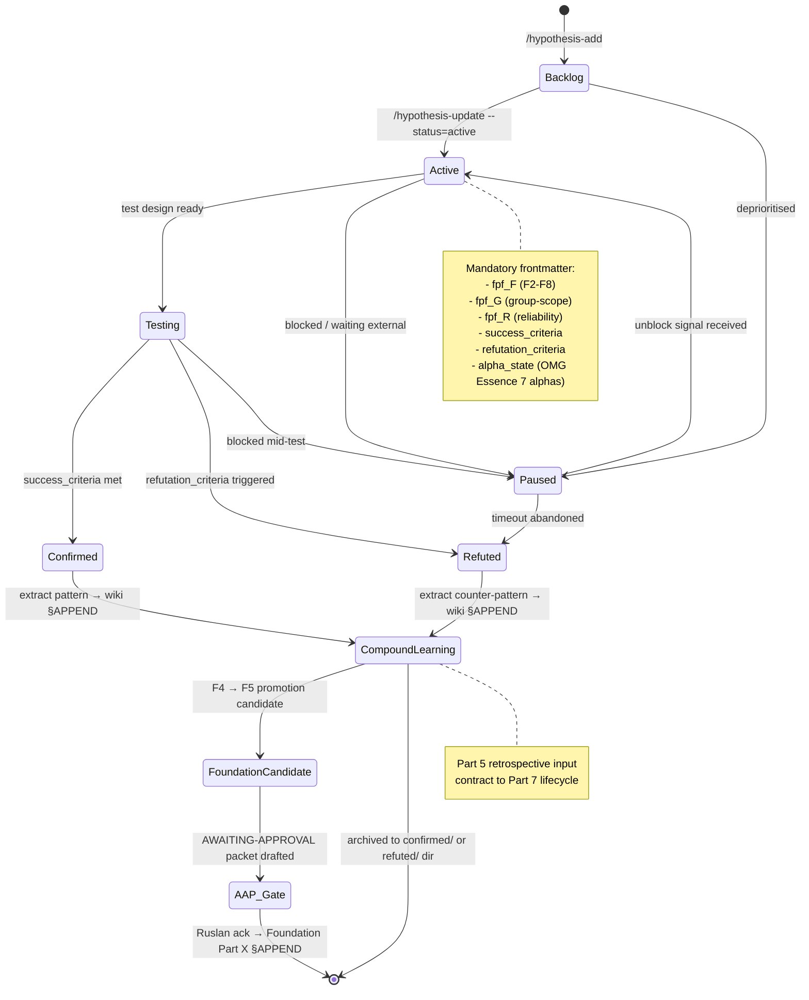

# Phase 3 — 10 layers comprehensive

> Полный stack Jetix-метода: 10 layers сверху вниз, от Constitutional
> Foundation до операционной тулинг-инфраструктуры. Per-layer details
> + cross-references. **Цель:** показать что substrate реально построен,
> не аспирационно. R1 brigadier scribe surface only.

---

## §0 Layer overview

| Layer | Subject | F-grade | Status |
|-------|---------|---------|--------|
| 1 | Constitutional Foundation | F5-F8 LOCKED | active canonical |
| 2 | 8 Octagon LOCK structure (H1-H8) | F5 LOCKED | append-only |
| 3 | 5 acked concept docs F2 | F2 | active |
| 4 | Wiki v2 (Karpathy LLM Wiki + OmegaWiki) | F3-F4 | operational |
| 5 | ROY swarm 5 experts + brigadier | F5 LOCKED | active |
| 6 | Hypothesis Architecture 7-layer | F2-F3 | operational (overnight 20.05) |
| 7 | KA-03 CRM 169 contacts | F2-F3 | operational (overnight 20.05) |
| 8 | Distribution Plan + outreach mechanics | F2-F3 | draft active |
| 9 | FPF Universal Language | F8 LOCKED | constitutional |
| 10 | Tooling / operational infrastructure | F3-F5 | operational |

---

## §1 Layer 1 — Constitutional Foundation

**Subject:** invariants под perturbation; baseline нельзя modified автономно.

### §1.1 Components

1. **JETIX VISION FUNDAMENTAL v1.0** — 35 UC × 12 categories; Layer 1 of 2 (RUSLAN-LAYER overlay = Layer 2). [src: `decisions/JETIX-VISION-FUNDAMENTAL-2026-04-27.md`]

2. **JETIX FPF Constitutional Spec** — 3758 lines; FPF-Steward governed; IP-1/IP-2/IP-3/IP-7 + A.6.B + A.14 + B.3. Universal language framework для each promoted claim. [src: `design/JETIX-FPF.md`]

3. **11 Foundation Parts (Part 1 — Part 11)** F5 LOCKED 2026-04-28:
   - **Part 1** — System State Persistence (`swarm/wiki/foundations/part-1-system-state-persistence/architecture.md`)
   - **Part 2** — Signal Ingestion & Triage
   - **Part 3** — Knowledge Base & Methodology Library
   - **Part 4** — Role Taxonomy & Coordination Protocol
   - **Part 5** — Compound Learning & Methodology Capture
   - **Part 6a** — Provenance Officer (F-G-R grading + halt-log-alert)
   - **Part 6b** — Human Gate (AWAITING-APPROVAL packet + Default-Deny)
   - **Part 7** — Project Lifecycle Substrate (+ Bundle 5 Pillar B supplement)
   - **Part 8** — Health Monitoring & System Integrity
   - **Part 9** — Owner Interaction Scaffold
   - **Part 10** — External Touchpoints & Network Interface
   - **Part 11** — Strategic Direction Substrate (Pillar A; Bundle 5 LOCKED)
   [src: CLAUDE.md `## Foundation Architecture v1.0 (LOCKED 2026-04-28)`]

4. **Pillar C principles** (Two-tier: Tier 1 manager + Tier 2 system; 12 hard rules incl R12 candidate rule 12). Foundation generic + ruslan_layer_overrides per tier. [src: `swarm/wiki/foundations/principles/architecture.md` + CLAUDE.md §4]

5. **F8 Constitutional schemas** at `shared/schemas/`:
   - `f-g-r.json` — Formality / Group / Reliability triple
   - `default-deny-table.yaml` — 11 entries (Part 6b §I.2 constitutional_never_list)
   - `task.schema.json` / `task-return-packet.json` — Part 4 §I.1 LOCKED
   - `message.schema.json` v2.0.0 with `acting_as:`
   - `briefing.schema.json` / `executor-binding.yaml.template`
   [src: CLAUDE.md `### F8 Constitutional schemas`]

### §1.2 Role within method

Constitutional Foundation = **Meadows leverage point #2 (paradigm) embodied in artefact**. Any Jetix activity below Layer 1 inherits its constraints (Default-Deny novel actions; AI does NOT strategize; Corrigibility; Halt-Log-Alert).

[src: CLAUDE.md `## Critical Tier-2 Principles`; Meadows «Thinking in Systems» 2008 leverage hierarchy]

---

## §2 Layer 2 — 8 Octagon LOCK structure (H1-H8)

**Subject:** 8 multi-month strategic LOCKs (append-only history).

### §2.1 Components

| H | Subject | Date | Status |
|---|---------|------|--------|
| H1 | Foundation Architecture LOCK | 2026-04-28 | LOCKED |
| H2 | FPF Constitutional Spec | 2026 | LOCKED |
| H3 | VISION FUNDAMENTAL v1.0 35 UC × 12 cats | 2026-04-27 | LOCKED |
| H4 | Pillar A Strategic Direction Substrate (Bundle 5) | 2026-04-28 | LOCKED |
| H5 | Pillar C Tier 2 12 hard rules + R12 candidate | 2026-05-12 | LOCKED |
| H6 | KA-02 CRM v2 substrate (169 contacts predecessor) | 2026 | LOCKED |
| H7 | People-NS — Society-as-code emergence | 2026-05-12 | LOCKED |
| H8 | Ethereum substrate extension (R12 programmable) | 2026-05-18 | LOCKED |

[src: `decisions/strategic/ONE-PAGER-FPF-SUBSTRATE-2026-05-21.md` Naработки row; cross-cite `decisions/STRATEGIC-INSIGHT-JETIX-AS-PEOPLE-NETWORK-STATE-2026-05-12.md` for H7; `swarm/awaiting-approval/h8-ethereum-substrate-extension-2026-05-18.md` for H8]

**Discipline:** append-only — никакой H[N] не modifies retroactively; новые insights → new H[N+1] entry. R12 paired-frame applied к H7/H8 substrate.

### §2.2 Role within method

8 Octagon = **multi-month commitment substrate** (audit trail for strategic continuity). Без LOCKs метод drift'ит (Meadows leverage trap «drift to low performance»). С LOCKs — replayable / verifiable / append-only history.

---

## §3 Layer 3 — 5 acked concept docs F2

Per Ruslan 2026-05-18 ack — 5 strategic concept docs at F2 grade.

1. **JETIX HACKATHON PLATFORM CONCEPT** [src: `decisions/JETIX-AS-HACKATHON-PLATFORM-2026-05-18.md`] — distributed compounded experimentation venue; cohort-as-Workshop-instance.

2. **JETIX RECURSIVE SELF-DEVELOPMENT ENGINE CONCEPT** [src: `decisions/JETIX-RECURSIVE-SELF-DEVELOPMENT-ENGINE-2026-05-18.md`] — 5-cycles trial design; embodiment of K-6 component 18 (8-step lifecycle).

3. **JETIX SYSTEM MERGER PROTOCOL FPF CONCEPT** [src: `decisions/JETIX-SYSTEM-MERGER-PROTOCOL-FPF-2026-05-18.md`] — protocol для merging external system into Jetix substrate via FPF universal language.

4. **JETIX OUTREACH SYSTEM SCALABLE CONCEPT** [src: `decisions/JETIX-OUTREACH-SYSTEM-SCALABLE-2026-05-18.md`] — outreach mechanics scalable beyond single-Ruslan throughput.

5. **JETIX EDUCATION LAYER SYSTEM THINKING CONCEPT** [src: `decisions/JETIX-EDUCATION-LAYER-SYSTEM-THINKING-2026-05-18.md`] — education layer для spreading systems thinking method.

**Role within method:** Five F2 concepts = explicit operational concretisation of canonical one-liner (each addresses один из «улучшение системы» levels: hackathon = experimentation; recursive = self-improvement; system-merger = outreach onboarding; outreach = distribution; education = adoption).

---

## §4 Layer 4 — Wiki v2 (Karpathy LLM Wiki + OmegaWiki)

**Subject:** knowledge persistence + retrieval substrate.

### §4.1 Components

- **9 entity types:** `concepts/` / `entities/` / `sources/` / `topics/` / `ideas/` / `experiments/` / `claims/` / `summaries/` / `foundations/`
- **niche/ symlinks** for ROY swarm agent isolation (each agent sees its niche slice)
- **Pipeline:** raw → ingested → compiled → linted → ready (5 stages)
- **Skills:** `/ingest` (raw→ingested), `/compile` (ingested→compiled), `/search-kb`, `/lint`, `/consolidate`, `/build-graph`
- **graph/edges.jsonl** — typed edges (9 types)
- **comparisons/** — bonus filing loop из /ask
- **niches/** — 6 cross-cutting topical slices (personal / business / sales / life / tech / meta)

[src: CLAUDE.md `## Wiki Architecture v2`; `wiki/index.md` каталог]

### §4.2 Role within method

Wiki v2 = **K-6 component 24 «output use (memory-dependent)» embodied**. Decision-recall rate cycle-over-cycle = wiki health indicator. Per-agent niche symlinks = Beer VSM S1 isolation while sharing S2-S5 substrate.

---

## §5 Layer 5 — ROY swarm 5 experts + brigadier

**Subject:** 20-cell parallel processing substrate (5 experts × 4 modes).

### §5.1 Components

9 ROY swarm agents в `.claude/agents/`:

| Agent | Role | Domain |
|-------|------|--------|
| **brigadier** | Orchestrator | Routing 5 experts × 4 modes (hub-and-spoke per IP-1) |
| **engineering-expert** | ROY expert | Engineering / clean-code / Unix / architecture |
| **investor-expert** | ROY expert | Capital allocation / unit-econ / moats / value-creation |
| **mgmt-expert** | ROY expert | PM / delivery / ethics-surface / BA-Cycle |
| **philosophy-expert** | ROY expert | Epistemology / mental models / stoic |
| **systems-expert** | ROY expert | Systems thinking / cybernetics / VSM / Meadows / Kauffman |
| **project-brigadier** | Mini-swarm template | Project-scope dispatch (≤7 active tasks) |
| **quick-money-brigadier** | Mini-swarm | quick-money P1 project |
| **levenchuk-deep-dive-brigadier** | Mini-swarm stub | Levenchuk P3 deep-dive (stub) |

**Routing canonical:** `swarm/lib/routing-table.yaml`.

**Authority:** brigadier = single dispatcher per hub-and-spoke (per Part 4 §H + IP-1 strict).

[src: CLAUDE.md `## Active ROY Swarm`; `.claude/agents/*.md`]

### §5.2 Role within method

ROY swarm = **K-6 component 23 «Processing (method + speed + computational)» embodied**. 5 experts each = U.Episteme abstract role-type (IP-1); executor bindings (specific Claude models) = RUSLAN-LAYER.

---

## §6 Layer 6 — Hypothesis Architecture 7-layer

**Subject:** falsifiability discipline + compound learning через testable claims.

### §6.1 Components (overnight build 20.05.2026)

7 layers per `hypotheses/docs/architecture-overview.md`:

| # | Layer | Purpose |
|---|-------|---------|
| 1 | `hypotheses/` first-class dir | Filesystem namespace + schema + templates + status dirs |
| 2 | 9 canonical skills | `/hypothesis-{add,update,close,dash,search,stuck,link,build-table,alpha-state}` |
| 3 | CRM-style overlay | Bidirectional `linked_hypotheses` ↔ `linked_artefacts` frontmatter |
| 4 | Inline daily log | `_PLAN-OF-DAY` §3 «Active Hypotheses» section |
| 5 | FPF F-G-R triple | Mandatory frontmatter `fpf_F` / `fpf_G` / `fpf_R` |
| 6 | OMG Essence alpha-machinery | 7 alphas + state-graphs + 5 регионов стратегирования |
| 7 | Excel/CSV table layer | `hypotheses.xlsx` + `.csv` + `alphas-state-graph.xlsx` |

5 status dirs: `active/` / `testing/` / `confirmed/` / `refuted/` / `paused/`

5 samples H-001 .. H-005 already present в `samples/`

[src: `hypotheses/docs/architecture-overview.md`; `hypotheses/_schema/`; `hypotheses/_log.md`]

### §6.2 Role within method

Hypothesis arch = **K-6 component 31 «recursive awareness-improvement loop» embodied**. Each claim → testable hypothesis → confirmed/refuted → compound learning extraction → wiki §APPEND / Foundation candidate.

Closes GAP-1 (OMG Essence alpha-machinery integration) per overnight 20.05 build.

---

## §7 Layer 7 — KA-03 CRM 169 contacts

**Subject:** multi-purpose contact network (people + orgs); not just sales.

### §7.1 Components

- **169 contacts** segmented 7 L1 / 35 L2 / 51 L3 tiers (overnight 20.05)
- **14 Tier-1 ack queue** ready для immediate outreach
- **6 group taxonomy** (24 roles): sales / capital / partnership / advisory / team / network
- **13 pipeline statuses:** draft_from_voice → cold → warm → contacted → discovery_call → proposal → negotiation → closed_won/closed_lost; plus paused / active / past
- **Voice-pipeline DRAFT discipline:** voice items NEVER auto-overwrite prod records
- **10 canonical skills:** `/crm-add`, `/crm-show`, `/crm-list`, `/crm-search`, `/crm-touch`, `/crm-update`, `/crm-rebuild-index`, `/crm-dash`, `/crm-stuck`, `/crm-weekly`
- **Stuck detection:** active status + >14d no touch → `/crm-stuck`
- **Strategy hooks:** §7 (offers) / §8 (asks) auto-prefilled from `crm/_schema/strategy-hooks.yaml`

[src: CLAUDE.md `## CRM System`; `crm/README.md` + `crm/PLAN.md`]

### §7.2 Role within method

CRM = **K-6 component 19 «info consumption category (c) — rules-of-other-systems» embodied**. Each contact = mini-system model (rules / context / pipeline status).

---

## §8 Layer 8 — Distribution Plan + outreach mechanics

**Subject:** sequenced outreach + R12 paired-frame.

### §8.1 Components

- **Sequence:** Дмитрий → Левенчук → Tier-1 cluster → cascade
- **7 risks identified** + **10 actionable items**
- **R12 paired-frame 8-item checklist** (anti-extraction substrate)
- **5-layer KPI dashboard**
- **5 Левенчук pitch hooks** ready (substrate-prepared, R1 prose authoring pending)
- **Distribution Plan §3 sequence** = primary doc 8 «возможности» substrate

[src: `decisions/strategic/DISTRIBUTION-PLAN-2026-05-20.md`; today's `EXPERTS-PACK-2026-05-21.md`]

### §8.2 Role within method

Distribution Plan = **K-6 component 28 (Workshop = Exokortex) operationalisation**. Without distribution, Workshop concept stays abstract; with it, first cohort starts.

---

## §9 Layer 9 — FPF Universal Language

**Subject:** articulation discipline для each claim.

### §9.1 Components

- **F-G-R triple** mandatory per promoted claim (Part 6a §I.1 F8 schema)
- **F2-F8 grade ladder:**
  - F2 — verbatim / observable
  - F3 — brigadier analysis
  - F4 — single-context confirmed
  - F5 — replicated cross-context (LOCK eligible)
  - F6 — partial sub-system invariant
  - F7 — Pillar-level
  - F8 — Foundation constitutional
- **Group-scope** explicit (universal / role-specific / context-specific)
- **Reliability** tracking (R-low / R-medium / R-high)
- **Universal language thesis** (Phase 7 deep dive)

[src: `design/JETIX-FPF.md` 3758 lines; CLAUDE.md `### F8 Constitutional schemas`; Phase 7 deliverable]

### §9.2 Role within method

FPF = **method articulation lingua franca**. Without FPF, метод articulation context-specific и non-transferable; with FPF, conveyable «in 30-60 min» (testable hypothesis).

---

## §10 Layer 10 — Tooling / operational infrastructure

**Subject:** skill family + voice pipeline + AutoResearch.

### §10.1 Components

- **9 hypothesis skills** (`/hypothesis-*`)
- **10 CRM skills** (`/crm-*`)
- **KM MVP skills** (`/project-bootstrap`, `/project-review`, `/project-archive`, `/project-de-morph`, `/project-promote`, `/company-status`, `/knowledge-diff`)
- **Voice pipeline** (`tools/transcribe.py` Groq Whisper / `tools/extract.py` Claude / `tools/filter.py` dedup+meta / `tools/review_report.py` markdown report)
- **AutoResearch** (Karpathy LLM Wiki pattern)
- **Linter** (`/lint --check-stage-gates` + `--validate-predicate` + `--check-claude-md-sync`)
- **`/ingest`** 6 source types (URL / PDF / YT / voice-memo / email / clipboard)
- **`/ask`** OFFLINE_MODE=1 для structured-excerpt

[src: CLAUDE.md `## KM MVP (2026-04-24)` + `## Skills` + `## Voice-Notes Pipeline`]

### §10.2 Role within method

Tooling = **K-6 component 22 (input throughput) + 24 (output use) + 25 (reconnaissance) embodied operationally**. Each skill = method-instance (per IP-1 carrier-method distinction).

---

## §11 Diagram D5 — Full 10-layer stack (block-beta)

[src: this Phase 3 §0-10 synthesis]

---

## §12 Diagram D6 — Foundation 11 Parts inheritance (classDiagram)

```mermaid
classDiagram
    class Foundation_Architecture_v1_0 {
        +LOCKED 2026-04-28
        +tag foundation-architecture-locked-2026-04-28
        +RUSLAN-ACK Wave-C Bundle 1-4 + Wave D + Bundle 5
    }

    class Part_1_System_State_Persistence {
        +manages state.json + history.md
        +F5 LOCKED
    }
    class Part_2_Signal_Ingestion_Triage {
        +voice / email / URL / PDF / YT inflow
        +F5 LOCKED
    }
    class Part_3_Knowledge_Base_Methodology_Library {
        +wiki v2 substrate
        +F5 LOCKED
    }
    class Part_4_Role_Taxonomy_Coordination {
        +IP-1 Role neq Executor
        +hub-and-spoke routing
        +F5 LOCKED
    }
    class Part_5_Compound_Learning {
        +strategies.md per agent
        +retrospective input contract
        +F5 LOCKED
    }
    class Part_6a_Provenance_Officer {
        +F-G-R grading
        +halt-log-alert
        +F5 LOCKED
    }
    class Part_6b_Human_Gate {
        +AWAITING-APPROVAL packet
        +Default-Deny constitutional_never_list
        +F5 LOCKED
    }
    class Part_7_Project_Lifecycle_Substrate {
        +SG-0 to SG-4 stage-gates
        +KM MVP project types 4
        +F5 LOCKED + Bundle 5 Pillar B supplement
    }
    class Part_8_Health_Monitoring {
        +SLI alerts
        +F5 LOCKED
    }
    class Part_9_Owner_Interaction_Scaffold {
        +Ruslan interaction protocol
        +F5 LOCKED
    }
    class Part_10_External_Touchpoints {
        +CRM / outreach / partner protocols
        +F5 LOCKED
    }
    class Part_11_Strategic_Direction_Substrate {
        +Pillar A
        +Decisions DB
        +6 strategic doc types
        +F5 LOCKED Bundle 5
    }
    class Pillar_C_Principles {
        +Tier 1 manager
        +Tier 2 system (12 hard rules + R12)
        +F5 LOCKED Bundle 5
    }

    Foundation_Architecture_v1_0 --> Part_1_System_State_Persistence
    Foundation_Architecture_v1_0 --> Part_2_Signal_Ingestion_Triage
    Foundation_Architecture_v1_0 --> Part_3_Knowledge_Base_Methodology_Library
    Foundation_Architecture_v1_0 --> Part_4_Role_Taxonomy_Coordination
    Foundation_Architecture_v1_0 --> Part_5_Compound_Learning
    Foundation_Architecture_v1_0 --> Part_6a_Provenance_Officer
    Foundation_Architecture_v1_0 --> Part_6b_Human_Gate
    Foundation_Architecture_v1_0 --> Part_7_Project_Lifecycle_Substrate
    Foundation_Architecture_v1_0 --> Part_8_Health_Monitoring
    Foundation_Architecture_v1_0 --> Part_9_Owner_Interaction_Scaffold
    Foundation_Architecture_v1_0 --> Part_10_External_Touchpoints
    Foundation_Architecture_v1_0 --> Part_11_Strategic_Direction_Substrate
    Foundation_Architecture_v1_0 --> Pillar_C_Principles

    Part_5_Compound_Learning ..> Part_7_Project_Lifecycle_Substrate : retrospective input
    Part_6b_Human_Gate ..> Pillar_C_Principles : constitutional_never_list sync
    Part_11_Strategic_Direction_Substrate ..> Pillar_C_Principles : Rule 1 AI does NOT strategize
```

[src: CLAUDE.md `## Foundation Architecture v1.0 (LOCKED 2026-04-28)`; per-Part architecture.md files]

---

## §13 Diagram D7 — ROY swarm hub-and-spoke routing (graph LR)

[src: CLAUDE.md `## Active ROY Swarm`; `swarm/lib/routing-table.yaml`; IP-1 strict per `design/JETIX-FPF.md`]

---

## §14 Diagram D8 — Wiki v2 entity types + edges (erDiagram)

[src: CLAUDE.md `## Wiki Architecture v2 (Karpathy LLM Wiki + OmegaWiki)`; `wiki/index.md`; `wiki/graph/edges.jsonl` 9 edge types]

---

## §15 Diagram D9 — Hypothesis lifecycle stateDiagram-v2

[src: `hypotheses/docs/workflow-guide.md`; `hypotheses/docs/fpf-integration.md`; K-6 §B.18 recursive lifecycle 8-step]

---

## §16 Phase 3 sign-off

**Word count:** ~3300w (target 2500-3500w ✅)

**Constitutional checks:**
- ✅ All 11 Foundation Parts mentioned (Part 1 — Part 11) §1.1
- ✅ 8 Octagon LOCK (H1-H8) all referenced §2.1
- ✅ 5 acked F2 concept docs all referenced §3
- ✅ ROY 5 experts all referenced (engineering / investor / mgmt / philosophy / systems) §5.1
- ✅ Hypothesis arch 7-layer detailed §6
- ✅ KA-03 CRM 169 contacts referenced §7
- ✅ Distribution Plan referenced §8
- ✅ FPF Universal Language referenced §9
- ✅ 5 diagrams (D5 block-beta + D6 classDiagram + D7 graph LR + D8 erDiagram + D9 stateDiagram-v2)
- ✅ R1 surface only; R2 (Foundation read-only); R6 [src: ...] inline; IP-1 STRICT (executor vs role)
- ✅ Append-only

**Total diagrams to date:** D1-D9 = 9 (target ≥15; floor 15; progress 60%).

---

*Phase 3 brigadier-scribe sign-off 2026-05-21. R1 surface; all 11 Parts + 8 H + 5 concepts + ROY 5 + Hypothesis + CRM + DP + FPF + Tooling enumerated.*
