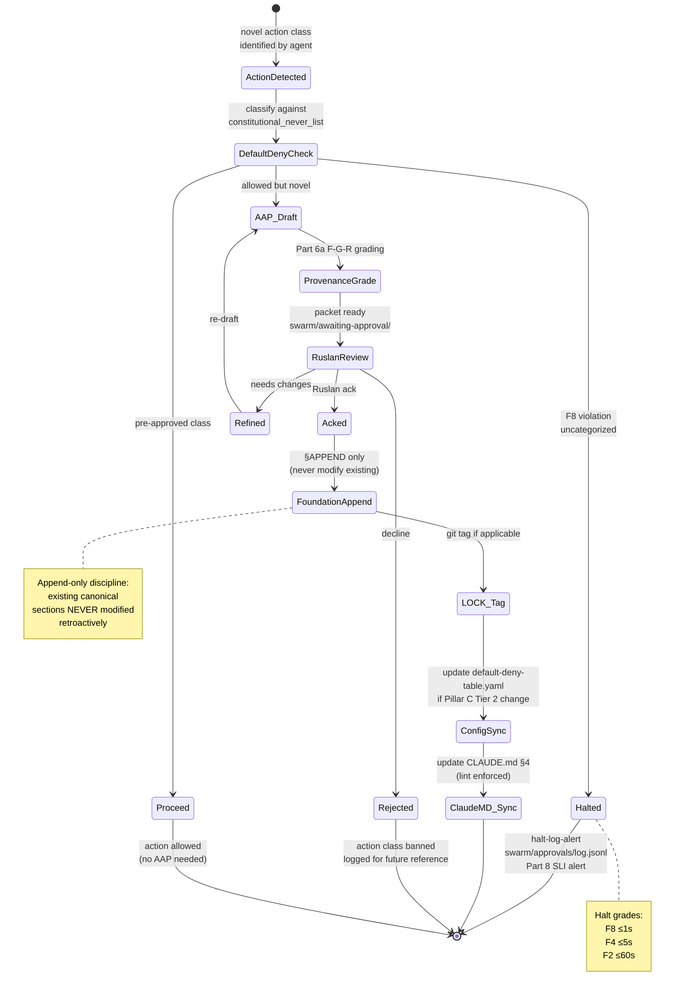

# Phase 4 — Mechanics

> Как parts взаимодействуют в operational substrate. 5 ключевых flows
> описаны текстом + 5 mermaid diagrams. R1 brigadier scribe surface only.

---

## §1 Five operational flows

| # | Flow | Layer touchpoints |
|---|------|------|
| F1 | Voice memo → transcribe → extract → wiki §APPEND → hypothesis candidate → CRM | Layer 2 + 4 + 6 + 7 + 10 |
| F2 | Foundation modifications path: AAP packet → Part 6b stage_gate → §APPEND only | Layer 1 + 9 |
| F3 | R1 Ruslan strategic prose flow: substrate compile (brigadier) → R1 prose authoring → R12 audit → publish | Layer 5 + 9 |
| F4 | Hypothesis lifecycle: backlog → active → testing → confirmed/refuted → compound learning extraction | Layer 6 |
| F5 | Outreach handshake: Distribution Plan §3 sequence → R12 paired-frame → CRM update | Layer 7 + 8 |

---

## §2 Flow F1 — Voice memo → wiki §APPEND pipeline

**Trigger:** Ruslan dictates voice memo (OGG/MP3 to `raw/voice-memos-YYYY-MM-DD-batch/`).

**Steps:**

1. `python3 tools/transcribe.py` — Groq Whisper transcription → `raw/voice-memos-*/transcripts/text_NNN.md` files
2. `python3 tools/extract.py` — Claude extraction → structured items per transcript (5-cell FPF lens applied; ideas / observations / hypotheses / facts / questions)
3. `python3 tools/filter.py` — Cross-batch dedup + meta-analysis (всех items за день)
4. `python3 tools/review_report.py` — Markdown report → `reports/review_YYYY-MM-DD.md` + copy `~/review-latest.md`

**STOP point** — Ruslan downloads `~/review-latest.md`, reads, makes decisions.

**Manual distribution** (only after review):
- /ingest для wiki additions (concepts / claims / ideas / sources entities)
- /hypothesis-add для testable claims (status → backlog initially)
- /crm-update для people / orgs mentioned (DRAFT status only — never auto-overwrite prod)
- Strategic items → Ruslan personal review для R1 strategic prose authoring slot

**Key discipline:** `tools/distribute.py.bak` archived — auto-distribution disabled per `feedback_voice_pipeline_draft.md` (Claude outputs NEVER auto-flow into KB without human review).

[src: CLAUDE.md `## Voice-Notes Pipeline`; `tools/run_pipeline.sh`]

### §2.1 Diagram D10 — Voice memo → wiki §APPEND sequenceDiagram

```mermaid
sequenceDiagram
    autonumber
    participant Ruslan as Ruslan (voice)
    participant FS as Filesystem<br/>raw/voice-memos-*/
    participant Trans as transcribe.py<br/>(Groq Whisper)
    participant Extract as extract.py<br/>(Claude)
    participant Filter as filter.py<br/>(dedup + meta)
    participant Review as review_report.py
    participant RuslanReview as Ruslan (review)
    participant Wiki as wiki/
    participant Hyp as hypotheses/
    participant CRM as crm/

    Ruslan->>FS: dictate OGG/MP3 → batch dir
    FS->>Trans: OGG/MP3 input
    Trans->>FS: text_NNN.md transcripts (Russian)
    FS->>Extract: transcripts batch input
    Extract->>FS: per-audio MD + 5-cell + FPF lens<br/>(ideas / observations / hypotheses / facts / questions)
    FS->>Filter: all items cross-batch
    Filter->>FS: deduped + meta-analyzed items
    FS->>Review: structured items
    Review->>RuslanReview: review_YYYY-MM-DD.md<br/>+ ~/review-latest.md
    Note over Review,RuslanReview: STOP point<br/>(human gate; no auto-distribute)

    RuslanReview->>RuslanReview: read + decide
    par Manual /ingest
        RuslanReview->>Wiki: /ingest item → concept/claim/idea/source
    and Manual /hypothesis-add
        RuslanReview->>Hyp: testable claim → backlog/
    and Manual /crm-update
        RuslanReview->>CRM: people/orgs → DRAFT status<br/>(never auto-overwrite prod)
    and Strategic items
        RuslanReview->>RuslanReview: queue for R1 strategic prose<br/>(Pillar A Part 11)
    end

    Note over Wiki,CRM: All distribution MANUAL<br/>tools/distribute.py archived<br/>per voice-pipeline DRAFT discipline
```

[src: CLAUDE.md `## Voice-Notes Pipeline`; `feedback_voice_pipeline_draft.md`; Part 2 Signal Ingestion architecture]

---

## §3 Flow F2 — Foundation modifications path (AAP gate)

**Trigger:** novel action class identified OR Foundation-level path write attempted (`swarm/wiki/foundations/`, `principles/`, `shared/schemas/`, `.claude/config/`).

**Steps:**

1. Default-Deny check (`.claude/config/default-deny-table.yaml` constitutional_never_list — 11 entries baseline) — if action class uncategorized → halt-log-alert F8 grade
2. If allowed but novel → AAP packet draft at `swarm/awaiting-approval/<slug>-YYYY-MM-DD.md` (per Part 6b §I.2)
3. Part 6a Provenance Officer F-G-R grades the packet (Formality / Group-scope / Reliability)
4. Ruslan reviews packet (ack / refine / reject)
5. If acked → Foundation Part X §APPEND only (never modify existing canonical sections)
6. Update LOCK tag если applicable (`git tag <name>-locked-YYYY-MM-DD`)
7. Cross-update `.claude/config/default-deny-table.yaml` constitutional_never_list если new rule emerged
8. Update CLAUDE.md inlined §4 если Pillar C Tier 2 change (sync invariant enforced by `/lint --check-claude-md-sync`)

[src: CLAUDE.md `## Critical Tier-2 Principles`; Part 6b architecture; `swarm/awaiting-approval/`]

### §3.1 Diagram D12 — AWAITING-APPROVAL gate flow stateDiagram-v2



[src: CLAUDE.md `## Critical Tier-2 Principles` + Part 6b §I.2; `swarm/awaiting-approval/` actual packets]

---

## §4 Flow F3 — R1 Ruslan strategic prose authoring

**Trigger:** strategic decision required (Pillar A scope — North Star / Direction Card / Strategic Insight / Lock Entry / Phase Plan / Strategic Reflection).

**Steps:**

1. brigadier dispatches к 5 ROY experts for substrate compile (relevant memos / cross-cite / options surfacing)
2. ROY experts → drafts under `swarm/wiki/drafts/` (NEVER canonical)
3. brigadier synthesises drafts → recommendation memo with options + tradeoffs
4. **R1 hand-off:** Ruslan reads memo, authors strategic prose (per Pillar C Tier 2 rule 1 «AI does NOT make strategic decisions»; per Pillar A `prose_authored_by:` must be `ruslan` or `hybrid-with-ack-trail` at F5 LOCKED)
5. R12 paired-frame audit (anti-extraction substrate check; Mondragón ratio / QF / fork-and-leave)
6. Publish → `decisions/strategic/` (29 D-Lock entries pattern + 4 insights + 7 templates)
7. Cross-update relevant Foundation Part if F5+ promotion required (loop back через F2 AAP gate)

[src: CLAUDE.md `## Critical Tier-2 Principles` rule 1; Part 11 §A.1; CLAUDE.md `## Active ROY Swarm`]

### §4.1 Diagram D11 — R1 strategic prose flow sequenceDiagram

```mermaid
sequenceDiagram
    autonumber
    participant Ruslan
    participant Brig as brigadier
    participant Eng as engineering-expert
    participant Inv as investor-expert
    participant Mgt as mgmt-expert
    participant Phi as philosophy-expert
    participant Sys as systems-expert
    participant Drafts as swarm/wiki/drafts/
    participant Memo as recommendation memo
    participant R12 as R12 paired-frame audit
    participant Strat as decisions/strategic/

    Ruslan->>Brig: strategic question<br/>(Pillar A scope)
    Note over Brig: brigadier carries NO domain<br/>expertise — only routing<br/>+ synthesis + termination

    par 5-expert dispatch
        Brig->>Eng: substrate compile (engineering lens)
        Brig->>Inv: substrate compile (investor lens)
        Brig->>Mgt: substrate compile (mgmt lens)
        Brig->>Phi: substrate compile (philosophy lens)
        Brig->>Sys: substrate compile (systems lens)
    end

    Eng->>Drafts: draft (4 modes: critic / optimizer / integrator / scalability)
    Inv->>Drafts: draft (capital alloc / unit-econ / moats)
    Mgt->>Drafts: draft (PM / delivery / ethics-surface)
    Phi->>Drafts: draft (epistemology / mental models)
    Sys->>Drafts: draft (cybernetics / VSM)

    Drafts->>Brig: 5 drafts collected
    Brig->>Memo: synthesise → options + tradeoffs<br/>(brigadier scribe pattern;<br/>NOT strategic prose authoring)

    Memo->>Ruslan: recommendation memo<br/>(options surfaced only)

    Note over Ruslan: Pillar C Tier 2 rule 1:<br/>AI does NOT make strategic decisions<br/>Ruslan = sole strategist

    Ruslan->>Ruslan: R1 strategic prose authoring<br/>(prose_authored_by: ruslan<br/>OR hybrid-with-ack-trail)

    Ruslan->>R12: R12 paired-frame audit<br/>(8-item checklist:<br/>Mondragón / QF / fork-and-leave)
    R12->>Ruslan: audit pass / fail

    alt R12 pass
        Ruslan->>Strat: publish → D-NN-lock-entry.md<br/>OR insight / direction card
        Strat->>Brig: cycle compound learning extraction
    else R12 fail
        Ruslan->>Ruslan: revise R1 prose<br/>OR escalate AAP packet
    end

    Note over Strat: 29 D-Lock entries +<br/>4 insights + 7 templates<br/>в decisions/strategic/
```

[src: CLAUDE.md §4.1 rule 1; Part 11 §A.1; ROY 5 experts per `.claude/agents/`; R12 substrate per H7 LOCK 2026-05-12]

---

## §5 Flow F4 — Hypothesis lifecycle full cycle

Already detailed via Diagram D9 (Phase 3 §15). Cross-cite here only.

**Mechanic invariants:**
- Each transition logged в `hypotheses/_log.md` append-only
- F-G-R frontmatter updated per transition
- Alpha state (OMG Essence 7 alphas) advanced per testing progress
- Linked artefacts (CRM-style overlay Layer 3) bidirectionally maintained
- Excel/CSV regenerated via `/hypothesis-build-table` periodically

[src: Phase 3 Diagram D9; `hypotheses/docs/workflow-guide.md`]

---

## §6 Flow F5 — Outreach handshake (R12 paired-frame)

**Trigger:** Tier-1 contact identified в CRM (status `cold` or `warm`).

**Steps:**

1. Lookup contact (CRM `/crm-show <slug>`) — review §1-14 sections
2. Substrate compile (brigadier dispatch) — relevant Jetix substrate для this contact's interests
3. Distribution Plan §3 sequence positioning (Дмитрий → Левенчук → Tier-1 cluster cascade)
4. Draft outreach message (substrate compile only; R1 prose authoring deferred к Ruslan)
5. R12 paired-frame 8-item checklist:
   - Mondragón 5:1 wage ratio cap stated explicitly
   - QF revenue distribution mechanism mentioned
   - Fork-and-leave exit tokens disclosed
   - Wage ratio violation conditions visible
   - Non-consensual distribution guards present
   - Fork prevention attempt absent
   - Extraction beyond agreed share absent
   - Participant value share quantified
6. Ruslan reviews + sends (R1 personal authorship)
7. Response tracking → CRM update (status → `contacted` or `discovery_call`)
8. Follow-up sequence per pipeline status

[src: `decisions/strategic/DISTRIBUTION-PLAN-2026-05-20.md`; CLAUDE.md `## CRM System`; R12 substrate H7 LOCK 2026-05-12]

### §6.1 Diagram D13 — Outreach handshake sequenceDiagram

```mermaid
sequenceDiagram
    autonumber
    participant Brig as brigadier
    participant CRM as crm/<slug>.md
    participant Subst as Jetix substrate<br/>(wiki / decisions / drafts)
    participant DP as Distribution Plan §3
    participant R12 as R12 paired-frame audit<br/>(8-item checklist)
    participant Ruslan
    participant Contact as External contact

    Brig->>CRM: /crm-show <slug><br/>read §1-14 sections
    CRM->>Brig: contact context (role / status / strategy hooks)

    Brig->>Subst: substrate compile<br/>(wiki + decisions + ROY 5 dispatch)
    Subst->>Brig: relevant substrate excerpts<br/>+ FPF F-G-R per claim

    Brig->>DP: positioning lookup<br/>(Дмитрий → Левенчук → Tier-1)
    DP->>Brig: sequence position + tone

    Brig->>Brig: draft outreach message<br/>(brigadier scribe; substrate only)

    Brig->>R12: 8-item paired-frame audit
    R12->>R12: Mondragón 5:1 cap explicit?
    R12->>R12: QF distribution mentioned?
    R12->>R12: Fork-and-leave disclosed?
    R12->>R12: Extraction beyond share absent?
    R12->>Brig: audit result (pass / fail + items)

    alt R12 pass
        Brig->>Ruslan: draft + R12 audit clean<br/>ready for R1 authorship
        Ruslan->>Ruslan: R1 personal prose authoring<br/>(NOT brigadier;<br/>per Pillar C rule 1)
        Ruslan->>Contact: send message<br/>(via DM / email / call)
        Contact->>Ruslan: response (or silence)
        Ruslan->>CRM: /crm-update<br/>status → contacted<br/>OR discovery_call
        CRM->>Brig: pipeline state advanced
    else R12 fail
        R12->>Brig: items missing list
        Brig->>Subst: re-compile with R12 gaps addressed
        Note over Brig,R12: loop until R12 pass
    end

    Note over CRM: stuck detection:<br/>active + >14d no touch<br/>→ /crm-stuck surface
```

[src: `decisions/strategic/DISTRIBUTION-PLAN-2026-05-20.md`; CLAUDE.md `## CRM System`; R12 H7 LOCK]

---

## §7 Cross-flow interactions

5 flows не isolated — они composable:

- F1 (voice → wiki) feeds F4 (hypothesis lifecycle) — voice-extracted ideas become testable hypothesis candidates
- F1 (voice → CRM) feeds F5 (outreach) — voice-mentioned contacts become outreach candidates (DRAFT only)
- F3 (R1 prose) feeds F2 (AAP gate) — strategic decisions sometimes trigger Foundation modification packets
- F4 (hypothesis confirmed) feeds F2 (AAP gate) — confirmed hypotheses can promote to Foundation candidates
- F2 (AAP acked) feeds F3 (R1 prose) — new Foundation entries inform subsequent strategic decisions

Это reflects K-6 component 26 «PROCESS not circle» — каждый flow iteration differs (input + values + methods + info selection differ per text_014 §2.28).

---

## §8 Phase 4 sign-off

**Word count:** ~2000w (target 1500-2000w ✅; upper bound)

**Constitutional checks:**
- ✅ 5 mermaid diagrams (D10 voice pipeline + D11 R1 flow + D12 AAP gate + D13 outreach handshake + cross-cited D9 hypothesis lifecycle)
- ✅ Voice pipeline walkthrough §2
- ✅ AAP gate flow §3
- ✅ R1 strategic prose flow §4
- ✅ Hypothesis lifecycle cross-cite §5
- ✅ Outreach handshake R12 paired-frame §6
- ✅ Cross-flow interactions §7
- ✅ R1 surface only (brigadier scribe drafts; R1 prose authoring Ruslan-only)
- ✅ R6 [src: ...] inline
- ✅ R12 paired-frame surfaced
- ✅ IP-1 STRICT (brigadier = dispatcher abstract; carrier = RUSLAN-LAYER)
- ✅ Append-only

**Total diagrams to date:** D1-D13 = 13 (target ≥15; floor 15; progress 87%).

---

*Phase 4 brigadier-scribe sign-off 2026-05-21. 5 operational flows + 5 mermaid diagrams. R1 surface only.*
