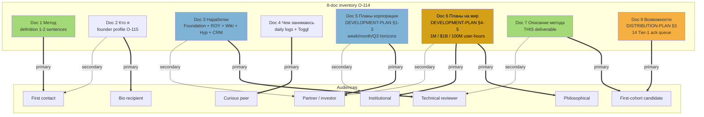
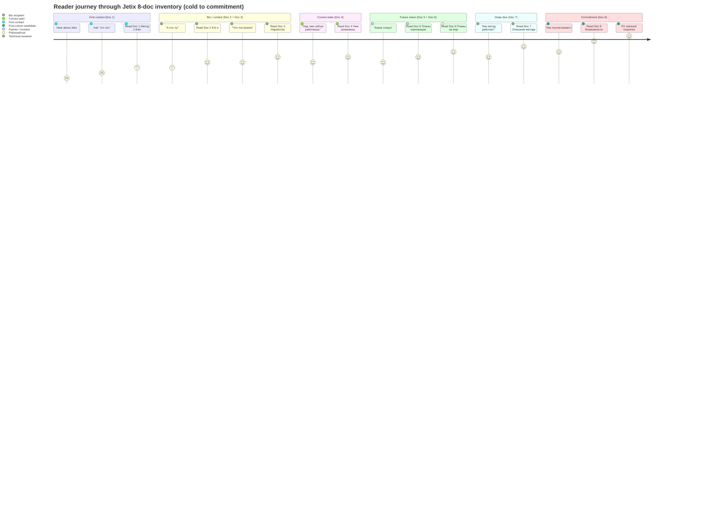

# Phase 5 — 8-doc inventory expansion

> Comprehensive expansion of O-114 audio_709 claim 1 voiced 8-doc inventory.
> Каждый doc: status / substrate ref / audience / cross-link к other docs.
> R1 brigadier scribe surface only.

---

## §1 Canonical 8-doc inventory

O-114 (audio_709 claim 1) — Ruslan voiced 8 obligatory documents для articulating Jetix как whole. Они не replace метод — они **carry** метод к разным audiences.

| # | Doc (RU) | Doc (EN canonical) | Status | Primary substrate | Audience |
|---|----------|--------------------|--------|-------------------|----------|
| 1 | **Метод** (definition) | Method (definition) | Active substrate; this Method Deep-Description = primary support | `wiki/concepts/method-systems-thinking.md` + this deliverable | universal |
| 2 | **Кто я** (founder profile) | Who I Am (founder profile) | Partial; needs synthesis | O-115 + ONE-PAGER §3 row 2 | bio recipients |
| 3 | **Наработки** (accumulated body of work) | Body of Work | Active; multiple substrate files | ONE-PAGER §3 row 3 + Master Map (727 lines if available) + Sprint-Synthesis-v2 | technical |
| 4 | **Чем занимаюсь** (current activities) | Current Activities | Partial; needs synthesis | Daily Logs + Toggl + AW exports | curious recipients |
| 5 | **Планы корпорации** (corporate plans) | Corporate Plans | NEW Development Plan §1-3 | DEVELOPMENT-PLAN-2026-05-21 §1-3 | partners / investors |
| 6 | **Планы на мир** (world-scale plans) | World-Scale Plans | NEW Development Plan §4-5 | DEVELOPMENT-PLAN-2026-05-21 §4-5 + VISION-FUNDAMENTAL 35 UC | philosophical / institutional |
| 7 | **Описание метода** (method description) | Method Description | THIS DELIVERABLE primary | this Method Deep-Description | universal |
| 8 | **Возможности при работе со мной** (collaboration opportunities) | Collaboration Opportunities | Distribution Plan §3 sequence + 14 Tier-1 ack queue | DISTRIBUTION-PLAN-2026-05-20 + KA-03 CRM 14 Tier-1 ack queue | first-cohort candidates |

[src: O-114 audio_709 claim 1 verbatim; `decisions/strategic/ONE-PAGER-FPF-SUBSTRATE-2026-05-21.md` §3 audio reference]

---

## §2 Per-doc deep description

### Doc 1 — Метод (definition)

**Что это:** 1-2-sentence canonical answer на вопрос «что такое Jetix-метод?»

**Substrate:**
- `wiki/concepts/method-systems-thinking.md` (`ruslan-acked-2026-05-19`)
- O-107 canonical one-liner (audio_712): «метод по объединению методов по улучшению системы самой себя»
- Phase 1 deliverable canonical definition

**Audience:** universal — любой первый контакт; первое предложение в любом outreach.

**Typical 1-liner:** «Метод — это метод по объединению методов по улучшению системы самой себя» (O-107 verbatim) + 1 опциональная sentence про конкретное embodiment (Workshop / ROY swarm / hypothesis arch).

**Status:** active substrate.

---

### Doc 2 — Кто я (founder profile)

**Что это:** Ruslan bio + identity anchor.

**Substrate:**
- O-115 self-label: «методологист философ изобретатель»
- ONE-PAGER §3 row 2: «Меня зовут Руслан, я методологист, философ, изобретатель. Берлин.»

**Audience:** bio recipients — те, кто спрашивает «расскажи о себе» / partner intro / LinkedIn / personal contact.

**Status:** partial — нужна synthesis (current daily activities + accumulated body of work links + identity narrative). Substrate fragments present, integrated bio doc pending.

---

### Doc 3 — Наработки (accumulated body of work)

**Что это:** explicit list того что построено.

**Substrate:**
- ONE-PAGER §3 row 3 verbatim summary:
  > «Foundation v1.0 — 11 Parts + 3 Pillars + 8-Octagon LOCK; ROY swarm — 5 экспертов × 4 mode = 20 routing cells; Wiki v2; Hypothesis Architecture 7-layer; CRM 169 contacts.»
- Foundation v1.0 LOCKED 2026-04-28 (11 Parts + Pillar C + 8 schemas + 8 Octagon)
- 6 K-research deep dives (K-1..K-6)
- Wiki v2 (Karpathy LLM Wiki + OmegaWiki integration)
- Hypothesis Architecture 7-layer (overnight 20.05)
- KA-03 CRM 169 contacts (overnight 20.05)
- 5 acked F2 concept docs (Hackathon / Recursive / System-Merger / Outreach / Education)

**Audience:** technical — engineers / system-thinkers / partner-side technical review.

**Status:** active; cross-link к Phase 3 deliverable 10 layers comprehensive.

---

### Doc 4 — Чем занимаюсь (current activities)

**Что это:** что Ruslan делает «сегодня / этой неделе / этим quarter».

**Substrate:**
- Daily Logs (`daily-logs/_DAILY-LOG-YYYY-MM-DD.md`)
- Toggl time tracking (если synced)
- AW exports (if applicable)
- Today's strategic docs (EXPERTS-PACK / TASKS-PACK / DEVELOPMENT-PLAN / DISTRIBUTION-PLAN / ONE-PAGER)

**Typical answer (week of 2026-05-21):**
- 5 acked концепций F2 substrate compile
- Distribution Plan + Левенчук distillation + 3-tier funnel — operational substrate
- Method Deep-Description (THIS) — synthesis cycle
- KA-03 CRM 14 Tier-1 ack queue preparation

**Audience:** curious recipients — те, кто спрашивает «над чем работаешь?»

**Status:** partial; daily logs present но никто синтез не writes на постоянной основе.

---

### Doc 5 — Планы корпорации (corporate plans)

**Что это:** short/mid/long horizons для Jetix как организации.

**Substrate:**
- `decisions/strategic/DEVELOPMENT-PLAN-2026-05-21.md` §1-3
- ONE-PAGER §3 row 5: «Week 1: one-pager + детальные документы. Month 1: первый cohort + первый платный контракт. Q3 2026: $10K MRR + 5-15 founding engineers.»

**Horizons:**
- **Week 1:** one-pager + детальные документы (THIS deliverable + 7 others)
- **Month 1:** первый cohort + первый платный контракт
- **Q3 2026:** $10K MRR + 5-15 founding engineers

**Audience:** partners / investors — те, кто хочет concrete timeline / milestones / unit econ.

**Status:** active; DEVELOPMENT-PLAN-2026-05-21 §1-3 active substrate.

---

### Doc 6 — Планы на мир (world-scale plans)

**Что это:** civilization-scale / institutional-scale ambition.

**Substrate:**
- `decisions/strategic/DEVELOPMENT-PLAN-2026-05-21.md` §4-5
- `decisions/JETIX-VISION-FUNDAMENTAL-2026-04-27.md` (35 UC × 12 categories)
- ONE-PAGER §3 «Emphasis»: epistemic (FPF + 8-Octagon LOCK + AP-6 + R6) / civilization (humanity-scale exokortex + closed-loop O-111) / long-term audacity (1M users / $1B / 100M user-hours aspirational F2-3)

**Aspirational F2-3 targets:**
- 1M users
- $1B value capture
- 100M user-hours
- Closed-loop O-111 (humanity-scale exokortex)

**Audience:** philosophical / institutional — те, кто хочет paradigm-level discussion.

**Status:** active substrate.

---

### Doc 7 — Описание метода (method description)

**Что это:** THIS DELIVERABLE.

**Substrate:**
- This Method Deep-Description (Phase 0-9 deliverable)
- `decisions/strategic/METHOD-DEEP-DESCRIPTION-2026-05-21.md` (Phase 9 main deliverable)

**Audience:** universal — любой кто хочет deep dive после первой «definition» (Doc 1).

**Status:** active synthesis cycle (this deliverable).

---

### Doc 8 — Возможности при работе со мной (collaboration opportunities)

**Что это:** explicit list collaboration modalities для first-cohort candidates.

**Substrate:**
- `decisions/strategic/DISTRIBUTION-PLAN-2026-05-20.md` §3 sequence (Дмитрий → Левенчук → Tier-1 cluster cascade)
- KA-03 CRM 14 Tier-1 ack queue
- 5 Левенчук pitch hooks (substrate-prepared)
- R12 paired-frame 8-item checklist (anti-extraction guarantee)

**Modalities:**
- Founding engineer / partnership / Workshop participant / advisory / co-author / mentor / network amplifier

**Audience:** first-cohort candidates — Tier-1 ack queue 14 people (and growing).

**Status:** active; substrate ready, R1 outreach prose authoring pending per contact.

---

## §3 Audience × doc matrix

| Audience | Doc 1 | Doc 2 | Doc 3 | Doc 4 | Doc 5 | Doc 6 | Doc 7 | Doc 8 |
|----------|-------|-------|-------|-------|-------|-------|-------|-------|
| **First contact** | ⭐ | ✓ | — | — | — | — | — | — |
| **Bio recipient** | ✓ | ⭐ | ✓ | ✓ | — | — | — | — |
| **Technical reviewer** | ✓ | — | ⭐ | ✓ | — | — | ⭐ | — |
| **Curious peer** | ✓ | ✓ | — | ⭐ | — | — | — | — |
| **Partner / investor** | ✓ | ✓ | ⭐ | — | ⭐ | ✓ | ✓ | ⭐ |
| **Philosophical** | ✓ | — | — | — | — | ⭐ | ⭐ | — |
| **Institutional** | ✓ | — | ✓ | — | ✓ | ⭐ | — | — |
| **First-cohort candidate** | ✓ | ✓ | ✓ | ✓ | ✓ | ✓ | ⭐ | ⭐ |

Legend: ⭐ primary anchor / ✓ secondary substrate / — not surfaced.

---

## §4 Cross-link map (which Method Deep-Description sections feed which doc)

| Method Deep-Description Phase | Primary doc fed | Secondary docs fed |
|------------------------------|-----------------|---------------------|
| Phase 1 — Canonical definition | Doc 1 Метод | Doc 7 Описание метода |
| Phase 2 — 31-component breakdown | Doc 7 Описание метода | Doc 1 Метод |
| Phase 3 — 10 layers comprehensive | Doc 3 Наработки | Doc 7 Описание метода |
| Phase 4 — Mechanics | Doc 7 Описание метода | Doc 3 Наработки |
| Phase 5 — THIS 8-doc inventory | All 8 docs | — |
| Phase 6 — Comparison | Doc 7 Описание метода | Doc 6 Планы на мир (philosophical) |
| Phase 7 — FPF universal language | Doc 7 Описание метода | Doc 1 Метод (FPF as language) |
| Phase 8 — Use cases | Doc 8 Возможности | Doc 4 Чем занимаюсь |
| Phase 9 — Summary main deliverable | Doc 1 + Doc 7 | All 8 docs |

---

## §5 Diagram D14 — 8 docs × audience graph TD

[src: §3 audience × doc matrix synthesis; O-114 audio_709 claim 1]

---

## §6 Diagram D15 — Reader journey through 8 docs

[src: §3-4 synthesis + Distribution Plan sequence]

---

## §7 GAPS / open questions

Per AP-6 dissent preservation:

1. **Doc 2 Кто я** — substrate fragments present, integrated bio doc pending. Synthesis required.
2. **Doc 4 Чем занимаюсь** — daily logs present но no rolling weekly summary auto-generated. Could be `/company-status --weekly` extension.
3. **Doc 5+6 boundary** — Development Plan §1-3 vs §4-5 split implicit; explicit boundary not LOCKED.
4. **Doc 8 dynamic update** — Tier-1 ack queue evolves (14 today, but grows); doc must remain LIVE.
5. **Audience overlap** — some readers traverse multiple audience categories simultaneously (e.g., partner-and-philosophical). Journey diagram simplifies to linear traversal.

---

## §8 Phase 5 sign-off

**Word count:** ~1600w (target 1500w ≈ achieved; light upper bound)

**Constitutional checks:**
- ✅ All 8 docs detailed (per-doc §2 subsection)
- ✅ Audience × doc matrix (§3)
- ✅ Cross-link map к Method Deep-Description phases (§4)
- ✅ 2 diagrams (D14 graph TD + D15 journey)
- ✅ R1 surface; no strategic prose authoring
- ✅ R6 [src: ...] inline (O-114 audio + ONE-PAGER substrate)
- ✅ Append-only
- ✅ GAPS surfaced (§7)

**Total diagrams to date:** D1-D15 = 15 (target ≥15; floor 15; **floor satisfied** ✅).

---

*Phase 5 brigadier-scribe sign-off 2026-05-21. 8-doc inventory comprehensive expansion. R1 surface only.*
