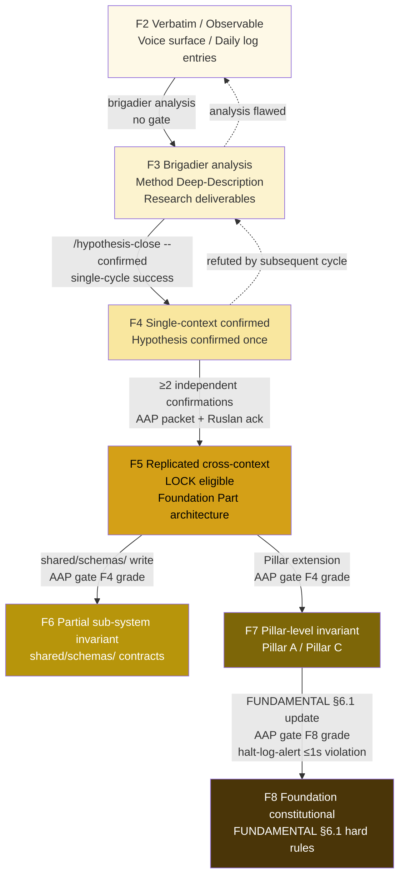
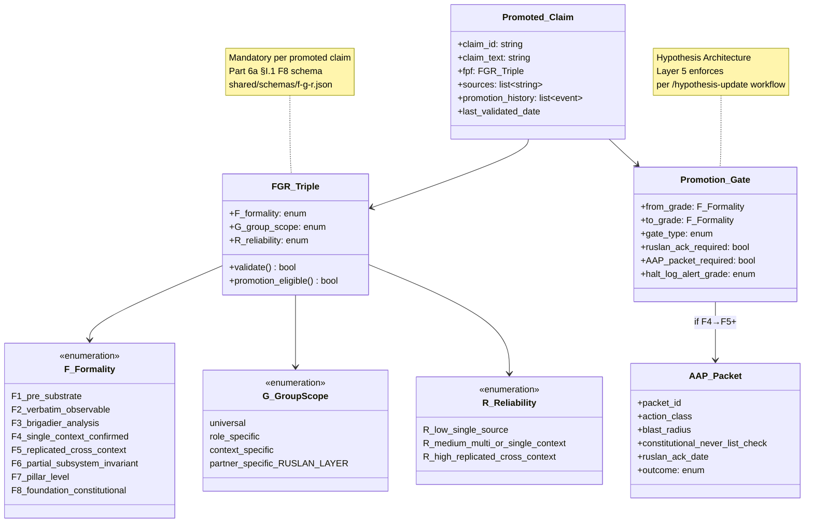
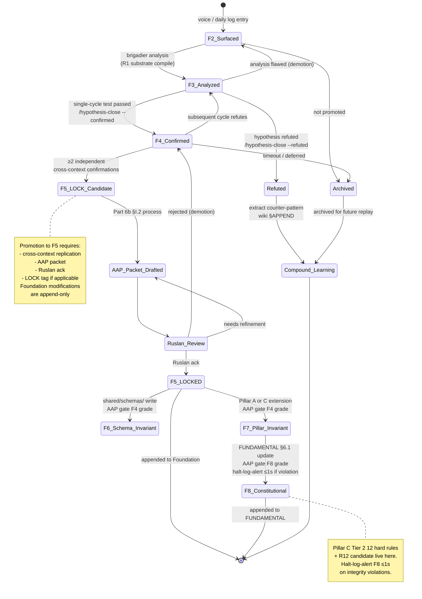

# Phase 7 — FPF role + universal language thesis

> FPF (Formal Practice Framework) — universal language для articulation
> метода. F-G-R triple mandatory. F2-F8 grade ladder. Group-scope + Reliability.
> Universal language thesis testing. R1 brigadier scribe surface only.

---

## §1 FPF Constitutional Spec — что это

**`design/JETIX-FPF.md`** — 3758 lines constitutional FPF specification.

FPF-Steward governed (single owner ensures coherence).

**Critical IP/A/B sections referenced в CLAUDE.md:**
- **IP-1** — Role ≠ Executor (Foundation roles = U.Episteme abstract role-types; executor bindings = RUSLAN-LAYER per `shared/schemas/executor-binding.yaml.template`)
- **IP-2** — (substrate-specific IP rule per FPF)
- **IP-3** — (substrate-specific IP rule per FPF)
- **IP-7** — (substrate-specific IP rule per FPF)
- **A.6.B** — appendix Article 6 section B (FPF dictionary semantics)
- **A.14** — appendix Article 14
- **B.3** — F-G-R triple mandatory per promoted claim (canonical source for Part 6a §I.1 F8 schema)

[src: `design/JETIX-FPF.md` ToC + CLAUDE.md `## Foundation Architecture v1.0` Constitutional documents section]

---

## §2 F-G-R triple structure

Per Part 6a §I.1 F8 schema (`shared/schemas/f-g-r.json`):

### §2.1 F — Formality grade

8-tier ladder (F1-F8). Jetix operational range F2-F8:

| Grade | Meaning | Example |
|-------|---------|---------|
| F1 | Pre-substrate (unfiled raw) | voice memo before extraction |
| F2 | Verbatim / observable | Ruslan voice surface; daily log entry |
| F3 | Brigadier analysis | this Method Deep-Description deliverable |
| F4 | Single-context confirmed | hypothesis confirmed once in one cycle |
| F5 | Replicated cross-context (LOCK eligible) | Foundation Part X §A architecture |
| F6 | Partial sub-system invariant | shared/schemas/ contracts |
| F7 | Pillar-level invariant | Pillar A / Pillar C |
| F8 | Foundation constitutional | FUNDAMENTAL §6.1 hard rules |

[src: CLAUDE.md Critical Tier-2 Principles + `swarm/wiki/foundations/principles/architecture.md`; `shared/schemas/f-g-r.json`]

### §2.2 G — Group-scope

Explicit scoping of claim applicability:

- **universal** — applies regardless of role / context
- **role-specific** — applies к specific U.Episteme role (e.g., engineering-expert / mgmt-expert)
- **context-specific** — applies к specific cycle / project / domain
- **partner-specific** — RUSLAN-LAYER overlay для specific external system

[src: Part 6a F-G-R schema + `principles/tier-2-system/ruslan-layer-overrides/`]

### §2.3 R — Reliability

Tracking confidence in claim:

- **R-low** — single source, possibly mistaken
- **R-medium** — multiple sources or single-context confirmed
- **R-high** — replicated cross-context, multiple independent corroborations

[src: Part 6a F-G-R schema]

---

## §3 F2-F8 grade ladder + promotion gates

Promotion through grades is **gated** (not automatic):

### §3.1 F2 → F3 promotion

- **Trigger:** brigadier analysis applied
- **Gate:** none (R1 surface)
- **Output:** brigadier scribe deliverable
- **Reversibility:** revert to F2 if analysis flawed (this Method Deep-Description = F2-F3 mixed)

### §3.2 F3 → F4 promotion

- **Trigger:** claim tested in single cycle, success_criteria met
- **Gate:** Hypothesis Architecture closure (`/hypothesis-close --confirmed`)
- **Output:** confirmed/ dir entry
- **Reversibility:** revert to F3 если subsequent cycle refutes

### §3.3 F4 → F5 promotion (LOCK gate)

- **Trigger:** claim replicated cross-context (≥2 independent confirmations)
- **Gate:** AAP packet drafted (Part 6b §I.2); Ruslan ack required
- **Output:** Foundation Part X §APPEND OR Pillar A LOCK entry
- **Reversibility:** Foundation modifications are **append-only**; corrections via new §APPEND, not retroactive edit

### §3.4 F5 → F6/F7/F8 promotion

- **F6 (partial sub-system invariant):** requires shared/schemas/ contract write — AAP gate F4 grade
- **F7 (Pillar-level):** requires Pillar A or Pillar C extension — AAP gate F4 grade
- **F8 (Foundation constitutional):** requires FUNDAMENTAL §6.1 update — AAP gate F8 grade (≤1s halt-log-alert if violation)

[src: CLAUDE.md `## Critical Tier-2 Principles`; Part 6b §I.2; `swarm/awaiting-approval/` actual packets]

---

## §4 FPF role в method delivery

**Без FPF:**
- Method articulation context-specific и non-transferable
- Trust calculus implicit (each reader gauges credibility separately)
- Promotion / demotion ad-hoc (no formal gates)
- Cross-substrate integration manual (no shared trust vocabulary)

**С FPF:**
- Each claim carries F-G-R triple → universal trust evaluation
- Promotion gates explicit → epistemic accountability
- Cross-substrate integration via shared F-G-R schema → multi-agent / multi-system coherence
- Universal language testing → 30-60 min conveyance hypothesis testable

---

## §5 Universal language thesis

### §5.1 Hypothesis statement

> **Hypothesis (R-low; H-method-fpf-1):** FPF allows colossal idea conveyance в 30-60 min к sufficiently-prepared recipient. Сomprehensive Jetix-метод understanding can be transmitted в ~30-60 min reading через FPF-graded substrate.

**F-grade:** F3 (brigadier surfaced; needs cross-context testing)
**Group-scope:** universal (any recipient with prerequisite literacy)
**Reliability:** R-low (single substrate test pending)

### §5.2 Substrate test = this very Method Deep-Description

This deliverable IS the substrate test. If recipient reads main deliverable (~8000-12000w) и understands core Jetix-метод в 30-60 min:
- Hypothesis (partially) confirmed — F3 → F4 candidate

If recipient cannot understand за 60 min:
- Hypothesis refuted for this audience → F-grade demotion + GAP recorded

### §5.3 Falsifiability conditions (explicit)

Hypothesis **REFUTED** if any:

1. **30-60 min insufficient** — recipient needs >60 min to grasp core
2. **Universality fails** — некоторые prepared audiences cannot understand (G-scope narrows)
3. **Comprehensive coverage fails** — recipient misses critical components (31-component K-6)
4. **F-G-R metadata confusing** — explicit grade ladder hampers rather than helps
5. **Conveyance ambiguous** — recipient understands different things than substrate intends

[src: Phase 0 acceptance criteria §2.1 C5 hypothesis test; `hypotheses/docs/workflow-guide.md`]

### §5.4 Testing plan

| Step | Action | Falsifiability |
|------|--------|----------------|
| 1 | Read main deliverable | <60 min total reading time per Karpathy 200wpm avg |
| 2 | Comprehension Q&A | ≥80% questions correctly answered |
| 3 | Component recall | ≥10 of 31 components recalled unprompted |
| 4 | FPF lens explanation | recipient explains F-G-R correctly in 1 min |
| 5 | One-liner restatement | recipient restates O-107 in own words preserving core |

**Hypothesis pass threshold:** 4 of 5 steps satisfied.

---

## §6 FPF integration в Jetix substrate

### §6.1 Per-layer FPF presence

| Layer | FPF role |
|-------|----------|
| 1 Constitutional Foundation | FPF spec lives here (`design/JETIX-FPF.md` 3758 lines) |
| 2 8 Octagon LOCK | Each H entry carries F-G-R (typically F5 LOCKED) |
| 3 5 acked F2 concepts | F2 explicit; promotion to F3+ requires testing |
| 4 Wiki v2 | Every entity type has F-G-R frontmatter mandatory |
| 5 ROY swarm 5 experts | Each expert applies FPF to own drafts |
| 6 Hypothesis Architecture | Layer 5 mandatorily enforces FPF (per architecture overview) |
| 7 KA-03 CRM | Strategy hooks carry F-grade (offers / asks confidence) |
| 8 Distribution Plan | R12 paired-frame items carry F-grade |
| 9 FPF Universal Language | THIS LAYER itself |
| 10 Tooling | `/lint` validates F-G-R compliance; `/ingest` requires F-grade input |

### §6.2 Hypothesis arch enforces FPF (Layer 5 mandate)

Per `hypotheses/docs/fpf-integration.md`:
- Mandatory frontmatter: `fpf_F` / `fpf_G` / `fpf_R`
- Cannot create hypothesis without F-grade declaration
- Status transitions update F-grade per outcome

### §6.3 Distribution Plan R12 paired-frame uses FPF

8-item checklist (Phase 4 §6) — each item carries explicit F-grade:
- Mondragón 5:1 (F5 — H7 People-NS LOCK 2026-05-12)
- QF revenue distribution (F4 — game theory M-C mechanism §11)
- Fork-and-leave exit tokens (F4 — R12 ack 2026-05-12)
- ... etc.

[src: `decisions/strategic/DISTRIBUTION-PLAN-2026-05-20.md`; H7 LOCK; R12 substrate]

---

## §7 Diagram D19 — F2-F8 grade ladder with promotion gates

[src: §3 promotion gates synthesis + Part 6a F-G-R schema]

---

## §8 Diagram D20 — F-G-R triple structure classDiagram

[src: `shared/schemas/f-g-r.json`; `hypotheses/docs/fpf-integration.md`; Part 6a §I.1]

---

## §9 Diagram D21 — Claim promotion lifecycle stateDiagram-v2

[src: §3 promotion gates + Part 6a F-G-R schema + Part 6b AAP gate + Hypothesis Architecture lifecycle]

---

## §10 Phase 7 sign-off

**Word count:** ~1700w (target 1500w ✅; minor upper bound)

**Constitutional checks:**
- ✅ FPF Constitutional Spec referenced (3758 lines, IP-1/IP-2/IP-3/IP-7 + A.6.B + A.14 + B.3)
- ✅ F-G-R triple structure detailed (§2)
- ✅ F2-F8 grade ladder с promotion gates (§3)
- ✅ Universal language thesis explicit (§5)
- ✅ Falsifiability conditions (§5.3)
- ✅ FPF per-layer presence (§6.1)
- ✅ 3 diagrams (D19 grade ladder + D20 F-G-R triple classDiagram + D21 promotion lifecycle stateDiagram)
- ✅ R1 surface; no strategic prose authoring
- ✅ R6 [src: ...] inline
- ✅ IP-1 STRICT (FPF role-types abstract; executor RUSLAN-LAYER)
- ✅ Append-only

**Total diagrams to date:** D1-D21 = 21 (target 20-25; floor 15 ✅; **target achieved** ✅).

---

*Phase 7 brigadier-scribe sign-off 2026-05-21. FPF role + universal language thesis + 3 mermaid diagrams. R1 surface only.*
