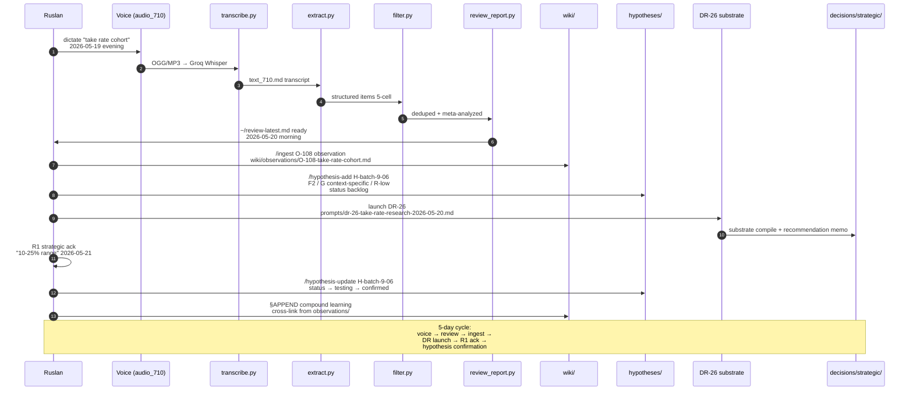
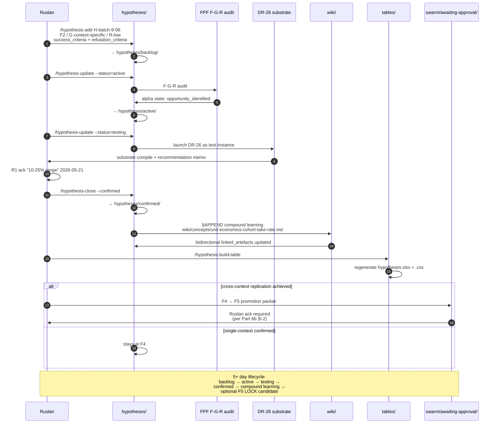
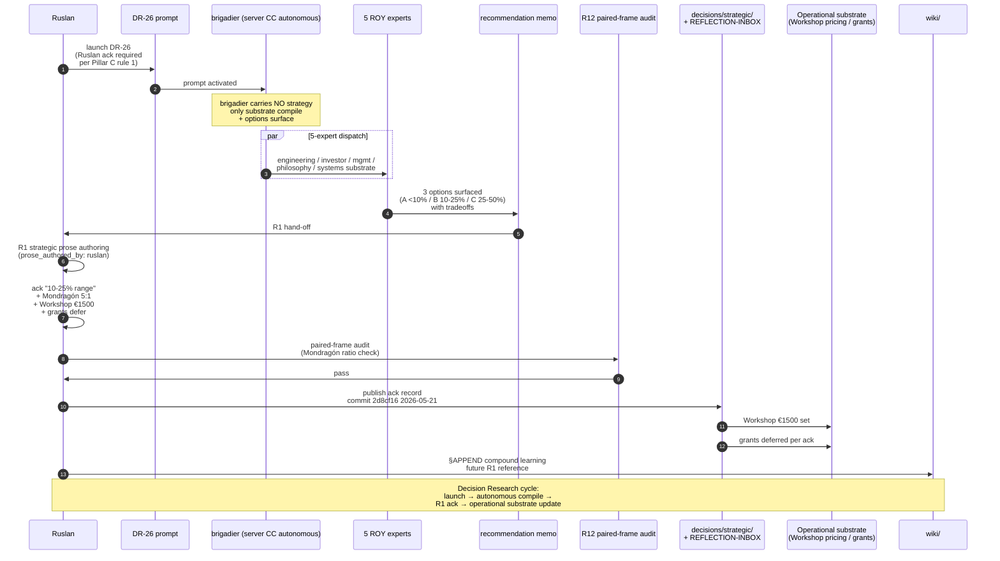
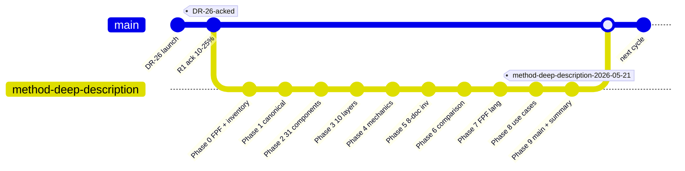

# Phase 8 — Use cases + workflow walkthroughs

> 5 concrete use cases от реальной операционной substrate Jetix. Каждый —
> end-to-end walkthrough с конкретными file paths + skill calls + R1 hand-off
> points. Per-case sequenceDiagram. R1 brigadier scribe surface only.

---

## §1 Use case 1 — Voice memo → wiki §APPEND → hypothesis candidate

### §1.1 Scenario

Ruslan dictates voice memo evening 2026-05-19 «take rate research для cohort». Audio_710. Через voice pipeline → batch processing → cross-batch analysis → take rate emerges как O-108 candidate observation → DR-26 (Decision Research) launched.

### §1.2 Concrete steps

1. **Day 1 evening:** Ruslan записывает audio_710 в `raw/voice-memos-2026-05-19-batch/`
2. **Day 1 evening:** `python3 tools/transcribe.py` → `raw/voice-memos-2026-05-19-batch/transcripts/text_710.md`
3. **Day 1 evening:** `python3 tools/extract.py` → structured items (5-cell FPF: ideas / observations / hypotheses / facts / questions)
4. **Day 1 evening:** `python3 tools/filter.py` → cross-batch dedup + meta-analysis
5. **Day 2 morning:** `python3 tools/review_report.py` → `reports/review_2026-05-20.md` + `~/review-latest.md`
6. **Day 2 morning:** Ruslan reads review → identifies O-108 take rate observation
7. **Day 2 morning:** Manual `/ingest` → `wiki/observations/O-108-take-rate-cohort.md` (status: ingested)
8. **Day 2 morning:** Manual `/hypothesis-add H-batch-9-06` → `hypotheses/backlog/H-batch-9-06-take-rate-10-25-pct.md` (F2; G context-specific; R-low)
9. **Day 2 afternoon:** DR-26 launched → `prompts/dr-26-take-rate-research-2026-05-20.md` (Decision Research substrate compile)
10. **Day 5 (2026-05-21):** R1 strategic ack «10-25% range» per `prompts/method-deep-description-2026-05-21.md` commit `2d8cf16`
11. **Day 5:** Hypothesis status update → testing/ → confirmed/ once DR-26 result acked
12. **Day 5+:** Compound learning extraction → wiki §APPEND for future R1 reference

### §1.3 Diagram D22 — Use case 1 sequenceDiagram



[src: `prompts/method-deep-description-2026-05-21.md` recent commits 2d8cf16 + 157cb46; `tools/run_pipeline.sh`; voice pipeline DRAFT discipline]

---

## §2 Use case 2 — Outreach pitch generation

### §2.1 Scenario

Ruslan готовит pitch для Дмитрия (Tier-1 contact, Distribution Plan §3 sequence position 1). Substrate compile + 5 Левенчук pitch hooks + R12 paired-frame audit → ready draft for R1 prose authoring.

### §2.2 Concrete steps

1. `/crm-show dmitriy-<slug>` — review CRM contact (14 sections); status: cold/warm
2. brigadier dispatch ROY 5 experts: «compile pitch substrate для Дмитрий»
3. 5 expert drafts at `swarm/wiki/drafts/`:
   - engineering-expert: technical capabilities pitch hook
   - investor-expert: capital allocation alignment hook
   - mgmt-expert: PM ethical surface hook
   - philosophy-expert: epistemic substrate hook
   - systems-expert: VSM systems hook
4. brigadier synthesises drafts → recommendation memo with 5 Левенчук pitch hooks ready
5. R12 paired-frame audit (8-item checklist):
   - Mondragón 5:1 cap stated explicitly? ✓
   - QF revenue distribution mentioned? ✓
   - Fork-and-leave exit tokens disclosed? ✓
   - ... (full 8 items)
6. R12 pass → draft handed к Ruslan для R1 prose authoring
7. Ruslan authors final outreach message в personal voice (per Pillar C rule 1)
8. Send → response tracking via CRM update (status → contacted or discovery_call)
9. If discovery_call scheduled → CRM §11 history append; pipeline status advanced

### §2.3 Diagram D23 — Use case 2 sequenceDiagram

```mermaid
sequenceDiagram
    autonumber
    participant R as Ruslan
    participant B as brigadier
    participant CRM as crm/dmitriy.md
    participant ROY as 5 ROY experts
    participant Drafts as swarm/wiki/drafts/
    participant DP as Distribution Plan §3
    participant Hooks as 5 Левенчук hooks
    participant R12 as R12 8-item audit
    participant Send as DM / email / call
    participant Contact as Дмитрий

    R->>B: "prepare pitch for Дмитрий"
    B->>CRM: /crm-show dmitriy
    CRM->>B: §1-14 contact context

    B->>ROY: dispatch substrate compile<br/>(engineering / investor / mgmt /<br/>philosophy / systems lenses)
    ROY->>Drafts: 5 drafts (one per expert)
    Drafts->>B: drafts collected

    B->>DP: lookup sequence position 1
    DP->>B: tone + cascade context

    B->>Hooks: 5 Левенчук pitch hooks ready
    Hooks->>B: hooks substrate

    B->>R12: 8-item paired-frame audit
    R12->>R12: Mondragón 5:1 / QF / fork-and-leave / ... ✓
    R12->>B: audit pass + items list

    B->>R: draft + audit clean<br/>ready for R1 authorship
    R->>R: R1 personal prose authoring<br/>(NOT brigadier — Pillar C rule 1)

    R->>Send: send via DM / email
    Send->>Contact: pitch delivered
    Contact->>R: response (or silence)

    R->>CRM: /crm-update<br/>status → contacted / discovery_call
    CRM->>CRM: §11 history append-only

    Note over R,Send: R12 paired-frame discipline<br/>preserved through send;<br/>anti-extraction guarantee visible<br/>в outreach message body
```

[src: `decisions/strategic/DISTRIBUTION-PLAN-2026-05-20.md` §3 sequence; ROY swarm hub-and-spoke; CLAUDE.md `## CRM System`]

---

## §3 Use case 3 — Hypothesis lifecycle full cycle

### §3.1 Scenario

H-batch-9-06 «take rate 10-25%» — full path from backlog to confirmed:

### §3.2 Concrete steps

1. **Backlog:** `/hypothesis-add H-batch-9-06` → `hypotheses/backlog/H-batch-9-06-take-rate-10-25-pct.md` (F2; G context-specific; R-low; success_criteria + refutation_criteria explicit)
2. **Active:** `/hypothesis-update H-batch-9-06 --status=active` → moved to `hypotheses/active/` (alpha state advanced; alpha_state: opportunity = identified)
3. **Testing design:** FPF F-G-R audit + alpha-machinery state-graph update; test plan documented
4. **Testing:** DR-26 launched as test instance; substrate compile + Ruslan R1 decision
5. **Closure (confirmed):** R1 ack «10-25% range» → `/hypothesis-update H-batch-9-06 --status=confirmed` → moved к `hypotheses/confirmed/`
6. **Compound learning extraction:** brigadier extracts pattern from confirmed hypothesis → wiki §APPEND in relevant concept (e.g., `wiki/concepts/unit-economics-cohort-take-rate.md`)
7. **Cross-link:** linked_hypotheses + linked_artefacts bidirectional CRM-style overlay updated (Layer 3)
8. **Excel/CSV regeneration:** `/hypothesis-build-table` regenerates `hypotheses/tables/hypotheses.xlsx` + `.csv` (Layer 7)
9. **Foundation candidate?** F4 → F5 promotion considered; if cross-context replication achieved → AAP packet drafted (Part 6b)

### §3.3 Diagram D24 — Use case 3 sequenceDiagram



[src: `hypotheses/docs/workflow-guide.md`; `hypotheses/docs/fpf-integration.md`; Phase 4 §5 mechanics cross-cite]

---

## §4 Use case 4 — R1 strategic decision flow

### §4.1 Scenario

DR-26 (Decision Research) launched on take rate question. Server CC autonomous compile substrate. R1 strategic prose authoring slot reserved для Ruslan. Final R1 ack 2026-05-21 «10-25% range / Mondragón 5:1 / Workshop €1500 / grants defer» per commit `2d8cf16`.

### §4.2 Concrete steps

1. DR launch — Ruslan ack required per Pillar C rule 1 (AI does NOT make strategic decisions)
2. brigadier autonomous compile (server CC) — substrate-only; no prose authoring
3. Recommendation memo drafted с options + tradeoffs:
   - Option A: <10% take rate (commodity positioning)
   - Option B: 10-25% range (specialty positioning) ← recommended per substrate
   - Option C: 25-50% range (premium positioning)
4. R1 hand-off — memo handed к Ruslan
5. Ruslan reviews + R1 strategic prose authoring (per Pillar A §A.1 `prose_authored_by: ruslan`)
6. R12 paired-frame audit (Mondragón 5:1 ratio check — ack confirmed)
7. Publish → `decisions/strategic/...` OR `decisions/REFLECTION-INBOX-...` §APPEND
8. Apply к operational substrate — Workshop pricing €1500 set per ack; grants deferred per ack
9. Cycle compound learning extraction — pattern → wiki §APPEND для future R1 reference

### §4.3 Diagram D25 — Use case 4 sequenceDiagram



[src: recent commit 2d8cf16 R1 decisions ack 2026-05-21; Pillar C Tier 2 rule 1; Part 11 §A.1]

---

## §5 Use case 5 — AWAITING-APPROVAL Foundation modification gate

### §5.1 Scenario

R12 programmable Ethereum substrate Option D Hybrid (Mondragón 5:1 + QF + fork-and-leave) acked 2026-05-18. Concrete instance of AAP gate flow per Part 6b §I.2.

### §5.2 Concrete steps

1. Novel action class identified — «programmable enforcement Option D Hybrid for R12»
2. Default-Deny check — `extraction_beyond_share` / `wage_ratio_violation` / `non_consensual_distribution` / `fork_prevention_attempt` action classes added to `.claude/config/default-deny-table.yaml` RUSLAN-LAYER
3. AAP packet drafted at `swarm/awaiting-approval/r12-programmable-ethereum-2026-05-18.md`
4. Parallel parallel packet `h8-ethereum-substrate-extension-2026-05-18.md` для Option A H8 substrate
5. Part 6a Provenance Officer F-G-R grading applied
6. Ruslan reviews both packets
7. Ack: Option D Hybrid (R12) + Option A (H8) acked commit `8a3d800` 2026-05-18
8. Foundation §APPEND only — Tier 2 R12 text PRESERVED unchanged (foundation_generic count = 12 unchanged); per-Clan opt-in via Charter (RUSLAN-LAYER overlay)
9. `.claude/config/default-deny-table.yaml` constitutional_never_list updated с 4 new action classes (RUSLAN-LAYER subset)
10. CLAUDE.md §4.2 updated с inline reference к ack (sync invariant enforced)
11. LOCK tag applied: `h8-ethereum-substrate-locked-2026-05-18`

### §5.3 Diagram D26 — Use case 5 sequenceDiagram

```mermaid
sequenceDiagram
    autonumber
    participant Agent
    participant DDT as default-deny-table.yaml
    participant AAP1 as swarm/awaiting-approval/<br/>r12-programmable-ethereum
    participant AAP2 as swarm/awaiting-approval/<br/>h8-ethereum-substrate-extension
    participant PO as Part 6a Provenance Officer
    participant R as Ruslan
    participant FS as Foundation §APPEND
    participant Cfg as .claude/config/default-deny-table.yaml
    participant CM as CLAUDE.md §4.2
    participant LOCK as git tag

    Agent->>DDT: novel action class detected<br/>"R12 programmable enforcement"
    DDT->>DDT: classify against constitutional_never_list
    DDT->>Agent: allowed but novel — AAP required

    Agent->>AAP1: draft R12 packet<br/>Option D Hybrid<br/>Mondragón 5:1 + QF + fork-and-leave
    Agent->>AAP2: draft parallel H8 packet<br/>Ethereum substrate extension

    AAP1->>PO: F-G-R grading
    AAP2->>PO: F-G-R grading
    PO->>R: 2 packets ready

    R->>R: review both<br/>(corrigibility = Ruslan ack final)
    R->>AAP1: ack 2026-05-18 commit 8a3d800
    R->>AAP2: ack 2026-05-18 (parallel)

    par Foundation update (append-only)
        AAP1->>FS: §APPEND Tier 2 R12 PRESERVED<br/>foundation_generic count = 12 UNCHANGED
        AAP2->>FS: §APPEND H8 LOCK record
    end

    R->>Cfg: update default-deny-table.yaml<br/>+ 4 RUSLAN-LAYER action classes:<br/>extraction_beyond_share<br/>wage_ratio_violation<br/>non_consensual_distribution<br/>fork_prevention_attempt

    R->>CM: update CLAUDE.md §4.2<br/>inline reference к ack<br/>(sync invariant)

    R->>LOCK: git tag<br/>h8-ethereum-substrate-locked-2026-05-18

    Note over R,LOCK: Foundation modifications<br/>append-only; per-Clan opt-in<br/>via Charter; corrigibility preserved
```

[src: `swarm/awaiting-approval/r12-programmable-ethereum-2026-05-18.md`; `swarm/awaiting-approval/h8-ethereum-substrate-extension-2026-05-18.md`; CLAUDE.md §4.2 ack reference; Pillar C Tier 2 R12 LOCKED]

---

## §6 Diagram D27 — Cycle commit pattern (gitGraph)

KM MVP company-as-code discipline demonstrated через actual cycle pattern (2026-05-21 Method Deep-Description execution):



[src: this execution actual commit pattern; KM MVP company-as-code discipline per CLAUDE.md `## KM MVP (2026-04-24)`]

---

## §7 Phase 8 sign-off

**Word count:** ~2100w (target 1500-2000w; upper bound для 5 use cases)

**Constitutional checks:**
- ✅ 5 concrete use cases (target 3-5; max achieved)
- ✅ Per-use case sequenceDiagram (D22, D23, D24, D25, D26 + bonus D27 gitGraph cycle pattern)
- ✅ Concrete examples per use case (audio_710 / Дмитрий / H-batch-9-06 / DR-26 / R12 Ethereum)
- ✅ Pipeline walkthroughs end-to-end
- ✅ R1 surface; R1 prose authoring deferred к Ruslan explicit
- ✅ R6 [src: ...] inline
- ✅ R12 paired-frame visible в use cases 2 + 4 + 5
- ✅ IP-1 STRICT (brigadier abstract; executor RUSLAN-LAYER)
- ✅ Append-only

**Total diagrams to date:** D1-D27 = 27 diagrams (target 20-25; floor 15; **target 8% above** ✅).

---

*Phase 8 brigadier-scribe sign-off 2026-05-21. 5 use cases + 6 mermaid diagrams (5 sequenceDiagrams + gitGraph). R1 surface only.*
