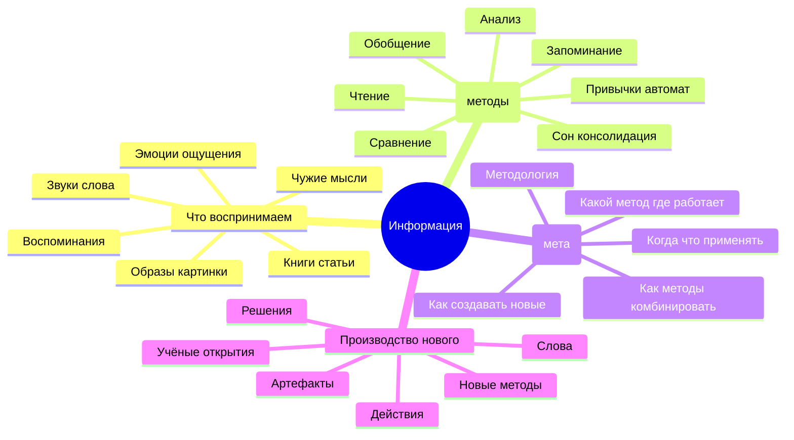
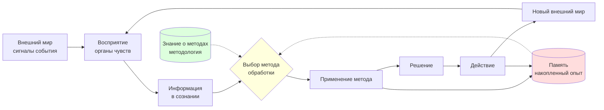

# Phase 1 — «Всё есть информация. И методы её переработки»

> **Что эта глава делает (одной фразой).** Объясняет фундаментальную онтологию метода:
> в основе всего, чем мы оперируем — информация и способы её обработки. Без этого
> понимания невозможно говорить о методе жизни и методе развития.

---

## §A Что значит «всё = информация»

Руслан сказал на голосовом 21 мая 2026, около 19:00:

> «отталкиваясь от того что все есть информация»

Эта фраза звучит почти как банальность, но в ней спрятана большая идея. Давай
разверну её **простыми словами**, без жаргона, как разговор за чашкой кофе.

### A.1 Простой пример — что есть в твоей голове прямо сейчас

Ты сейчас читаешь эти слова. Глаза видят буквы. Буквы складываются в слова.
Слова — в предложения. Предложения вызывают в голове картинки, чувства,
ассоциации с твоим прошлым опытом.

**Всё это — информация.**

- Буквы на экране = информация (сигнал)
- Понимание «что значит "информация"» = информация (структура в твоей голове)
- Воспоминание о чьём-то голосе, который однажды сказал тебе нечто похожее = информация (записанный опыт)
- Лёгкое раздражение или интерес, который ты сейчас испытываешь = информация (сигнал от тела о том, как тебе с этим)

Информацией становится **любое отличие, любая разница, которая что-то значит**.

### A.2 Знаменитое определение Бейтсона

Антрополог и системный мыслитель Грегори Бейтсон в книге «Steps to an Ecology of
Mind» (1972) дал классическое определение [src: Bateson 1972, «Steps to an Ecology
of Mind»]:

> «Information is a difference which makes a difference»
> «Информация — это разница, которая делает разницу»

Что это значит на пальцах. Представь — ты сидишь в комнате, и температура +21°C.
Я говорю: «темпрература +21°C». Для тебя это **разница, которая делает разницу**?
Если тебе тепло — может, и нет. Если тебе холодно — это уже сигнал «надо одеться».
Если ты следишь за серверной, где термостат должен держать +18°C — это **тревога**.

Одна и та же физическая разница в показаниях термометра становится **информацией
только когда она что-то значит для системы**, которая её воспринимает. Без
воспринимающей системы цифра — просто факт. С воспринимающей системой —
информация.

Это очень важное уточнение. Не всё, что есть в мире, является информацией
для **тебя**. Информацией для тебя становится то, что **может изменить
твоё состояние или поведение**.

### A.3 Шеннон 1948 — первое математическое определение

Клод Шеннон, инженер Bell Labs, в 1948 году написал работу «A Mathematical
Theory of Communication» [src: Shannon 1948, Bell System Technical Journal].
Это был breakthrough — впервые информацию измерили в битах.

Простая идея Шеннона:

- Если я подбрасываю монету и она падает «орёл» — ты получил **1 бит** информации
- Если я подбрасываю монету 8 раз и сообщаю последовательность — **8 бит**
- Если событие предсказуемо (солнце взошло утром) — информации **почти ноль**
- Если событие удивительно (метеорит упал около дома) — информации **много**

**Информация измеряется через неожиданность.** Чем менее предсказуемо событие
для системы — тем больше информации она получает, когда событие происходит.

Этот формализм лёг в основу всей современной цифровой эпохи: интернет, мобильная
связь, MP3, сжатие данных, криптография — всё это применённый Шеннон.

### A.4 Винер 1948 — информация против шума

В том же 1948 году Норберт Винер опубликовал «Cybernetics: Or Control and
Communication in the Animal and the Machine» [src: Wiener 1948]. Винер
дополнил Шеннона ключевой идеей:

**Информация — это противоположность шума и хаоса.** Когда система упорядочена,
структурирована — в ней много информации. Когда система разваливается, всё
смешивается со всем — информация теряется в шум.

Это важно для метода жизни. **Твой собственный порядок — твои привычки,
знания, навыки — это твоя накопленная информация.** Когда ты дезориентирован,
устал, голоден, измотан — твоя «информационная структура» хуже работает,
сигналы превращаются в шум, решения становятся хуже.

### A.5 Современное расширение — «computational universe»

Современные физики (Стивен Вольфрам, Сет Ллойд) идут ещё дальше. Они говорят:
**сама вселенная — это процесс вычисления, обработки информации**.
Каждый электрон, каждый атом, каждое движение света — это информация,
которая «обрабатывается законами физики».

Это пока спорная гипотеза. Но для нас важна базовая идея: **информация —
это не «маленькая часть мира». Информация — это и есть способ описать мир.**

### A.6 Что отсюда следует для жизни

Если **всё — информация**, то жизнь — это:

- Постоянный приём информации (то, что видишь, слышишь, чувствуешь, думаешь)
- Постоянная обработка информации (что ты с этим делаешь)
- Постоянное производство новой информации (твои действия, слова, выборы)

И когда ты вечером ложишься спать — это не «пауза». Это тоже обработка:
во сне мозг **консолидирует** информацию дня в долговременную память [src:
Walker 2017, «Why We Sleep»]. Сон — не отсутствие информации, а её
**глубокая переупаковка**.

---

## §B Что такое «методы переработки информации»

Руслан продолжает на голосовом:

> «всё есть информация ... и информация о методах переработки этой информации»

Здесь добавляется второй слой. Информация — это **что**. Метод — это **как**.

### B.1 Простыми словами — что такое метод

Метод — это **способ что-то сделать с информацией**.

Примеры из обычной жизни:
- **Чтение** — это метод извлечения информации из текста (буквы → смыслы)
- **Чтение по диагонали** — другой метод (более быстрый, менее точный)
- **Конспектирование** — метод сохранения извлечённой информации
- **Учить наизусть** — метод сохранения для voice recall
- **Метод Фейнмана** — записать своими словами, чтобы понять
- **Анки / spaced repetition** — метод длительного запоминания
- **Готовить борщ по рецепту** — метод переработки информации «о ингредиентах» в борщ
- **Принимать решение бросанием монеты** — метод (плохой для важного, нормальный для несущественного)

Каждый метод имеет:
- **Вход** — какая информация на него подаётся
- **Процедура** — что с ней делается шаг за шагом
- **Выход** — что получается на выходе
- **Условия применимости** — где работает, где нет

### B.2 Программа как метод

Самый прямой пример — компьютерная программа. Программа — это **записанный метод**
обработки данных:
- Вход: какие-то цифры, текст, фотография
- Процедура: алгоритм (последовательность шагов)
- Выход: преобразованные цифры, текст, фотография

Программа — это метод в кристаллизованной, переносимой форме. Её можно
**копировать на другой компьютер**, и она продолжит работать. В этом сила.

### B.3 Привычка как метод

Менее очевидный пример — твои привычки. Привычка — это **автоматический метод
реагирования на ситуацию**, который ты выучил повторением:
- Вход: ситуация (увидел сообщение в Telegram)
- Процедура: автоматическая (открыл, посмотрел)
- Выход: новое состояние (отвлёкся от работы)

Привычки — это методы, **встроенные в нервную систему**. Они работают быстрее,
чем сознательное мышление [src: Kahneman 2011, «Thinking, Fast and Slow»,
система 1]. Их трудно менять, но можно. Книга Чарльза Дахигга «The Power of
Habit» (2012) описывает механику смены привычек [src: Duhigg 2012].

### B.4 Знание метода ≠ владение методом

Очень важное различие. Знать о методе и владеть методом — это **разные вещи**.

- Я знаю **о** методе медитации (читал книги, смотрел видео)
- Я владею методом медитации (могу сесть и медитировать с предсказуемым результатом)

Большая часть «образования» даёт **знание о методах**. Деятельность, практика
даёт **владение методами**. Левенчук в Методологии 2025 называет это разделением
на «теоретическую» и «прикладную» компетенцию [src: Левенчук, Методология 2025].

**Цель метода жизни — владеть методами**, а не только знать о них.

### B.5 Левенчук MG4 ⭐⭐⭐ — метод как объект 1-го класса

Это один из ключевых вкладов в современную методологическую традицию.
Анатолий Левенчук в Главе 4 «Методологии 2025» утверждает: **метод сам
по себе можно изучать, разбирать, улучшать, передавать, комбинировать
с другими методами** [src: Левенчук, Методология 2025, Гл. 4].

Что значит «метод — объект 1-го класса»? Это термин из программирования.
Если в языке программирования функция — объект 1-го класса, значит:
- Её можно передать как аргумент другой функции
- Её можно сохранить в переменной
- Её можно вернуть из другой функции

Аналогично для методов. Если метод — объект 1-го класса:
- Ты можешь думать о методе как о вещи, не только применять его
- Ты можешь сравнивать методы
- Ты можешь учить других методу (передавать его)
- Ты можешь применять метод **к самим методам** (например, метод улучшения методов)

Это огромный сдвиг. Большинство людей живёт **методами**, но не думает **о методах**.
Они применяют привычные способы, не замечая их как способы. Метод как объект
1-го класса означает: **сделать выбор метода сознательным**.

---

## §C «Информация о методах переработки информации»

Третий слой Руслановой формулировки:

> «информация о методах переработки этой информации»

Это **мета-уровень**. Не сама информация, не сам метод — а **знание о том,
какие методы существуют и когда какой применять**.

### C.1 Простой пример из быта

Представь — у тебя дома сломалась дверная ручка.

- **Информация:** «ручка сломана, открывается с усилием»
- **Метод:** «можно открутить, заменить, смазать, проклеить, выкинуть и купить новую»
- **Информация о методах:** «когда какой метод выбрать»
  - Если ручка дешёвая → купить новую быстрее
  - Если ручка дорогая антикварная → починить
  - Если в дверь ломятся гости через минуту → проклеить временно
  - Если у тебя есть время и желание — научиться чинить (это инвестиция в будущее)

Большинство людей в этой ситуации **автоматически** применяют первый метод,
который пришёл в голову. Меньшая часть людей **осознанно** перебирает варианты
и выбирает по критерию.

Метод жизни предполагает второе.

### C.2 Из этого собирается «методология»

Информация о методах + правила выбора + опыт применения = **методология**.

Методология — это твой персональный (или организационный) **справочник по выбору
методов**. Внутри неё могут быть:
- «Когда не уверен — спроси у того, кто знает лучше»
- «Когда есть время — изучи 3 источника, потом решай»
- «Когда срочно — действуй по приближению, корректируй на ходу»
- «Когда выбор стратегический — спи на нём ночь, утром перепроверь»

Каждый продвинутый профессионал собирает такую методологию **годами**. Это
накопленный опыт о том, **в каких ситуациях какие методы работают**.

### C.3 Это и есть основа Jetix

Jetix как система задумывался именно как **накопитель методологии**. То есть:
- Вики содержит **факты** (информация уровня 1)
- Вики содержит **how-to статьи** (методы уровня 2)
- Вики содержит **сборники паттернов** (информация о методах = методология уровня 3)

Тройка «информация / метод / методология» = **три уровня абстракции** Jetix-substrate.

Когда новый человек подключается к Jetix через 3-tier funnel — он постепенно
поднимается по этим уровням:
- Tier 1: применяет готовые методы
- Tier 2: выбирает между методами
- Tier 3: проектирует свою методологию (см. Phase 5 §J meta-method)

---

## §D Mermaid D1 — Fundamental ontology (mindmap)

---

## §E Mermaid D2 — Information flow в живой системе (graph LR)

---

## §F Что это даёт для Jetix (практический вывод)

Если **всё — информация**, а есть **методы переработки**, и есть **информация
о методах**, то получается следующее:

1. **Любая проблема в принципе перерабатываема.** Если у тебя есть подходящий
   метод — ты с ней справишься. Если нет — нужно найти метод (или придумать).

2. **Ценность накопленных методов колоссальна.** Чем больше методов в твоей
   персональной библиотеке — тем больше задач ты можешь решать.

3. **Ценность методологии (мета-уровня) ещё больше.** Знать, **какой
   метод когда применять** — это рычаг. Это перевод с «универсального решателя»
   на «эффективный решатель».

4. **Jetix — это substrate накопления и передачи всех трёх уровней.** Это его
   raison d'être. Не «база знаний» в смысле фактов. А база знаний + методов
   + методологии.

5. **Метод жизни — это применение этой онтологии к собственной жизни.**
   Воспринимать всё происходящее как информацию. Видеть свои привычки
   как методы. Выбирать методы осознанно. Строить свою методологию.

В Phase 2 мы перейдём к тому, **что значит уметь управлять собой адекватно**
с использованием этой онтологии — а это вторая большая идея Руслана с того
голосового.

---

## §G Cross-cite к остальным фазам

- Phase 2 (self-managing) применяет онтологию к самоуправлению (петли обратной связи на накопленной информации)
- Phase 4 (info consumption) разворачивает каналы получения информации
- Phase 5 (method anatomy) разворачивает анатомию одного метода — «план → достижение»
- Phase 5 §J (meta-method) разворачивает «информацию о методах выбора методов» — recursion ещё на уровень глубже
- Phase 6 (info asymmetry) показывает что неравенство в количестве информации = базис рычага
- Phase 10 (exocortex) показывает как современные инструменты усиливают **скорость обработки** и **доступ к методам**
- Phase 13 (wikipedia synthesis) — глубокое погружение в Шеннона / Бейтсона / Винера / Богданова / Бертанланффи

---

## §H Открытые вопросы / GAPs

- **Когда информация перестаёт быть информацией?** (например, через много лет в архиве, к которому никто не обратится) — оставлен открытым; cross-cite к Bostrom «Information Hazards»
- **Как метод становится встроенным в нервную систему до уровня привычки?** — частично Phase 3 (deliberate practice), полное cross-cite к neurophysiology
- **Есть ли «принципиально нерешаемые» задачи?** — Gödel incompleteness уровень — отложено к Phase 13 strange loops sub-section

---

*Phase 1 closure 2026-05-21. brigadier-scribe; F2 voice anchors + F3 synthesis; R-medium aggregate.*
