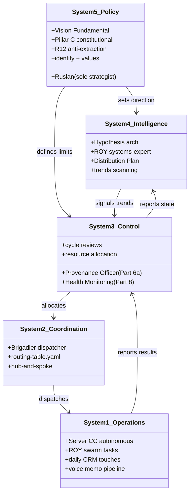
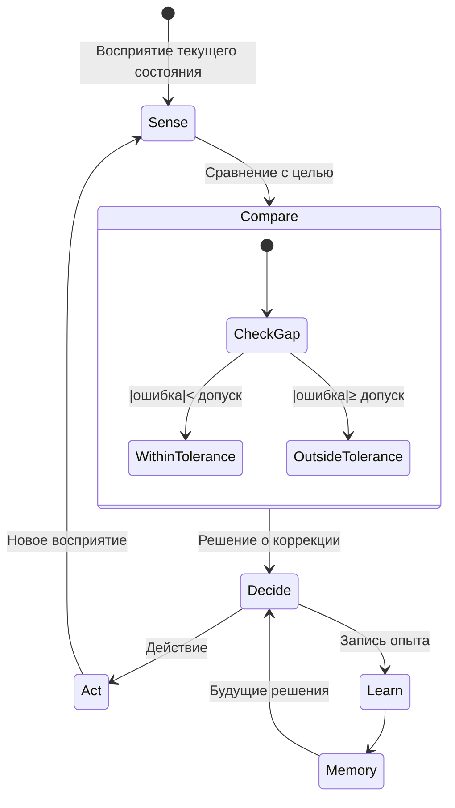

# Phase 2 — Самоуправляющиеся системы

> **Что эта глава делает.** Раскрывает второй слой Руслановой формулировки:
> «если система адекватно управляет собой — ставит цели, задачи, контролирует
> результат — она лучше развивается и принимает лучшие решения». Идея вроде
> простая, но за ней — 70+ лет научной традиции (кибернетика, теория управления,
> биология живых систем). Без этих корней нельзя осмысленно говорить об
> «адекватном самоуправлении».

---

## §A Что значит «адекватно управлять собой»

Руслан на голосовом 21.05:

> «система может вот адекватно управлять собой там ставить себе вот какие-то
> цели задачи и так далее то она может вот хорошо развиваться»

Разверну. **Управление собой** — это четыре связанные способности, без любой из
которых вся конструкция разваливается:

1. **Ставить цели** — формулировать, куда я хочу прийти
2. **Ставить задачи** — определять, что для этого делать прямо сейчас и на этой неделе
3. **Отслеживать движение** — знать, где я сейчас относительно цели
4. **Корректировать** — менять курс, если уходишь не туда (а не упрямиться)

В кибернетике это называется **петлёй управления с обратной связью**. И это
не метафора — это математически описанный механизм.

### A.1 Самый простой пример — термостат

Возьми обычный домашний термостат:
- **Цель:** поддерживать +21°C в комнате
- **Восприятие:** датчик температуры
- **Сравнение:** «текущая температура минус цель = ошибка»
- **Действие:** если холоднее — включить отопление; если теплее — выключить
- **Новое восприятие:** датчик снова мерит → петля замыкается

Это **простейшая самоуправляющаяся система**. Никакой загадки. Уравнение в
коробочке. Но обрати внимание — в этой конструкции есть **все четыре способности
из списка выше**.

Теперь распространи эту структуру на:
- **Человека**, который пытается выучить язык
- **Команду**, которая запускает продукт
- **Государство**, которое снижает безработицу
- **Систему Jetix**, которая накапливает методы и распространяется

Везде та же базовая петля — цель / сенсор / сравнение / коррекция. Меняется
сложность и время цикла. Термостат корректируется каждые секунды.
Изучение языка — месяцы. Государственная политика — годы. Но **онтология
самоуправления** одна.

### A.2 Что значит «адекватно»

Руслан добавил слово «**адекватно**» не случайно. Управление **бывает плохое**.
Бывает, что система:
- Ставит цели нереалистичные («стану миллиардером за неделю»)
- Не имеет хороших сенсоров (не знает реальное состояние)
- Сравнивает не с тем (сравнивает с другом-успешным, а не с своим вчерашним)
- Корректирует не туда (стало хуже → удвоил усилия в том же направлении)

**Адекватное самоуправление** — это все четыре компоненты работают и работают
**вместе**. Не одна. Не две из четырёх. Все четыре, согласованно.

Это редкая характеристика. У большинства людей одна из четырёх ломается:
- Многие хорошо ставят цели, но плохо отслеживают → драма «опять не получилось»
- Многие хорошо корректируют тактически, но не видят стратегического дрейфа
- Многие отлично воспринимают, но не действуют (паралич анализа)
- Многие действуют без целей (тушение пожаров)

**Метод жизни** в нашей формулировке — это **тренировка всех четырёх до приемлемого
уровня**, плюс **постоянная проверка их совместной работы**.

---

## §B Винер 1948 — рождение кибернетики

Норберт Винер, математик из MIT, в 1948 году опубликовал «Cybernetics: Or
Control and Communication in the Animal and the Machine» [src: Wiener 1948].
Книга по сей день в каноне.

Слово **«кибернетика»** Винер взял из греческого κυβερνήτης — «кормчий», тот,
кто управляет лодкой. Это очень точная метафора. Кормчий:
- Видит, куда движется лодка (восприятие)
- Знает, куда нужно прийти (цель)
- Чувствует ветер, течение, волны (контекст)
- Подправляет рулём (действие)
- И делает это **непрерывно**, не один раз в начале

Винер первым **объединил в единую теорию**:
- Управление в живых организмах (как ты держишь чашку, не пролив воду)
- Управление в машинах (как ракета держит курс на цель)
- Управление в обществе (как организации регулируют сами себя)

До Винера это были три **разные** дисциплины. После Винера стало ясно — это
один и тот же класс явлений на разных носителях.

### B.1 Negative feedback vs positive feedback

Два типа обратной связи. Различение критическое для понимания.

**Negative feedback (отрицательная обратная связь) — стабилизирующая.**
- Чем дальше система ушла от цели — тем сильнее её толкают обратно
- Это термостат, автопилот, баланс на велосипеде
- Это базовый механизм устойчивости

**Positive feedback (положительная обратная связь) — усиливающая.**
- Чем дальше система ушла — тем дальше её **толкает в том же направлении**
- Это «снежный ком», цепная реакция, вирусное распространение
- Может быть **продуктивно** (рост стартапа, обучение через успех)
- Может быть **разрушительно** (паника на бирже, бунт)

**Самоуправляющаяся система** в идеале использует negative feedback для
стабилизации **внутри** и positive feedback для **роста наружу**. У Jetix-метода
эта структура зашита:
- Foundation + Pillar C = negative feedback (стабилизация ценностей и границ)
- Positive virus distribution (Phase 12 §G) = positive feedback (рост)

---

## §C Эшби — Закон Необходимого Разнообразия

Уильям Росс Эшби, нейропсихиатр и кибернетик, в книге «An Introduction to
Cybernetics» (1956) сформулировал теорему, которая стала называться
**Law of Requisite Variety** [src: Ashby 1956].

В одной фразе:

> Только разнообразие в управляющей системе может контролировать разнообразие
> в управляемой системе.

Что это значит на пальцах. Если ситуация может разворачиваться по **10**
сценариям, у тебя должно быть **минимум 10** способов реагировать. Иначе
ты систематически попадаешь в ситуации, где не знаешь, что делать.

### C.1 Практический пример — продажи

Представь продавца, у которого только **один** скрипт. Что бы ни сказал
клиент — он отвечает одно и то же. На каких клиентах это сработает? На тех,
кто **под этот скрипт подходит**. Остальные пройдут мимо.

Продавец, у которого **20 разных подходов** под разные типы клиентов —
**куда более эффективен**. Не потому что он умнее. А потому что у него больше
**разнообразия в репертуаре**.

### C.2 Для Jetix

ROY swarm из 5 экспертов (engineering / investor / mgmt / philosophy / systems)
— это применение закона Эшби. Один эксперт = одна точка зрения. Пять экспертов
с разными лензами = 5 точек зрения = **больше разнообразия в управляющей
системе** = лучше справляется с разнообразием реального мира.

То же про Foundation — 11 LOCKED parts покрывают **разные классы** задач
(сигналы, знание, координация, lifecycle, мониторинг, внешние связи и т.д.).
Не потому что «больше — лучше», а потому что **каждая часть отвечает за свой
тип разнообразия**.

### C.3 Опасная сторона закона

У Эшби есть и **обратная сторона**. Если у управляющей системы **слишком много**
разнообразия — она **дороже**. Может быть переусложнена. Реагирует медленнее.

Поэтому **адекватное** разнообразие = минимально достаточное под класс задач.
Не больше, не меньше. Принцип «just enough variety».

Для Jetix это означает: **не плодим парты без нужды**. Каждая часть
должна закрывать **реальный класс ситуаций**. Если можно без — не добавляем.

---

## §D Матурана-Варела — Автопоэзис

Хумберто Матурана и Франсиско Варела, чилийские биологи, в 1972-1980 годах
развили теорию **автопоэзиса** [src: Maturana & Varela 1980, «Autopoiesis
and Cognition»].

«Аутос» = себя. «Поэзис» = производство. **Автопоэзис = система, которая
производит сама себя.**

### D.1 Биологический образец — клетка

Живая клетка — каноническая автопоэтическая система. Она:
- Имеет границу (мембрана), которая отделяет «внутри» от «снаружи»
- Производит компоненты внутри себя (белки, ДНК, ферменты)
- Эти компоненты, в свою очередь, **производят саму клетку** (включая мембрану)
- Если разрушить компоненты — клетка восстанавливает их (если может)

Это **круг производства**. Клетка не приходит из «фабрики клеток» — она
сама себя производит и поддерживает.

### D.2 Применимо ли это к Jetix?

Строго говоря, **нет**. Jetix не самовоспроизводится в биологическом смысле.
Но **частично применимо**, если расширить понятие:

- Jetix **производит свои методы** (новые методы возникают из применения старых)
- Jetix **поддерживает свою структуру** (через Foundation Pillar C constitutional)
- Jetix **обновляется в ответ на внешние возмущения** (через hypothesis cycles)
- Jetix **поддерживает свою границу** (через R12 и SKIP-list)

Можно сказать, что Jetix — **частично автопоэтический**. Это полезная рамка
для мышления, но не точная биология.

### D.3 Луман и социальные автопоэтические системы

Никлас Луман, немецкий социолог, расширил Матурану на **социальные системы**
[src: Luhmann 1995, «Social Systems»]. Утверждение: правовая система,
экономическая система, политическая система — все они автопоэтичны на уровне
**коммуникаций**. Их элементы — не люди, а **коммуникативные акты** (решения,
сделки, законы). И эти коммуникативные акты воспроизводят сами себя.

Применение к Jetix: каждый цикл (cycle) — это коммуникативный акт системы,
который воспроизводит структуру системы. Прервётся коммуникация — Jetix
перестанет существовать как система (живут только артефакты).

---

## §E Стэффорд Бир — Viable System Model (VSM)

Стэффорд Бир, английский кибернетик, в 1972 году опубликовал «Brain of the
Firm» [src: Beer 1972]. Он применил кибернетику к управлению организациями
и создал **Viable System Model** (VSM) — модель жизнеспособной системы.

Утверждение Бира: **любая жизнеспособная организация — от компании до
государства до клетки — имеет одну и ту же структуру из 5 подсистем**.

### E.1 Пять систем VSM

| Система | Функция | Что делает | Тип фокуса |
|---|---|---|---|
| **System 1** | Операции | Непосредственно делает дело (продаёт, производит, решает задачи) | Здесь и сейчас |
| **System 2** | Координация | Гасит конфликты между параллельными System 1 | Между операциями |
| **System 3** | Контроль | Распределяет ресурсы, аудит, оптимизация | Текущая эффективность |
| **System 4** | Интеллект / разведка | Смотрит наружу + в будущее: что меняется, куда тренд | Внешний мир + горизонт |
| **System 5** | Политика / identity | Кто мы, ради чего, какие ценности | Глобальная цель |

В здоровой организации все 5 работают, **в правильной иерархии**, и **между
ними есть быстрые каналы коммуникации**.

### E.2 Болезни VSM

Большинство дисфункциональных организаций имеют один из паттернов:
- **System 1 без System 4** — много работают, не видят как меняется рынок (выживают, пока рынок не уйдёт)
- **System 4 без System 1** — много стратегии, ничего не делается (стратегические семинары вместо продаж)
- **System 5 размыта** — нет ясной идентичности, каждый отдел тянет в свою сторону
- **System 3 перегружено** — микроменеджмент, нет System 4 рефлексии
- **System 2 отсутствует** — параллельные команды конфликтуют, дублируют работу

### E.3 Mapping для Jetix

Это очень важное упражнение. Где какая система в Jetix?

| VSM | Jetix |
|---|---|
| System 1 (операции) | Server CC autonomous prompts; ROY swarm tasks; daily CRM touches; voice memo processing |
| System 2 (координация) | Brigadier как dispatcher; routing-table.yaml; hub-and-spoke protocol |
| System 3 (контроль) | Provenance Officer (Foundation Part 6a); Health Monitoring (Part 8); cycle reviews |
| System 4 (разведка) | Hypothesis arch (тестирует будущее); ROY systems-expert (тренды); Distribution Plan |
| System 5 (политика) | **Ruslan** — sole strategist (per IP-1); Pillar C constitutional; Vision Fundamental; R12 |

Обрати внимание — **System 5 = один человек**. Это не недостаток, это **дизайн**.
Per Pillar C Tier 2 rule 1 «AI does NOT make strategic decisions» — System 5
**должна** быть человеком в Jetix-схеме. Это constitutional posture.

### E.4 Что Бир добавляет к Винеру и Эшби

Винер дал петлю обратной связи.
Эшби дал закон разнообразия.
Бир показал **внутреннюю структуру**, которая делает петлю обратной связи
**жизнеспособной** в сложных системах. Без System 4 петля сходится к
**локальному минимуму**. Без System 5 — теряет направление при изменении
контекста. Без System 2 параллельные операции грызут друг друга.

VSM — это **архитектурный минимум** для самоуправляющейся системы выше
определённого порога сложности.

---

## §F Шесть способностей самоуправления (синтез)

Соединяя всё вышесказанное в **практический список** для метода жизни:

| # | Способность | Кибернетика | Пример повседневный |
|---|---|---|---|
| 1 | Иметь цели **явные** (System 5) | направление управления | «хочу выучить английский до B2 за год» |
| 2 | Воспринимать текущее состояние | сенсор | «прохожу тесты A2 уверенно» |
| 3 | Помнить опыт | накопленная информация | «я уже пробовал Duolingo — слабо помогло» |
| 4 | Принимать решения | алгоритм управления | «переключаюсь на Italki + Anki» |
| 5 | Петли обратной связи | feedback loop | «через 2 недели проверяю прогресс по тесту» |
| 6 | Учиться из ошибок (compound) | adaptive control | «прошлый раз бросил — на этот добавлю accountability партнёра» |

Каждая из этих способностей — **тренируемая**. И каждая может ломаться
независимо. Метод жизни предполагает **периодическую проверку всех шести**.

---

## §G Mermaid D3 — VSM 5 систем mapping для Jetix (classDiagram)

---

## §H Mermaid D4 — Цикл обратной связи (stateDiagram)

---

## §I Что отсюда следует для метода жизни

1. **Самоуправление — это не натура, это конструкция.** Конструкция из 4-6
   проверяемых компонент. Каждая тренируема. Это не «или есть характер, или нет».
   Это инфраструктура.

2. **Если что-то не получается — диагностировать, какая компонента сломана.**
   Не «я лажа, не способен». А: «у меня цели не явные» / «я не вижу прогресса» /
   «решаю под импульсом, без опыта». **Конкретный диагноз → конкретное лечение.**

3. **System 4 (разведка) — самая дефицитная.** Большинство людей и организаций
   живут System 1 + System 2. Без System 4 (взгляд наружу + в будущее) —
   ты тактически справляешься, но не видишь, что мир уходит.

4. **System 5 (политика) — должна быть явной.** «Кто я, ради чего я, что для
   меня неприемлемо» — без этого ответа System 4 не знает, куда смотреть.

5. **Negative feedback стабилизирует, positive feedback растит. Нужны оба.**
   Только negative → застой. Только positive → раздувание и крах. Здоровая
   комбинация — устойчивый рост.

В Phase 3 мы перейдём к **мотивационной стороне** — Руслан говорил «нацеленность
на развитие самой себя» и «хороший настрой / вера в себя». Это та сила, которая
**запускает** петли самоуправления и **поддерживает их под нагрузкой**.

---

## §J Открытые вопросы

- **Применим ли VSM к одному человеку?** Бир разрабатывал для организаций, но в
  поздних работах применял к индивиду. Cross-cite Phase 11 для индивидуальной
  адаптации.
- **Как System 5 (политика) у человека формируется?** — частично психология
  развития (Erikson), частично философия жизни. Не закрыто здесь, отсылка к
  Phase 3.
- **Можно ли System 5 «оптимизировать» через AI?** — критично нет (per R1
  Pillar C). Это constitutional posture.

---

*Phase 2 closure 2026-05-21. brigadier-scribe; F2 voice anchors + F3 synthesis.*
