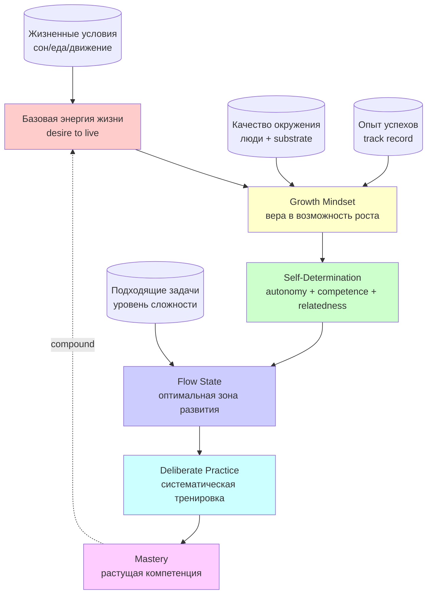

# Phase 3 — Нацеленность на развитие. И мотор, который её крутит.

> **Что эта глава делает.** В Phase 2 мы показали **механизм** самоуправления.
> Этот механизм — пустой. У него нет сам по себе **причины** двигаться. Phase 3
> отвечает на вопрос: что заставляет систему хотеть улучшаться? Где источник
> энергии? И что происходит, когда этот источник иссякает?

---

## §A «Нацелена на развитие самой себя»

Руслан на голосовом 21.05:

> «я на что вот нацелен на развитие самой себя»

Это **центральная мотивация** Jetix-метода. Без неё система может работать
как термостат — поддерживать гомеостаз, не падать ниже определённого уровня —
но **не будет улучшаться**. Будет ходить по кругу.

### A.1 Гомеостаз vs развитие — два режима

Гомеостаз — «удержание стабильности». Это:
- Я не голодаю
- У меня есть крыша над головой
- Я не в опасности
- Моя репутация в норме

Гомеостаз — необходимое условие выживания. Но если **только** гомеостаз —
система **не растёт**. Она может удерживать текущий уровень десятилетиями
и всё. Без развития система **отстаёт** от меняющегося мира и в какой-то
момент гомеостаза не хватит.

Развитие — это **активное расширение** способностей. Это:
- Я могу больше, чем мог год назад
- Я знаю больше, чем знал год назад
- Я понимаю больше, чем понимал год назад
- Я владею большим количеством методов

В терминах Phase 2: развитие = **позитивная обратная связь, направленная
внутрь системы**.

### A.2 Развитие — не «вверх», а «глубже + шире»

Распространённое заблуждение — развитие = «карьерный рост». Развитие — гораздо
шире:
- **Глубже** — лучше понимаешь то, что знаешь (например, проходишь от
  поверхностного знания к экспертному)
- **Шире** — захватываешь новые области (например, кроме программирования
  начинаешь понимать дизайн или психологию)
- **Тоньше** — различаешь нюансы (например, в продажах учишься читать
  невербалику)
- **Глубже встроенее** — то, что было сознательным усилием, становится
  автоматическим (например, привычка говорить «спасибо» становится естественной)

«Развитие самой себя» в Руслановой формулировке — это **все четыре оси**.
Не одна. Не «карьера». А **расширение и углубление способности обрабатывать
информацию + применять методы**.

---

## §B «Хороший настрой / вера в себя»

Продолжение Руслана:

> «у нее этот хороший настрой должен быть вера в себя»

Это **психологическое измерение** самоуправления. И оно критически важно.
Я объясню почему.

### B.1 Без веры в возможность изменения — ничего не меняется

Представь — ты пытаешься выучить новый язык. У тебя есть учебник, есть время,
есть приложение. Но **глубоко внутри** ты не веришь, что осилишь:
- «У меня нет языковых способностей»
- «Я слишком старый чтобы учить»
- «Раньше пробовал, не получилось»

Что произойдёт? Первое же препятствие (длинное слово / непонятная грамматика /
плохой день) станет **подтверждением** того, что ты «не способен». И ты
бросишь.

**Вера в возможность улучшения — не «приятное дополнение». Это
энергетический бюджет на преодоление неизбежных трудностей.** Без неё бюджет
кончается на первом препятствии.

### B.2 Кэрол Двек — Mindset

Кэрол Двек, психолог Стэнфорда, в книге «Mindset: The New Psychology of
Success» (2006) описала два типа мышления [src: Dweck 2006]:

**Fixed mindset (фиксированное мышление):**
- «Способности — это то, с чем ты родился»
- «Если у меня не получается — значит, у меня нет к этому способностей»
- «Усилие — признак отсутствия таланта»
- «Ошибки — это плохо, потому что показывают мою недостаточность»
- Результат: избегаешь сложного, потому что страшно «провалиться» и доказать
  себе свою «бездарность»

**Growth mindset (мышление роста):**
- «Способности — это то, что развивается через практику»
- «Если у меня не получается — мне нужно изменить подход или потратить
  больше времени»
- «Усилие — это путь к мастерству»
- «Ошибки — ценный сигнал, что именно нужно подкрутить»
- Результат: тянешься к сложному, потому что в нём максимальный рост

Долгие исследования Двек показали: дети с growth mindset систематически
**обгоняют** детей с fixed mindset по успеваемости, **независимо от исходного
IQ**. Не потому что они умнее. Потому что они **продолжают пробовать** там,
где fixed-mindset дети сдаются.

### B.3 Применение к Jetix-методу

Метод жизни **требует** growth mindset в качестве операционной системы. Иначе
вся конструкция Phase 2 (самоуправление через петли обратной связи) рушится:
- Цели поставлены, но при первой ошибке = «я не способен» (вместо «надо
  скорректировать»)
- Восприятие искажено в сторону подтверждения «бездарности»
- Решения принимаются защитные, не развивающие
- Обучение из ошибок отрезано (потому что ошибки = угроза для эго)

Поэтому **growth mindset — это не «приятная добавка»**. Это **технический
пререкуизит** для самоуправления, направленного на развитие.

### B.4 Можно ли «выучить» growth mindset?

Хороший вопрос, поднятый самой Двек в последних работах. Ответ — **да, частично**.
Способы:
- **Reframing ошибок** — не «я провалился», а «я нашёл, что не работает»
- **Process praise, not outcome praise** — хвалить за процесс, не за результат
  (детей **и себя** взрослого)
- **«Yet» добавление** — «я не умею Х» → «я не умею Х **пока что**»
- **Изучение нейропластичности** — понимание, что мозг физически меняется
  при обучении
- **Окружение** — быть среди тех, кто верит в возможность изменения

Это не «настройки», которые делаются за вечер. Это **многомесячная
переориентация** мышления. Но **переориентация возможна**. Это и есть
часть метода развития.

---

## §C Self-Determination Theory — мотивационная база

Эдвард Деси и Ричард Райан, психологи Университета Рочестера, разработали
теорию самодетерминации (Self-Determination Theory, SDT) с 1985 [src: Deci &
Ryan 2000]. SDT утверждает: у человека есть **три базовые психологические
потребности**, удовлетворение которых даёт **устойчивую внутреннюю мотивацию**:

### C.1 Три базовые потребности

| # | Потребность | Что значит | Как создать |
|---|---|---|---|
| 1 | **Autonomy** (автономия) | Чувство, что я сам выбираю и направляю свои действия | Иметь реальные варианты; не быть вынужденным |
| 2 | **Competence** (компетенция) | Чувство, что я могу справиться с задачей; что я расту | Trovati's challenges; видеть свой прогресс |
| 3 | **Relatedness** (связь) | Чувство, что я связан с другими; что мои действия значимы для кого-то | Сообщество; взаимная поддержка; общие смыслы |

Если хотя бы одна из этих трёх **систематически нарушена** — мотивация затухает,
человек начинает «отбывать», выгорает.

### C.2 Применение к Jetix дизайну

Jetix как substrate **сознательно** проектирован под три потребности SDT:

| SDT | Jetix реализация |
|---|---|
| Autonomy | **R12 fork-and-leave** — выйти без штрафа; **opt-in** на каждом уровне; substrate как **выбор**, не принуждение |
| Competence | **3-tier funnel** с растущей сложностью; **Workshop hands-on** для овладения через практику; видимый прогресс через hypothesis cycles |
| Relatedness | **Cohort + community** структура; **общие методы и язык (FPF)**; чувство принадлежности к «inventing the future» |

Это не случайность. **Без удовлетворения трёх потребностей** Jetix-подобная
система превратилась бы в экстрактивную (R12 violation) и потеряла бы участников.

### C.3 Внутренняя vs внешняя мотивация

SDT различает:
- **Intrinsic motivation** — делаешь, потому что **сам процесс приносит**
  удовлетворение
- **Extrinsic motivation** — делаешь ради **внешней награды или избежания
  наказания**

Классическое исследование показало: **внешние награды могут разрушать
внутреннюю мотивацию** [src: Deci 1971 «The Effects of Externally Mediated
Rewards on Intrinsic Motivation»]. Если ты любил рисовать, а потом тебе
начали платить за каждый рисунок — ты будешь рисовать **меньше**, когда
платить перестанут. Деньги «съели» внутренний смысл.

Это критически важно для Jetix-метода. **Метод жизни нельзя построить
на чистой внешней мотивации.** Деньги, статус, чужое одобрение —
**вспомогательные**. Главный двигатель — **внутренний интерес** к развитию
самого себя.

---

## §D Дисценти atom: «жизнь как тягучка» (audio_709 preserved)

Per AP-6 dissent preservation discipline — Phase 3 обязан surface dissent atom.

Руслан на одном из ранних голосовых (audio_709, май 2026) сказал:

> «жизнь — это тягучка ... desire-to-live = primary info-valve»

Что это значит. Иногда у человека **просто нет** «нацеленности на развитие».
Не потому что он «неправильный». А потому что **базовая энергия жизни** —
желание жить — у него **низкая**.

В такие периоды:
- Цели кажутся пустыми
- Усилие непропорционально результату
- Хочется не «развиваться», а **переждать**
- Каждый шаг — через сопротивление

Это **не патология** обязательно. Это часть человеческого опыта. Бывают
такие периоды у каждого. В психиатрии есть **спектр**: от лёгкого dysthymia
до клинической депрессии. На лёгком конце — просто плохое настроение неделю.
На тяжёлом — требуется профессиональная помощь.

### D.1 Как метод жизни соотносится с этим dissent atom

**Ошибка №1:** Игнорировать. «Просто будь growth mindset!» — это **газолайтинг**
в адрес человека в дне 4 затяжного эпизода низкой энергии.

**Ошибка №2:** Демотивировать. «У меня нет drive → значит я не для этой
системы → надо бросать». Это путь от плохой недели к **выученной беспомощности**.

**Правильное:**
- **Признать** период как реальный
- **Снизить нагрузку** на это время (не «попытка достичь больше», а «не дать
  отношениям и базовым обязанностям развалиться»)
- **Использовать петлю обратной связи** Phase 2, но с **другим setpoint** — не
  «развитие», а «возвращение к развитию-готовности»
- **Восстановить базу** — сон, питание, движение, человеческий контакт
- При длительности > 2-4 недели — **профессиональная помощь**, не «сам справлюсь»

### D.2 Связь с Phase 1 fundamental ontology

Желание жить = **valve** между внешним миром информации и внутренней обработкой.
Если valve закрыт — информация не доходит. Если открыт — переработка происходит.

Это **не моральная характеристика** («хорошие vs плохие люди»). Это
**состояние valve**. Может закрываться от усталости, болезни, горя, химии,
травм. И **открываться обратно** через восстановление условий.

Метод жизни **уважает это состояние valve**. Не претендует на «вечный
энтузиазм». Знает, когда нужно **отступить**.

---

## §E Flow — Csikszentmihalyi

Михай Чиксентмихайи, психолог Чикагского университета, описал состояние
**flow** (поток) в книге «Flow: The Psychology of Optimal Experience» (1990)
[src: Csikszentmihalyi 1990].

**Flow** — состояние полной поглощённости задачей, когда:
- Время теряется (час прошёл как 5 минут)
- Усталость не ощущается
- Действие и осознание сливаются
- Самокритика выключается
- Результаты обычно лучше обычного

**Условие flow:** баланс между уровнем вызова задачи и уровнем твоих
навыков.
- Если вызов >> навыки → **тревога**, ступор
- Если вызов << навыки → **скука**
- Если вызов ≈ навыки → **flow**

### E.1 Применение к методу развития

Flow — **оптимальная зона** для развития. Именно в flow:
- Скилл прирастает быстрее всего
- Мотивация поддерживается «изнутри» (само состояние flow приятно)
- Не нужна внешняя пинай-сила

Поэтому одна из задач метода развития — **создавать условия для flow**:
- Выбирать задачи на «росте» твоих навыков (a few percent above current)
- Минимизировать прерывания (никаких уведомлений, изолированное время)
- Иметь ясные правила и быструю обратную связь
- Снимать страх ошибиться (low-stakes контекст)

### E.2 Антипаттерн — «выгорание через гиперстимуляцию»

Современный мир пытается забрать тебя **не в flow**, а в **dopamine spikes**
(TikTok-style). Это **противоположно** flow:
- Очень короткие циклы стимуляции
- Нет роста навыков
- Истощает дофаминовую систему
- После длительной экспозиции **трудно** входить во flow (мозг привык к
  быстрым импульсам)

Поэтому метод жизни **сознательно ограничивает** низкокачественную информационную
диету (см. Phase 4). Не из «дисциплины ради дисциплины». А чтобы **сохранить
способность входить во flow**, в котором происходит развитие.

---

## §F Ericsson Deliberate Practice — мастерство

Андерс Эрикссон, шведско-американский психолог, посвятил карьеру изучению
**экспертов мирового уровня**. Книга «Peak» (2016) суммирует [src: Ericsson
2016].

Утверждение: становление **эксперта мирового уровня** в любой области требует
не просто 10,000 часов практики (популярное упрощение), а **deliberate
practice** — целенаправленной практики со строгой структурой.

### F.1 Условия deliberate practice

1. **Чётко определённая цель** — не «потренироваться», а «отработать движение
   X с точностью Y»
2. **Полная концентрация** — никаких отвлечений; в зоне ближайшего развития
3. **Немедленная обратная связь** — знаешь, получилось или нет
4. **Постоянное усложнение** — как только освоил уровень, следующий
5. **Часто требуется тренер / партнёр** — для обратной связи и подбора
   нагрузки

### F.2 Почему «10,000 часов» вводит в заблуждение

Многие люди работают 30 лет и **остаются на уровне 5 лет опыта**. Почему?
Потому что они делают **то же самое снова и снова**, без deliberate practice.
Это не накопление мастерства — это **зависание**.

10,000 часов — приблизительный порог для тех, кто **делает deliberate practice**.
Без deliberate practice 50,000 часов могут не помочь.

### F.3 Применение в Jetix-методе

Метод развития = практика deliberate practice над **самой жизнью**.
- Цель явная (Phase 2 self-management)
- Концентрация (no distraction; deep work blocks)
- Обратная связь (hypothesis cycles + voice memo пересмотр)
- Постоянное усложнение (3-tier funnel)
- «Тренер» = substrate + сообщество (peer review через ROY swarm patterns)

---

## §G Mermaid D5 — Motivation stack (graph TD)

**Чтение:** диаграмма читается **снизу вверх** — каждый уровень опирается на
предыдущий. Если ломается основание (низкая базовая энергия) — верхние уровни
не держатся. Compound-стрелка показывает позитивную обратную связь: достигнутое
mastery возвращает энергию жизни (это сильнейший антидепрессант — но он
работает **только** при условии, что нижние уровни тоже работают).

---

## §H Что отсюда следует для метода жизни

1. **«Просто хоти развиваться» — не работает.** Под желанием развития должна
   быть инфраструктура: базовая энергия жизни (D.) + growth mindset (B.) +
   три потребности SDT (C.).

2. **Вера в себя — не «оптимизм». Это операционный prerequisite.** Без неё
   обратные связи системы Phase 2 искажаются (ошибки = угроза вместо сигнала).

3. **Внутренняя мотивация важнее внешней.** Деньги и статус как **подкрепление**
   — ОК. Деньги и статус как **основной двигатель** — гарантированный путь
   к выгоранию.

4. **Принимать периоды низкой энергии.** AP-6 dissent atom: «не каждый день
   ты тигр». Метод жизни уважает биологию.

5. **Условия flow — проектируются.** Не «случается с правильными людьми»,
   а создаётся подбором задач и среды.

6. **Mastery — через deliberate practice, не через 10,000 часов.** Качество
   практики важнее количества.

В Phase 4 мы перейдём к **накоплению информации и опыта** — что значит «обрабатывать
информацию каждую минуту» и как из этого собирается мастерство.

---

## §I Cross-cite

- Phase 2 — без петель обратной связи мотивация не направлена
- Phase 4 — без качественной информационной диеты мотивация рассыпается
- Phase 5 — выбор метода требует enough мотивации, чтобы **не пойти
  по дефолту**
- Phase 12 — личная история Руслана = живая иллюстрация long-term motivation
  на 38+ дней непрерывной работы

---

*Phase 3 closure 2026-05-21. brigadier-scribe; F2 voice anchors + F3 synthesis; AP-6 dissent atom (audio_709) preserved.*
