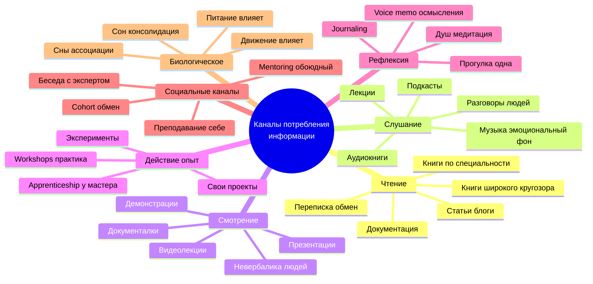
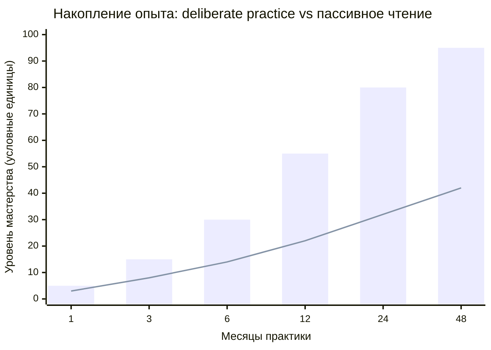

# Phase 4 — Жизнь как процесс непрерывной переработки информации

> **Что эта глава делает.** Phase 1 говорил «всё — информация». Phase 4
> разворачивает практический вопрос: **что именно** ты потребляешь, **в каких
> каналах**, какого **качества** — и как это накапливается в **опыт и мастерство**.

---

## §A «Процесс жизни — это процесс»

Руслан на голосовом 21.05:

> «процесс жизни это процесс»

Звучит как тавтология, но это **сильное утверждение**. Жизнь — **не состояние**.
Жизнь — это **непрерывный процесс**, в каждую минуту которого происходит
**приём и переработка информации**.

### A.1 Минута за минутой — информация входит

Прямо сейчас, читая эти строки, твой мозг обрабатывает:
- Зрительный сигнал от экрана (буквы, расположение, цвет фона)
- Слуховой фон (звуки квартиры, города, людей)
- Тактильный — рука на мышке, поза тела, температура
- Внутренний — сигналы от желудка (поел / голоден), биение сердца, дыхание
- Эмоциональный — какое-то лёгкое чувство интереса, скуки, раздражения
- Воспоминания — слово «информация» вызывает ассоциации с прошлым

И **всё это** обрабатывается **параллельно**, **без твоего сознательного
управления**.

### A.2 Сознательное vs автоматическое

Это критически важное различие. Большая часть информационного потока обрабатывается
**ниже уровня сознания**. Канемановская «Система 1» [src: Kahneman 2011].
Сознание — Система 2 — обрабатывает в десятки тысяч раз меньше.

**Что мы можем контролировать сознательно:**
- Куда направляем внимание
- Что выбираем читать / слушать / смотреть
- С кем общаемся
- В какие моменты включаем какие методы переработки

**Что не контролируем:**
- Что происходит автоматически на основе уже накопленного
- Привычные интерпретации, паттерны
- Эмоциональные реакции (можем модифицировать через практику, но не отменить)
- Большая часть обработки во сне

Метод жизни **обращает внимание** на эту параллельную работу. Не отрицает её
(«я полностью сознательный»). Не игнорирует её. **Учит её сотрудничать с
сознательной частью.**

---

## §B Накопление опыта — Ruslan voice example

Руслан на голосовом 21.05 дал прямой пример:

> «я например вот на этой системе потребил много информации соответственно
> у меня там опыт накопился до большого количества людей и соответственно
> это позволяет ... большие проекта что-то выполнять»

Что здесь происходит. За **38 дней непрерывной работы** с Jetix-системой
(13 апреля — 21 мая 2026) у Руслана накопилось:
- 1365 коммитов в Git
- ~1.2 миллиона слов substrate (только wiki + foundations + decisions +
  hypotheses + research)
- 169 контактов в CRM (post KA-03)
- 43 файла гипотез

Это не «просто информация». Это **переработанный опыт** — каждый коммит
содержит решение, каждая запись — результат размышления. И главное —
**паттерны** между ними. После 1365 циклов **узнаются повторяющиеся ситуации**,
**формируются интуитивные правила**, **снижается стоимость» каждого нового
решения.

Phase 12 разворачивает эту тему с количественными деталями. Здесь же важно
зафиксировать: **накопление работает по compound-схеме**.

### B.1 Compound interest в накоплении опыта

Compound (сложный процент) — экономический термин. Применим к опыту так:
- Если каждый день ты узнаёшь N новых единиц
- И каждая новая единица **связывается** со средним K уже накопленных
- То **полезность** новых единиц растёт не линейно, а **экспоненциально**

Простой пример. Ты выучил слово «компьютер». 10 связей с другими словами
(монитор, клавиатура, программа...). Выучил 100 слов — 100 × 99 / 2 = 4950
возможных связей. Выучил 1000 слов — **499,500** возможных связей. Это
**500 раз больше** при 10-кратном росте словаря.

В реальности не все связи **активные**. Но порядок величины правильный.
Это и есть **сила накопления**.

### B.2 Почему многие люди не накапливают

Парадокс — большинство людей **живут десятилетиями** и не накапливают опыт
с compound-эффектом. Почему?

- **Поверхностное потребление** — информация прошла через сознание, не
  закрепилась
- **Отсутствие связывания** — новое не интегрируется со старым
- **Отсутствие повторного использования** — один раз посмотрел, забыл
- **Нет внешнего хранилища** — память человека ограничена; без записи теряется
- **Нет рефлексии** — не делает паузу обдумать «что я узнал сегодня»

Метод развития = **активная борьба с этими антипаттернами**. Сознательное
накопление, связывание, повторное использование.

---

## §C Tacit knowledge — Polanyi

Майкл Поланьи, венгерско-британский философ, в книге «The Tacit Dimension»
(1966) сформулировал знаменитое:

> «We know more than we can tell»
> «Мы знаем больше, чем можем рассказать»

[src: Polanyi 1966]. Это о **скрытом знании** — том, что мы умеем, но не
можем артикулировать.

### C.1 Примеры tacit knowledge

- Кататься на велосипеде (попробуй объяснить словами как именно балансируешь)
- Узнавать лицо знакомого человека (можешь, но не объяснишь алгоритм)
- Определять, что собеседник напряжён (читаешь сотни микро-сигналов автоматически)
- Готовить «по вкусу» (рецепт не передаёт всю реальную процедуру)
- Знать когда «настало время» в продажах (не формализуется)

Tacit knowledge — это **большая часть** мастерства профессионала. Когда
эксперт говорит «just feel it» — он не врёт, он именно так и знает. Он
приобрёл огромное количество tacit knowledge через опыт, и не может его
**вербализовать**.

### C.2 Как передаётся tacit knowledge

Не через книги. **Книги передают explicit knowledge** (то, что можно
артикулировать).

Tacit передаётся через:
- **Apprenticeship** — годы рядом с мастером
- **Подражание** — наблюдение и повторение
- **Совместная работа** — на одной задаче с экспертом
- **Обсуждение конкретных случаев** — разбор «вот тут я делал так, потому что...»
- **Корректировка вживую** — мастер останавливает «не так, попробуй вот так»

Это **одна из причин**, почему Jetix Workshop задуман как **hands-on**, а не
как лекции. Hands-on — единственный способ передавать tacit. Лекции
передают только explicit, что **существенно меньше**.

### C.3 Tacit и AI — открытый вопрос

Современный AI (включая LLM) хорошо переваривает **explicit knowledge** —
тексты, формулы. С tacit куда сложнее. Многократно цитируется проблема —
**Moravec's paradox**: AI решает PhD-уровень математики, но не может
«просто пройти по комнате» так же ловко как 2-летний ребёнок. Причина —
большая часть человеческого интеллекта это tacit, и она **труднее переводима**
в формализм.

Для Jetix-метода это означает: AI substrate (Claude / Jetix) — мощный
амплификатор **explicit knowledge** (см. Phase 10 exocortex). Но
**tacit knowledge** по-прежнему накапливается **через личную деятельность**
человека. AI не заменяет, а дополняет.

---

## §D Каналы потребления информации

Не все каналы равны. У каждого свои свойства.

| Канал | Скорость | Глубина | Тип | Пример |
|---|---|---|---|---|
| **Чтение** (текст) | Управляемая (можно медленно) | Высокая (можно перечитать) | Explicit | Книга по специальности |
| **Слушание** (audio) | Фиксированная (×1, ×1.5) | Средняя (труднее вернуться) | Explicit + tone | Подкаст, аудиокнига |
| **Смотрение** (video) | Фиксированная | Средняя | Explicit + visual + tone | YouTube лекция, демо |
| **Действие** (опыт) | Реального времени | Высокая (включает tacit) | Tacit + explicit | Сделать проект самому |
| **Рефлексия** | Самостоятельная | Высокая | Reorganizes existing | Journaling, voice memo осмысления |
| **Сон + сны** | 7-9 часов | Глубокая (consolidation) | Reorganizes existing | Естественный процесс |
| **Беседа** | Реального времени | Средняя-высокая | Explicit + tacit (видимо) | Разговор с экспертом |
| **Преподавание** | Управляемая | Очень высокая | Forces explicit, reveals tacit gaps | Объяснить кому-то другому |

### D.1 «Преподавание = лучший способ выучить»

Древняя истина, экспериментально подтверждённая. Когда ты пытаешься объяснить
что-то другому человеку:
- Обнаруживаешь, что не понимаешь так глубоко как думал (Феинмановский «test»)
- Вынужден переформулировать (создаёшь новые связи)
- Получаешь обратную связь от слушателя («а вот это непонятно»)
- Закрепляешь через многократное проговаривание

В Jetix-методе это применено напрямую через **3-tier funnel** — продвинутые
участники **обучают** новичков. Это не «общественная нагрузка». Это **способ
для продвинутых дальше углублять своё понимание**.

### D.2 Качество > количество

Современная проблема: каналов информации **слишком много**. Twitter / TikTok /
YouTube / Reddit / Telegram / LinkedIn / новости / подкасты. **Физически
невозможно** потреблять всё.

Метод жизни **фильтрует** на качество:
- Что тренирует мышление vs что отупляет
- Что строит связи с уже накопленным vs что разрозненно
- Что я смогу применить vs что просто развлечение
- Где источник заинтересован в **моём** росте vs где источник заинтересован
  в **моём внимании** (рекламная модель)

Без этого фильтра — **информационный шум вытесняет сигнал** (см. Phase 1
A.4 Винер «информация vs шум»).

---

## §E DIKW pyramid

Russell Ackoff в 1989 году описал иерархию [src: Ackoff 1989 «From Data to
Wisdom»]:

```
                Wisdom (мудрость)
              /
           Knowledge (знание)
         /
       Information (информация)
     /
   Data (данные)
```

Данные → Информация → Знание → Мудрость.

### E.1 Каждый уровень требует переработки

- **Data** — сырые факты. «Температура +18°C»
- **Information** — данные в контексте. «На улице +18, это прохладно для
  мая в Берлине»
- **Knowledge** — обобщённые паттерны. «В мае в Берлине бывает прохладно,
  возьму куртку»
- **Wisdom** — знание применённое к жизненным выборам. «Зная это, я планирую
  одежду на неделю с прогнозом погоды»

Переход с уровня на уровень — это **обработка**, не «просто хранение». Это
требует **активного метода**.

### E.2 Современная экономика часто застревает на data/information

«Big data», «информационный взрыв», «информационная экономика» — всё на двух
нижних уровнях. **Knowledge** и **wisdom** — **дефицит**. Это парадоксально:
данных как никогда много, знания и мудрости в среднем — **меньше**, чем
у предков, в относительных терминах.

Почему? Потому что **переработка** требует времени, навыка, методики.
А современный поток информации **подавляет** возможность медленной
переработки. Ты не успел переварить вчерашнее — уже сегодня новое.

Метод жизни **сознательно тормозит** поток на уровне knowledge/wisdom.
Не «всё прочитать». А «прочитать то, что переварю, и переварить **до**
knowledge».

---

## §F Активное vs пассивное потребление

Параметр **качества потребления**, который часто игнорируется.

### F.1 Пассивное потребление

- Видео крутится, ты смотришь не concentrating
- Подкаст играет на фоне, ты в полусон
- Скроллишь ленту, информация проходит без зацепки
- Читаешь скандинавский детектив на пляже

Это **не плохо** по умолчанию (релакс — важен). Но это **не накопление**.
Информация **не закрепляется**. Через неделю не помнишь, что слушал.

### F.2 Активное потребление

- Делаешь заметки во время чтения
- Останавливаешь видео, чтобы обдумать
- Пересказываешь себе вслух главное
- Делаешь упражнения (если книга по навыку)
- Связываешь с тем, что уже знаешь
- Применяешь в течение 24-48 часов

Это **накопление с compound-эффектом**. После активной обработки 1 хорошая
книга = больше, чем 10 пассивно прослушанных.

### F.3 Spaced repetition — Leitner / Anki

Spaced repetition system (SRS) — экспериментально подтверждённый метод
**долговременного запоминания** [src: Ebbinghaus 1885 forgetting curve;
Leitner 1972 system; Anki software модерн].

Принцип: **повторяй карточку в момент, когда ты почти забыл**, увеличивая
интервалы по экспоненте. После 10 повторов через несколько лет — выучено
**пожизненно** с минимальной затратой времени.

Применение в методе развития: критически важные методы и факты — на SRS.
Не «один раз прочитал в книге → забыл через месяц». А «прочитал → выписал
ключевую карточку → SRS пересматривает».

---

## §G Mortimer Adler «How to Read a Book»

Книга 1940 года, всё ещё актуальна [src: Adler 1940/1972]. Алдер выделил
4 уровня чтения:

1. **Elementary reading** — понимать буквы и предложения. Базовая школьная
   грамотность.
2. **Inspectional reading** — быстро понять, **о чём** книга. Беглое
   ознакомление. Цель — решить, стоит ли читать глубже.
3. **Analytical reading** — медленное, внимательное чтение с целью **полностью
   усвоить** содержание. Делаешь заметки, формулируешь главные тезисы автора.
4. **Syntopical reading** — параллельное чтение нескольких книг по одной теме
   для **синтеза**. Высший уровень.

Большинство людей застряли на (1)-(2). Метод развития = **систематическое
использование (3) и (4)** для критически важных тем.

### G.1 Применение к Jetix substrate

- (1) Чтение voice memo транскрипты — Elementary
- (2) Quick scan нового Foundation Part — Inspectional
- (3) Deep read Pillar C constitutional — Analytical
- (4) Phase 13 wikipedia synthesis (12 traditions × Jetix application) —
  Syntopical

Это сознательное **применение чтения как метода Phase 5 §J meta-method**.

---

## §H Память — три уровня

Когнитивная психология описывает три уровня памяти [src: Atkinson & Shiffrin
1968]:

1. **Sensory memory** — миллисекунды. Что мгновение назад видел/слышал.
2. **Working memory** — секунды-минуты. Что сейчас в активном использовании.
   Знаменитые 7±2 элемента [src: Miller 1956].
3. **Long-term memory** — годы-десятилетия. Накопленное.

Переход из 2 в 3 — **консолидация**. Происходит через:
- Сон (особенно глубокий)
- Повторение в разных контекстах
- Эмоциональную значимость (что важно — запоминается лучше)
- Связывание с уже известным (приклеивание к структуре)

Метод жизни **уважает биологию памяти**:
- Достаточно спит (без сна — нет консолидации)
- Не пытается «выучить за ночь» (working memory не масштабируется)
- Использует внешнюю память (записывает, иначе forgetting curve проглотит)
- Возвращается к важному через интервалы (spaced repetition)

---

## §I Внешняя память — Jetix как extended cognition

Phase 10 разворачивает это полно (exocortex). Здесь — короткий промежуточный
тезис.

**Внешняя память человека** — записи, заметки, файлы, помощники — увеличивает
эффективную «оперативную память» на порядки.

В Jetix эту функцию выполняют:
- **Wiki v2** — концептуальная память (концепты, темы, факты с цитированием)
- **Hypothesis arch** — память о текущих ставках и их состоянии
- **CRM** — память о людях и взаимодействиях (151 человек + 29 организаций)
- **Daily logs** — короткосрочная память дня
- **Voice memos archive** — сырая память голоса, для последующей переработки
- **Git history** — append-only лог всех решений (1365 коммитов на 21.05)

Без этой внешней памяти Руслан не смог бы держать в голове весь substrate.
**С** этой памятью — каждое решение опирается на накопленное.

---

## §J Mermaid D6 — Каналы потребления (mindmap)



---

## §K Mermaid D7 — Кривая накопления опыта (xychart-beta)



**Чтение диаграммы:**
- **Bars (выше)** — deliberate practice траектория. Compound growth, S-curve, к месяцу 48 — уровень эксперта.
- **Line (ниже)** — пассивное чтение траектория. Линейный (или sub-линейный) рост; через 4 года — половина того, что у deliberate practice.

Это **одна и та же затраченная единица времени**, **разный метод** =
**разный результат**.

---

## §L Что отсюда следует для метода жизни

1. **Жизнь — процесс, не состояние.** Каждая минута — приём + переработка.
   Это не выбор, а биология. Выбор — **как** перерабатывать.

2. **Compound-эффект работает.** Накопление с правильной техникой даёт
   экспоненциальный рост. Без техники — линейный или сублинейный.

3. **Tacit knowledge — большая часть мастерства.** Передаётся через **действие**,
   не через тексты. Метод развития должен включать **hands-on** компоненту.

4. **Качество каналов > количество.** Современный мир толкает к шуму. Метод
   жизни сознательно фильтрует.

5. **Активное потребление в десятки раз эффективнее пассивного.** Заметки,
   объяснение себе, применение в 24-48 часов.

6. **Внешняя память — мультипликатор.** Без неё ты ограничен биологией.
   С ней — на порядки больше.

7. **Сон — не «потеря времени». Сон — глубокая обработка.** Без сна нет
   консолидации, нет долговременной памяти.

В Phase 5 мы перейдём к **анатомии одного метода** — как именно происходит
переход от «плана» к «достижению», и как **выбирается** метод в каждый момент.

---

## §M Cross-cite

- Phase 1 — основа («всё — информация»)
- Phase 2 — самоуправление через накопленный опыт
- Phase 3 — мотивация для активного потребления
- Phase 5 — выбор метода **переработки** информации
- Phase 10 — exocortex усиливает скорость и доступ
- Phase 12 — Ruslan'а quantitative bootstrap = живая иллюстрация compound

---

*Phase 4 closure 2026-05-21. brigadier-scribe; F2 voice anchors + F3 synthesis.*
