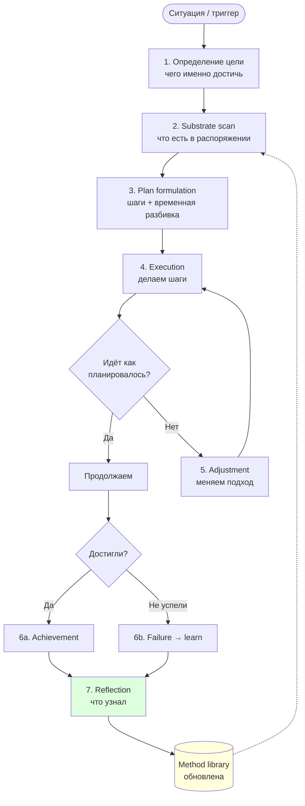
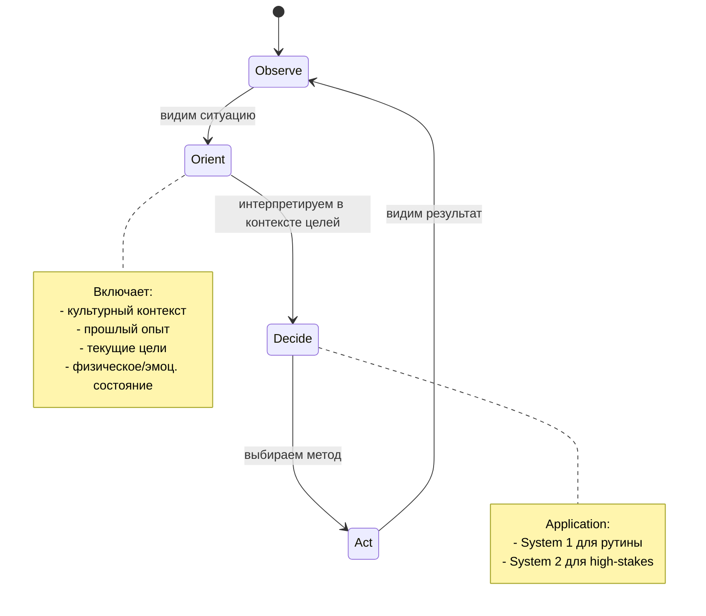
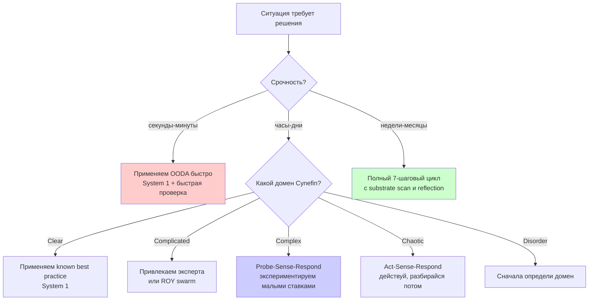
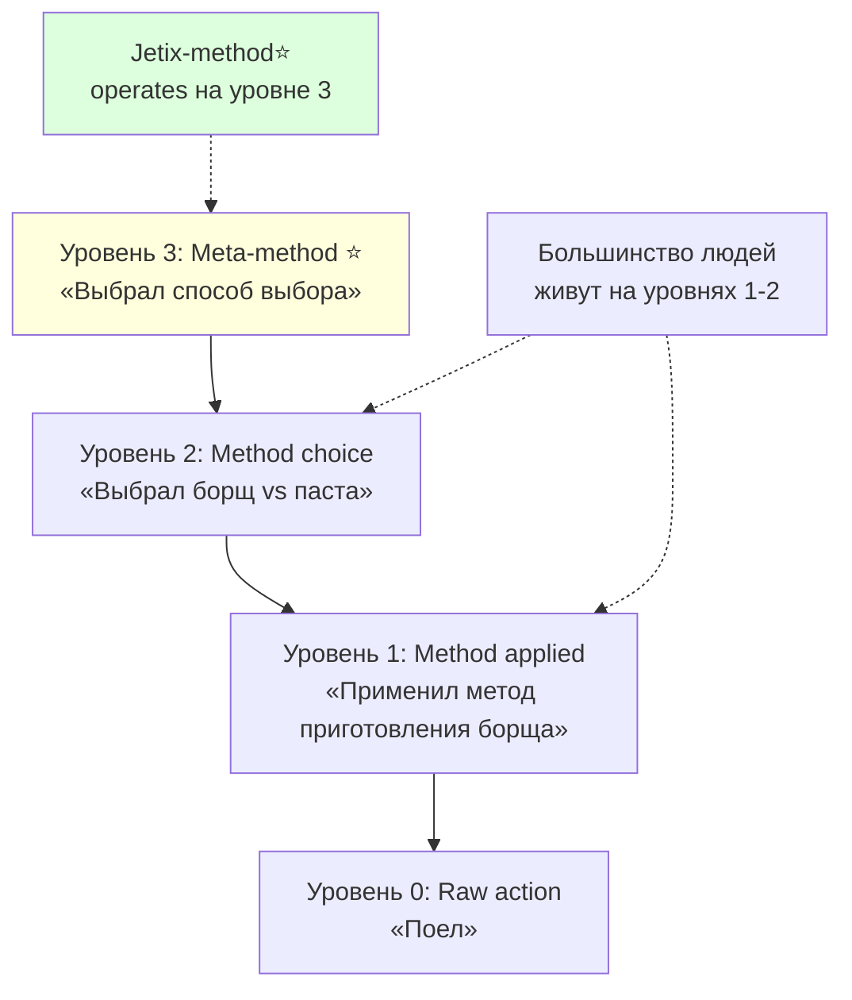
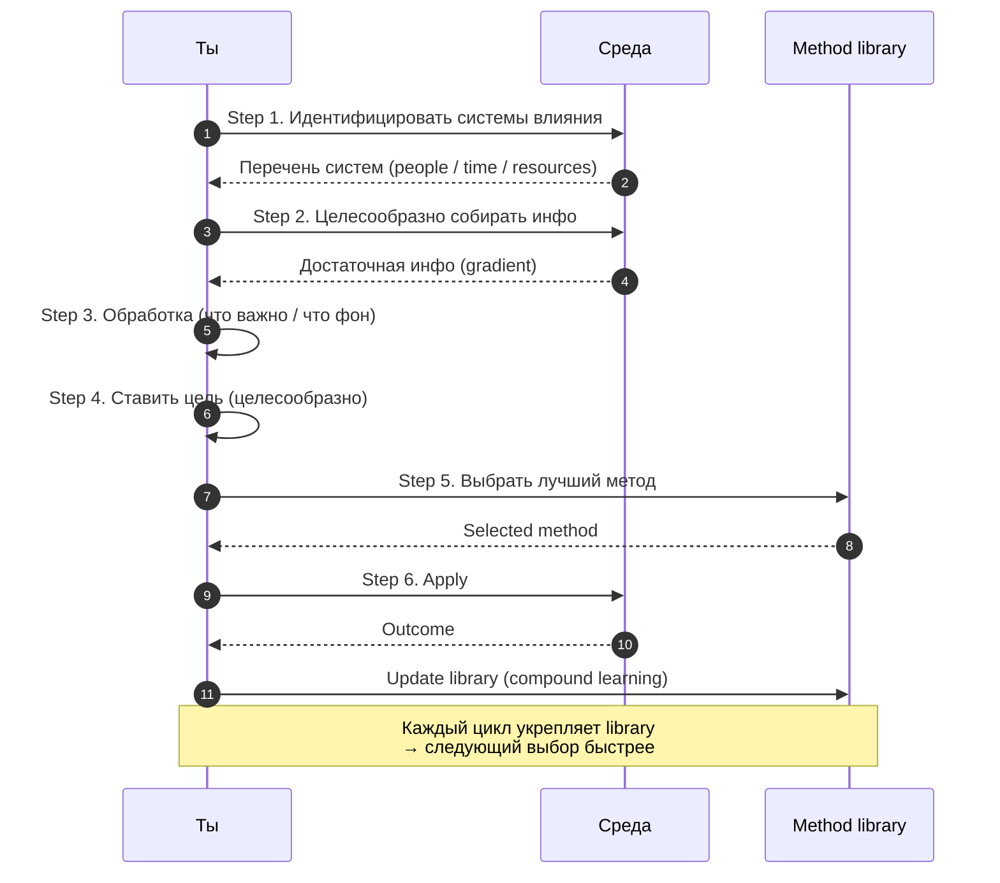
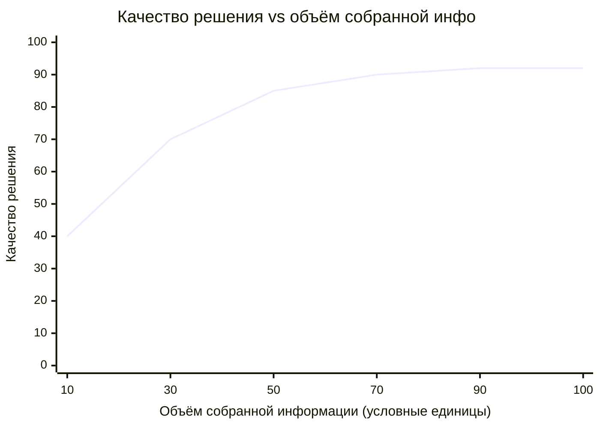
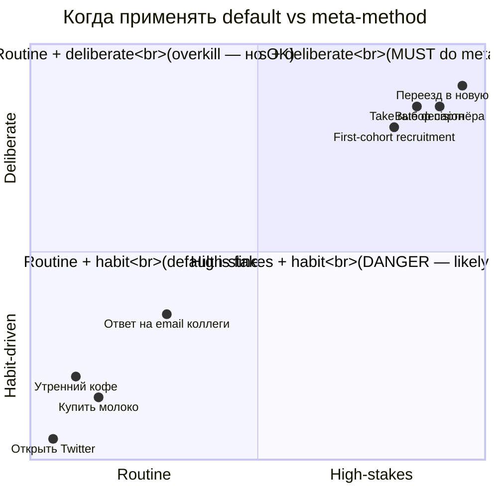

# Phase 5 — Анатомия метода. Тайминг. И метод выбора методов.

> **Что эта глава делает.** Phase 5 — одна из центральных. Здесь мы:
> (1) Разбираем структуру **одного метода** — от плана до достижения.
> (2) Понимаем, что метод выбирается **в каждый момент времени**.
> (3) ⭐⭐ Поднимаемся на **мета-мета уровень** — метод выбора методов
> (квадрат) — это ключевое отличие Jetix-подхода.

---

## §A Анатомия метода — «план → достижение»

Руслан на голосовом 21.05:

> «сам этот метод что то есть я что-то там планирую да потом я вот этого достигаю»

Внутри этой простой формулировки спрятана структура из 7 шагов. Разберём её
**максимально конкретно**.

### A.1 Семь шагов любого осознанного метода

1. **Определение цели.** Что именно достичь? Чем точнее формулировка —
   тем выше шансы. «Похудеть» — плохая цель. «Скинуть 5 кг за 3 месяца до уровня X кг» — реализуемая.
2. **Substrate scan.** Что у меня уже есть для этого? Время, деньги, навыки,
   связи, инструменты, знания. Без этой инвентаризации — слепой полёт.
3. **Plan formulation.** Последовательность шагов. **С временной разбивкой**.
   Без сроков плана нет — есть пожелание.
4. **Execution.** Делать шаги. Это **не отдельно** от плана — это его
   материализация. Большинство людей застревают здесь, потому что план был
   нерабочий.
5. **Adjustment.** Если не работает — менять. **Не упрямиться.** Сигналы:
   результат отстаёт от плана; неожиданные препятствия; новая информация.
6. **Achievement (или failure → learn).** Либо достиг — фиксируешь. Либо
   нет — извлекаешь урок (что не так в плане / условиях / выполнении).
7. **Reflection.** Что узнал из всего цикла, **независимо** от итога. Это
   шаг, который большинство пропускает — и поэтому не накапливает методологию.

### A.2 Почему именно эти 7 (а не больше / меньше)

Существуют десятки фреймворков: SMART goals, OODA, PDCA (Plan-Do-Check-Act),
GTD, Scrum sprint, Kaizen ... [src: Drucker «The Practice of Management» 1954;
Deming PDCA; Boyd OODA].

Наша 7-шаговая структура — **синтез**, оптимизированный под:
- **Понятность** (Феинман-стиль)
- **Полнота** (не упускает ключевые блоки)
- **Применимость** к жизни в целом, не только к проектам

Альтернативные формулировки **равноценны**:
- PDCA = Plan / Do / Check / Act — компактнее, теряет substrate scan и reflection
- OODA = Observe / Orient / Decide / Act — для быстрых решений; нет цели явно
- SMART = критерий **цели**, не **метода**
- Scrum sprint = тот же цикл, но в командном контексте

### A.3 Пример: освоить SQL за месяц

| Шаг | Что |
|---|---|
| 1. Цель | Уметь писать SELECT/JOIN/GROUP-BY на средне-сложных задачах за месяц |
| 2. Substrate scan | Есть базовое программирование; 1 час/день; SQL Tutorial Mode на postgresql.org; компьютер с базой данных |
| 3. Plan | Week 1 — SELECT basics; Week 2 — JOIN; Week 3 — GROUP BY + aggregations; Week 4 — практика на реальных задачах + LeetCode |
| 4. Execution | Каждый день 18:00-19:00, делаю упражнения |
| 5. Adjustment | На неделе 2 понял что Tutorial Mode слабовато — добавил PostgreSQL Exercises |
| 6. Achievement | Через 30 дней — могу решить 80% задач LeetCode Easy/Medium → достиг |
| 7. Reflection | Что узнал: 1 час/день стабильно > 3 часа/раз/неделю; реальная база лучше упражнений из книги; **SQL легче, чем казалось — страх был больше реальности** |

Reflection в шаге 7 даёт material для **методологии** — knowledge о методах,
который применим в **следующем** обучении.

---

## §B Метод тайминг: «каждую секунду выбирает»

Руслан на голосовом 21.05:

> «каждый там раз или каждую секунду что человек блять или intellect вот
> как-то метод выбирает или там информацию исходя из той информации которая у него есть»

Это **критическое наблюдение**. Большинство людей думают о «выборе методов»
как о редком событии — «поставил цель на год → выбрал стратегию». Но
**на самом деле** выбор метода происходит **постоянно**.

### B.1 Микро-выборы — везде

Прямо сейчас, читая это:
- **Метод чтения** — пробежать или вчитаться (каждый абзац — переоценка)
- **Метод концентрации** — открыть Telegram или продолжить
- **Метод запоминания** — просто читать или сделать заметку
- **Метод дыхания** — углубить или оставить

Все эти микро-выборы происходят **каждые секунды-минуты**. Большая часть
**автоматически**, ниже уровня сознания. И **именно от этих автоматов**
зависит, **какой будет твой год** в сумме.

### B.2 OODA loop — Boyd 1976

Джон Бойд, военный стратег, в 1970-е разработал концепт OODA (Observe-
Orient-Decide-Act) [src: Boyd 1976, неопубл. лекции; см. Coram «Boyd:
The Fighter Pilot Who Changed the Art of War» 2002].

OODA — **самая быстрая** версия 7-шагового цикла, для условий, когда
**нет времени** на полный план:

| OODA | Что |
|---|---|
| **Observe** | Что происходит прямо сейчас? Сенсорный вход. |
| **Orient** | Что это значит в контексте моих целей? Интерпретация. |
| **Decide** | Какой метод реакции? Выбор. |
| **Act** | Действие. |
| (→ Observe) | Новое восприятие, цикл замыкается. |

**Ключевое утверждение Бойда:** тот, кто **проходит OODA быстрее** —
выигрывает столкновение. Военный лётчик в воздушном бою. Шахматист в
блиц-партии. Стартап, опережающий конкурента на 1 месяц на каждом шаге.

**OODA loop = быстрый цикл метода**.

### B.3 Где OODA, а где полный 7-шаг

- **OODA (быстрый):** реактивные ситуации, секунды-минуты, частые
  пересмотры (продажи, переговоры, спорт, кризис-управление)
- **Полный 7-шаг (медленный):** стратегические выборы, дни-месяцы,
  крупные ставки (карьера, переезд, запуск продукта)

Метод жизни — это **умение различать** ситуации и **применять правильный
ритм цикла**.

### B.4 Cynefin — Snowden

Дэвид Сноуден разработал фреймворк Cynefin [src: Snowden & Boone «A Leader's
Framework for Decision Making» HBR 2007]. Cynefin различает **5 доменов
сложности**:

| Домен | Характеристика | Метод |
|---|---|---|
| **Clear (Obvious)** | Причина→следствие очевидно | Best practice — применяй известный метод |
| **Complicated** | Причина→следствие требует экспертизы | Good practice — нужен эксперт |
| **Complex** | Причина→следствие видны только в ретроспективе | Probe-Sense-Respond — эксперимент |
| **Chaotic** | Причина→следствие нет | Act-Sense-Respond — действуй первым, разбирайся потом |
| **Disorder** | Не знаешь, в каком домене | Сначала определи домен |

Каждый домен требует **своего метода**. Применение Complex-метода к Clear
ситуации = трата времени. Применение Clear-метода к Complex = плохие
результаты.

**Часть мета-метода (см. §J ниже)** — определить, в каком домене ты сейчас,
**прежде** чем выбирать конкретный метод.

---

## §C Method library / репертуар

У каждого человека есть **библиотека методов** — выученных и интуитивных.
Это его рабочий инструментарий.

### C.1 Что в библиотеке у среднего взрослого

Допустим, типичный 35-летний взрослый. Что у него есть:
- ~5-15 рабочих методов из его профессии
- ~10-20 «жизненных» методов (как готовить простую еду, как находить дешёвые
  билеты, как разрешить мелкий конфликт, как уснуть после стресса)
- ~5-10 социальных методов (как познакомиться, как поддержать друга,
  как сказать «нет»)
- ~3-5 методов саморегуляции (что делать, когда злой/грустный/усталый)

**Итого ~25-50 методов.** Это много или мало? Зависит от того, **что
ты делаешь в жизни**. Для среднего европейца с типичной работой — нормально.
Для **строителя своей системы**, как Руслан, — **мало**.

### C.2 Расширение библиотеки = основа развития

Метод развития = **систематическое** расширение библиотеки.
- Каждый новый изученный метод = расширение repertoire
- Каждое применение = укрепление этого метода (выученный → встроенный)
- Каждая комбинация (метод A + метод B) = новый «составной» метод

Цель — **не «знать сотни методов»**, а:
- Знать метод **для каждого регулярного класса ситуаций** в твоей жизни
- Знать **несколько альтернатив** для важных ситуаций
- Знать **критерии**, когда какой выбирать

### C.3 Jetix substrate расширяет library

Это одно из ключевых обещаний Jetix. **Substrate** — это **доступ к
методам, которых нет в твоей личной библиотеке**:
- Кто-то другой потратил годы на освоение метода X
- Записал его в substrate
- Ты получаешь доступ к **исполнимой версии** метода X через substrate
- Не нужно изобретать заново — стой на плечах гигантов

Это и есть основа компетенс scaling в Phase 8 «1 → 10 → 100 → 1000+».

---

## §D Критерии выбора метода (для одной ситуации)

Когда перед тобой ситуация и **несколько** возможных методов — по каким
критериям выбирать?

| Критерий | Вопрос | Пример |
|---|---|---|
| **Тип ситуации (Cynefin)** | В каком домене я? | Clear → known; Complex → experiment |
| **Доступные ресурсы** | Что у меня есть? | Метод X требует 10 часов — а у меня 1 |
| **Time constraint** | Сколько у меня времени? | Дедлайн через час — нет времени на сбор инфо |
| **Risk tolerance** | Что я готов проиграть? | Стратегическая ставка — низкий риск; tactical — выше |
| **Past success rate** | Применял раньше — работало? | Метод X работал в 7 из 10 случаев — высокий confidence |
| **Group dynamics** | Кто ещё участвует? | Метод требует cooperation команды — есть ли команда? |
| **R12 conformance** | Это extractive или нет? | Метод эксплуатирует кого-то → не применяю (constitutional) |

Эти 7 критериев — **не магия**. Это **explicit list**, по которому ты
**сознательно** проходишься перед выбором. Сначала медленно (System 2). С
практикой — быстрее (часть отдаётся Системе 1).

---

## §E Канеман — System 1 vs System 2

Дэниел Канеман в «Thinking, Fast and Slow» (2011) [src: Kahneman 2011]
описал две **системы** мышления:

| System | Скорость | Усилие | Применимость | Подводный камень |
|---|---|---|---|---|
| **System 1** | Очень быстро (миллисекунды) | Малое | Знакомые ситуации, паттерны | Cognitive biases, иллюзии |
| **System 2** | Медленно (секунды-минуты) | Большое | Новые / сложные ситуации, рассуждение | Утомляемое; ленивое |

**95-98% решений** мы принимаем System 1. Без System 1 мы бы не справились
с темпом жизни (каждое микро-решение через рассуждение = паралич).

Но System 1 **заражена biases**:
- **Anchoring** — первое услышанное число становится якорем
- **Availability heuristic** — то, что легко вспомнить, переоценивается
- **Confirmation bias** — ищем подтверждение, игнорируем опровержение
- **Sunk cost fallacy** — продолжаем, потому что много вложили
- **... ещё ~150 задокументированных biases**

### E.1 Когда какую систему?

- **System 1** для рутины — она дешёвая, быстрая, обычно достаточно точная
- **System 2** для **high-stakes** решений — медленнее, но точнее на новых
  задачах
- **Hybrid** для большинства — System 1 предлагает default, System 2
  проверяет если время есть

Klein-Kahneman синтез (2009) [src: Klein & Kahneman 2009 American Psychologist]
утверждает: **expert intuition** (System 1 эксперта) **бывает надёжной**,
если она формировалась в **regular environment** с **быстрой обратной связью**.
Если нет — System 1 эксперта может быть **уверенно неправа**.

Применение для метода жизни: **доверять Системе 1 в тех областях, где ты
получил много обратной связи**. Применять System 2 на новых территориях.

---

## §F Concrete example: день Руслана (метод тайминг в действии)

Возьмём один день. Как метод тайминг работает на практике.

**Утро 21.05.2026, около 9:00.**

- Wake up → ситуация: вчера допоздна, средняя усталость, есть голос-память
  от вчера которая ещё не разобрана, есть Updated Plan с 11 A-actions
- **Выбор #1 (System 1):** open Telegram / нет → решает **нет** (привычка
  отложенного reactivity) [время на выбор: ~1 секунда]
- **Выбор #2 (System 2):** что приоритет сегодня? — пересматривает 11 A-actions,
  выбирает Method V2 prompt + Slack DR-33 review [~5 минут]
- **Выбор #3:** voice memo дать ли или сразу писать? → решает голосом, потому
  что устал, голос дешевле [~2 секунды]
- **Выбор #4:** какую часть Method V2 раскручивать первой? → Phase 12 personal
  origin — наиболее заряжена, легче извлечь [~30 секунд]
- ... и так весь день, **сотни** мелких и средних выборов

Каждый выбор — **применение метода тайминг**. Большинство — System 1
(автоматика). Несколько критических — System 2 (осознанное).

**Pattern, который Руслан развивает:** на критические выборы **переводить
System 2** (не дать решить дефолту). На рутину **доверять System 1** (не
тратить cognitive bandwidth).

---

## §G Mermaid D8 — Анатомия метода 7-шаг (graph TD)

---

## §H Mermaid D9 — OODA loop (stateDiagram)

---

## §I Mermaid D10 — Дерево решения метода (graph TD)

---

# §J ⭐⭐ Метод выбора методов — meta-meta уровень

Это — **сердце** Phase 5. И, возможно, **одно из самых важных** для всего
метода жизни. Если запомнить только одну идею из всего документа — пусть
будет эта.

Руслан на голосовом 21.05 вечером:

> «это можно еще назвать как метод выбора методов ... перед тем как подумать
> какой мне метод надо еще раз надо подумать о какой мне метод надо ну то
> как-то в квадрате»

«В квадрате» — это **рекурсия один уровень глубже** того, что описывает
Левенчук Методологией MG4 (метод как объект 1-го класса). Это **метод о методах
выбора методов**.

Reframing Jetix: O-107 canonical one-liner был «метод по объединению методов
по улучшению системы самой себя». **«Метод выбора методов»** — одна из самых
точных переформулировок этого же.

---

## §J.1 Квадрат — четыре уровня

| Уровень | Что происходит | Пример |
|---|---|---|
| **0 (raw)** | Просто действие | «Поел» |
| **1 (method)** | Метод применяется | «Применил метод приготовления борща» |
| **2 (method choice)** | Выбор метода | «Выбрал готовить борщ vs пасту» |
| **3 (meta-method)** ⭐ | **Метод выбора метода** | «Сначала собрал инфо о наличии продуктов / времени / голода → потом выбрал способ выбора (рандом / по любимости / по доступности) → потом выбрал готовить борщ» |

**Большинство людей оперируют на уровне 1-2.** Делают, не думая о методе.
Иногда выбирают между методами, обычно по дефолту.

**Jetix-method operates explicitly на уровне 3.** Это **ключевое отличие**.

Это не «больше думаешь». Это **думаешь на правильном уровне** в важных
ситуациях.

---

## §J.2 Зачем квадрат — рекурсия как рычаг

Если ты просто **«выбираешь метод»** — выбор зависит от твоих **default
habits / biases / heuristics**. Ты идёшь по проторённой дорожке.

Если ты **«выбираешь метод выбора метода»** — у тебя появляется **explicit
awareness** о **критериях выбора**. И это позволяет:

1. **Заметить, когда habit-based выбор не оптимален.** Сегодня делаю как
   всегда — но сегодня ситуация **другая**. Если я на уровне 2 — еду по
   привычке. Если на уровне 3 — замечаю «стоп, ситуация необычная, default
   не подходит».

2. **Адаптировать стратегию выбора под ситуацию.** Под Clear используется
   быстрый default. Под Complex — нужны эксперименты. Под Chaotic —
   действие первым. Уровень 3 = эту разметку держим в голове.

3. **Рекурсивно улучшать.** Улучшая «как я выбираю методы», я улучшаю
   **все** будущие выборы методов. Это **compound at the meta level**.
   Один цент работы → доллар результата.

Это **leverage** — небольшое усилие на правильном уровне → большой эффект
вниз.

---

## §J.3 Процедурная анатомия — 6 шагов мета-метода

Руслан на голосовом 21.05 разворачивает:

> «нужно выбирать вот самый подходящий в нужный момент отталкиваясь вот от
> ситуации то есть набирая достаточное количество информации о системах
> которые окружают тебя в данный момент и которые могут повлиять на это
> решение соответственно собирать у них информацию ... достаточного собирать
> для действия вот целесообразно собирать информацию потом целесообразно
> ее обрабатывать ну потом еще ставить цель соответственно да чтобы
> целесообразно это все делать ну и потом вот выбирать лучший метод»

Это **6-шаговая процедура мета-метода**:

### Step 1: Определить системы, которые влияют на это решение

- Какие окружающие **системы** (люди / контексты / инструменты / время /
  ресурсы / эмоциональное состояние) влияют на исход?
- Какие из них **могут** существенно повлиять?
- Какие **сейчас релевантны**?

**Пример (выбор «писать one-pager сейчас или спать»):**
- Системы: тело и его усталость; внутренний дедлайн; family expectations;
  motivation; завтрашний график; внешние коммитменты.

### Step 2: Целесообразно собирать информацию

«Целесообразно» = **в количестве, достаточном для действия**, не больше.

**Antipatterns:**
- Over-research → **paralysis by analysis** (часы собираешь данные,
  решение не принято)
- Under-research → **blind decision** (решил, не зная критических факторов)

См. §J.5 ниже про gradient достаточности — это конкретика этого шага.

### Step 3: Целесообразно обрабатывать собранную информацию

- Что **важно**, что **фоновое**?
- Confidence calibration — насколько уверен в каждом куске?
- Pattern matching — узнаю ли я эту ситуацию по прошлому опыту? Что было тогда?

### Step 4: Ставить цель

- Не «что мне сейчас **хочется**»
- А «что мне **надо** в этот момент жизни» (Phase 3 self-development direction)
- Цель отражает **приоритеты** системы
- Iterative — цель уточняется по мере того, как раскрывается ситуация

### Step 5: Выбрать **лучший** метод

- На основе шагов 1-4
- Не «первый, что пришёл в голову»
- Опираясь на накопленную method library (Phase 4 + §C выше)
- Если в library нет подходящего → **fallback strategies**: импровизация /
  консультация / изучение нового

### Step 6: Apply + measure + adjust

- **Execute** selected method
- **Observe** outcome (через короткое время)
- **Update** method library — это и есть compound learning (Phase 4)

---

## §J.4 «Метод» против «решения сразу» — antipattern

Руслан подчёркивает:

> «не просто сразу думать о выборе какой мне метод надо ну то есть перед
> тем как подумать какой мне метод надо еще раз надо подумать о какой
> мне метод надо»

**Default human pattern (импульсивный):**
- Возникает ситуация → fast System 1 → выбор метода (biased / habitual)
- Часто sub-optimal
- Иногда хорош (когда habit действительно подходит)
- Иногда ужасен (когда ситуация **новая**, а habit старый)

**Jetix-method pattern (deliberative):**
- Ситуация → **пауза** (engage System 2)
- Собрать информацию о ситуации
- Выбрать meta-strategy выбора
- Select method
- Execute

**Trade-off:**
- Pure deliberative = paralysis. Никогда не действуешь, всё анализируешь.
- Pure импульсивный = **bias-driven mistakes**. Едешь по дефолту.
- **Optimal = hybrid** — fast System 1 для **routine**; deliberative для
  **high-stakes**; распознаёшь one от other через мета-метод.

**Гифка:** не «всегда медленнее». А «**правильно** медленно когда надо, и
**правильно** быстро когда можно».

---

## §J.5 «Градиент достаточности» (gradient of sufficiency)

Руслан на голосовом:

> «не то что прям снова-таки на сто процентов нужную здесь как градиент
> соответственно если достаточно нужную подбираешь в правильном количестве»

**Нет** требования perfect information / perfect method. Есть требование
**достаточной** information для **конкретного действия** в **конкретный
момент**.

### J.5.1 Bounded rationality — Simon 1957

Герберт Саймон, нобелевский лауреат, ввёл понятие **bounded rationality**
[src: Simon 1957 «Models of Man»]. Утверждение: реальные agents (люди,
организации) **не могут** оптимизировать в полную силу:
- Не успевают собрать всю информацию
- Не справляются с её обработкой
- Не учитывают все варианты

Поэтому они **satisfice** (термин Саймона = satisfy + suffice) — выбирают
**первое решение**, которое **достаточно хорошо**.

Это **не дефект**. Это **рациональная стратегия** в условиях ограниченных
ресурсов. Optimum — недостижим, satisficing — реалистичен.

### J.5.2 Когда «достаточно»?

**Калибровочные вопросы:**
- Хватит ли мне инфо для **этого** решения? (не «для всех будущих», а для **сейчас**)
- Что я ещё **не знаю**, что могло бы **радикально** изменить выбор?
- Если ответ «ничего критичного» → **действие**
- Если ответ «X / Y / Z неизвестны» → **собрать ещё** (в рамках time budget)

**Time budget — важная часть.** «У меня 30 минут на этот выбор» — лимит,
заданный заранее. По истечении 30 минут — действие, **не «ещё чуть-чуть
поищу»**.

### J.5.3 Гифка градиента — диаграмма ниже

См. D13-meta xychart-beta. Кривая «качество решения от количества инфо»
не линейная — она **загибается** после определённой точки. Делаешь больше
research — но качество решения почти не растёт. Это и есть **момент
satisficing**.

---

## §J.6 «Метод выбора методов» как defining feature Jetix

Почему это **критично** для миссии Jetix:

- Большинство education / consulting offerings **teach методам** (уровень 1)
- Некоторые **teach choosing между методов** (уровень 2)
- **Jetix teaches**, как **design свою meta-strategy** для choosing методов
  (**уровень 3**)
- Это и есть «развитие самой себя» (Phase 3 orientation) **operationalised**
- R12-conformant — non-extractive. **Вы развиваете СВОЙ meta-method**, не
  подчиняетесь Jetix-методу

Это **отличает Jetix** от классического коучинга / consulting / education,
где консультант часто **продаёт свой метод** как **тот самый**. Jetix
**продаёт способность строить свой**. Это **другой бизнес**.

---

## §J.7 Три конкретных примера

### J.7.1 Утром Руслан решает «писать one-pager или sleep»

**Default (level 1-2):** «Усталость / надо писать → выберу sleep / writing на autopilot»

**Meta-method (level 3):**
- **Шаг 1.** Какие системы влияют на это решение? — тело, energy reserves,
  дедлайн one-pager, family commitments, motivation level, завтрашний график.
- **Шаг 2.** Сколько инфо нужно? Quick check — последние 12 ч сна, последний
  meal, current deadline urgency. **Достаточно** — не нужно полное self-assessment.
- **Шаг 3.** Process — energy moderate, дедлайн one-pager Week 1 (не urgent
  сегодня), пишу лучше с свежими мозгами утром.
- **Шаг 4.** Цель — finish one-pager **этой неделей**, но **НЕ ценой
  burnout** (R12 self-extraction antipattern).
- **Шаг 5.** **Method selected:** sleep сейчас + write завтра утром fresh.
- **Шаг 6.** Outcome → check завтра, реально ли свежее писание.

Время на мета-метод: 2-3 минуты. Качество решения: **существенно выше**, чем
импульсивное «надо писать».

### J.7.2 Стратегическое решение — Take rate DR-26

**Default (level 1-2):** «20-25% звучит хорошо → ack 22.5%»

**Meta-method (level 3):**
- **Шаг 1.** Какие системы влияют? — Mondragón precedent (cooperative
  history), cooperative DAOs (modern parallel), Maven case (failed
  middleman), traditional markets (extractive baseline), first-cohort
  partners (will they accept this rate?), R12 constraints (no extraction
  beyond agreed).
- **Шаг 2.** DR-26 даёт substantial info — 4 scenarios + sensitivity matrix.
  **Достаточно** — больше теории не нужно, нужны конкретные partner
  negotiations.
- **Шаг 3.** Process — recognize, что **per-partnership variation > flat
  rate**. Range 10-25% даёт большую гибкость.
- **Шаг 4.** Цель — sustainable Phase 1 launch + R12-conformant + scalable
  to first-cohort + не отпугнуть партнёров заранее жёсткой цифрой.
- **Шаг 5.** **Method selected:** range «10-25% per-partnership» — adapts
  к каждому отдельному партнёру (acked 21.05).
- **Шаг 6.** Outcome → validate когда first-cohort actually negotiates.

Время на мета-метод: 30 минут размышления + 1 день sleep on it. Качество
решения: **переход от уверенной ошибки (фиксированная цифра) к гибкой
правильной (range)**.

### J.7.3 Daily method-selection ritual

Каждое утро:

> «Какой мой meta-method выбора today's methods?»

Опции:
- **Energy-driven** — выбираю что хочется по energy levels
- **Priority-driven** — что наиболее important сейчас
- **Calendar-driven** — что в график вписано
- **Substrate-driven** — что доступно (кто-то ждёт мой response / какой
  prompt loaded / что готово к продолжению)

Иногда **mix** — first 2 hours substrate-driven (server CC processing),
потом priority-driven.

**Awareness, что meta-strategy = applied** = **key win**. Не «делаешь
правильно». А «**знаешь, по какому методу выбираешь**». Это и есть
quadrate logic в действии.

---

## §J.8 Варианты / интерпретации

Несколько способов сказать одно и то же:

- **«Метод выбора методов»** — preferred phrasing (Ruslan voice 21.05)
- **«Meta-method»** — academic term (cognitive science)
- **«Strategy of strategies»** — Western business equivalent
- **«Method-engineering»** — Schedrovitsky / ММК tradition
- **«Way-of-working»** — OMG Essence alpha-machinery
- **«Phronesis»** — Aristotelian practical wisdom (philosophical lineage)
- **«Recursive self-improvement»** — AI safety literature (с caveat —
  здесь **human-centric**, не AI-autonomous)

Каждый вариант берёт один аспект. Соедини все — получишь полную картину.

---

## §J.9 Насколько это логично — самопроверка

Руслан спросил:

> «насколько это вообще ну не знаю логично может работать звучать»

Честная оценка:

- ✅ **Formally sound** — рекурсия выбора хорошо изучена (Hofstadter strange
  loops [src: Hofstadter 1979 GEB]; см. также Phase 13).
- ✅ **Empirically grounded** — литература о deliberate practice показывает,
  что meta-уровень рефлексии **ускоряет** приобретение навыка [src: Ericsson 2016].
- ✅ **Operationally feasible** — люди делают это естественно (обычно
  неосознанно); делая explicit, улучшаешь.
- ⚠️ **Caveat:** **too much meta = paralysis**. Need баланс с execution.
- ⚠️ **Caveat:** meta-method **needs base methods** to operate on. Без library
  — meta-choice **пустой** (нечем выбирать).

**Verdict:** sound концепт. Operational discipline required, чтобы избежать
pitfalls.

---

## §J.10 Cross-link к остальному Jetix substrate

- **Hypothesis arch (Layer 6)** — alpha-machinery «way-of-working» alpha =
  meta-method tracking
- **K-6 31-component method** — explicitly включает «active selection»
  component
- **Левенчук Методология MG4** — метод как объект 1-го класса (level 2);
  meta-method = level 3 territory
- **R12 anti-extraction** — meta-method = **empowering** recipient к
  выбирать (vs extractive «here's THE method»)
- **3-tier funnel** — tier 1 учит method (level 1); tier 2 учит choosing
  (level 2); tier 3 учит meta-choosing (level 3)
- **FPF F-G-R** — meta-уровень эпистемики (F = formality level выбираешь
  явно)

---

## §J.11 Mermaid диаграммы §J

### D11-meta — Квадрат логика 4 уровня (graph TD)

### D12-meta — Шесть шагов мета-метода (sequenceDiagram)

### D13-meta — Градиент достаточности (xychart-beta)

**Чтение:** кривая **загибается** после ~50 единиц. Дальнейший research даёт
**убывающую отдачу**. **Satisficing point** — где кривая входит в плато.
Дальше — потеря времени без выигрыша в качестве.

### D14-meta — Default vs Meta-method × Routine vs High-stakes (quadrantChart)

**Чтение:** правый верхний квадрант — **must do meta-method**. Правый нижний —
**красная зона** (high-stakes решается по дефолту = вероятная ошибка).
Левая часть — habit OK.

---

## §K Что отсюда следует для метода жизни

1. **Метод — 7 шагов, не один шаг.** Skip любого шага и result страдает.

2. **Выбор метода происходит каждую секунду.** Большинство выборов
   автоматичны. Сознательная часть — small, но **критическая** часть.

3. **OODA для быстрого, full-cycle для медленного.** Различать через Cynefin.

4. **Method library — твой капитал.** Расширяй её через изучение и
   применение, не через накопление **знания о методах** без использования.

5. **⭐⭐ Meta-method (уровень 3) = ключевое.** «Метод выбора метода» —
   рекурсивно мощнее «выбора метода». Это **отличает Jetix-подход**.

6. **Gradient достаточности — реальный.** Satisficing > optimizing в большинстве
   жизненных решений.

7. **Default vs deliberate — switch по контексту.** Quadrant chart D14-meta —
   когда какой.

В Phase 6 мы перейдём к **information asymmetry** и **reverse engineering**,
плюс ⭐⭐ §H «управление через уровень-выше» — ещё одна meta-структурная
концепция.

---

*Phase 5 closure 2026-05-21. brigadier-scribe; F2 voice + F3 synthesis;
§J meta-method ⭐⭐ Ruslan voice 21.05 evening explicit anchor.*
