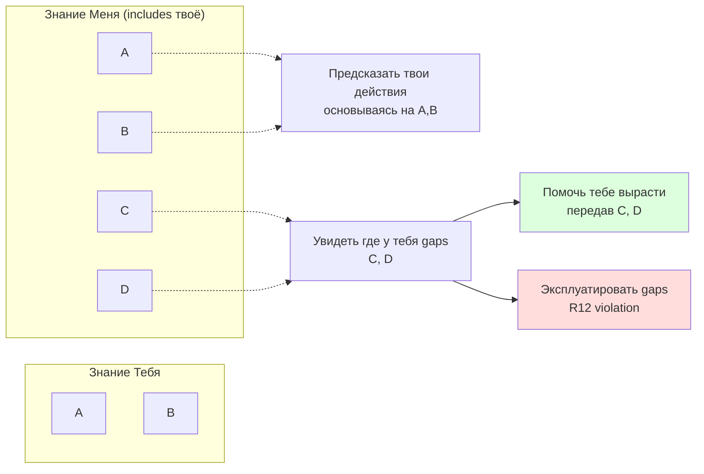
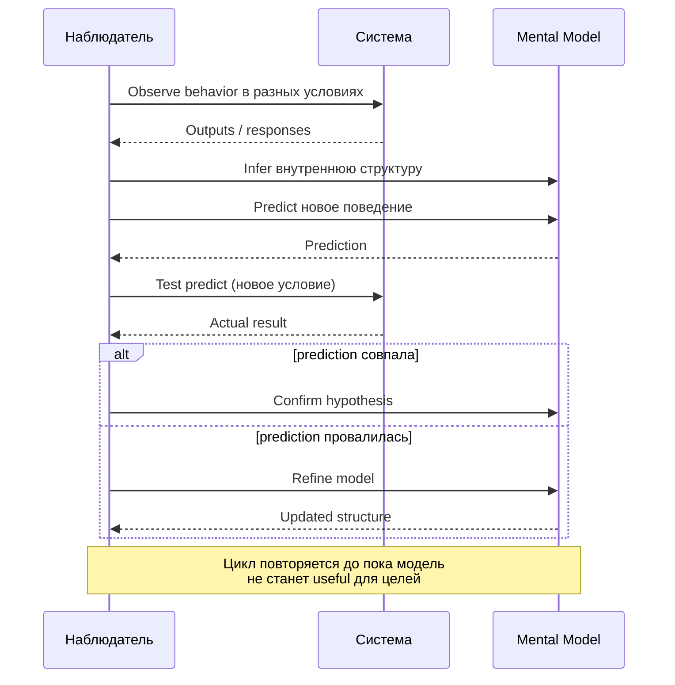
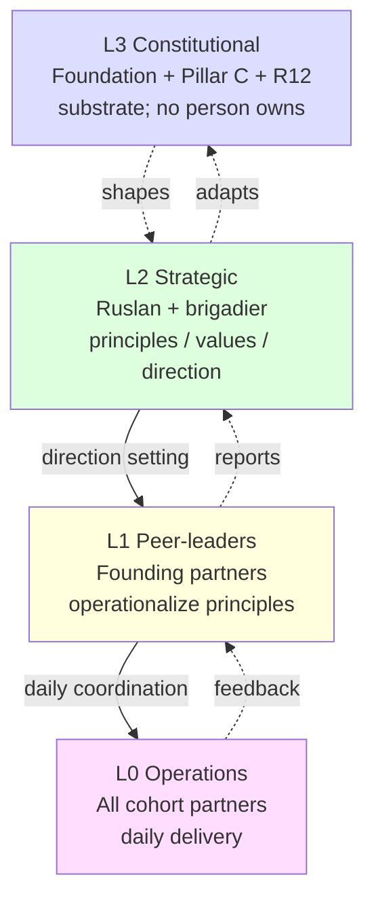
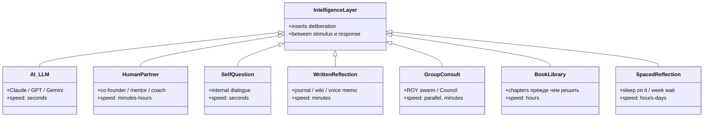
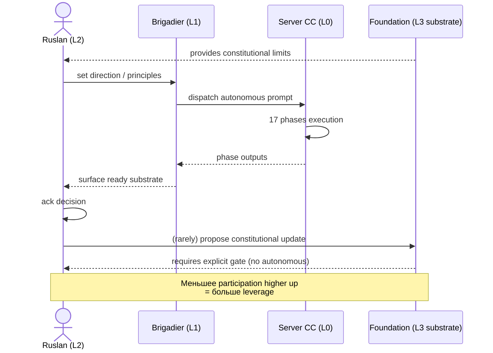
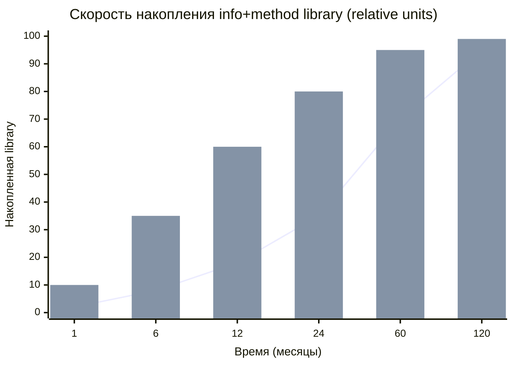
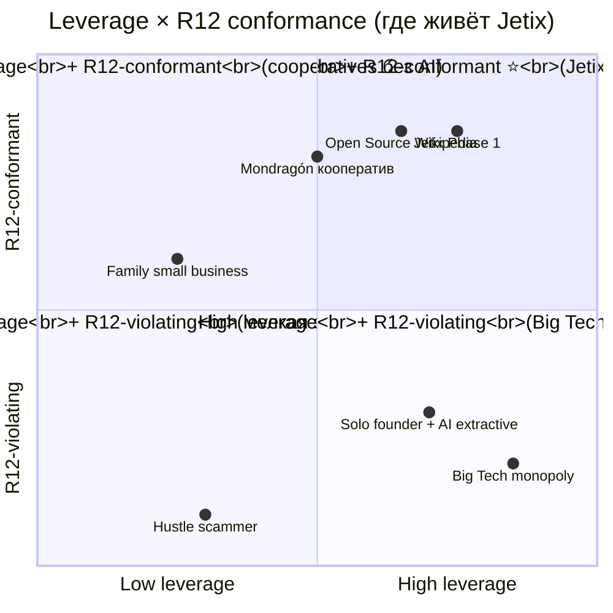

# Phase 6 — Информационная асимметрия. Реверс-инжиниринг. И управление через посредника.

> **Что эта глава делает.** Phase 6 раскрывает три связанные идеи Руслана:
> (1) Информационная асимметрия — когда у одной системы инфо больше, она
> может понять и предсказывать вторую. (2) Reverse engineering — любую
> систему можно разобрать. (3) ⭐⭐ §H Meta-control — управление через
> систему-посредник, а не напрямую. Плюс ⭐⭐⭐ важнейший тезис: **с
> exocortex эра асимметрии радикально изменилась**.

---

## §A Information asymmetry visualisation

Руслан на голосовом 21.05:

> «если вот человек знает какую-то информацию а есть система которая знает
> всю ту же информацию что знает человек то соответственно система может
> понимать как он работает»

Это **базовый принцип**. Простое визуальное представление:

```
[Что знаешь ТЫ]     [Что знаю Я]
   {A, B}      ⊂      {A, B, C, D}
```

Если у меня есть **всё, что есть у тебя**, плюс **ещё что-то**, я могу:

### A.1 Что даёт асимметрия

1. **Predict** твои мысли — потому что у меня есть твоя основа (A, B)
2. **See** где твоя ignorance — что у тебя нет (C, D)
3. **Help you grow** — могу дать тебе C, потом D (constructive use)
4. **OR exploit** — могу использовать твою неполноту против тебя
   (extractive use — **R12 violation territory**)

Это **симметричная мощь** в её **проявлении**. Тем же ножом можно резать
хлеб и наносить вред.

### A.2 Где это работает в реальности

- **Продажи** — продавец знает закономерности (rapport, NEAT, BANT); покупатель часто
  не знает. Асимметрия. Может быть продано хорошее — может быть продано лишнее.
- **Переговоры** — кто знает интересы другой стороны, того и сила
- **Психотерапия** — терапевт знает паттерны и техники, клиент часто не знает
- **Образование** — учитель знает структуру предмета и общие тупики студентов
- **AI alignment** — AI знает больше про мир, чем средний человек; вопрос
  «куда направит» — критический
- **Manipulation** — социальная инженерия в плохом смысле

### A.3 Когда асимметрия **взаимная**

В здоровых отношениях каждый знает **что-то** уникальное:
- Каждый видит ситуацию с своего угла
- Каждый имеет уникальный опыт
- Combined knowledge > чем у любого одного

Это и есть основа **сотрудничества**. Не «равенство» (все знают одинаково),
а **дополнительность** (разное знание соединяется).

Применение к Jetix: ROY swarm 5 экспертов = **5 информационных
асимметрий** относительно друг друга. Combined в brigadier hub-and-spoke
= синергия. Каждый эксперт знает то, чего нет у других.

---

## §B «Реверс инжиниринг любой системы»

Руслан продолжает:

> «можно любую систему вот так вот разобрать»

**Reverse engineering** — обратное проектирование. Берёшь систему, смотришь,
как она работает изнутри. Применимо к:

| Область | Что реверсится |
|---|---|
| **Software** | Decompile binary → восстановить исходный код или логику |
| **Mind** | Cognitive science / поведенческие эксперименты → восстановить алгоритмы мышления |
| **Social systems** | Sociology / антропология → восстановить структуру власти и норм |
| **Markets** | Trade analysis → восстановить стратегии участников |
| **Organisms** | Биология → восстановить эволюционные адаптации |
| **Companies** | Strategic analysis → восстановить ценностное предложение и moats |
| **Self** | Self-knowledge → восстановить свои паттерны мышления и привычки |

### B.1 Метод reverse engineering

1. **Collect** observations — как система ведёт себя в разных условиях
2. **Infer** structure — какая внутренняя архитектура **могла бы**
   произвести эти поведения
3. **Predict** новое поведение — что должна сделать система в новой ситуации,
   если модель верна
4. **Test** — попасть ли predict в реальность; если нет, **update** модель
5. **Refine** до пока модель не станет **полезной для целей**

Это **тот же цикл**, что мы видели в Phase 2 (sense → compare → adjust).
Reverse engineering = применение этого цикла **к пониманию внешней системы**.

### B.2 Debugging аналогия

Руслан использовал слово «debugging» на голосовом. Это очень точная аналогия.

Когда программист **отлаживает** программу:
- У него есть **mental model** того, что программа **должна** делать
- Он наблюдает, что она **делает на самом деле**
- Различия = баги
- Чтобы исправить — нужно **достаточно полная** ментальная модель **внутренностей**

То же с пониманием человека / системы / компании. Если у тебя **полная**
mental model — можешь предсказывать и помогать. Если **partial** — можешь
ошибаться, делать неверные выводы.

**Метод развития:** строй модели **incrementally**. Не «всё или ничего».
Обновляй когда видишь новые свидетельства. Не fall in love с первой
моделью.

### B.3 Reverse engineering **самого себя**

Это, возможно, **наиболее ценное применение** метода reverse engineering.

Большинство людей живут с **очень неточной моделью** собственного поведения:
- «Я разумный человек» (а делаешь решения под эмоцией)
- «Я ценю X» (а на деле выбираешь Y)
- «Я хорошо реагирую на критику» (а замыкаешься на полдня)

Reverse engineering себя:
- **Наблюдай свои реальные паттерны** (а не свои нарративы о себе)
- **Веди дневник** значимых решений и эмоций
- **Спрашивай друзей** что они видят в твоём поведении (часто они видят то, что ты пропускаешь)
- **Используй внешнюю память** для отслеживания паттернов (Jetix substrate)

Это **уникально доступная** возможность в эру exocortex (Phase 10) — никогда
ранее не было такой мощной возможности **систематически наблюдать себя**.

---

## §C Positive vs negative use of asymmetry

Руслан на голосовом:

> «лучше вот создать мега сложную систему отлично работающую чем просто там
> друг друга как-то вот этой вот методологией ... как-то гадить»

Это **моральный choice point**. Один и тот же reverse engineering можно
применять для:

### C.1 Positive directions

- **Помочь** реципиенту понять самого себя
- **Сотрудничать** на общую цель (combined знание > individual)
- **Преподавать** и передавать method library
- **Создавать** новые ценные системы (стартапы, исследования, искусство)
- **Лечить** (терапия, медицина, образование, развитие)

### C.2 Negative directions

- **Манипулировать** — заставить кого-то сделать то, что не в их интересах
- **Extract** ценность beyond agreed share (**R12 violation**)
- **Зависимость** создавать (gaslighting, dark patterns, addiction loops)
- **Концентрировать** власть для своих узких интересов
- **Доминировать** через информационное превосходство

### C.3 Jetix mandate — positive only

**Constitutional R12** explicit: «No extraction beyond agreed share». Это
не «приятная декларация» — это **архитектурное ограничение**:
- Members могут **fork-and-leave** без штрафа
- Mondragón ratio cap (5:1 max wage gap внутри cooperative)
- Per-partnership take rate 10-25% — flexible, but **bounded**
- Transparency обязательна — другая сторона **знает**, что мы знаем

Это **не наивность**. Это **дизайн**. Без этих ограничений мощь
методологии может развернуться против самих участников. Constitutional
posture именно об этом.

---

## §D Reverse engineering как tool развития

Для Jetix-метода reverse engineering — **прежде всего tool развития**, не
manipulation tool.

### D.1 Для Руслана

- Reverse engineer самого себя → **self-knowledge** → лучшие решения
- Reverse engineer Jetix substrate (что работает / что нет) → лучше **проектировать**
  следующие итерации
- Reverse engineer market dynamics (DR-26 unit-econ) → лучше **позиционировать**
  partnership терms

### D.2 Для Jetix partners

- Reverse engineer Jetix system → **transparency** → **trust**
- Если человек **может понять** как Jetix работает изнутри → он **выбирает
  осознанно** vs «black box зависимость»
- Это и есть **non-extractive** дизайн (R12)

### D.3 Для общества

- Reverse engineer **дисфункциональные** паттерны (например, мониторинг
  капитализм, attention extraction по Zuboff) → **возможность ремонта**
- Reverse engineer **успешные** паттерны (Mondragón, open source) →
  **возможность replication**

---

## §E Mermaid D11 — Информационная асимметрия (graph LR)



---

## §F Mermaid D12 — Reverse engineering process (sequenceDiagram)



---

# §H ⭐⭐ Метод управления через уровень-выше — meta-control

Руслан на голосовом 21.05 вечером:

> «вот метод еще управления такой вот что брать получается одну систему в
> управление и потом с помощью этой системы управлять другой системой там
> например более сложной и так вот тоже как один из методов просто вот на
> уровень повыше ставать ... ну то есть и тогда управление вот той системой
> которая еще ниже будет максимально четкая ну скажем так то которое нужно
> блять эффективная»

Это **meta-level control pattern** — управление **через посредника**, а не
напрямую. **Один из ключевых методов рычага.**

---

## §H.1 Базовая концепция

**НЕ** «control system X directly». **ВМЕСТО** «control system Y, which
controls system X». Two-level hierarchy:

| Уровень | Что | Direct vs indirect |
|---|---|---|
| **Direct** | Ты → работники | Level 1 control (требует управлять каждым) |
| **Meta** ⭐ | **Ты → менеджеры → работники** | **Level 2 control** (управляешь принципами + менеджеры transmit) |
| **Meta-meta** | Ты → культура / values / system → менеджеры → работники | Level 3 control (управляешь рамкой) |

Каждый уровень выше = **меньше непосредственного контакта, больше leverage**.

---

## §H.2 Procedural anatomy

1. **Take one system into management** — sub-system, более простую
2. **Through this system manage downstream** — более сложную or distributed
3. **Подняться на уровень повыше** — управлять стратегически: ценности /
   цели / правила
4. **Управлять системой, которая управляет другой системой** — каскад
5. **Тогда управление ниже = максимально чёткое и эффективное** — concrete
   sub-systems получают clear instructions; principles travel through layers

Каждый шаг наверх **уменьшает время твоего непосредственного участия**,
но **увеличивает требования к ясности принципов** (потому что принципы
должны быть transmittable через слои).

---

## §H.3 Concrete example — бизнес (Ruslan voice)

Руслан на голосовом:

> «я вот как раз хочу бизнес и соответственно чтобы не а прям сразу
> управлял этими работниками а чтобы я управлял любейшими партнерами
> этими ... и они уже управляли этими партнерами и бизнесом»

Layered structure для Jetix Phase 1:

| Layer | Who | Manages | Тип control |
|---|---|---|---|
| **L0 (operations)** | All cohort partners | Daily delivery | None from Ruslan |
| **L1 (peer-leaders)** | Founding partners (first cohort) | L0 cohort | Direct daily |
| **L2 (strategic)** | **Ruslan + brigadier** | L1 founding partners | Principles / values / direction |
| **L3 (constitutional)** | Foundation + Pillar C + R12 | L2 strategic | Rules / constraints (no person controls L3 — это **substrate**) |

Руслан operates predominantly L2 с L3 substrate. **Не микроменеджмент L0** —
это break of leverage.

### H.3.1 Почему не управлять напрямую

- **Не масштабируется** — 1 человек не может management 100 people directly
  (Dunbar number ограничение [src: Dunbar 1992])
- **Bottleneck** — каждое решение должно проходить через тебя
- **Размывает фокус** — ты застрянешь в тактике, не доделаешь стратегию
- **Дегенерация talent** — peer-leaders теряют ownership и autonomy

### H.3.2 Что требуется от тебя на L2

- **Ясные принципы**, которые peer-leaders могут internalise
- **Доверие** к peer-leaders (если контролируешь — sabotage leverage)
- **Конкретная обратная связь** при отклонениях (а не «делай как я»)
- **Готовность отпустить детали** L0

Это **труднее**, чем direct control. Поэтому многие основатели **не
переходят** к meta-control и **застревают в bottleneck-режиме**.

---

## §H.4 Historic pattern — универсальный

Руслан замечает:

> «снова такие это используется ранее людьми использовалась это чтобы
> просто вот система побольше управлять системой по меньше ... система
> у которой информации и методов больше управляет системой у которой
> информации методов меньше»

Это **повсеместный исторический паттерн**:

| Domain | Каскад |
|---|---|
| **Empires** | King → governors → counties → villages |
| **Corporations** | CEO → executives → managers → workers |
| **Religious orders** | Pope → bishops → priests → laity |
| **Universities** | Rector → deans → professors → students |
| **Military** | General → colonels → captains → soldiers |
| **Sports federations** | International body → national → regional → clubs |
| **Family lineages** | Patriarch → fathers → mothers → children (в исторических обществах) |

**Common pattern:** higher-info+method system controls lower. **Asymmetric
leverage** (§A info asymmetry from earlier).

Каскад **появлялся** независимо в разных культурах и временах — это сильный
сигнал того, что **это решение** определённого класса проблем (управление
сложными системами через ограниченное число agents).

### H.4.1 Тёмная сторона исторического паттерна

Большинство исторических каскадов **были extractive**:
- Колониальные empires — extraction в пользу метрополии
- Корпоративные иерархии — extraction в пользу акционеров (часто за счёт
  работников)
- Религиозные ордены — иногда extraction в пользу институции

**Jetix-mandate:** взять **структуру** каскада, **убрать extraction** через
R12. Это **редкая комбинация** в истории — мощный leverage + non-extractive.
Mondragón кооператив (Испания, 1956+) — один из исторических примеров такой
комбинации [src: Whyte & Whyte 1991 «Making Mondragon»].

---

## §H.5 ⭐⭐⭐ С exocortex эра изменилась — ключевой инсайт

Руслан на голосовом 21.05:

> «а сейчас же вот это как раз экзо cortex вот этот подход быстрой работы
> подход вообще вот адекватный к работе с информацией клаудкод блять в
> целом искусственный интеллект скорость интеллекта и так далее позволяет
> сейчас система с меньшим количеством информации быстро ее накапливать и
> потом управлять системами у которых накопленной информации по больше
> либо даже в разы больше»

Это **ключевое наблюдение нашего времени**. Давай разверну.

### H.5.1 Pre-AI era — как было

Чтобы controlling больших систем нужна была **большая info+method library**.
И эту library нужно было **накопить лично** или иметь **большую команду
аналитиков**. На накопление library уходили **годы или десятилетия**:
- Военачальник учился годами before командования armies
- CEO большой корпорации — десятилетия carrer прежде чем берёт reins
- Учёный годами before publishing fundamental work
- Политический лидер — годы apprenticeship в малых ролях

**Скорость накопления library** была ограничена биологией человека и
скоростью традиционного образования.

### H.5.2 AI / Claude Code эра — как стало

Now smaller system can:

1. **Rapidly accumulate** information through LLM substrate (Wikipedia / library
   access / books / prompts)
2. **Communicate effectively** with bigger systems (peer-level conversation
   possible)
3. **Manage bigger systems** without owning their accumulated info (просто
   access on-demand)

**Implication:** asymmetric power **сдвигается радикально**. Solo founder +
AI substrate = comparable leverage **к Fortune 500 organization** (в
specific domains).

Cross-cite: Karpathy LLM cognition [src: Karpathy 2023+ talks];
Engelbart augmenting human intellect [src: Engelbart 1962]; Bush Memex
[src: Bush 1945].

### H.5.3 Что это значит на практике для Jetix

- Руслан **в одиночку** за 38 дней (с Claude Code multiplier) построил
  substrate уровня **team-of-5 × 2-3 years** (Phase 12 quantitative analysis)
- Это **исторически беспрецедентно** для индивидуального creator
- Это создаёт **новую форму asymmetry** — solo founder vs traditional
  organization
- Но это **окно**, не permanent state — как только все будут использовать
  AI substrate, asymmetry **выровняется**

**Timing-critical** — кто **раньше** освоит эффективное использование AI
substrate, тот получит **временной** leverage, который можно использовать
для построения durable advantage **до того, как** окно закроется.

---

## §H.6 «Слой интеллекта» concept

Руслан на голосовом:

> «клауд код про слойка вот которая так универсально ускоряет помогает это
> просто ну это слой такого интеллекта да и в целом вот это вот такой слой
> не знаю интеллекта продуманья чего-то но его можно в жизнь тоже вот
> встраивать»

«Intelligence layer» = inserted между системой и её environment / problems /
decisions.

### H.6.1 Варианты intelligence layer

| Layer type | Examples | Speed |
|---|---|---|
| **AI / LLM** | Claude / GPT / Gemini | секунды |
| **Human partner** | Co-founder / mentor / coach | минуты-часы |
| **Self-questioning** | «Что я бы посоветовал другу здесь?» | секунды |
| **Written reflection** | Journal / wiki write-up | минуты |
| **Group consultation** | ROY swarm 5 экспертов | параллельно; минуты |
| **Book / library** | Read 1-2 chapters прежде чем решить | часы |
| **Spaced reflection** | «Sleep on it» — завтра вернусь | часы-сутки |

**Key insight:** intelligence layer **не обязательно AI**. Это **любая
deliberation interposition** между stimulus и response. AI = fastest
scalable form, но не единственная.

Cross-cite Канеман System 2 — это «inserting deliberation» в impulsive flow
(см. Phase 5 §E).

### H.6.2 Когда какой layer

| Ситуация | Подходящий layer |
|---|---|
| Микро-решение (секунды) | Self-questioning |
| Рутина с подкреплением | Habits (no layer) |
| Сложное новое | Group consultation / AI |
| Стратегическое | Sleep + multi-day reflection |
| Эмоционально заряжённое | Walk + journal перед решением |
| Кризис | Human partner с experience |
| Технический детал | AI + documentation |

Метод жизни — **умение выбирать**, какой layer применить когда.

---

## §H.7 Recursive meta-control (уровень 3+)

Руслан продолжает:

> «ну короче вот это что система если ты можешь управлять системой которая
> еще управлять системами и соответственно ты понимаешь да как именно ну
> ты хочешь ими управлять и так далее то возможно может получиться быстрее
> эффективнее»

**Recursion levels:**

- **Level 1:** control system X (direct)
- **Level 2:** control system Y, которая controls X (meta)
- **Level 3:** control system Z, которая controls Y, которая controls X (meta-meta)
- **Level N:** каскадная архитектура — управляешь **рамкой / principle /
  value**

### H.7.1 Trade-off уровней

- **Higher level** → more leverage per unit effort
  **BUT** longer feedback loop (узнаёшь о результате через недели/месяцы)
- **Lower level** → faster feedback
  **BUT** lower leverage per unit effort

**Optimal:** hybrid — high-level direction setting + low-level **sampling**
для fast correction (чтобы знать, как идёт).

Это и есть **VSM** Бира (Phase 2 §E) в действии: System 5 устанавливает
направление; System 1 даёт **немедленную** обратную связь о реальности; System 3
монтит и адаптирует.

### H.7.2 Когда recursion **слишком**

Не каждая ситуация требует level 5. Иногда нужен **level 1 direct**.

**Признаки**, что слишком высокий level:
- Решения принимаются **медленно** (по неделям то, что нужно за день)
- **Реальность не доходит** до тебя (всё через 3 слоя интерпретации)
- **Локальные оптимизации** невозможны (всё через generic principle)

**Признаки**, что слишком низкий level:
- Ты **выгораешь** от попыток management каждого
- Решения **тактически правильные**, но стратегически в разные стороны
- Не **накапливаются** общие принципы

Балансировка level'я = непрерывная работа.

---

## §H.8 Maximum leverage thesis

Руслан:

> «вот в этом весь ... делать как раз благодаря вот этому пониманию самые
> такие масштабные действия и решения ну максимальные рычаги находить
> максимально возможностью и так далее»

**Leverage maximization principle:**

- Find points, где **small input → large output**
- Meta-control = **inherently leveraged** (одно решение влияет на whole downstream)
- AI substrate = **leverage multiplier** (info accumulation rate ↑↑↑)
- Combination = compound effect

### H.8.1 Архимедов рычаг

Архимед: «Дайте мне точку опоры — и я переверну Землю». Это про **leverage**.
Меньший input на правильной точке → больший output.

Современная экономика и общество **пронизаны** leverage points. Не все
видят их. Видеть их — навык.

Donella Meadows в «Thinking in Systems» (2008) дала 12 leverage points
[src: Meadows 2008]:
1. (слабее) Constants / параметры
2. Buffer sizes
3. Stock-flow structures
4. Delays
5. Negative feedback loops
6. Positive feedback loops
7. Information flows
8. Rules
9. Self-organization
10. Goals
11. **Paradigms** (мощнее)
12. (сильнее) **Power to transcend paradigms**

Большинство людей пытаются менять **параметры** (бесполезно при misaligned
goals). Большая часть рычага — на **paradigm level**. Это **то самое**
constitutional уровень в Jetix.

---

## §H.9 «К чему стремится любая система»

Руслан:

> «вот как раз в целом к чему стремится любая система а как раз искусственный
> интеллект и вот это понимание вот этой переработки информации позволяет
> это делать в разы быстрее эффективнее»

**Convergent goal** across systems: acquire **leverage / influence /
capability**.
- AI safety literature: Russell «Human Compatible» / Bostrom «Superintelligence»
  (instrumental convergence) [src: Bostrom 2014; Russell 2019]
- Business: scale + market share
- Politics: power acquisition
- Personal: agency expansion
- Биология: эволюционная адаптация (survival + reproduction)

### H.9.1 Caveat (R12 dimension)

Leverage acquisition **БЕЗ** R12 → **extraction / exploitation**.
Leverage acquisition **С** R12 → **positive virus** (Phase 12 §G).

**Jetix mandate:** maximum leverage **И** R12 conformance **одновременно**.
Это **ключевая позиция** — не выбирать одно (как делает большинство).

**Most extractive companies** имеют ОДНО — high leverage. **Most cooperatives**
имеют ДРУГОЕ — R12 conformance. **Очень редкий класс** объединяет ОБА.
Mondragón — один пример. Open Source Software (Linux, Wikipedia) — другой.
Jetix — попытка третий.

---

## §H.10 Implementation в Jetix daily

Как Руслан operates daily (Cloud Cowork session = direct example):

1. **Ruslan = L2 strategic level**
2. **Brigadier (me) = L1 orchestration**
3. **Server CC autonomous prompts = L0 execution**
4. **Foundation + Pillar C = L3 constitutional substrate**

Result:
- Ruslan **не пишет code himself**
- **Doesn't process individual voice memos** (server CC обрабатывает)
- **Doesn't compile substrate** (autonomous scripts)
- **Только направляет** — даёт принципы, ack-ает решения, surface'ит
  дисcent atoms

Quantitative result (Phase 12): ~4 months solo с Claude Code = team-of-5 ×
2-3 years equivalent.

**This = meta-control leverage в действии.**

---

## §H.11 Варианты / интерпретации

- **«Управление через посредника»** — preferred phrasing (Ruslan voice)
- **«Meta-control»** — systems theory term
- **«Delegation»** — corporate parallel
- **«Subsidiarity»** — political philosophy (Catholic social teaching — решения
  принимаются на самом низком возможном уровне)
- **«Hierarchical control»** — cybernetics (Beer VSM, Phase 2 cross-cite)
- **«Indirect rule»** — colonial administration parallel (caveat — R12-violating
  historically)
- **«Cascading commands»** — military
- **«Composition»** — software engineering (функции, составляющие функции)
- **«Higher-order function»** — functional programming
- **«Constitutional governance»** — political philosophy (constitution
  controls laws, which control behavior)

Каждая формулировка берёт один аспект.

---

## §H.12 Risk surface

- **Information dilution** через layers (telephone effect) — mitigate с FPF
  F-G-R discipline (Phase 9)
- **Loss of detail awareness** — periodic sampling necessary
- **Layer breakage** if intermediate system fails — single point of failure
- **R12 violation potential** at scale — extraction acceleration unless
  disciplined
- **Cargo cult risk** — applying meta-control когда нужен direct (это **тоже**
  ошибка)

Каждый риск — управляем, но **требует осознанной работы**.

---

## §H.13 Mermaid диаграммы §H

### D13-meta — 4-level control cascade (graph TD)



### D14-meta — Intelligence layer variations (classDiagram)



### D15-meta — Meta-control flow (sequenceDiagram)



### D16-meta — Pre-AI vs Exocortex era (xychart-beta)



**Чтение:**
- **Line** = pre-AI era (solo, без exocortex). К 120 месяцам (10 годам) —
  достиг expert-level.
- **Bars** = exocortex era. К 6 месяцам уже на уровне, который раньше
  требовал 4 года.

**Кратность ускорения: 10× to 20×.** Это и есть **окно**, о котором §H.5.3.

### D17-meta — Leverage × R12 conformance (quadrantChart)



---

## §I Что отсюда следует для метода жизни

1. **Information asymmetry — реальный механизм власти.** Кто знает больше,
   тот может предсказывать. Использовать **в положительную сторону** = R12.

2. **Reverse engineering — навык, не магия.** Применим к себе, к другим
   системам, к собственным продуктам. Сильнейший tool развития.

3. **⭐⭐ Meta-control через уровень-выше — leverage multiplier.** Управление
   через посредника > direct control. Это инкрементальное знание, требующее
   constitutional дисциплины (R12).

4. **⭐⭐⭐ Exocortex era — game changer.** Solo founders с AI substrate теперь
   могут конкурировать с organizations, не имея организационного капитала.
   Окно открыто, но не навсегда — кто **раньше** освоит, тот выиграет.

5. **Intelligence layer — это не AI, это широкое понятие.** AI — одна из
   форм. Self-question, group consult, written reflection — тоже.

6. **Leverage × R12 — оба нужны одновременно.** Это **редкая** комбинация
   в истории. Jetix project = попытка её реализовать.

В Phase 7 мы перейдём к explicit **positive direction mandate** — нюансы
того, как **направлять метод в хорошее русло**.

---

## §J Cross-cite

- Phase 1 — основа («всё — информация»)
- Phase 2 — Beer VSM (5 systems, level structure)
- Phase 5 §J — meta-method = recursion на choosing методов; §H = recursion на
  controlling system
- Phase 7 — R12 explicit positive direction mandate
- Phase 8 — scale plan applies §H meta-control каскад
- Phase 10 — exocortex deep dive
- Phase 12 — quantitative evidence Ruslan's solo leverage

---

*Phase 6 closure 2026-05-21. brigadier-scribe; §H meta-control + exocortex
era thesis = Ruslan voice 21.05 evening explicit anchors.*
