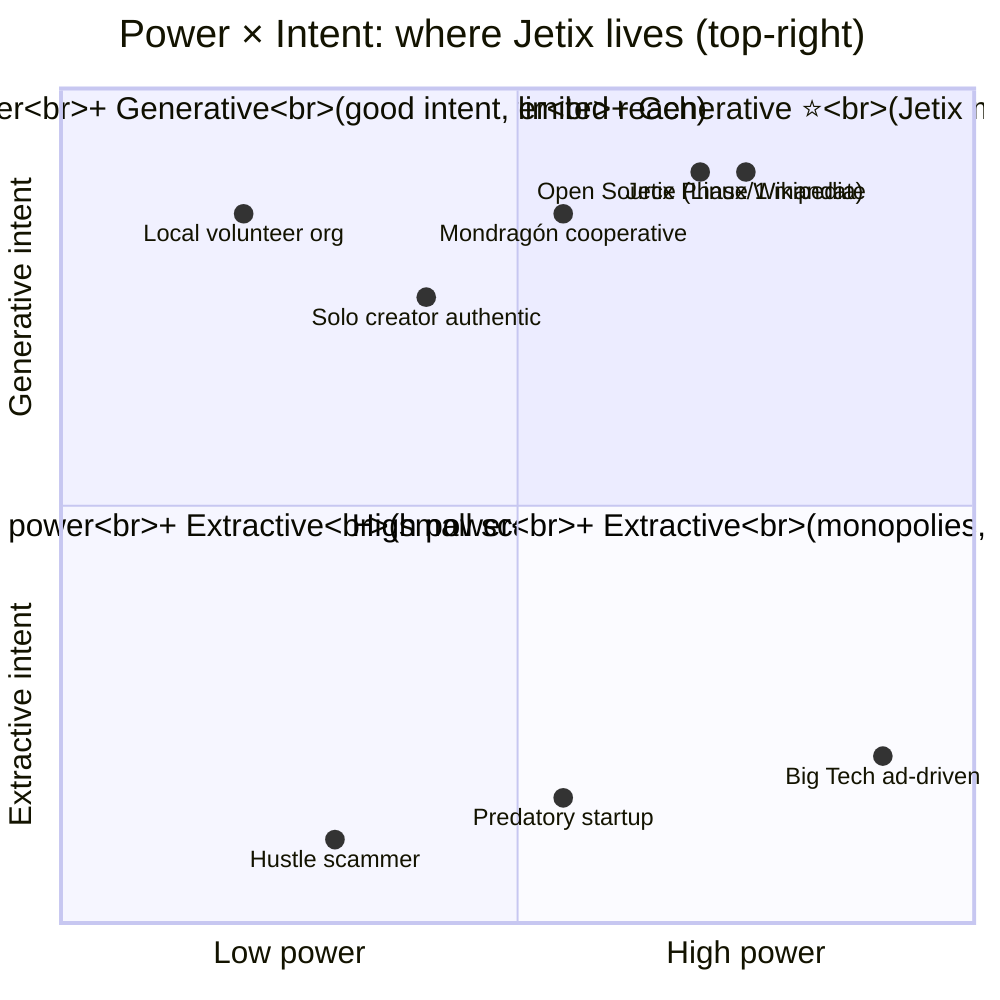

# Phase 7 — Направить метод в хорошее русло. R12 mandate.

> **Что эта глава делает.** Phase 6 показала: метод мощен и может быть применён
> как в плюс, так и в минус. Phase 7 фиксирует **обязательство направлять в плюс**.
> Это не «мораль» в смысле deontology, а **архитектурное ограничение**, без которого
> вся конструкция метода жизни ломается через scale.

---

## §A «Метод направить в хорошее русло»

Руслан на голосовом 21.05 explicit:

> «надо вот это сейчас метод направить вы хорошее русло на развитие общества»

Это **сильное** утверждение. Не «можно использовать в плюс». А «**надо
направить**». Это **направленность вектора всей конструкции**.

### A.1 Почему это критическое

В Phase 6 мы показали: метод даёт **information asymmetry leverage** и
**meta-control leverage**. Без этической направленности эти leverage'и =
**инструменты extraction**:
- Asymmetric power → manipulation (вместо help)
- Meta-control → exploitation cascade (вместо empowerment)
- Exocortex era → concentration of power в немногих руках (вместо distribution)
- Scale 1000+ → mass exploitation (вместо mass empowerment)

История XX-XXI веков показала: технологии **сами по себе** не «хорошие» или
«плохие». Они принимают **направление от** проектировщиков.
- Социальные сети могли стать **инструментом** общения; стали engagement-extraction
- AI может стать **усилителем** интеллекта; может стать tool для масс-манипуляции
- Cooperative структуры исторически были **либо** non-extractive (Mondragón),
  **либо** превратились в standard extractive (большинство переходов)

**Метод жизни без направленности = опасный.** С направленностью = ценный.

### A.2 Что значит «хорошее русло»

«Хорошее» — оперируемое определение. Мы используем:
- **Non-extractive** (R12) — не извлекаем ценность beyond agreed share
- **Empowering** — даёт recipient'у больше agency, не меньше
- **Voluntary** — opt-in на каждом уровне; fork-and-leave возможен
- **Transparent** — recipient может **понять**, как система работает
- **Generative** — создаёт новые ценные системы (vs только extracting from existing)
- **Inclusive** — открыто для тех, кто хочет участвовать с разными исходными
  ресурсами

Это не «единственно правильная мораль». Это **операционные критерии**, по
которым **можно проверить** каждое решение.

---

## §B R12 anti-extraction LOCK — reminder

Per Pillar C Tier 2 rule 12 (LOCKED 2026-05-12 commit `93b796d`; programmable
Ethereum substrate Option D Hybrid acked 2026-05-18):

> **No extraction beyond agreed share** — AI / substrate cannot extract
> value from members beyond agreed share; members can fork-and-leave without penalty.

Это **constitutional limit**, не «приятная фраза в README». Это **встроено в
архитектуру** через:

### B.1 R12 enforcement mechanisms

1. **Fork-and-leave protection** — every member может уйти, скопировать своё,
   continue elsewhere. Без штрафа.
2. **Mondragón ratio cap (5:1)** — internal wage gap внутри Jetix structure
   не превышает 5×. Founder получает в 5× от младшего — не в 100× как
   современные corporate.
3. **Per-partnership take rate 10-25%** — Foundation institutional share от
   каждого partnership; lower bound для cooperative partnerships, upper bound
   для extractive markets. Ack'нуто Ruslan'ом 21.05.
4. **Programmable Ethereum substrate (Option D Hybrid)** — Phase 2+ overlay
   binding R12 в smart-contract patterns; non-consensual distribution
   blocked at protocol level; ack'нуто 2026-05-18.
5. **Transparency obligation** — financial flows visible; take rate visible;
   ratio visible.

### B.2 Power → Responsibility

Метод даёт мощь. Мощь без ограничений = опасность для **самого носителя**
тоже. История: лидеры, освобождённые от ограничений, **разрушались** —
коррупция власти, изоляция, отрыв от реальности.

Дисциплина R12 — **в том числе самозащита** от corrupting effect мощи.
Это не «жертва ради других». Это **дизайн** для устойчивости.

---

## §C «На развитие общества» — социальная ориентация

Руслан:

> «на развитие общества»

Не «личное развитие» как самоцель. А **развитие общества через личные
вклады**. Это очень важный сдвиг.

### C.1 Two orientations

| Self-orientation | Society-orientation |
|---|---|
| «Я хочу стать богатым / known / power» | «Я хочу, чтобы у людей было лучше через мой вклад» |
| Метрики: личный wealth, status, influence | Метрики: чьи жизни улучшились, какой substrate существует, что осталось после |
| Trade-off с others = OK (zero-sum mindset) | Trade-off с others = красная линия (positive-sum mindset) |

Метод жизни Jetix-style склоняется к **society-orientation**.

### C.2 Это не наивность

Society-orientation **не** означает «забыть о себе». Self-care — необходимое
условие для устойчивого вклада в общество. Burnout = нулевой вклад.
Поэтому self-care **функционально оправдан**.

Это означает: **в конфликте между личной выгодой и общественной пользой —
выбирать общественную, кроме экстренных ситуаций**.

И это означает: **проектировать systems**, которые **выравнивают** personal
и social interests. R12 = пример. Когда R12 enforced, твой success **связан**
с success твоих partners — нет противоречия.

---

## §D Concrete positive examples

Чтобы это не было abstract — конкретные применения Jetix-method в положительную сторону:

### D.1 Education layer — 3-tier funnel

- **Tier 1 (Workshop):** дать новичкам базовые методы. Hands-on, не лекции.
  Подключение к method library.
- **Tier 2 (Practice):** научить выбирать между методами. Сопровождение
  через первые реальные применения.
- **Tier 3 (Mastery):** научить дизайнить свою meta-strategy (Phase 5 §J).
  Sufficient autonomy.

**Положительный эффект:** общество получает **больше людей** с метод-мастерством.
Не «эксклюзивный клуб», а **multiplying** способность. Каждый, кто прошёл,
**может стать** учителем для следующих.

R12 conformance: opt-in на каждом уровне; стоимость покрывается ratio cap;
fork-and-leave доступен (методы — open knowledge, не «trade secret»).

### D.2 Hypothesis arch operational

Внедрение **falsifiability discipline** в широкое практическое использование.
- Принимая решение — пишешь, при каких условиях оно опровергается
- Это **тренирует калибровку** confidence
- Сообщество **обменивается** результатами hypotheses
- **Меньше ошибок** в decision-making масштаба общества

Это **общественная ценность** — снижение systemic bias через массовое
applied falsifiability.

### D.3 ROY swarm pattern — democratising multi-expert advice

Раньше: multi-expert advice = богатым (consultants, advisory boards,
expensive coaches).

Теперь: каждый с Claude / similar substrate может получить **5 expert
perspectives** на свою ситуацию. ROY swarm pattern (engineering / investor
/ mgmt / philosophy / systems) = **template**, который **любой может
применить** к своему контексту.

Это **демократизация capability**, ранее эксклюзивной.

### D.4 KA-03 Tier-1 outreach — partnership conversations

R12 paired-frame: каждое предложение **связано с явным запросом**. Не
«пришли услугу продать»; а «вот ценность, которую я могу принести; вот
ценность, которую я ищу взамен; видим ли мы overlap?».

Это **changes the conversation**. Не extraction, а **mutual value
exploration**. Если overlap есть — partnership. Если нет — explicit «не
сейчас» без манипуляции.

### D.5 KEYSTONE Distribution Plan — 150 → 15 → 1M cascade

Audio_686 visualisation: Phase 1 (~150 founding partners) → Phase 2
(~15 institutional partnerships) → Phase 3+ (~1M end-users через cascade).

**Каждая ступень** структурирована R12-conformant. Founding partners
получают **больше**, чем дают (because они rare и critical для early). 15
institutional получают standard partnership. 1M users получают **free or
low-cost access** к method library.

Это **non-extractive scaling**. Что обычно требует Big Tech-style
monopoly, здесь делается через **distributed cooperative**.

---

## §E Риск: «gadить друг друга»

Руслан на голосовом:

> «лучше вот создать мега сложную систему отлично работающую чем просто там
> друг друга как-то вот этой вот методологией ... как-то гадить»

«Гадить» — короткое жёсткое слово для **using method для harm**. Метод
мощен — мощь привлекает злоупотребление. Это **не теоретический риск**.
Это **реальная опасность**.

### E.1 Конкретные риски, которые надо тщательно отслеживать

| Risk | Description | Mitigation в Jetix |
|---|---|---|
| **Cheat-code positioning** | «Вот секретный приём, который даст тебе преимущество над другими» | HR-1 / O-83 / KA-07 R12 review — flagged для review |
| **Aggressive tone** | Outreach, который давит, манипулирует | R-3 — softer paraphrase needed; communication best practices DR-33 |
| **Burnout extraction** | «Я каждому запихаю» / момент перегрузки | AP-6 dissent atom «я тигр»; small-cohort sufficiency; weekly review |
| **Selection bias** | Включаем только тех, кто легко конвертируется | Inclusive recruitment; explicit «не для всех» когда уместно |
| **Information overload** | Заваливаем кого-то контентом, в котором они не разберутся | 3-tier funnel — onboarding по уровням |
| **False urgency** | «Только сейчас!» дешёвая срочность | Не использовать в Jetix outreach |
| **Status manipulation** | «Только избранные» — fake exclusivity | Open about критериях |
| **Lock-in** | Создание зависимости, из которой трудно выйти | Fork-and-leave is feature |

### E.2 Discipline — постоянный аудит

«Гадить» не происходит **намеренно** обычно. Это **дрейф**:
- Маленькая acceleration → ещё чуть → ещё чуть → значительная extraction
- Каждый шаг кажется «нормальным»; общий результат — не нормален

Поэтому **discipline = постоянный аудит**:
- Еженедельные R12 review
- Раз в месяц — full constitutional review (KA-07 R12 pending)
- AP-6 — surface ALL dissent atoms; не вытеснять
- Outreach review (DR-33) — каждое сообщение проходит «could this feel
  manipulative?» check

---

## §F Mermaid D-quadrant — Positive vs negative direction (quadrantChart)

**Чтение:** Jetix project — explicit mandate жить **только в верхнем правом
квадранте**. Constitutional posture (R12 LOCKED) обеспечивает это. Без
constitutional дисциплины **дрейф** в правый-нижний квадрант — стандартная
история стартапов.

---

## §G Что отсюда следует для метода жизни

1. **Направленность вектора обязательна.** Метод без направления = опасный.
   Pillar C Tier 2 constitutional → не option, а requirement.

2. **R12 anti-extraction — не «приятная декларация», а архитектурное
   ограничение.** Через fork-and-leave, ratio cap, programmable substrate.

3. **«На развитие общества» — переход от self-orientation к society-orientation.**
   Не отказ от себя, а **alignment** of personal и social interests через
   design.

4. **Positive examples должны быть concrete.** 5 положительных применений
   (D.1-D.5) — реальные направления Jetix Phase 1.

5. **«Гадить» = реальная опасность.** Восемь категорий risk (E.1) — список
   для постоянного аудита. Дрейф происходит **накапливаемо**, не разово.

6. **Discipline = постоянный аудит**, не «раз в год отчётность».

В Phase 8 мы переходим к **scaling plan** — как эта структура работает
при росте от 1 до 1000+ людей.

---

## §H Cross-cite

- Phase 6 §H — meta-control leverage (откуда исходит мощь)
- Phase 8 — scale plan, как R12 удерживается при росте
- Phase 12 — positive virus distribution model
- Pillar C Tier 2 R12 LOCKED — constitutional source
- `swarm/awaiting-approval/r12-programmable-ethereum-2026-05-18.md` — Phase 2+ overlay

---

*Phase 7 closure 2026-05-21. brigadier-scribe; R12 mandate Pillar C LOCKED reference.*
