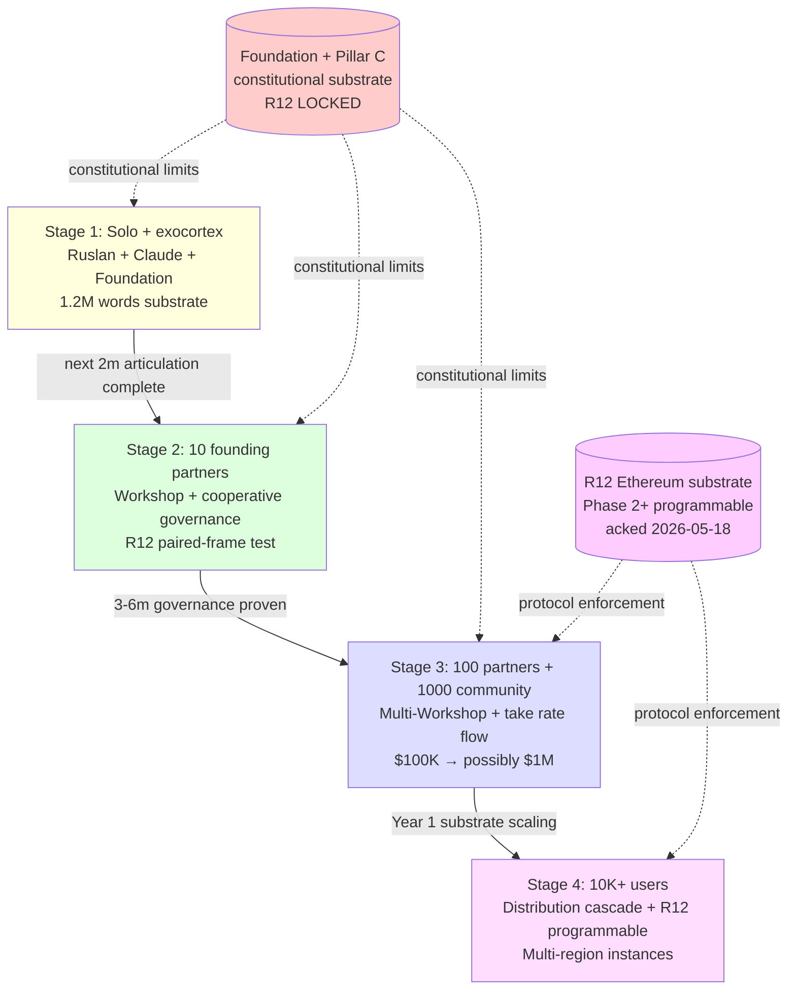
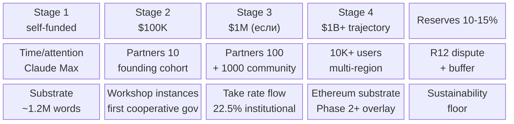

# Phase 8 — Масштабирование: 1 → 10 → 100 → 1000+

> **Что эта глава делает.** Метод работает на одном человеке (Руслан) с
> exocortex multiplier — это **доказано** (Phase 12 quantitative). Phase 8
> отвечает: **как** этот метод масштабируется до 10, 100, 1000+, не
> разваливаясь и не нарушая R12.

---

## §A Каскадная мотивация

Руслан на голосовом 21.05:

> «надо еще вот просто блять еще человек десять чтобы они еще подумали по
> проработали план уже по развитию далее потом это распространилась то на
> сотню тысячи людей»

### A.1 Почему один человек **недостаточен**

Даже с Claude Code multiplier (10-20× leverage) **один человек** имеет:
- **Когнитивные ограничения** — у одного мозга один набор biases, blind spots,
  ассоциативных паттернов
- **Биологические ограничения** — сон, еда, продолжительность жизни
- **Информационные ограничения** — один может усвоить ограниченное количество
  source materials в день, неделю, год
- **Социальные ограничения** — выходы / отношения / семья требуют времени
- **Energy ограничения** — burnout-prone при overcommit

10 людей с тем же substrate, разными perspectives = **10× variety** (Эшби,
Phase 2 §C) → **better decisions** + **больше throughput**.

### A.2 Почему не «нанять команду»

Стандартный подход — «нанять команду» — имеет проблемы:
- **Hire = commitment** обеих сторон; ошибка дорогая
- **Hierarchy → extraction tendency** (без R12 discipline)
- **Mission alignment** — наёмники работают за зарплату, не за миссию
- **Knowledge silos** — knowledge у одного сотрудника не общая

Jetix scale plan — **другая структура**:
- **Founding partners**, не сотрудники
- **Shared substrate**, не silos
- **R12 conformance** через cooperative structure
- **Fork-and-leave** возможен — нет lock-in

Это **дороже** ставит барьер вхождения (нужны люди, разделяющие миссию), но
**дешевле** удерживает (нет ongoing extraction, alignment встроен).

---

## §B 4-stage cascade

### Stage 1: **Solo + exocortex** (now → next 2 months)

**Состояние сейчас (21.05.2026):**
- Ruslan alone
- + Claude (Max subscription)
- + ROY swarm 5 experts (engineering / investor / mgmt / philosophy / systems)
- + Foundation v1.0 LOCKED (11 parts)
- + Pillar C constitutional (Tier 2 R1-R12 LOCKED)
- + Wiki v2 (62 concepts + 1 topic)
- + Hypothesis arch (43 files)
- + CRM 169 (151 people + 29 orgs, post KA-03 overnight)
- + Distribution Plan substrate
- + ~1.2M words substrate (per Phase 0 §E inventory)

**What this stage delivers:**
- Substrate **complete enough** для transition to Stage 2
- Methods **articulated enough** (this V2 doc!) для transfer
- Hypothesis cycles **operational** для systematic learning
- First Tier-1 contacts через KA-03 (14 ack queue)

**Capacity limit:** ~3-5 simultaneous major activities. Уже close to ceiling.

### Stage 2: **10 founding partners** (next 3-6 months)

**Target:** 10 founding partners по criteria:
- Подходящий profile (technical / mission-aligned / network-positioned)
- Готовы делать hands-on Workshop participation
- Принимают R12 paired-frame
- Имеют complementary expertise

**Activities этого stage:**
- **First-cohort Workshop** (D-R1-2 pending decision) — hands-on training
- **Cooperative governance test** — first decisions с partner participation
- **First per-partnership take rate negotiations** (10-25% range per DR-26)
- **Substrate refinement** based on partner feedback
- **R12 conformance audit** — does cooperative structure hold in practice

**Capacity при 10 partners:**
- 10× cognitive capacity (subject to coordination overhead)
- Different perspectives → better decisions (variety law)
- Bigger network — each partner brings own connections
- **First validation point**: works ли метод **transferable**, не только для Руслана

**Risk:** coordination overhead. Brooks's Law [src: Brooks 1975 «The Mythical
Man-Month»] — «adding manpower to a late project makes it later». В первые
1-2 months partners требуют **больше** support чем дают output.

### Stage 3: **100 partners + 1000 community** (Year 1)

**Target структура:**
- 100 active partners (cohort scaling из 10 founding)
- 1000 community members (lighter participation; access to substrate)

**Activities:**
- **Multi-Workshop instances** — параллельные cohorts
- **Community matching pool active** — community members подключаются к
  partner-led initiatives
- **Resource pool первый round** — $100K initial goal (summer 2026)
  → возможно $1M раунд (Year-end 2026 если warranted)
- **First product / service revenue** через partnerships
- **R12 distribution mechanism activated** — first take rate distributions
  to Foundation institutional share

**Capacity при 100 partners:**
- Significantly больше cognitive throughput
- Self-organizing sub-clusters (по доменам, географии, интересам)
- **Specialisation** возможна — раньше каждый делал многое; теперь могут
  углубляться

**Risk:** governance overhead. Cooperative governance scales хуже linear.
Mondragón использует hierarchical councils для этой проблемы. Jetix вероятно
адаптирует аналогичный паттерн.

### Stage 4: **10K+ users** (Year 2+)

**Target структура:**
- 1000 partners (active cohort members)
- 10,000+ community / users (apply Jetix-method к своей жизни/работе)
- Multiple Workshop branches / партнёрских instances
- Foundation institutional layer activated

**Activities:**
- **Distribution Plan cascade activated** — 150 founding → 15 institutional → 1M users
- **Multi-region / multi-language Workshops**
- **Foundation as substrate provider** для third-party Workshop instances
- **R12 programmable Ethereum substrate** Phase 2+ overlay (acked 2026-05-18)
- **Network State substrate pattern** возможный applicable (Phase 2+ deferred
  per `project_balaji_outreach_target.md` memory)

**Capacity при 10K+:**
- Substrate **самовоспроизводится** — community members обучают друг друга
- **Multiple sovereign instances** — fork allowed (R12 fork-and-leave)
- **Network effects** дают exponential capability вместо linear
- **Real societal impact** — accumulated method library в общественной
  библиотеке knowledge

---

## §C Resource distribution

Руслан на голосовом:

> «реально такой вот развитие реально влив сюда ресурсы»

Ресурсы — деньги, время людей, attention, internal substrate, social capital.

### C.1 Initial resource targets

| Stage | Time horizon | Resource goal |
|---|---|---|
| Stage 1 (now) | Continuing | Self-funded; Claude Max subscription; time |
| Stage 2 (3-6m) | Summer 2026 | **$100K initial goal** |
| Stage 3 (Year 1) | Y/E 2026 | **$1M возможный раунд** if warranted |
| Stage 4 (Y2+) | 2027+ | **$1B+ trajectory** (per audio_686 KEYSTONE long-term) |

These — **stretch targets**, not commitments. Per DR-26 unit-econ, путь к
$1B trajectory **возможен** через cooperative structure + scaling, не
требует Big Tech-style extraction.

### C.2 Allocation principle (per DR-26)

| Allocation | Share | Назначение |
|---|---|---|
| **Institutional** | ~22.5% (range 10-25% per partnership) | R-comp (researchers) + M-comp (maintainers) + O-comp (operators) — Foundation roles |
| **Founding partners** | depends на cohort agreements | Cooperative governance shares |
| **Reinvestment** | depends | Substrate development / Workshop instances / community matching pool |
| **Reserve** | ~10-15% | Buffer для R12 dispute resolution + unforeseen needs |

Это **rough allocation**, не commitment. Реальные numbers формируются по
ходу с founding partners (per R12 paired-frame).

### C.3 Mondragón ratio cap (5:1) — internal discipline

Inside Jetix structure: **maximum 5× wage gap** between highest и lowest
paid member. Это **жёсткое ограничение**, derived из Mondragón cooperative
practice (Spain, 1956+) [src: Whyte & Whyte 1991].

Why 5:1? Эмпирически:
- 1:1 (equal) — destroys incentive для harder roles; demotivates
- 100:1 (modern corporate) — destroys cohesion; creates two-tier society
  внутри organization
- 5:1 — balance: rewards harder roles без destroying cohesion

Это **не магия 5**. Просто **bounded** ratio, derived empirically.

---

## §D Why this might work

Несколько структурных аргументов:

### D.1 Substrate уже built (~3 months work)

Phase 1 заканчивается **substrate complete enough** для transfer. Это
**асимметрия**: новый partner получает 38 дней Ruslan'а × 10-20× exocortex
multiplier = **substantial body of work** за **дни** ознакомления.

Это **scaling enabler**, который ранее (pre-AI) был невозможен.

### D.2 Methods articulated (this doc!)

V1 (architecture) + V2 (human-language) — together покрывают **full surface**
метода. New partner может **читать и применять**, не реверс-инжинирить из
behavior.

### D.3 Network growing (KA-03 + 169 contacts)

CRM с 169 records (post KA-03) + 14 Tier-1 ack queue — это **substrate
of relationships**. Каждый contact — potential connection в Stage 2 / 3.

### D.4 Cooperative tradition validates structure

Mondragón (70+ years), Linux/Wikipedia (30+ years), Bitcoin community —
доказали, что **non-extractive scaling possible**. Jetix не invents new
structure; **synthesizes** validated patterns + adds R12 programmable
substrate.

---

## §E Why this might fail

Equally important — explicit failure modes:

### E.1 Coordination overhead at scale

Brooks's Law. Cooperative governance scales хуже linear. Mondragón решает
через hierarchical councils. Jetix needs analogous structure but в condensed
timeline.

**Mitigation:** clear governance protocol; subsidiarity (решения на самом
низком возможном уровне); periodic reflection cycles.

### E.2 Quality dilution

Ruslan'а voice signal could **dilute** через 1000 partners. «Method» становится
multiple methods, divergent.

**Mitigation:** constitutional anchor (Pillar C); written canonical sources;
periodic re-grounding в Foundation principles.

### E.3 Extraction risk at scale

С scale appears **temptation** to extract — bigger pools attract bigger
parasitic strategies (rent-seekers, regulatory capture, internal political
factions).

**Mitigation:** R12 programmable Ethereum substrate Phase 2+ — protocol-level
enforcement, не «обещание людей». Smart contract patterns make extraction
**technically harder** vs **prohibited only by goodwill**.

### E.4 Coordination with traditional markets

Cooperative structure не вписывается в standard VC / corporate / M&A
patterns. Может ограничить access к traditional capital.

**Mitigation:** mixed model — cooperative core + market-facing layer (similar
to Mondragón's approach с external sales while internal cooperative).

### E.5 Founder dependency risk

Ranný period сильно зависит от Ruslan'а как System 5 (per Phase 2 VSM
mapping). Если Ruslan недоступен на длительное время → структура страдает.

**Mitigation:** Stage 2 explicitly transfers part of System 5 to founding
partners cohort (collective ownership of values). Это **тестируется** в Stage 2
и **критично** для Stage 3 transition.

### E.6 Methodological errors propagate

Если в V2 articulation есть ошибки → 1000+ people применяют ошибочно.
Compound at scale.

**Mitigation:** Hypothesis arch operational — assumptions are testable;
refutations are surfaced. Falsifiability discipline catches errors early.

---

## §F «Реально шансы есть» (Ruslan voice)

Руслан на голосовом:

> «потому что реально вот шансы есть и в целом но интересная вот задумка но
> и почему бы это вот него не воплотить это опять еще и настолько элементарно
> вот уже все ресурсы есть инструменты есть»

Argument structure:

- **Substrate уже built** (~3 months work; ~1.2M words)
- **Inputs all available** (Foundation / wiki / Hypothesis arch / CRM /
  Distribution Plan)
- **Method articulated** (this document!)
- **Network growing** (KA-03 169 contacts; 14 Tier-1 ack queue)
- **Tools available** (Claude / ROY swarm / skills)
- **Probability ↑ if scale plan executes**

Не «гарантия» — но **conditional probability ↑↑** при выполнении plan.

---

## §G Mermaid D14 — 4-stage cascade (graph TD)

---

## §H Mermaid D15 — Resource distribution per stage (block-beta)

---

## §I Что отсюда следует для метода жизни

1. **Solo проверяет; масштаб подтверждает.** Если метод работает только для
   Ruslan'а — это **личная история**, не **метод**. Phase 2 — критический
   test transfer-ability.

2. **Каскад 1 → 10 → 100 → 1000+ — поэтапный.** Не «прыгнуть в 1000»; не
   «надо сначала идеально». Каждая ступень — own challenges + lessons →
   substrate refinement для next.

3. **Resource allocation R12-conformant.** 22.5% institutional; Mondragón
   5:1 cap; fork-and-leave protection. Это **сtructural choices**,
   определяющие будущее.

4. **Coordination overhead reality.** Brooks's Law applies. Решается через
   subsidiarity + clear governance + periodic reflection.

5. **Failure modes — список из 6.** Explicit failure modes (E.1-E.6) с
   mitigations. Не наивный оптимизм; **calibrated** confidence.

6. **«Реально шансы есть» — conditional**, не гарантия. Conditional probability
   ↑↑ при actual execution каскада.

В Phase 9 мы перейдём к **FPF как универсальному языку** — что нужно, чтобы
метод **transferable** через 1000+ участников.

---

## §J Cross-cite

- Phase 6 §H — meta-control = leverage, который делает 1 → 10 transition feasible
- Phase 7 — R12 mandate, который удерживает scale non-extractive
- Phase 9 — FPF universal language enables transfer
- Phase 12 — quantitative proof Stage 1 works (Ruslan solo evidence)
- DR-26 — unit-econ deep dive предоставляет 22.5% rate calibration
- Mondragón cross-cite — historical precedent для cooperative scaling

---

*Phase 8 closure 2026-05-21. brigadier-scribe; scale plan articulation + failure modes explicit.*
