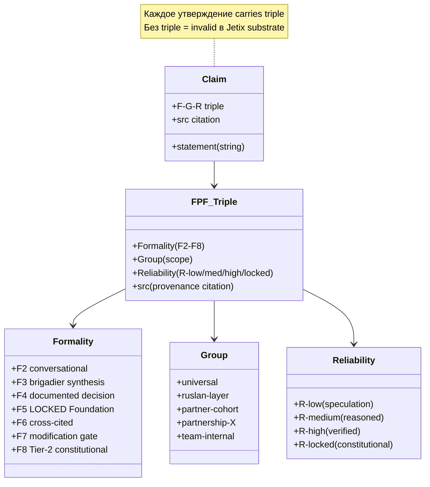
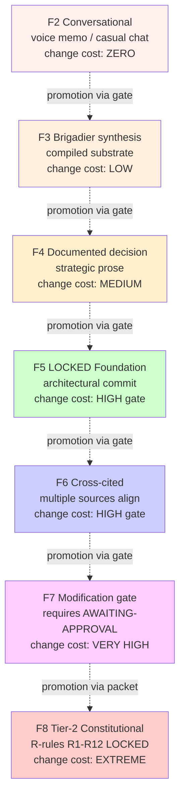

# Phase 9 — FPF: язык, на котором разные системы понимают друг друга

> **Что эта глава делает.** Метод бесполезен, если его нельзя **передать**.
> Phase 9 разбирает FPF — Foundation Promotion Framework — как **универсальный
> язык** epistemic precision, который позволяет разным системам (людям, AI,
> организациям) обмениваться знаниями без накапливающейся путаницы.

---

## §A «FPF = язык универсальной коммуникации»

Руслан на голосовом 21.05:

> «fpf это как раз вот язык который позволяет вот коммуницировать да довольно
> эффективно»

FPF — это инструмент **явного маркирования эпистемического состояния**
каждого утверждения. Тройка **F-G-R** (Formality / Group-scope / Reliability)
прицепляется к каждому claim'у.

### A.1 F (Formality) — уровень формальности

Восьмиуровневая шкала **F2 → F8**:

| Уровень | Что значит | Пример |
|---|---|---|
| **F2** | Разговорное / casual / voice-anchored | «мне кажется проект растёт» (voice memo) |
| **F3** | Brigadier analysis / synthesis | Brigadier compiles voice + substrate → coherent statement |
| **F4** | Documented decision / strategic prose | Ruslan-authored strategic memo с rationale |
| **F5** | LOCKED Foundation part / architecture | Part 11 Strategic Direction Substrate LOCKED |
| **F6** | Cross-cited constitutional precedent | Vision Fundamental cited |
| **F7** | Foundation modification / explicit gate | Constitutional change requires AWAITING-APPROVAL |
| **F8** | Constitutional Tier 2 R-rule | R12 anti-extraction LOCKED |

**Higher F = more constraints + higher precision + slower to change.**

### A.2 G (Group-scope) — для кого валидно

| G-value | Применимость |
|---|---|
| `universal` | Любой человек / любая система |
| `ruslan-layer` | Specific к Ruslan'у; не generalisable без adaptation |
| `partner-cohort` | Founding partners shared knowledge |
| `partnership-X` | Specific к partnership X |
| `team-internal` | Internal Jetix only |

Это **important** — что верно для Ruslan'а **может не быть** верно для
другого человека. Маркировка G явно об этом сигналит.

### A.3 R (Reliability) — насколько уверены

| R-grade | Confidence |
|---|---|
| `R-low` | Speculation / hypothesis / hunch |
| `R-medium` | Reasoned but unverified |
| `R-high` | Empirically verified / multiple sources / direct quote |
| `R-locked` | Constitutional — change requires explicit packet |

R-low — **не плохо**. Это **честная маркировка** того, что уверенности ещё нет.
Без R-маркировки claims **смешиваются** — speculation выглядит как fact.

---

## §B Зачем универсальный язык

### B.1 Без precision — путаница накапливается

Имагинируй cascade scenario:

- Ruslan говорит: «Мы должны быть R12-conformant» (он подразумевает strong)
- Founding partner понимает: «Если можно — будем, если нет — extracton OK
  немного» (semantic drift)
- Cohort partner: «Гибко используем R12 как маркетинг» (further drift)
- End-user: «R12 — это название продукта Jetix» (полная потеря смысла)

После трёх передач **smysl исчез**. Это не злая воля — это **энтропия
коммуникации**. Без precision happens **always**.

FPF F-G-R = anti-entropy mechanism. Each передача сохраняет F-G-R marking.
**R12 LOCKED F8 R-locked** не может «дрейфовать» в pre-decisional speculation
unless explicitly de-graded через gate.

### B.2 Different systems нуждаются в shared protocol

- **People** мыслят nuanced; часто не различают confidence levels
- **AI** генерирует confident-sounding text при любом R-уровне (по дефолту)
- **Organizations** имеют свой формальный язык, часто не совместимый
- **External partners** имеют свои conventions

FPF F-G-R = **shared protocol** между всеми. Каждая claim **explicitly tagged**.
Никаких implicit assumptions о confidence или scope.

### B.3 Method бесполезен без передачи

Если ты освоил method, но **не можешь его передать** другим точно — он
**остаётся** твоим личным секретом. Не масштабируется. Не благо для общества.

FPF makes transfer **possible at scale**.

---

## §C FPF как «надстройка над методом»

Руслан на голосовом:

> «вот такой вот уже далее добавление к этому методу позволяет разным
> системам быстро между самой коммуницировать»

**Method** = что-то делать с информацией (Phase 1 B).
**FPF** = как **передавать** информацию о методах **без потери precision**.

Без method — FPF empty (нечего передавать).
Без FPF — method локальный (нельзя передать).
**Вместе** — scalable methodology.

---

## §D Universal language thesis — тестирование

### D.1 Hypothesis

> FPF позволяет передать **колоссальную идею** в 30-60 минут чтения, **с
> точностью** достаточной для применения.

### D.2 Testable

- **Recipient comprehension** после прочтения V2 doc → проверяемо
- **Application success** → проверяемо через первый цикл применения
- **Failure modes** — если reader misunderstand → нужно refine FPF или
  audience-specific styling

### D.3 Falsification conditions

- Если многие readers не понимают core ideas после 60 мин → FPF недостаточен
- Если application fails systematically → FPF marker не передаёт необходимый
  nuance
- Если semantic drift всё равно происходит through 2-3 передач → enforcement
  mechanism недостаточен

Это **honest hypothesis**, не «гарантия». Hypothesis arch operational
протестирует.

---

## §E Сравнение с другими universal languages

История попыток создать **universal language**:

| Язык | Год | Цель | Результат |
|---|---|---|---|
| **Esperanto** | 1887 (Zamenhof) | Universal natural language | Failed — нет native speakers; не scale'нулся |
| **Lojban** | 1955 (Brown) | Logical structure language | Niche success — несколько тысяч enthusiasts |
| **Mathematics** | (вечная) | Universal в domain | Success в domain; не вне |
| **UML** | 1997 | Software design notation | Wide adoption, но declining (too complex) |
| **JSON Schema** | 2010s | Data structure description | Wide adoption (technical only) |
| **OWL / RDF** | 2004 | Semantic web | Adopted в narrow domains |
| **Pictographs / icons** | (вечная) | Visual universal | Limited bandwidth |
| **Music notation** | (вечная) | Universal в domain | Success в domain |
| **Pidgins / creoles** | (исторически) | Trade languages | Emerge naturally, fade |
| **English** (де-факто) | XX век | Global lingua franca | Wide spread, но extractive |

**Pattern из истории:** universal language **не** appears через declaration.
Он appears через **utility** — если people get value, used spreads.

FPF имеет:
- ✅ Utility — precision saves time в complex coordination
- ✅ Compatibility — co-exists с natural language (не replace)
- ✅ Open spec — `design/JETIX-FPF.md` Constitutional Spec доступен
- ⚠️ Risk: cognitive overhead для recipient; curse of knowledge для author

### E.1 FPF advantages

- **Explicit epistemic state** — no Western false-confidence
- **Layered formality** (F2 conversational + F8 constitutional)
- **Group-scope explicit** — избегает over-generalization
- **Compatible** с natural language — не requires replacement
- **Machine-readable** — AI agents can parse F-G-R structurally

### E.2 FPF limitations

- **Cognitive overhead** для recipient — нужно учиться читать
- **Curse of knowledge** для author — забываешь F-mark и оставляешь implicit
- **Doesn't solve disagreement** — просто **clarifies** disagreement
  (sometimes that's enough; sometimes нужно больше)
- **Requires discipline** — без enforcement F-G-R erode

---

## §F Sample FPF в действии

Иллюстрация: одно утверждение в трёх F-grades.

**F2 (voice anchor):**
> «методы вот эти выбирать надо — это самое важное»
> [F: F2, G: ruslan-layer, R: R-medium, src: voice memo 2026-05-21]

**F3 (brigadier synthesis):**
> Meta-method (recursion level 3) — выбор стратегии выбора методов — представляет ключевое отличие Jetix-method от стандартных methodology offerings.
> [F: F3, G: universal, R: R-medium, src: this V2 doc Phase 5 §J]

**F8 (constitutional):**
> No extraction beyond agreed share — AI / substrate cannot extract value from members beyond agreed share; members can fork-and-leave without penalty.
> [F: F8, G: universal, R: R-locked, src: Pillar C Tier 2 rule 12 LOCKED 2026-05-12]

**Three statements, same topic family, different F.** Reader **immediately
knows**, какую weight давать каждому.

---

## §G FPF и Jetix substrate

FPF не только universal language. В Jetix он **встроен в data model**:

- Каждый `decisions/strategic/*.md` имеет frontmatter с `F:` / `G:` / `R:`
- Each Foundation Part имеет F5 LOCKED grade
- Wiki concepts имеют F-G-R per page
- Hypothesis arch tracks refutation criteria по R-grade

Это **архитектурное решение**, не cosmetic. Это позволяет:
- **Лento** lint check FPF integrity (`/lint --check-fpf` Phase B materialisation)
- **Routing** decisions — high-F claims нужно ack через gate
- **Sweep operations** по F-level (например, «show me все F4+ pending acks»)

---

## §H Mermaid D16 — FPF F-G-R triple structure (classDiagram)

---

## §I Mermaid D17 — F2-F8 grade ladder (graph TD)

---

## §J Что отсюда следует для метода жизни

1. **Universal precision language — необходимое условие для scale.**
   Без FPF method остаётся локальным.

2. **F-G-R triple — minimal sufficient marking.** Каждое claim получает
   F (формальность) / G (для кого) / R (уверенность). Это **немного больше
   усилий** при написании, **намного меньше путаницы** при передаче.

3. **Higher F = больше constraints + больше precision + slower change.**
   Это не «лучше / хуже», это **трейд-off** между гибкостью и устойчивостью.

4. **FPF не заменяет естественный язык.** Он **дополняет** его marking.

5. **Discipline required.** Без enforcement F-G-R erode. Lint + cycle reviews
   удерживают.

6. **Method + FPF together** — основа scaling Jetix-method до общественного
   уровня.

В Phase 10 мы перейдём к **exocortex** — instrumentation, который amplifies
intelligence и **позволяет** method жизни масштабироваться к Stage 4.

---

## §K Cross-cite

- Phase 5 §J — meta-method recursion level 3 = F-mark explicit для каждого
  утверждения
- Phase 6 §H — FPF mitigates information dilution через cascade layers
- Phase 8 — universal language enables 100 → 1000+ transfer
- `design/JETIX-FPF.md` — Constitutional Spec (3758 lines, full FPF technical)
- `decisions/strategic/ONE-PAGER-FPF-SUBSTRATE-2026-05-21.md` — sub-pager

---

*Phase 9 closure 2026-05-21. brigadier-scribe; FPF F-G-R triple grounded in Constitutional Spec.*
