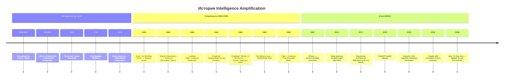

# Phase 10 — Exocortex: усиление интеллекта

> **Что эта глава делает.** Phase 6 §H.5 показала: с AI/Claude эра асимметрии
> изменилась. Phase 10 разворачивает эту идею. Что такое exocortex? Где он
> уже existed (даже до AI)? Что меняется сейчас? Как Jetix построен как
> integrated intelligence amplification system?

---

## §A «Exocortex = усиление интеллекта»

Руслан на голосовом 21.05:

> «этот экзо cortex да это по сути усиление интеллекта»

**Exocortex** = внешний (exo-) кортекс (cortex). Внешний когнитивный
substrate, который **дополняет** биологический мозг.

### A.1 Простой пример из жизни

У тебя в кармане есть телефон. В нём:
- Контакты твоих знакомых (без него — не вспомнишь все номера)
- Карты с навигацией (без него — заблудишься в чужом городе)
- Калькулятор (большая часть людей в современной жизни не умеют
  делать ручную многозначную арифметику)
- Поисковик (доступ к factual базе всего человечества)
- Календарь (что делать когда)
- Заметки (что подумал тогда-то)

**Это уже exocortex.** Не «дополнительный аксессуар» — а **расширение
твоей когнитивной способности**.

Если телефон сломается на день — ты чувствуешь как **снижение** способности.
Не потому что плох. Потому что часть твоей cognition **была отдана** телефону.

### A.2 Это не новость

Exocortex существовал **тысячи лет**:
- Письменность (4-3 тыс. до н.э.) — externalised memory
- Печатный станок (1450) — externalised knowledge distribution
- Энциклопедии (XVIII век) — structured externalised knowledge
- Библиотеки (Александрийская — III в. до н.э., Британская — 1753) — institutional
- Картотеки и каталоги (Меллвил Дьюи 1876) — externalised organisation
- Записные книжки (Леонардо да Винчи, Эйнштейн) — personal externalised thinking
- Калькуляторы (механические 1640s; электронные 1960s) — externalised computation
- Компьютеры (1940s) — programmable externalised processing
- Интернет (1980s+) — externalised global knowledge
- Smartphones (2007+) — pocket-portable exocortex
- LLM (2022+) — interactive externalised cognition

Каждый шаг — **новый layer** exocortex. Каждый layer **увеличивает** эффективную
когнитивную способность человека.

---

## §B Definition: «интеллект = способность обрабатывать информацию + выбирать методы»

Руслан на голосовом:

> «интеллект тоже рассказать что это вот способность обрабатывать информацию
> выбирать методы»

Это **practical definition** — не философская, а **операционная**.

**Intelligence = capacity to process information × method selection quality**

Оба factor имеют значение:
- **High processing без good methods** = useless (быстро делаешь не то)
- **Good methods без processing capacity** = bottleneck (знаешь как, но не успеваешь)

### B.1 Что усиливает exocortex

Exocortex усиливает **processing capacity** напрямую:
- Hold больше информации в активном использовании (working memory расширена)
- Process быстрее (calculation, lookup, comparison)
- Retrieve мгновенно (vs spending время на recall)

Exocortex усиливает **method selection** косвенно:
- Доступ к knowledge о методах (что какой метод когда применять)
- Externalised method library (записанные процедуры, играющие как plugins)
- ROY swarm pattern — multiple expert perspectives in seconds

### B.2 Что НЕ усиливает exocortex

- **Глубокое понимание** (через tacit knowledge — Phase 4 §C) — всё ещё требует
  лично деятельности и времени
- **Эмоциональная регуляция** — может **помочь** (apps for meditation), но
  не **замещает** работу
- **Wisdom** в Ackoff'овском смысле (DIKW pyramid) — требует **жизненного
  опыта**, не выкачивается из database
- **Качество твоих ценностей** (System 5 в VSM) — это **owner's** задача, не
  делегируется

Это **important caveat**. Exocortex amplifies, не **создаёт**. Если внутри
пустота — exocortex её не заполнит.

---

## §C IA history — от Bush до Karpathy

### C.1 Vannevar Bush — «As We May Think» (1945)

Vannevar Bush, физик, руководивший US science effort во время WW2, в июле
1945 опубликовал «As We May Think» в Atlantic Monthly [src: Bush 1945].

В этой статье Bush описал **Memex** — гипотетическое устройство, которое:
- Хранит **all твои книги, записи, переписку**
- Позволяет **mechanically associate** items (предвосхищая hyperlinks)
- Создаёт **trails** мысли, которые можно **share** с другими
- Расширяет **memory** человека до уровня цивилизации

В 1945 это было фантастикой. К 1990-м это стало интернетом. К 2020-м — smartphone +
интернет + AI.

Bush первым artikulated **vision** intelligence amplification на institutional
scale.

### C.2 J.C.R. Licklider — «Man-Computer Symbiosis» (1960)

J.C.R. Licklider в 1960 опубликовал статью **«Man-Computer Symbiosis»** [src:
Licklider 1960]. Утверждение: компьютеры НЕ должны заменять человека. Они
должны быть в **partnership**.

Licklider differentiated:
- **Mechanically extended man** — компьютер как инструмент (молоток-эквивалент)
- **Humanly extended machine** — компьютер делает что-то, потом человек
  верифицирует (assistant)
- **Man-computer symbiosis** — глубокая интеграция, две системы работающие
  вместе, что **ни одна** не могла бы сделать одна

**Symbiosis** — ключевой концепт. Не «человек уходит, AI всё делает». А
**партнёрство**, где divisions of labour **естественно** делятся по
сильным сторонам.

Licklider позже руководил ARPA (предшественник DARPA), и его vision напрямую
повлиял на интернет и personal computing.

### C.3 Doug Engelbart — «Augmenting Human Intellect» (1962)

Doug Engelbart в 1962 опубликовал «Augmenting Human Intellect: A Conceptual
Framework» — research document для SRI International [src: Engelbart 1962].

Engelbart предложил **bootstrap principle**: используй tools для improvement
самих tools. **Recursive self-improvement через partnership**.

В 1968 Engelbart провёл **«The Mother of All Demos»** — публичная демонстрация
**мышки**, **hypertext**, **video conferencing**, **collaborative editing**,
**real-time** mostly working features. **В 1968.** 50+ лет до того, как
большинство пользователей получили эти features.

Engelbart также описал **co-evolution человек + tool**. Не «человек учится
пользоваться tool»; а **tool развивается** одновременно с **развитием человека**,
взаимно усиливая.

### C.4 Современная epoque — Karpathy LLM cognition

Andrej Karpathy в talks 2023+ описывает LLM как **substrate execution layer**
[src: Karpathy lectures]:
- Context window = working memory
- Wikipedia / training data = long-term memory
- Reasoning capability = procedural memory
- Tool use = motor functions
- Multi-modal = sensory functions

Это **explicit cognitive architecture** на substrate LLM. Не «компьютер с
текстовой генерацией». А **новая форма cognition**, available для partnership.

Jetix Wiki v2 design **derived** из Karpathy LLM Wiki pattern — Wiki как
structured external memory, accessible LLM context engineering. Это **direct
application** Karpathy insights.

---

## §D Extended cognition — Clark & Chalmers

Andy Clark и David Chalmers в 1998 опубликовали «The Extended Mind» [src:
Clark & Chalmers 1998]. **Parity principle:** если что-то выполняет cognitive
function, оно — **часть cognition**, независимо от **физического носителя**
(биологический мозг vs notebook vs phone).

### D.1 Знаменитый thought experiment

Inga и Otto — оба идут в музей. Inga **помнит** адрес. Otto держит **записную
книжку**, в которой adres записан. Otto открывает блокнот, видит адрес,
идёт.

Inga's process: query biological memory → retrieve address → action.
Otto's process: query blockbook (external memory) → retrieve address → action.

Clark & Chalmers: **функционально это одно и то же**. Если notebook **reliably**
служит Otto памятью, и Otto **полагается** на него и **доверяет** — notebook
**является** частью его cognition.

### D.2 Условия parity (extended mind не unconditional)

Clark & Chalmers выделили условия, при которых external resource — **часть**
cognition:
1. **Reliably available** (всегда под рукой)
2. **Easily accessible** (быстро открыть)
3. **Automatically endorsed** (доверяешь, не каждый раз перепроверяешь)
4. **Past endorsement** (раньше работало = используешь дальше)

Smartphone обычно удовлетворяет 1, 2; иногда 3, 4 в зависимости от пользователя.
Jetix substrate — **explicit aim** удовлетворять всем 4 для участников.

### D.3 Implications для Jetix

Jetix substrate = **extended cognition for owner (Ruslan) + future partners**.

Если Foundation + wiki + hypothesis arch + CRM удовлетворяют 4 conditions —
они **функционально часть** mentioning Ruslan и partners. Не «инструмент,
который он использует». А **часть его cognition**.

Это **deep claim**. Имеет implications:
- Loss substrate = **partial cognitive disability** (как amnesia)
- Backup discipline = **критическая** (не just convenience)
- R12 fork-and-leave = members могут **сохранить** свою extended cognition
  даже если разойдутся с Jetix

---

## §E Edwin Hutchins — distributed cognition

Edwin Hutchins, антрополог UCSD, в «Cognition in the Wild» (1995) [src:
Hutchins 1995] изучил navigation на корабле US Navy. Заключение:

**Cognition often resides не в одном мозге, а в системе мозгов + tools.**

Cockpit airplane = не «пилот + manuals». Это **distributed cognitive system**,
в котором cognition emerge из interaction:
- Pilot's brain (knowledge + skill)
- Co-pilot's brain
- Instruments (gauges, autopilot, charts)
- Procedures (written checklists)
- ATC (Air Traffic Control)

Удалить любой компонент → **system failure**.

### E.1 Implications для team work

Many high-performance teams работают как **distributed cognitive systems**, не
как «collection of smart individuals»:
- Surgical teams
- Emergency response teams
- Software development teams (high-functioning)
- Research labs

Часто **team performance** > sum of individual abilities **именно потому**,
что cognition distributes между members + tools + protocols.

### E.2 Implications для Jetix

ROY swarm = **distributed cognitive system**, не «5 separate AI calls». Каждый
expert lens partial; **combined** = larger cognitive surface.

Это **архитектурно** explicit: brigadier как hub coordinator + 5 experts +
shared substrate = distributed cognition. Это **не accident** — это **design
choice**.

---

## §F «Соединяем всё» — Jetix as integrated IA

Руслан в audio anchors:

> «вот это вот такой слой не знаю интеллекта продуманья чего-то но его можно
> в жизнь тоже вот встраивать»

Jetix = **integrated intelligence amplification system** для Ruslan + future
partners. Components:

| Component | Function | Bush-Licklider-Engelbart parallel |
|---|---|---|
| **Foundation (11 parts LOCKED)** | Constitutional substrate | Memex's «trails of thought» — explicit relations |
| **Pillar C Tier 2 (12 hard rules)** | Behavioural ceiling | Symbiosis "machine constraints" |
| **5 acked concept docs** | Strategic substrate | Engelbart's «conceptual framework» |
| **Wiki v2 (62+ concepts)** | Knowledge base | Bush Memex direct descendant |
| **ROY swarm 5 experts** | Multi-perspective consultation | Engelbart's «augmented teams» |
| **Hypothesis arch (43 files)** | Falsifiability discipline | Scientific method as IA |
| **KA-03 CRM 169** | Relationship knowledge | Externalised social cognition |
| **Distribution Plan** | Outreach mechanics | Bush's «information distribution» |
| **FPF F-G-R** | Universal language | Licklider's «symbiosis communication protocol» |

Together = coherent IA system.

### F.1 Result — quantitative

Phase 12 разворачивает quantitative analysis. Краткая версия:

Ruslan **с этой IA system** за 38 дней произвёл substrate, который без IA
требует **5-7 лет solo** или **2-3 года команды 5 человек**. Это **10× to 20×
leverage**.

Без IA это было бы **физически невозможно** в этот timeframe. С IA — обыденная
ежедневная работа.

---

## §G Mermaid D18 — Exocortex components stack (block-beta)

```mermaid
block-beta
  columns 3
  block:Bio
    Bio_brain["Biological brain<br/>working memory + emotion + intuition"]
  end
  block:Per
    notes["Personal notes<br/>voice memos + journal"]
    cal["Calendar / tasks"]
    contacts["Contacts CRM"]
  end
  block:Sub
    wiki["Wiki v2 substrate<br/>62+ concepts"]
    found["Foundation<br/>11 parts LOCKED"]
    hyp["Hypothesis arch<br/>43 files"]
  end
  block:AI
    LLM["LLM (Claude)<br/>reasoning + retrieval + generation"]
    ROY["ROY swarm<br/>5 expert lenses"]
    skills["Skills (/ingest /ask /...)<br/>operational verbs"]
  end
  block:World
    Web["Web access<br/>fact-check + current events"]
    Books["Books / library<br/>deep substrate"]
    Comm["Community<br/>partners + advisors"]
  end

  Bio --> Per
  Per --> Sub
  Sub --> AI
  AI --> World
  World --> Bio

  style Bio fill:#fcc
  style Per fill:#fed
  style Sub fill:#dfd
  style AI fill:#ddf
  style World fill:#fdf
```

---

## §H Mermaid D19 — IA history timeline (timeline)

---

## §I Что отсюда следует для метода жизни

1. **Exocortex существует тысячи лет.** Это не «новая AI вещь». Письменность,
   библиотеки, smartphones — каждый layer добавлял к exocortex.

2. **AI era ускоряет accumulation 10-20×.** Это **окно** (Phase 6 §H.5).
   Кто раньше освоит = leverage. Кто позже = catch-up.

3. **Intelligence = process × select methods.** Exocortex усиливает оба;
   но **wisdom**, **values**, **emotional depth** требуют личной работы.

4. **Bush-Licklider-Engelbart traditions = direct intellectual ancestry
   Jetix.** Не «новое изобретение». **Synthesis** validated lineage +
   modern AI substrate.

5. **Clark-Chalmers extended mind = функциональная** — substrate **часть**
   cognition если 4 conditions удовлетворены. Имеет implications для backup,
   R12 fork-and-leave, etc.

6. **Distributed cognition (Hutchins)** — ROY swarm pattern в действии.
   Cognition emerges from system, not individual.

7. **Jetix = integrated IA system.** Не «база знаний + AI assistant».
   А **coherent extended cognitive architecture**.

В Phase 11 мы соединим всё в **integration synthesis** — что такое **«метод
жизни / метод развития»** как целое.

---

## §J Cross-cite

- Phase 1 — fundamental ontology «всё — информация» — основа IA
- Phase 4 — info consumption channels — внутри которых работает IA
- Phase 6 §H.5 — exocortex era game change (overlap, complementary detail)
- Phase 11 — integration synthesis (соединение всех phases)
- Phase 12 — quantitative evidence Ruslan's solo + IA = ~10-20× leverage
- `wiki/concepts/jetix-as-exokortex.md` — companion concept page
- `wiki/concepts/method-systems-thinking.md` — applied method patterns

---

*Phase 10 closure 2026-05-21. brigadier-scribe; Bush-Licklider-Engelbart-Clark-Chalmers-Hutchins-Karpathy lineage explicit.*
