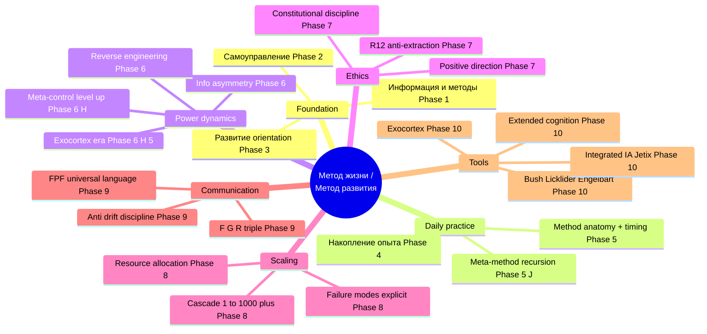
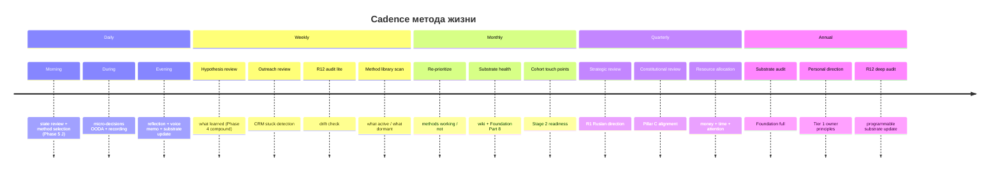
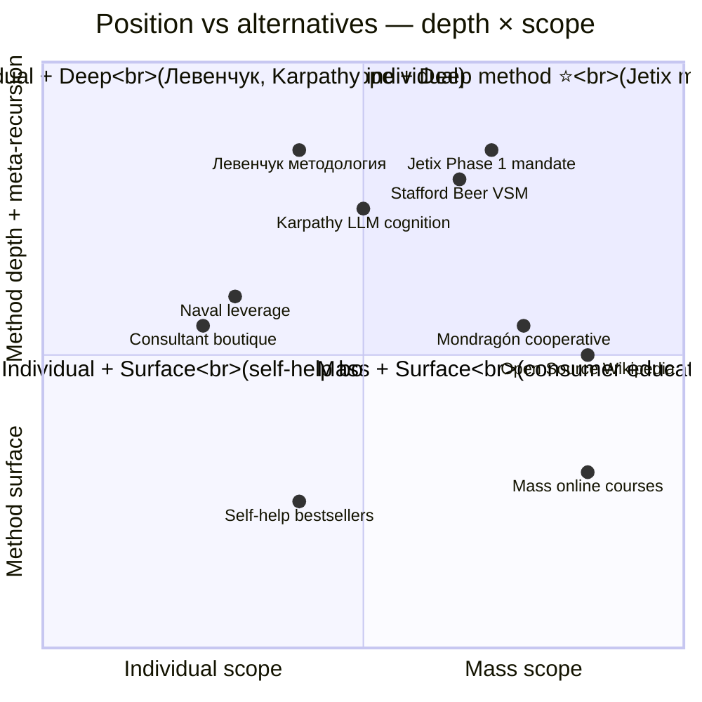

# Phase 11 — Соединяя всё: метод жизни / метод развития

> **Что эта глава делает.** Phase 1-10 раскладывали метод по компонентам.
> Phase 11 **соединяет обратно** в coherent целое. Что такое **«метод жизни /
> метод развития»** как **одна интегрированная конструкция**, на ежедневной
> практике, со всеми componentами, работающими вместе.

---

## §A «Это вместе всё соединить»

Руслан на голосовом 21.05:

> «это вместе все соединить вот как раз и должна получаться такая вот
> система жизни метод жизни метод развития»

Каждая phase до этого — **один кусок** общей картины. Phase 11 — **общая
картина**.

---

## §B 10 phases в одном предложении на phase

Прежде чем синтезировать, давай ужмём каждую phase в одно предложение —
для overview:

| # | Phase | One-liner |
|---|---|---|
| 1 | Fundamental ontology | Всё, чем мы оперируем, есть информация и методы её переработки + информация о методах. |
| 2 | Self-managing systems | Адекватное самоуправление — это 4-6 петель обратной связи, тренируемых и проверяемых, опираемых на VSM 5-system структуру. |
| 3 | Self-development orientation | Развитие требует growth mindset + self-determination (autonomy/competence/relatedness) + flow conditions + deliberate practice — на фундаменте базовой энергии жизни. |
| 4 | Info consumption + experience | Жизнь — процесс непрерывного приёма-обработки информации; накопление compound с правильной техникой; tacit knowledge — большая часть мастерства. |
| 5 | Method anatomy + ⭐⭐ §J meta-method | Каждый метод — 7 шагов от цели до reflection; выбор метода каждую секунду; **метод выбора методов** = ключевое отличие на уровне 3 (квадрат). |
| 6 | Info asymmetry + ⭐⭐ §H meta-control | Информационная асимметрия = базис рычага; reverse engineering — навык; **управление через посредника (level-up)** + **exocortex era game change**. |
| 7 | Positive direction + R12 | Метод мощен и без направленности опасен; R12 anti-extraction = архитектурное (не моральное) ограничение, без которого scale разваливается. |
| 8 | Scale plan 1→10→100→1000+ | Каскад с failure modes explicit; resource allocation R12-conformant; cooperative governance с Mondragón ratio cap. |
| 9 | FPF universal language | Method бесполезен без передачи; F-G-R triple обеспечивает scale без semantic drift. |
| 10 | Exocortex + IA | Bush-Licklider-Engelbart lineage + Karpathy LLM substrate = integrated intelligence amplification; AI era ускоряет 10-20× — окно открыто. |

Это **10 принципов** в краткой форме. Каждый разворачивается в свою phase.

---

## §C The full picture — как это работает в реальной жизни

Давай свяжем их в **один день** обычного функционирования метода жизни.
Это не «mock пример» — это **реальный паттерн** из ежедневной практики Ruslan'а
21.05.2026.

### C.1 Утро (10:00-12:00)

**Wake up.** Сразу — sense текущего состояния тела и сознания (Phase 2 sensor).
Energy: средняя; сон 7 часов; голова чистая.

**Voice memo.** Сразу — capture, что в голове. Это **active info consumption**
(Phase 4) — преобразование internal thoughts в externalised информацию
(Phase 1 «всё — информация»). На voice memo идёт прямо в pipeline (Phase 10
exocortex).

**Review** overnight server CC output. Это **distributed cognition** (Phase 10
Hutchins) — ROY swarm processed inputs пока ты спал. Reading output =
catching up с distributed processing.

**Method selection** на день (Phase 5 §J meta-method):
- Step 1. Какие системы влияют? — time available (4-6 hours focused), energy
  (medium), commitments (Slack DR-33 review, Method V2 read, family time later)
- Step 2. Достаточно ли инфо? Yes (routine selection, не high-stakes)
- Step 3. Process — Method V2 read = high value (он мой prompt!); DR-33 review =
  important но не urgent; family time = block sacred
- Step 4. Goal — Method V2 substantive read + ack DR-33 + family evening
- Step 5. Selected: Method V2 первое 90-min block; lunch break; DR-33 review
  next 60-min; family evening
- Step 6. Will adjust during day if signals appear

**Compound learning:** этот же ритуал делается каждое утро. Через 38 дней —
становится **almost automatic** (Phase 4 compound).

### C.2 Day work (12:00-17:00)

**Deep work block 1: Method V2 read.** В фоне — никаких уведомлений (Phase 3
flow conditions). Substrate в Wiki v2 + Foundation accessible если нужно
(Phase 10 extended cognition).

**Mid-block reflection:** что я узнаю? Это **active consumption** (Phase 4)
+ **R-grade calibration** (Phase 9 FPF). Не «прочитал и забыл», а
**enregistered** в method library.

**Lunch.** Break — important для consolidation (Phase 4 §H memory).

**Deep work block 2: DR-33 review.** OODA loop tighter (Phase 5 OODA) — read
quickly; identify issues; surface dissent atoms.

### C.3 Evening (17:00-21:00)

**Family time.** No work overlap. **R12 self-extraction** check — am I
extracting from себя/семьи to push на работу? Today — no. Boundary held.

**Voice memo вечерний reflection.** Что узнал за день? Какие decisions
сделал? Что surfaced? — Phase 12 pattern compound learning.

**Sleep.** Memory consolidation (Phase 4). Tomorrow continues.

### C.4 Pattern visible

Each step применяет **multiple phases simultaneously**:
- Phase 1 ontology (everything is info processing)
- Phase 2 self-management (sense + adjust)
- Phase 3 mindset (engaged, not avoiding)
- Phase 4 consumption (active, deliberate)
- Phase 5 method selection (especially §J meta-method)
- Phase 6 + 9 (substrate access, FPF marking)
- Phase 7 (R12 self-extraction check)
- Phase 10 (exocortex usage throughout)

**Метод жизни = эти 10 phases в continuous concurrent operation**, не «10
steps to do sequentially». Это **integrated cognitive practice**.

---

## §D Cadence — daily / weekly / monthly / quarterly / annual

Метод жизни требует **разных циклов** для разных уровней рефлексии:

### D.1 Daily

- **Morning review** — что приоритет (Phase 5 method selection)
- **Continuous** — micro-decisions per Phase 5 timing
- **Evening reflection** — voice memo + Wiki update; что узнал

### D.2 Weekly

- **Hypothesis cycle review** — что новое узнал (Phase 14 §B Example 2)
- **Outreach review** (DR-33) — что в CRM нужно туда; surface stuck
- **R12 audit lite** — нет ли drift к extraction
- **Method library scan** — какие методы used / какие dust collecting

### D.3 Monthly

- **Re-prioritize methods** — какие работают / не работают
- **Substrate health check** (Foundation Part 8) — wiki orphans, broken edges
- **Cohort touch points** (как scale to Stage 2) — kто growing

### D.4 Quarterly

- **Strategic direction review** (R1 Ruslan) — где Jetix; куда дрейф
- **Constitutional review** — Pillar C still aligned? R-rules need update?
- **Resource allocation review** — money / time / attention

### D.5 Annual

- **Substrate audit** + Foundation review
- **Personal direction** review (Pillar C Tier 1 — owner's principles)
- **R12 deep audit** + programmable substrate update

Different cadences для different layers метода. Daily — фокус. Weekly —
коррекция. Monthly — re-priorization. Quarterly — strategic. Annual —
constitutional.

---

## §E Difference от existing approaches

Чтобы понять Jetix-method, полезно сравнить с **близкими альтернативами**:

### E.1 Левенчук методология

**Strong:** Method as 1st-class object (MG4 RT); systems thinking lineage;
deep philosophical groundwork.

**Weak in comparison:** mass scaling (educational program, не cooperative);
nije AI substrate native; primarily individual learning focus.

**Jetix integration:** Builds on Левенчук MG4, **adds** ROY swarm distributed
cognition + R12 cooperative scaling + exocortex era updates.

### E.2 Karpathy LLM cognition

**Strong:** Modern AI substrate; context engineering rigour; cognition-as-substrate framework.

**Weak in comparison:** technical focus only; not addressing social integration;
no constitutional discipline.

**Jetix integration:** Wiki v2 directly derives from Karpathy LLM Wiki pattern;
**adds** Foundation constitutional + R12 + Workshop format social layer.

### E.3 Naval Ravikant specific knowledge / leverage

**Strong:** Individual leverage focus; clear identification of unique value;
modern entrepreneurial frame.

**Weak in comparison:** primarily individualistic; cooperative dimension absent;
no explicit anti-extraction constraint.

**Jetix integration:** Acknowledges individual leverage (Phase 6); **adds**
R12 cooperative dimension + meta-method recursion + scale plan.

### E.4 Stafford Beer VSM

**Strong:** Organizational architecture rigorously articulated; cybernetic
foundation; 50+ year track record.

**Weak in comparison:** Heavy formalism; primarily organizational, not
individual; not AI-substrate native.

**Jetix integration:** VSM mapping in Phase 2; ROY swarm = distributed System
4 lens; **adds** individual practice level + AI substrate + R12.

### E.5 Mondragón cooperative

**Strong:** Real-world non-extractive scaling proof (70+ years); ratio cap as
hard constraint; democratic governance proven.

**Weak in comparison:** primarily local-Spanish context; not method-engineering
focus; not AI-substrate.

**Jetix integration:** Mondragón ratio cap directly adopted (5:1); **adds**
method-engineering as core + Workshop format + AI substrate exocortex.

### E.6 Synthesis

**Jetix unique combination:**
- Левенчук method-as-object **+**
- Karpathy LLM cognition substrate **+**
- VSM organizational architecture **+**
- Mondragón non-extractive scaling **+**
- **PLUS** R12 programmable Ethereum enforcement **+** Hypothesis arch
  operational falsifiability **+** ⭐⭐ meta-method recursion (Phase 5 §J) **+**
  ⭐⭐ meta-control through level-up (Phase 6 §H)

Это **не «новое изобретение»**. Это **synthesis** validated lineages + few
genuine additions.

---

## §F Метод жизни — practical implications

Daily living of Jetix-method:

1. **Утром — review state + select day's methods** (Phase 5 method selection
   + Phase 2 self-management)

2. **Continuous — micro-decisions per method-timing principle** (Phase 5 OODA)

3. **Weekly — Hypothesis cycle review** (Phase 4 compound learning + Phase 14
   examples)

4. **Monthly — re-prioritize methods** (which working / not — adjust method
   library)

5. **Quarterly — strategic direction review** (R1 Ruslan; constitutional check)

6. **Annual — substrate audit + Foundation review** (Phase 7 R12 audit;
   Phase 9 FPF integrity)

Each cadence — own check-in items. Together — sustainable practice.

---

## §G Метод развития — practical implications

Sustained development через:

1. **Constant — information consumption diversification** (Phase 4 channels
   variety)

2. **Constant — method library expansion** (Phase 5 repertoire growing)

3. **Constant — reverse engineering practice** (Phase 6 self + others
   understanding deepening)

4. **Periodic — scale check** — на правильной ли stage cascade?

5. **Periodic — positive direction audit** (Phase 7 R12 conformance + KA-07
   review)

6. **Compound — exocortex usage** (Phase 10 substrate growing + tools
   improving)

---

## §H Failure modes ⚠️

Метод **может не работать**, если:

| Failure mode | Что происходит | Прорыв |
|---|---|---|
| **Базовая энергия низкая** (Phase 3 §D dissent atom) | Гомеостаз breaks down; меняется не to growth, а to survival | Восстановить — sleep, food, social, professional help |
| **Mindset fixed (Phase 3 §B)** | Ошибки = threat to ego; learning blocked | Reframing работа; therapy; environment change |
| **Tasks слишком сложные** (Phase 3 §E) | Tревога вместо flow; demotivation | Lower bar; smaller chunks; gradual progression |
| **Tasks слишком лёгкие** (Phase 3 §E) | Boredom; no growth | Higher bar; deliberate practice introducing |
| **Information overload** (Phase 4 §D) | Quality dilution; нет consolidation | Filter aggressively; quality > quantity |
| **Method selection collapsed to defaults** (Phase 5 §J §J.4) | Sub-optimal habit-driven decisions; metacognitive deficit | Practise Phase 5 §J 6-step explicitly до automaticity |
| **R12 drift** (Phase 7 §E) | Extraction accumulates; trust erodes | Weekly audit; constitutional re-grounding |
| **Substrate degraded** (Phase 10) | Extended cognition compromised; effectively cognitive disability | Backup discipline; substrate health checks (Foundation Part 8) |
| **FPF erosion** (Phase 9 §E.2) | Semantic drift; coordination overhead grows | Lint regular; cycle reviews; re-tagging |
| **Coordination overhead at scale** (Phase 8 §E.1) | Brooks's Law; throughput decreases | Subsidiarity; clear governance; reduce direct dependencies |

Это **realistic** view. Method НЕ работает в gloss-coated style. Method
включает **explicit failure modes** с **mitigations**.

---

## §I Mermaid D20 — Integration synthesis (mindmap)

---

## §J Mermaid D21 — Cadence (timeline)

---

## §K Mermaid D22 — Comparative position (quadrantChart)

**Reading:** Jetix mandate — top-right quadrant: **mass-scope deep method
with meta-recursion**. Few attempt этой combination; even fewer succeed.
Closest analogues — Mondragón (mass + R12 + cooperative) и Open Source
(mass + non-extractive + technical).

---

## §L Что отсюда следует — distilled essence

После всех 10 фаз и synthesis — **дистиллированная суть** метода жизни /
метода развития:

> **Жизнь — это процесс непрерывной переработки информации с использованием
> методов. Качество жизни = качество методов × качество их выбора. Развитие =
> систематическое расширение method library + улучшение meta-strategy выбора.
> Это можно делать solo, но при помощи exocortex (Jetix substrate + AI) — в
> 10-20× быстрее. Scaling от 1 до 1000+ возможен через cooperative структуру
> с R12 anti-extraction discipline. FPF F-G-R triple обеспечивает передачу
> без потери precision. Constitutional posture (Pillar C Tier 2) удерживает
> направление в положительное русло.**

Это **один параграф**. За ним — 10 phases substrate + 30+ external traditions.
Без substrate — параграф пустой. С substrate — operational guidance для
жизни.

---

## §M Cross-cite

- Все Phases 1-10 cross-cite explicit в §B и §C
- Phase 12 — personal origin, demonstrating это в действии для Ruslan'а
- Phase 13 — wikipedia synthesis, **deep dive** в каждую external tradition
- Phase 14 — concrete examples
- `decisions/JETIX-VISION-FUNDAMENTAL-2026-04-27.md` — constitutional grounding
- O-107 canonical one-liner reframed = «метод выбора методов» (Phase 5 §J)

---

*Phase 11 closure 2026-05-21. brigadier-scribe; full integration synthesis 10
phases + cadence + failure modes + comparative position.*
