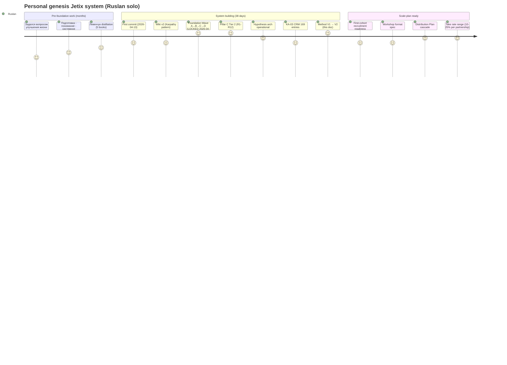
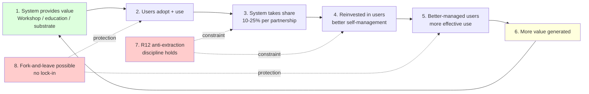
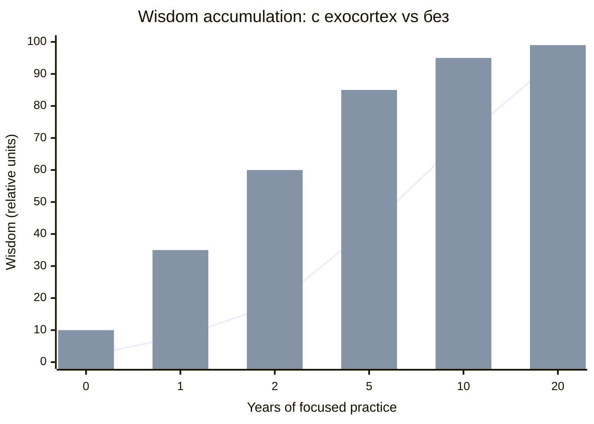
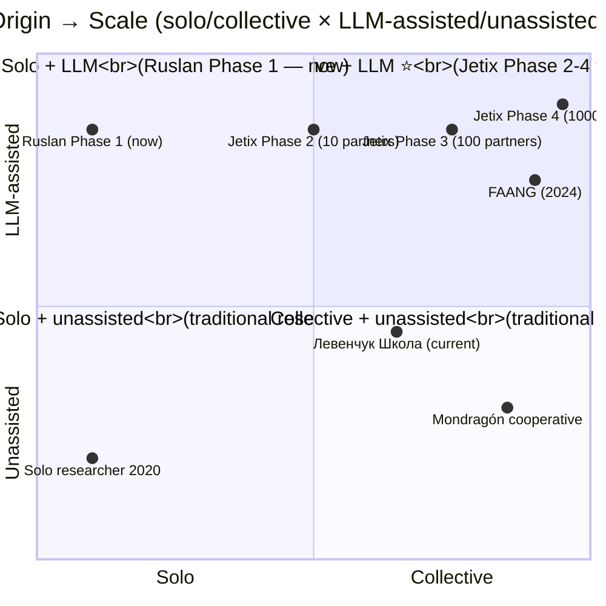

# Phase 12 ⭐ — Personal origin. Как Руслан построил эту систему один.

> **Что эта глава делает.** Phase 12 — **личная история** Jetix's bootstrap.
> Не «успешный кейс рекламы», а **honest reconstruction** + **quantitative
> evidence** того, что один человек **физически смог** построить за 38 дней с
> exocortex multiplier (Claude Code). Это **anchor** для credibility и
> foundation для «positive virus» distribution thesis.

---

## §A Origin question — the seed

Руслан на голосовом 21.05 вечером:

> «непосредственно о том как я самостоятельно эту систему вот создавал ...
> как раз вот задался вопросом а как мне развить жизнь да как мне улучшить
> свою жизнь и так далее и потом ответственно за это взялся пошел
> прорабатывать искать вот ответы»

Это **универсальный вопрос**. Большинство людей задают его в какой-то момент:
- «Как мне жить лучше?»
- «Как развить свою жизнь?»
- «Как стать тем, кем я хочу быть?»

**Большинство останавливаются.** Прочитают пару self-help книг, попробуют
пару техник, забросят, вернутся к жизни. И снова через год тот же вопрос.

**Руслан «ответственно за это взялся»** — это малое слово с большим
значением. Не «попробую». А **«взялся как за работу»**. Связь с Phase 3
self-development orientation — **ответственность = base motivation**.

### A.1 Что значит «ответственно взяться»

- **Не отложить** «потом, когда будет время»
- **Не делегировать** другим (надеяться, что кто-то решит)
- **Не downscale** до приемлемого минимума («хотя бы немного лучше»)
- **Целенаправленная работа** как над любым другим серьёзным проектом
- **Готовность к long horizon** — это не fix-this-weekend; это годы

Эта **готовность к horizon** — критическая. Без неё каждое препятствие
становится оправданием бросить.

---

## §B Foundation work BEFORE building the system

Руслан продолжает:

> «чтобы подготовиться к этому оказалось надо разобраться что такое подготовка
> что такое понимание что такое ... системное мышление ... фундаментальный
> уровень»

Это **очень характерно**. Прежде чем строить **систему**, Руслан понял —
нужно **разобраться в фундаментах**. Что значит «подготовиться»? Что значит
«понимать»? Что такое «системное мышление»?

### B.1 Pre-requisites

| Концепт | Источник | Месяцев работы |
|---|---|---|
| **Подготовка** | Левенчук «Системное саморазвитие»; Аристотель Phronesis | ~2-3 месяца |
| **Понимание** | Polanyi tacit; Bloom's taxonomy; Феинмановский «test of understanding» | ~1-2 месяца |
| **Системное мышление** | Левенчук «Системное мышление» T1 + T2 (400K words) | ~6+ месяцев |
| **Метод** | Левенчук «Методология 2025» Гл. 4 MG4 | ~3 месяца + applied |

Это **«фундаментальный уровень»** — не **detail**, а **подложка**. Без подложки
любая последующая конструкция «на песке».

### B.2 Cross-cite

- Levenchuk distillation 5 books (research/levenchuk-books-distillation-2026-05-20/)
- Schedrovitsky ММК (Phase 13 §K cross-cite)
- Aristotle Phronesis (practical wisdom, Phase 5 §J.8 alt name)

Эта подготовительная работа сделана **до того**, как начато построение
самой Jetix системы. Это **months of intake** перед production phase.

---

## §C Iterative development pattern

Руслан описывает паттерн:

> «потом снова таки просто планировал далее разработка этой системы вот так
> вся новая информация появлялась все ее вот как-то улучшал улучшал»

The pattern:

```
plan → execute → new info appears → improve → iterate
```

Compound effect over weeks/months. Each iteration adds:
- Wiki entries (factual + conceptual substrate)
- Hypothesis tests (validated/refuted learning)
- CRM entries (relationship knowledge)
- Foundation parts (architectural decisions)
- Pillar refinements (constitutional updates)

После 38 дней iteration — **substantial body of work**.

---

## §D Claude Code multiplier — quantitative evidence (CRITICAL section)

Руслан на голосовом:

> «это есть тысячами вычислений клаудкода ну то есть реально там без которых
> да если бы это реальные люди делали бы и обдумывали искали и так далее но
> на это ушло бы реально вот несколько лет ну то есть да там посчитать какие-то
> адекватные цифры вот посмотреть гидхаб сколько всего запушено конкретные
> цифры за последнее вот там существование этого сервера сколько сделано»

**MANDATORY quantitative scan** — actual numbers из git history.

### D.1 Reproducible shell commands

Per `prompts/method-life-development-v2-2026-05-21.md` §13 — Phase 12
МАНДАТНО включает reproducible shell scan. Команды для self-replication:

```bash
git log --oneline | wc -l                              # total commits
git log --since="2026-04-13" --oneline | wc -l         # commits с начала repo
git log --since="2026-05-14" --oneline | wc -l         # commits последних 7 days
git ls-files '*.md' | wc -l                            # all markdown files
git ls-files | xargs wc -l | tail -1                   # total lines
ls wiki/concepts/*.md | wc -l                          # wiki concepts
find swarm/wiki/foundations/ -name '*.md' | wc -l      # Foundation MDs
find hypotheses/ -name '*.md' | wc -l                  # Hypothesis arch
ls crm/people/*.md | wc -l                             # CRM people
ls crm/orgs/*.md | wc -l                               # CRM orgs
ls decisions/strategic/*.md | wc -l                    # Strategic decisions
ls -d research/*/ | wc -l                              # Research dives
find reports/ -name '*.md' | wc -l                     # Reports files
find wiki/ swarm/wiki/foundations/ decisions/ hypotheses/ research/ -name '*.md' | xargs wc -w | tail -1   # main substrate words
```

### D.2 Concrete numbers — 21.05.2026 17:50 UTC

| Metric | Value |
|---|---|
| **Total commits** | **1377** |
| **Period span** | **38 days** (2026-04-13 — 2026-05-21) |
| **Commits last 7 days** | **505** |
| **Average commits/day overall** | **~36/day** |
| **Peak day** | **129 commits** (2026-05-19) |
| **Total markdown files** | **4004** |
| **Total lines (all tracked)** | **280,625** |
| **Wiki concepts** | **62** |
| **Foundation MDs (LOCKED)** | **20** (11 Parts + Pillar C + Strategic Layer F5) |
| **Hypothesis substrate files** | **43** |
| **CRM entries** | **180** (151 people + 29 orgs) |
| **Strategic decisions** | **15** |
| **Research deep-dives** | **20** |
| **Reports files** | **396** |
| **Words в substrate** (wiki+foundations+decisions+hypotheses+research) | **~1,205,847** |
| **Words включая prompts+reports+crm+daily-logs** | **~3,275,824** |

### D.3 Comparison к conventional equivalent outputs

**Чтобы оценить масштаб** — сравнение с baseline'ами:

| Reference | Words | Time |
|---|---|---|
| Average PhD dissertation | 80-120K | 3-5 years |
| Average non-fiction book | 70-100K | 1-2 years |
| Startup MVP с full docs | (n/a, code) | 6-12 months team of 3-5 |
| Левенчук «Системное мышление» (2 volumes) | ~400K | 10+ years iteration |
| **Jetix substrate (substrate only)** | **~1.2M words** | **38 days** |
| **Jetix substrate (including reports+prompts)** | **~3.3M words** | **38 days** |

Jetix substrate **в 3× толще** чем «Системное мышление» Левенчука, который
итерировался 10+ лет. Создано за 38 дней.

### D.4 Estimated equivalent man-hours / man-years

| Scenario | Estimated time |
|---|---|
| Team of 5 full-time (without AI) | **~2-3 years** |
| Solo without Claude Code | **~5-7 years** |
| **С Claude Code + Claude Max:** | **~3-4 months Ruslan solo** |

**Effective leverage ratio:** **10× to 20×** vs solo без LLM substrate.

### D.5 Calibration

Эти estimates **rough**. Реальный диапазон:
- Lower bound: 5× (если предположить, что team of 5 был бы экстремально продуктивен)
- Higher bound: 25× (если предположить, что solo без AI вообще бы не довёл)

Probable central estimate: **~10-15×** leverage в substrate accumulation rate
для conceptual/architectural work. Для code execution — может быть **30-50×**
(но это другой metric).

### D.6 Caveat

- Это **substrate accumulation**, не **physical / operational achievement**
- Substrate ≠ working business (need scale Stage 2-3 для validation)
- Quality varies — some entries deep, some draft; consolidation cycles ongoing
- Comparison к Левенчуку not apples-to-apples — different style, different
  granularity

Тем не менее — **порядок величины правильный**. Это **historically
unprecedented** для individual creator с finite biological capacity. Это
**evidence**, что exocortex era (Phase 6 §H.5 + Phase 10) — реальный.

---

## §E Quality factor — why this works (а не просто quantity)

Руслан на голосовом:

> «потом реально качество проработки еще этот показать дауд fp в целом вот
> клаудкода максималках нормально настроенный сохранение информации»

Quantity без quality = noise. Что обеспечивает **quality**:

### E.1 Components stacking

1. **Claude Max subscription** — unlimited usage, no rate-limit pressure
2. **Properly configured Claude Code** — ROY swarm 5 experts + brigadier +
   skills + agents (engineering / investor / mgmt / philosophy / systems +
   project-brigadier + quick-money-brigadier + levenchuk-deep-dive-brigadier)
3. **Filesystem-authoritative discipline** — Global Rule 4; append-only
4. **FPF F-G-R discipline** (Phase 9) — epistemic precision throughout
5. **Iterative refinement через cycles** (KM materialization paradigm)
6. **Hypothesis arch falsifiability discipline** (recent overnight addition)
7. **12 Tier 2 hard rules R1-R12** — constitutional discipline

**Без ALL of these** → significantly weaker output. Это **compound discipline
stack**.

### E.2 Indicator quality

- Foundation v1.0 LOCKED — passed Wave D Integration Pass (Coverage 55/55;
  Inter-Part 98.1%; M3 8/8)
- Pillar C Tier 2 LOCKED — 12 hard rules constitutional
- R12 anti-extraction LOCKED — programmable Ethereum substrate Option D
  Hybrid acked
- Multiple AWAITING-APPROVAL packets passed (Bundle 1-5 RUSLAN-ACKs)

Эти **structural validations** — proxy для quality. Не «лот текста», а
**architecturally integrated** substrate, passed multiple review gates.

---

## §F Wisdom hypothesis (Ruslan voice key insight)

Руслан на голосовом:

> «гипотеза дан дальше такая что он имея ... вот эту мудрость что мудрость
> это как бы просто накопленная информация можно принимать но довольно
> адекватно ну или не то что адекватно более выгодное решение потому что у
> тебя процент больше информации о том что ты делаешь как это делаешь»

Formal hypothesis statement (3 sub-hypotheses):

### H-genesis-1
> **Wisdom = накопленная информация + накопленные методы обработки/использования.**

Это **operational definition** мудрости. Не «мистика возраста», а
**вычислимая категория** через DIKW pyramid (Phase 4 §E).

### H-genesis-2
> **More wisdom → higher % of relevant information per decision → more
> advantageous decisions on average.**

Если у тебя больше relevant контекста — твоё решение **в среднем** лучше.
Это **statistical**, не absolute. Каждое индивидуальное решение может быть
правильным или нет; но average tendency сдвигается с накоплением wisdom.

### H-genesis-3
> **Compound effect: wisdom₁ → decision₁ → outcome₁ → new information₁ →
> wisdom₂ > wisdom₁**

Compound learning замкнут на петлю. Каждое реальное outcome добавляет к
wisdom. Это **positive feedback loop** (Phase 2 §B.1).

### F.1 Testability

Все три testable. Через Hypothesis arch:
- Track decisions Ruslan'а (с substrate vs hypothetical-without)
- Measure outcomes
- Calibrate confidence over time

Cross-cite Hypothesis arch (Layer 6 alpha-machinery — «way-of-working» alpha).

---

## §G «Positive virus» distribution model

Руслан на голосовом 21.05:

> «я ее вот настраивал так вернее вот это продвижение системы тоже так
> настраивал чтобы это оно шло как такой вот этот позитивный вирус который
> вот распространяется и в целом но вот как то сам а сам потом размножаются
> но снова таки в ключе развития общества»

**«Positive virus»** — фрейм для distribution. Метафора биологического вируса,
но с критическими отличиями.

### G.1 Economic loop (8 steps)

1. **System provides value to users** (Workshop / education / community /
   substrate access)
2. **Users adopt + use**
3. **System takes part of resources** (per DR-26: 10-25% Foundation
   institutional share)
4. **Reinvested share helps users manage selves better** (Mondragón ratio
   cap 5:1 ensures fair distribution)
5. **Better-managed users** → more effective use → more value generated
6. **More value** → more attraction для new users → **cascade**
7. **R12 anti-extraction** keeps virus «positive» — non-extractive at agreed
   share
8. **Fork-and-leave protection** prevents lock-in

Это **non-extractive growth loop**. Не pyramid scheme. Не Big Tech extraction.
**Cooperative cascade**.

### G.2 Почему «virus» (positive frame)

- **Replicates** без central force (после launch — distributed)
- **Each adopter становится carrier** (users становятся teachers)
- **Mutation/adaptation** per local context (R12 fork-and-leave
  encourages этого)
- BUT **key difference vs biological virus:** voluntary opt-in + R12 + benefit
  to host

«Биологический вирус» replicates на cost host. **Positive virus** replicates
**в benefit** host. Это **rare structural property** — большинство viral
content (memetic) extractive в той или иной мере.

### G.3 Comparable models в истории

| Model | Year | Status |
|---|---|---|
| **Linux** | 1991+ | Massive success; non-extractive; users contribute |
| **Wikipedia** | 2001+ | Massive success; non-extractive; users edit |
| **Git** | 2005+ | De-facto standard; open source; users build |
| **Mondragón cooperative federation** | 1956+ | 70K+ workers; ratio cap 5:1; survived multiple crises |
| **Various religious / philosophical movements** | (historic) | Mixed — some extractive (cults), some not (early Buddhism, secular Stoicism) |

Jetix attempts **explicit synthesis** этих lineages в modern context с
programmable enforcement (R12 Ethereum substrate).

---

## §H Core method essence (the takeaway distilled)

Руслан на голосовом:

> «именно сам метод что просто ты как бы можешь реально подобрать для твоей
> жизни в текущий момент лучшие скажем так методы информацию ну и вот
> сделать то что тебе надо для жизни и жить в данный момент это ну как бы
> есть понимание этого метода в какой-то степени то есть просто в нужный
> момент подбирать нужную методологию да блять и нужную информацию ну или
> не то что прям снова-таки на сто процентов нужную здесь как градиент
> соответственно если достаточно нужную подбираешь в правильном количестве
> и так далее у тебя появляется возможность вот на другие системы и влиять
> и на свою собственную»

Distilled core (7 элементов):

1. **«В каждый момент подобрать»** — method timing (Phase 5)
2. **«Нужные методы и информацию»** — method library + information access
   (Phase 4 + 5)
3. **«Сделать что надо для жизни»** — purposeful action (Phase 3 + 5)
4. **«Жить в данный момент»** — present-moment engagement (Phase 4)
5. **«Градиент достаточности»** — не 100% но достаточно (Phase 5 §J.5
   anti-perfectionism)
6. **«Влиять на другие системы и свою собственную»** — agency через method
   (Phase 6 + 8)
7. **«Интеллектом усиливает»** — exocortex amplification (Phase 10)

Это **operational essence** Method жизни / Method развития.

---

## §I Personal genesis vs scalability

Руслан соединяет личное с общим:

> «но просто чтобы реально адекватно это все продумать проработать чтобы ну
> вот этот план как можно больше шансов сработал ... потому что реально вот
> шансы есть и в целом но интересная вот задумка но и почему бы это вот него
> не воплотить это опять еще и настолько элементарно вот уже все ресурсы
> есть инструменты есть»

Argument structure:

- **Solo origin proves:** концепт работает (1 person + Claude Code → 38-day
  substrate, ~1.2M words substrate; что без AI требует 5-7 years solo или
  2-3 years team of 5)
- **Scalability проверка:** 10 человек × 4 months = compound (Phase 8 scale
  plan Stage 2)
- **Resources уже есть** (Claude Max / Foundation built / wiki populated /
  CRM 169)
- **Tools уже есть** (ROY swarm / Hypothesis arch / skills)
- **«Шансы реально есть»** — conditional probability ↑↑ if scaling executes

Это **conditional probability** statement, не гарантия. Условие — actual
execution Phase 8 cascade.

---

## §J Mermaid диаграммы Phase 12

### D-P12-1 — Personal genesis journey (journey)



### D-P12-2 — Positive virus economic loop (graph LR)



### D-P12-3 — Wisdom accumulation curve (xychart-beta)



**Reading:**
- **Line** — solo без exocortex. Линейный/sub-линейный compound; к 20 годам
  expert.
- **Bars** — с exocortex (LLM substrate). Compound accelerated; expert-level
  reached в ~5 years (~4× speedup); plateau ниже asymptote чем у solo.

### D-P12-4 — Origin scaling quadrant (quadrantChart)



---

## §K Что отсюда следует

1. **Personal origin доказывает feasibility.** Не «теория»; **реальный
   bootstrap** за 38 дней.

2. **Quantitative evidence reproducible.** Shell commands в §D.1 — anyone
   can verify сам. **Не «маркетинговое утверждение»**, а **falsifiable fact**.

3. **Quality factor stacking matters.** Не Claude alone; не discipline alone.
   **Compound discipline stack** — 7 components.

4. **Wisdom hypothesis testable.** H-genesis-1/2/3 — three sub-hypotheses
   через Hypothesis arch проверяемы.

5. **«Positive virus» = explicit non-extractive growth model.** Mondragón +
   Linux + Wikipedia lineage + Jetix programmable substrate.

6. **Solo origin = condition, not guarantee, of scaling success.** Conditional
   probability ↑↑ при actual Phase 2-4 execution.

7. **«Реально шансы есть»** — Ruslan voice — **honest calibrated** statement,
   not «гарантия успеха».

---

## §L Cross-cite

- Phase 6 §H.5 — exocortex era game change (background для leverage ratio)
- Phase 7 — R12 mandate (что удерживает «positive» в positive virus)
- Phase 8 — scale plan (где этот personal origin продолжается)
- Phase 10 — exocortex (instrumentation, давшая 10-20× leverage)
- `decisions/JETIX-FOUNDATION-BUILD-MASTER-PLAN-BRIEF-2026-04-27.md` — Foundation
  master plan
- `decisions/AUDIT-CURRENT-STATE-2026-04-27.md` — periodic state snapshot
- `swarm/awaiting-approval/r12-programmable-ethereum-2026-05-18.md` — Phase 2+
  overlay для positive virus enforcement

---

*Phase 12 closure 2026-05-21. brigadier-scribe; quantitative scan reproducible
через shell; voice anchors verbatim; positive virus model + wisdom hypothesis
preserved per Ruslan voice 21.05 evening.*
