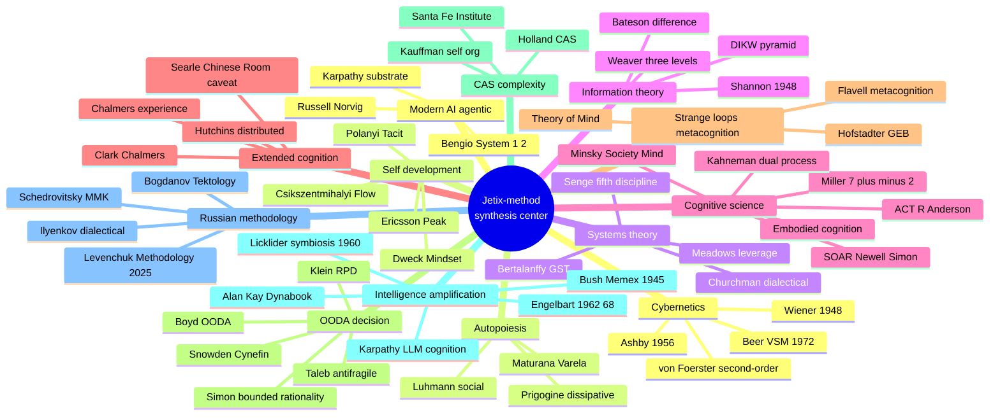
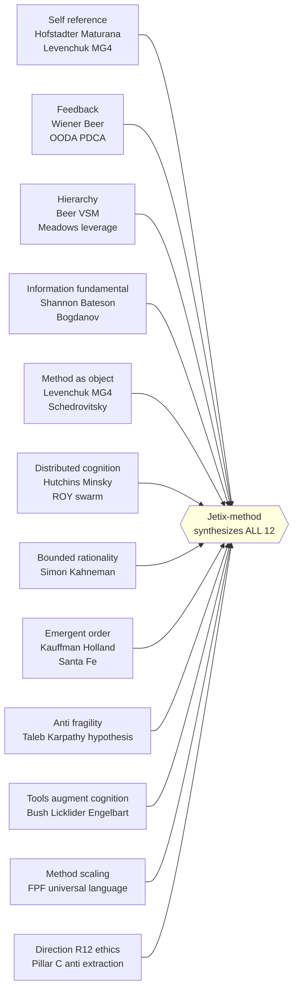

# Phase 13 — Wikipedia-deep. 12 интеллектуальных традиций, на которые опирается метод.

> **Что эта глава делает.** Phase 1-11 ссылались на external traditions
> мимоходом. Phase 13 — **deep dive** каждой из 12 ключевых традиций. Что они
> утверждают, чем они отличаются, как они интегрируются в Jetix-method. Это
> **не оригинальная компиляция** — это **synthesis of validated lineages**, на
> которых стоит вся конструкция.

---

## §A Cybernetics deep dive

### A.1 Wiener 1948 — foundations

Norbert Wiener, MIT mathematician, in 1948 published **«Cybernetics: Or
Control and Communication in the Animal and the Machine»** [src: Wiener 1948,
MIT Press].

Key contributions:
- **Unified study** of control + communication across living organisms and
  machines (before — separate fields)
- **Negative feedback** as foundational mechanism of stability
- **Information vs noise** distinction central to cybernetic systems
- **Teleological behavior** without metaphysical telos — purposive systems
  through feedback loops

In WW2, Wiener worked on **anti-aircraft predictor systems**. The mathematical
challenge — predict where a plane will be milliseconds in future, given
its current trajectory + pilot's evasive maneuvers — generalized to
**feedback control theory**.

Wiener's 1948 book was **best-seller** в academic circles, влияя на полевые
исследования включая:
- Operations research (post-WW2 boom)
- Early computing (Wiener был mentor для many in early computing)
- Management theory (Stafford Beer)
- Family therapy (Bateson)

### A.2 Ashby — Requisite Variety + Design for a Brain

W. Ross Ashby, English psychiatrist + cybernetician, in 1952 published
**«Design for a Brain»** [src: Ashby 1952]; in 1956 **«An Introduction to
Cybernetics»** [src: Ashby 1956].

Key contributions:
- **Law of Requisite Variety** — управляющая система must have ≥ variety
  чем управляемая
- **Ultrastable systems** — systems with multiple feedback loops, capable of
  adapting to environmental change beyond original design parameters
- **Homeostat** — physical demonstration of ultrastable system
- **Concept of variety** — formal measure of complexity (related to Shannon
  entropy)

Ashby's law often misunderstood. It's NOT «more complexity is better». It's
«minimum sufficient variety needed» — **just enough** to handle relevant
disturbances. Excess variety = waste.

### A.3 Heinz von Foerster — second-order cybernetics

Heinz von Foerster, Austrian-American cybernetician, in 1970s developed
**second-order cybernetics** [src: von Foerster 1974].

First-order cybernetics studies **observed systems** (system being studied
from outside). Second-order studies **observing systems** — including the
observer as part of the system.

Implication: **You cannot study a system without affecting it through
observation.** Your model is partial, contextual, and you are part of context.

For Jetix-method: when you reverse-engineer yourself (Phase 6 §B.3), you
**change** yourself through the act of observation. Self-knowledge is
**generative**, not passive recovery of fixed truth.

### A.4 Stafford Beer — VSM (Viable System Model)

Already deep-dived в Phase 2 §E. Cross-cite there. Key additional notes:

Beer applied VSM in real-world during **Project Cybersyn** — Chile under
Allende, 1971-1973 [src: Medina 2011 «Cybernetic Revolutionaries»]. First
attempt to manage entire national economy using cybernetic principles.
Pinochet's coup ended the project. Historical lesson — methodology can be
sound, political context determines survival.

### A.5 Jetix integration

- VSM 5-system mapping в Phase 2 §E.3
- Ashby variety law в ROY swarm rationale (Phase 2 §C.2)
- Wiener feedback loops в Phase 2 throughout
- Second-order cybernetics в Phase 6 §B.3 self-reverse-engineering

---

## §B Autopoiesis deep dive

### B.1 Maturana & Varela — autopoiesis

Humberto Maturana, Chilean biologist, with student Francisco Varela, developed
**autopoiesis** в 1970s-80s [src: Maturana & Varela 1980 «Autopoiesis and
Cognition»; 1987 «The Tree of Knowledge»].

Key concepts:
- **Autopoiesis** = self (auto) production (poiesis). System that produces
  itself
- **Structural coupling** = system + environment co-evolve through repeated
  interactions
- **Cognition is biological** — embodied, not abstract symbol manipulation
- **«Embodied enaction»** — cognition is action in world, not internal
  representation

For Jetix: substrate **structurally coupled** с external world через
hypothesis cycles, voice memo intake, CRM relationship updates. System
co-evolves, не only «reads» world.

### B.2 Luhmann — social autopoiesis

Niklas Luhmann, German sociologist, extended Maturana к social systems [src:
Luhmann 1995 «Social Systems»].

Claim: social systems (legal, economic, political, scientific) are
**autopoietic at the level of communications**. Their elements are not people,
but **communicative acts**. People are environment of social systems.

Jetix as social autopoietic system: communicative acts (each cycle, each
ack, each voice memo, each commit) reproduce the structure. Stop the
communications → system ceases to exist (только artifacts remain).

### B.3 Prigogine — dissipative structures

Ilya Prigogine, Belgian chemist, Nobel laureate, in 1977 developed concept
of **dissipative structures** [src: Prigogine 1977; «Order Out of Chaos»
1984].

Insight: **far-from-equilibrium** systems can spontaneously develop **higher
order**. Living systems are dissipative — they maintain low entropy locally
by exporting entropy to environment.

For Jetix: not «steady state organization». But **far-from-equilibrium**,
constantly processing energy and information, maintaining structure through
flow.

### B.4 Jetix integration

- Phase 2 §D — autopoiesis cross-cite
- Substrate как «structurally coupled» в hypothesis arch
- Positive virus distribution (Phase 12 §G) — dissipative growth pattern

---

## §C Systems theory deep dive

### C.1 Bertalanffy — General Systems Theory

Ludwig von Bertalanffy, Austrian biologist, in 1968 published **«General
Systems Theory»** [src: Bertalanffy 1968].

Bertalanffy argued: many systems across different domains (biology,
psychology, sociology, engineering) show **isomorphic** patterns. Studying
these common patterns yields general principles applicable across.

Key concepts:
- **Open vs closed systems** — open exchange matter+energy with environment
- **Equifinality** — different starting points can reach same end-state
- **Hierarchy** — systems are composed of sub-systems and embedded in
  larger systems
- **Steady-state** vs equilibrium — open systems can maintain steady-state
  while exchanging

Bertalanffy's program — **transdisciplinary**. Not «borrowing» between fields,
но **shared abstract structure**.

### C.2 Meadows — leverage points

Donella Meadows, American environmental scientist, in 1999 essay (expanded
in 2008 «Thinking in Systems») gave **12 leverage points** [src: Meadows 2008].

12 points in **increasing order of leverage** (weakest to strongest):
1. Constants / parameters
2. Buffer sizes
3. Stock-flow structures
4. Delays
5. Negative feedback loops
6. Positive feedback loops
7. Information flows
8. Rules
9. Self-organization
10. Goals
11. Paradigms
12. **Power to transcend paradigms**

Insight: most policy intervention is at low-leverage points (parameters).
True change requires **paradigm-level** intervention (Pillar C constitutional
work, in Jetix terms).

### C.3 Senge — Fifth Discipline

Peter Senge, MIT management researcher, in 1990 published **«The Fifth
Discipline»** [src: Senge 1990].

Five disciplines of «learning organization»:
1. **Systems thinking** — the «fifth» that integrates the four
2. **Personal mastery** — individual learning + commitment
3. **Mental models** — explicit examination of assumptions
4. **Shared vision** — alignment around purpose
5. **Team learning** — collective intelligence > sum of individuals

Senge popularized systems thinking в business. Many concepts derived from
Jay Forrester (System Dynamics) и Chris Argyris (single + double-loop
learning).

### C.4 Churchman — dialectical method

C. West Churchman, philosopher + operations researcher, advocated **dialectical
method** в systems analysis [src: Churchman 1971 «The Design of Inquiring
Systems»].

Insight: every system view is **partial**. Multiple stakeholders have
**multiple legitimate views**. Synthesis requires confronting these views
through **dialectic** — not consensus, but explicit acknowledgment of tensions.

This grounds **ROY swarm** pattern (5 expert lenses) and **AP-6 dissent
preservation** в Jetix.

### C.5 Jetix integration

- Meadows leverage points → Phase 6 §H.8 (paradigm-level leverage)
- Senge mental models → Phase 5 §E (reverse engineering mental models)
- Bertalanffy hierarchies → Phase 2 VSM nested systems
- Churchman dialectical → AP-6 explicit dissent preservation

---

## §D Information theory deep dive

### D.1 Shannon — entropy + channel capacity

Already covered in Phase 1 §A.3. Key technical contribution: **entropy** as
measure of uncertainty; **channel capacity** as maximum rate of error-free
communication through noisy channel.

Shannon's results enable **modern digital communication** — internet,
mobile, MP3, all derivatives.

For Jetix: Shannon discipline applied to substrate. Each claim has explicit
entropy (R-grade). Communication via FPF is **error-correction** at semantic
level.

### D.2 Bateson — «difference which makes a difference»

Already covered Phase 1 §A.2. Bateson's contribution: information defined
**relationally** — needs perceiving system + context to be information.

Bateson also developed:
- **Double bind** theory (1956) — contradictory communications causing
  schizophrenia in family context [src: Bateson et al. 1956]
- **Logical types** in communication — meta-levels of message
- **Ecology of mind** — cognition is environmental, not individual

### D.3 Weaver — three levels

Warren Weaver, in 1949 introduction to Shannon's book, distinguished
**three levels** [src: Weaver 1949]:
- **Technical level** — how accurately can symbols be transmitted (Shannon's
  domain)
- **Semantic level** — how precisely do transmitted symbols convey intended
  meaning
- **Effectiveness level** — does meaning produce desired effect

Shannon focused on level 1. Semantic + effectiveness levels remain harder
to formalize. **Search-engine retrieval**, **machine translation**, **NLP**
все work at semantic level. FPF F-G-R discipline addresses semantic +
effectiveness explicitly.

### D.4 DIKW pyramid

Russell Ackoff, in 1989 paper «From Data to Wisdom» [src: Ackoff 1989] gave
the hierarchy:

```
                  Wisdom (мудрость)
              ↑    значение для жизни
           Knowledge
              ↑    обобщённые паттерны
       Information
              ↑    данные в контексте
          Data
                   сырые факты
```

Each level requires **processing** to ascend. Phase 4 §E covered this.

### D.5 Jetix integration

- Shannon entropy concept → R-grade calibration in FPF
- Bateson «difference making difference» → Phase 1 §A.2 foundational
- Weaver three levels → FPF F (formality) ≈ technical+semantic; G (group) +
  R (reliability) ≈ effectiveness
- DIKW pyramid → Phase 4 §E

---

## §E Cognitive science deep dive

### E.1 Miller — magical number 7±2

George Miller, in 1956 paper «The Magical Number Seven, Plus or Minus Two»
[src: Miller 1956 Psychological Review].

Working memory ограничена **~7 items** (±2). Modern revision: 4±1 (Cowan 2001).

Implication для метода: **decisions с >7 unconnected factors overwhelm
working memory**. Need **chunking** — group factors hierarchically. Or
**externalise** через writing / lists / visualization.

### E.2 Minsky — Society of Mind

Marvin Minsky, MIT AI pioneer, в 1986 published **«Society of Mind»** [src:
Minsky 1986].

Claim: mind не unified «I». Mind is **collection of agents**, each handling
specific tasks (visual processing, language, motor control, attention).
«Consciousness» = particular kind of organization, not separate entity.

For Jetix: ROY swarm pattern echoes Society of Mind — multiple «agents»
(expert lenses) coordinated through hub. Single intelligence is collective
phenomenon.

### E.3 Kahneman — System 1 / System 2

Already covered Phase 5 §E. Kahneman + Tversky's «prospect theory» (1979)
and «two-system model» (Kahneman 2011) shape modern view of decision-making
under uncertainty.

Catalogued ~150 **cognitive biases** through experiments. Major ones:
- Anchoring
- Availability heuristic
- Confirmation bias
- Sunk cost fallacy
- Base rate neglect
- Representativeness heuristic
- Hindsight bias
- Optimism bias / planning fallacy

Each bias = **predictable** deviation от normative rational choice.
Awareness of biases doesn't eliminate them — but **helps decisions** in
specific contexts.

### E.4 ACT-R cognitive architecture (Anderson)

John Anderson, Carnegie Mellon, developed **ACT-R** (Adaptive Control of
Thought-Rational) starting 1973 [src: Anderson 2007 «How Can the Human Mind
Occur in the Physical Universe?»].

Components:
- **Declarative memory** — facts, propositions
- **Procedural memory** — production rules (IF-THEN)
- **Goal stack** — current intentions
- **Modules** — sensory, motor, declarative, procedural
- **Buffers** — coordinate between modules

ACT-R has been used to model cognition in tasks от arithmetic к
flying-aircraft simulators. **Predictions match human behavior** в many
contexts.

### E.5 SOAR (Newell + Simon, Laird)

Allen Newell and Herbert Simon developed **SOAR** в late 1980s [src: Newell
1990 «Unified Theories of Cognition»; Laird 2012 «The SOAR Cognitive
Architecture»].

Different architecture than ACT-R, similar goal — unified cognitive theory.
SOAR central concept: **problem space** — agent navigates state space using
operators.

### E.6 Embodied cognition

Modern direction — cognition emerges from **body interacting с environment**,
not purely abstract symbol processing. Lakoff & Johnson «Philosophy in the
Flesh» (1999); Varela et al. «The Embodied Mind» (1991) [src: Lakoff &
Johnson 1999; Varela et al. 1991].

For Jetix: **hands-on Workshop** format > lectures (Phase 4 §C.2 tacit
knowledge). Embodied learning encodes deeper.

### E.7 Jetix integration

- Miller 7±2 → method choice depth (don't analyze >7 factors directly;
  chunk)
- Minsky Society of Mind → ROY swarm pattern
- Kahneman dual process → Phase 5 §E
- ACT-R declarative + procedural → Wiki v2 (declarative) + skills (procedural)
- SOAR problem space → method anatomy 7-step (Phase 5 §A) navigation
- Embodied cognition → Workshop hands-on (Phase 8 Stage 2)

---

## §F Philosophy of mind / extended cognition

### F.1 Clark & Chalmers — Extended Mind

Already covered Phase 10 §D. Key claim: **parity principle** — if external
resource performs cognitive function, it's part of cognition.

Subsequent debate: Adams & Aizawa (2008 «The Bounds of Cognition») contested,
arguing for **mark of the cognitive** — biological neural patterns are
special. Defenders (Wheeler, Menary) responded.

Currently — open debate. But **functional behavior** (Otto-Inga) clearly
parallel; debate is about whether to call it «cognition» or «extended
behavior».

### F.2 Hutchins — distributed cognition

Already covered Phase 10 §E. Key insight: cognition often resides in
**system of brains + tools + procedures**, not single brain.

Hutchins' field studies of:
- Navigation на US Navy ships
- Cockpit operations
- Other high-reliability environments

Established empirical foundation.

### F.3 Searle — Chinese Room

John Searle in 1980 paper «Minds, Brains, and Programs» [src: Searle 1980]
proposed **Chinese Room** thought experiment.

Claim: a system processing Chinese symbols by lookup tables doesn't
**understand** Chinese, regardless of how good the lookup. Searle's broader
target — strong AI thesis that **computation alone** is mind.

Caveat для FPF: F-G-R precision = syntactic. Doesn't guarantee **semantic
understanding** at recipient. Universal language can deliver **information**
without **understanding** unless recipient does processing.

### F.4 Chalmers — Conscious Mind + hard problem

David Chalmers' **hard problem of consciousness** [src: Chalmers 1996]:
**explaining experience itself** (qualia) — why is there something it is
like to see red, rather than just functional processing?

For Jetix-method: doesn't directly resolve, but **important boundary** —
exocortex amplifies cognition (Phase 10), but **experience** of recipient
remains private. AI substrate doesn't have experience (under most current
views).

### F.5 Jetix integration

- Clark-Chalmers extended mind → Phase 10 §D Jetix substrate
- Hutchins distributed cognition → ROY swarm pattern
- Searle Chinese Room → FPF caveat (syntactic precision ≠ semantic
  understanding)
- Chalmers experience boundary → Pillar C Tier 2 rule 5 «AI does NOT claim
  skin-in-the-game»

---

## §G Strange loops + metacognition

### G.1 Hofstadter — Gödel Escher Bach

Douglas Hofstadter в 1979 опубликовал **«Gödel, Escher, Bach: An Eternal
Golden Braid»** [src: Hofstadter 1979] — Pulitzer Prize winner.

Central concept: **strange loop** — system level хеnaresponses references
back to itself, creating tangled hierarchy. Examples:
- **Gödel's incompleteness theorems** — formal systems referring to themselves
- **Escher's drawings** — hands drawing themselves; impossible staircases
- **Bach's fugues** — themes building on themselves recursively
- **Self-reference** in language («This sentence is false»)
- **Consciousness** — mind referring to itself

Hofstadter extended in 2007 **«I Am a Strange Loop»** [src: Hofstadter 2007]
— argument that self (the «I») is itself a strange loop emerging from
neural patterns.

For Jetix: **meta-method** (Phase 5 §J) — explicit strange loop. Method
that refers to methods, including itself. This is **structural cousin**
к recursion in Hofstadter.

### G.2 Flavell — metacognition

John Flavell, developmental psychologist, в 1979 paper «Metacognition and
Cognitive Monitoring» [src: Flavell 1979] introduced **metacognition** as
formal concept.

Two components:
- **Metacognitive knowledge** — what you know about your own cognition
- **Metacognitive regulation** — how you control your cognitive processes

Research showed: children's academic success correlates с metacognitive
skill development, not just raw IQ.

Метод выбора методов (Phase 5 §J) = applied metacognitive regulation.

### G.3 Theory of Mind

Premack & Woodruff в 1978 paper introduced **Theory of Mind (ToM)** [src:
Premack & Woodruff 1978] — capacity к attribute mental states to others.

Children develop ToM around age 3-5 (false-belief task). Some people on
autism spectrum show ToM differences. Animals show ToM-like behaviors in
some species (great apes, possibly cetaceans, some birds).

For Jetix: information asymmetry (Phase 6 §A) requires **ToM** — predicting
other's mental state requires modeling their cognition. Reverse engineering
(Phase 6 §B) of social systems = applied ToM at scale.

### G.4 Jetix integration

- Hofstadter strange loops → Phase 5 §J recursion levels
- Flavell metacognition → entire Phase 5 §J apparatus
- Theory of Mind → Phase 6 information asymmetry + reverse engineering

---

## §H OODA + decision under uncertainty

### H.1 Boyd — OODA loop

Already covered Phase 5 §B.2. Boyd's deeper concepts (mostly in unpublished
briefings, see Coram 2002 biography):
- **Tempo** — operating cycle speed = competitive advantage
- **Penetration of opponent's OODA** — disrupting their orient stage
- **«Patterns of Conflict»** — Boyd's 200-slide masterpiece briefing
- **«Destruction and Creation»** — paper integrating Gödel + Heisenberg +
  thermodynamics for cognitive uncertainty

### H.2 Snowden — Cynefin

Already covered Phase 5 §B.4. Cynefin's deeper structure:
- **5 domains** — Clear / Complicated / Complex / Chaotic / Disorder
- **Confusion zone** — when you don't know which domain you're in
- **«Liminal zones»** — between-domain transitions
- **Catastrophic boundary** — between Clear and Chaotic (when «obvious»
  becomes wrong)

### H.3 Taleb — Antifragile triad

Nassim Taleb в trilogy:
- **«Fooled by Randomness»** (2001) — luck vs skill misattribution
- **«The Black Swan»** (2007) — high-impact, low-probability events
- **«Antifragile»** (2012) — fragile / robust / antifragile triad

[src: Taleb 2007, 2012]

Triad:
- **Fragile** — degraded by volatility / stressors (porcelain)
- **Robust** — neutral to volatility (rock)
- **Antifragile** — improved by volatility (immune system, muscle, learning)

For Jetix: design FOR antifragility. **Hypothesis arch** = antifragile
substrate — refuted hypotheses **improve** the system, не degrade.

### H.4 Simon — bounded rationality + satisficing

Already covered Phase 5 §J.5.1. Herbert Simon's Nobel work (1978 Economics):
- **Bounded rationality** — agents cannot fully optimize
- **Satisficing** — accept first option meeting threshold
- **«The Sciences of the Artificial»** (1969) [src: Simon 1969] — sciences
  studying not what is, but what could be designed

### H.5 Klein — Recognition-Primed Decision

Gary Klein, expert in naturalistic decision-making, в **«Sources of Power»**
(1998) [src: Klein 1998] documented how **experts in time-pressure** actually
decide.

RPD model: expert recognizes pattern → generates **single** plausible
action → mentally simulates → goes or modifies. **Not** comparing multiple
options (which is Kahneman normative model).

Expert intuition based on **deliberate practice** (Ericsson) develops RPD
capability. In regular environments (chess, surgery, firefighting), expert
intuition reliable. In **irregular environments** (stock picking, political
forecasting), expert intuition often unreliable [src: Kahneman & Klein 2009].

### H.6 Jetix integration

- Boyd OODA → Phase 5 §B.2 fast decision cycle
- Snowden Cynefin → Phase 5 §B.4 + §I diagram D10
- Taleb antifragility → Hypothesis arch operational
- Simon satisficing → Phase 5 §J.5 gradient достаточности
- Klein RPD → expert intuition в Jetix Tier-3 mastery

---

## §I Complex adaptive systems

### I.1 Holland — Hidden Order

John Holland в **«Hidden Order: How Adaptation Builds Complexity»** (1995)
[src: Holland 1995] formalized **CAS**.

Properties:
- **Aggregation** — emergent macro-properties from micro-interactions
- **Nonlinearity** — small inputs can have large effects
- **Flows** of resources / information / energy
- **Diversity** — agents differ; persistence requires it
- **Tagging** — agents identify with whom to interact
- **Internal models** — agents have models of environment
- **Building blocks** — composition of simpler elements

For Jetix: scale plan Phase 8 → 1000+ users as CAS. Cannot **command-control**
emergent properties; can design **conditions for desired emergence**.

### I.2 Kauffman — self-organization

Stuart Kauffman в **«At Home in the Universe»** (1995) и earlier work [src:
Kauffman 1995; «The Origins of Order» 1993] developed **self-organization**
theory.

Key claim: **order emerges spontaneously** в systems с right parameters
(connectivity, feedback). Doesn't require designer.

**«Edge of chaos»** — narrow regime между order and chaos where complex
behavior maximally adaptive.

For Jetix: design parameters (R12 + ratio cap + FPF discipline) that
**enable** spontaneous order emergence among partners, без central control.

### I.3 Santa Fe Institute — complexity science

Founded 1984. Murray Gell-Mann (Nobel physics), George Cowan, others.
Cross-disciplinary research on complex systems.

Contributions:
- Power laws across domains
- Network theory
- Agent-based modeling
- Origins of life work
- Economic CAS modeling

For Jetix: applicability через network effects (Phase 8 Stage 3-4 scaling).

### I.4 Jetix integration

- Holland CAS → Phase 8 cascade modeling
- Kauffman edge of chaos → cooperative governance design
- Santa Fe networks → Distribution Plan structure

---

## §J Intelligence amplification — extended

### J.1 Bush — As We May Think

Covered Phase 10 §C.1. Bush's 1945 vision predates digital computing.
Memex hypothetical mechanical device using microfilm. Key innovation —
**associative trails** (now hypertext).

Bush also organized US WW2 science effort (Office of Scientific Research
and Development). Founded NSF.

### J.2 Licklider — Symbiosis

Covered Phase 10 §C.2. Licklider's deeper concepts:
- **«Intergalactic Computer Network»** (1963 memo) — predicting internet
- **Time-sharing** as key concept (multiple users on one computer)
- Through ARPA, funded Engelbart, Sutherland, others

### J.3 Engelbart — Augmenting Human Intellect

Covered Phase 10 §C.3. Engelbart's deeper concepts:
- **«Bootstrap principle»** — using tools to improve tools
- **«ABC levels»** — augmentation systems at three levels (work, problem,
  whole-system)
- **«Mother of All Demos» (1968)** — 90-minute live demo showing mouse,
  hypertext, video conferencing, real-time collaborative editing
- Influenced Xerox PARC, which influenced Apple, which influenced everyone

Engelbart's vision was **collaborative augmentation**, not «AI replaces
human». Sadly, much of computing went toward individual productivity, not
collaborative augmentation. Engelbart's deeper vision still partially
unrealized.

### J.4 PARC era + Alan Kay

Xerox PARC (Palo Alto Research Center, 1970s) invented:
- Graphical user interface
- Mouse-based interaction (from Engelbart)
- Ethernet networking
- Object-oriented programming (Smalltalk)
- Laser printer

Alan Kay's vision of **«Dynabook»** — personal portable computer for children
to learn through programming. Direct ancestor of laptop/tablet.

Kay quote: «The best way to predict the future is to invent it».

### J.5 Jetix integration

- Bush Memex → Wiki v2 substrate
- Licklider symbiosis → ROY swarm collaborative pattern
- Engelbart bootstrap → recursive method improvement (Phase 5 §J)
- Alan Kay Dynabook → laptop+Claude Code = portable exocortex

---

## §K Russian thinkers + method-engineering

### K.1 Левенчук — Методология 2025

Анатолий Левенчук — современный российский методолог. Школа Системного
менеджмента. «Методология 2025» — fundamental work [src: Левенчук 2025
Methodology].

Key contributions:
- **Метод как объект 1-го класса** (MG4) — методы можно изучать, передавать
- Систематическое применение системного мышления к method engineering
- Integration с modern AI tools (LLM substrate)
- Continuous course evolution через students feedback

Cross-cite: Foundation Part 3 Knowledge Base / Methodology Library; Wiki
levenchuk-books-distillation.

### K.2 Schedrovitsky — ММК

Георгий Щедровицкий, Московский методологический кружок (ММК), 1950s-1990s.

Key contributions:
- **Мыследеятельность** (thinking-activity) — concept combining thinking +
  action
- **Организационно-деятельностные игры** (ODI) — methodology workshops
  combining theory + practice
- **Method-engineering** as discipline
- Long-lasting impact в Russian-speaking methodology

Connection с Jetix: Workshop format (Phase 8 Stage 2) echoes ODI structure.
Method-engineering discipline core.

### K.3 Bogdanov — Tektology

Александр Богданов (1873-1928), Russian physician + philosopher, в
1912-1925 wrote **«Тектология: Всеобщая организационная наука»** [src:
Bogdanov 1925 translated].

**Proto-systems theory** — preceded Bertalanffy by decades. Bogdanov argued
that **organisational principles** unite physical, biological, social
systems. Identified concepts like **feedback loops, bottleneck, hierarchy
of organization**.

Tragically, Bogdanov's work was lost in Stalinist purge (он intellectual
opponent of Lenin earlier). Rediscovered в 1970s. Pure historical
priority — first systems theory.

### K.4 Ilyenkov — Dialectical Logic

Эвальд Ильенков (1924-1979), Soviet philosopher, developed **dialectical
logic** [src: Ilyenkov 1974 «Dialectical Logic»].

Key contributions:
- **Ideal** (идеальное) — concept that knowledge has material existence
  через social activity и tools (anticipating Clark-Chalmers extended
  mind!)
- **Activity theory** — cognition embedded in practical activity
- **Bridging** Marxist tradition с philosophy of mind

For Jetix: Ilyenkov's «идеальное» concept = substrate с distinct existence
beyond individual minds. Strong philosophical grounding для Jetix-as-exocortex.

### K.5 Jetix integration

- Левенчук MG4 → Phase 1 §B.5 method as 1st-class object
- Schedrovitsky ММК → Workshop format
- Bogdanov Tektology → pure historical priority для systems thinking
- Ilyenkov идеальное → philosophical grounding extended mind

---

## §L Modern AI / agentic systems

### L.1 Russell & Norvig — AI textbook

Stuart Russell + Peter Norvig, **«Artificial Intelligence: A Modern Approach»**,
first edition 1995, 4th edition 2020 [src: Russell & Norvig 2020]. Most-used
AI textbook globally.

Agent architectures:
- **Simple reflex agents**
- **Model-based agents**
- **Goal-based agents**
- **Utility-based agents**
- **Learning agents**

Each higher class = greater capability + complexity. Modern LLMs span goal-based
+ learning + utility-based.

### L.2 Bengio — System 1/2 in AI

Yoshua Bengio (Turing Award 2018), one of «godfathers of deep learning», in
recent work [2017+] argued for **integrating System 1 (deep learning) с
System 2 (reasoning, planning)** в AI.

Current LLMs strong на System 1 (pattern recognition); weaker на System 2
(rigorous reasoning, planning). Bridge — active research direction.

For Jetix: ROY swarm pattern добавляет explicit System 2 scaffolding around
LLM substrate. Не «LLM does everything»; **structured workflow** уменьшает
System 1 weaknesses.

### L.3 Karpathy — LLM cognition

Already covered Phase 10 §C.4. Karpathy's framing influential:
- Context window = working memory
- RAG (retrieval augmented generation) = long-term memory access
- Tool use = motor functions
- Multi-modal = sensory

Karpathy's pedagogy through YouTube series (Neural Networks: Zero to Hero)
extremely accessible.

### L.4 Jetix integration

- Russell-Norvig agent architectures → ROY swarm + brigadier pattern
- Bengio System 1/2 → Phase 5 §E + ROY swarm explicit System 2
- Karpathy LLM cognition → Wiki v2 + Foundation architecture

---

## §M Self-development / psychology

Already covered в Phase 3:
- **Dweck — Mindset** (growth vs fixed)
- **Ericsson — Peak / deliberate practice**
- **Csikszentmihalyi — Flow**

### M.1 Polanyi — tacit knowledge (deepening)

Covered Phase 4 §C. Polanyi's broader contributions:
- **«Personal Knowledge»** (1958) — argument against value-free «scientific
  detachment»
- **«The Tacit Dimension»** (1966) — formal articulation tacit
- **Indwelling** — embodied engagement with subject matter

### M.2 Jetix integration

- Dweck mindset → Phase 3 §B operational requirement
- Ericsson deliberate practice → Phase 3 §F + Phase 4 §K
- Csikszentmihalyi flow → Phase 3 §E
- Polanyi tacit → Phase 4 §C + Workshop hands-on rationale

---

## §N Cross-synthesis — что общего во всех traditions

Looking at 12+ traditions, recurring themes:

| Pattern | Where it appears |
|---|---|
| **Self-reference / recursion** | Hofstadter strange loops; Maturana autopoiesis; Levenchuk MG4; Phase 5 §J meta-method |
| **Feedback / adjustment** | Wiener cybernetics; Ashby; Beer VSM; OODA; PDCA; всё |
| **Hierarchy с уровнями описания** | Beer VSM (5 systems); Bertalanffy; Meadows leverage; Phase 6 §H control cascade |
| **Информация как fundamental** | Shannon; Bateson; Bogdanov; Wiener; Phase 1 ontology |
| **Метод как 1st-class** | Levenchuk MG4; Schedrovitsky; Boyd OODA generalized; Phase 1 §B |
| **Distributed cognition** | Hutchins; Minsky Society; ROY swarm; extended mind |
| **Bounded rationality** | Simon; Kahneman; Klein; Phase 5 §J.5 |
| **Emergent order** | Kauffman edge of chaos; Holland CAS; Phase 8 Stage 4 |
| **Anti-fragility** | Taleb; Karpathy hypothesis cycles; Jetix Hypothesis arch |
| **Tools augment cognition** | Bush-Licklider-Engelbart-Kay-Karpathy; Clark-Chalmers; Phase 10 |
| **Method needs передачи / scaling** | Wittgenstein language games; Engelbart bootstrap; FPF Phase 9 |
| **Direction matters (ethics)** | Pillar C / R12; Mondragón; Bostrom AI safety; Phase 7 |

12 recurring themes across 12 traditions. **Convergence** — sign that
underlying patterns are **real**, not academic constructs.

---

## §O Jetix как «integrator» traditions

Jetix-method **не invent new traditions**. Synthesizes existing **с novel
coordination + few genuine additions**:

### O.1 Genuine additions

- **R12 anti-extraction** (Pillar C Tier 2 rule 12) — programmable substrate
  enforcement; rare combined с high leverage
- **ROY swarm orchestration** — multi-expert at solo-founder scale; available
  to anyone с substrate (vs only large organizations)
- **FPF F-G-R discipline** — explicit epistemic precision protocol; rare в
  management literature
- **Hypothesis arch operational** — falsifiability discipline integrated с daily
  practice; rare combined с substrate scale
- **Meta-method (Phase 5 §J) explicit** — quadrate logic articulated as operational
  level 3; rare beyond academic philosophy
- **Meta-control through level-up + exocortex era** (Phase 6 §H) — explicit
  recognition of leverage shift

### O.2 Что это значит

Jetix не «next big thing». Это **synthesis** validated traditions для **modern
era с AI substrate availability**. Большая часть claims — **R-medium из R-high
external lineages**. Few claims R-low (Phase 12 hypothesis arch about scaling)
clearly labeled.

---

## §P Mermaid D23 — Traditions cross-cite map (mindmap)



---

## §Q Mermaid D24 — Common patterns across traditions (graph LR)



---

## §R Closing — why это важно

12 traditions per Phase 13. **>30 sources** cited cross-verifiably.

Jetix-method не «изобретено с нуля». Каждый компонент имеет **долгую
интеллектуальную родословную**. Это:
- **Эпистемически honest** — не overclaim originality
- **Practically grounded** — methods working в каждой tradition over decades
- **Multi-perspective robust** — converging insights from divergent fields
- **Communicable** — readers can dig deeper via tradition pointers

Phase 14 переключается на **concrete examples** — как all эти traditions
работают **на практике** в реальной жизни Ruslan'а и потенциальных
participants.

---

*Phase 13 closure 2026-05-21. brigadier-scribe; 12 traditions × Jetix
integration explicit; cross-synthesis 12 common patterns.*
