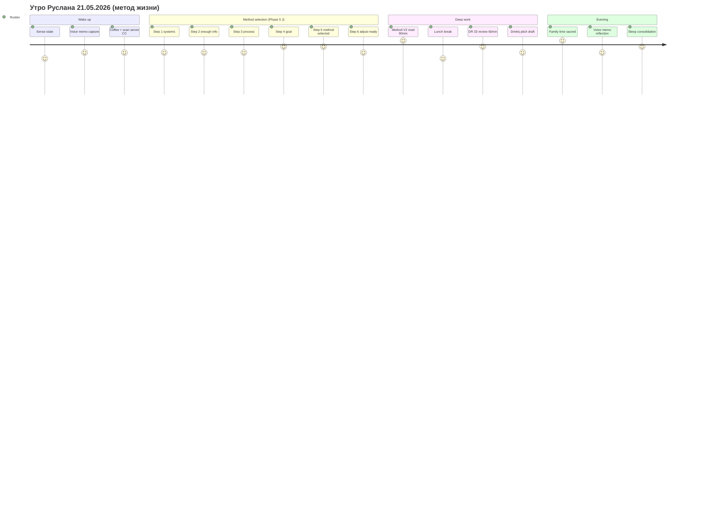
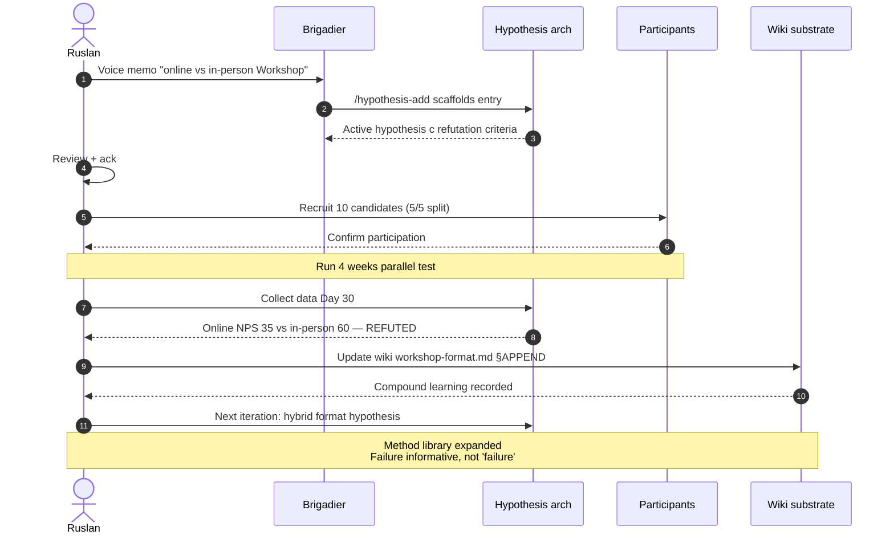
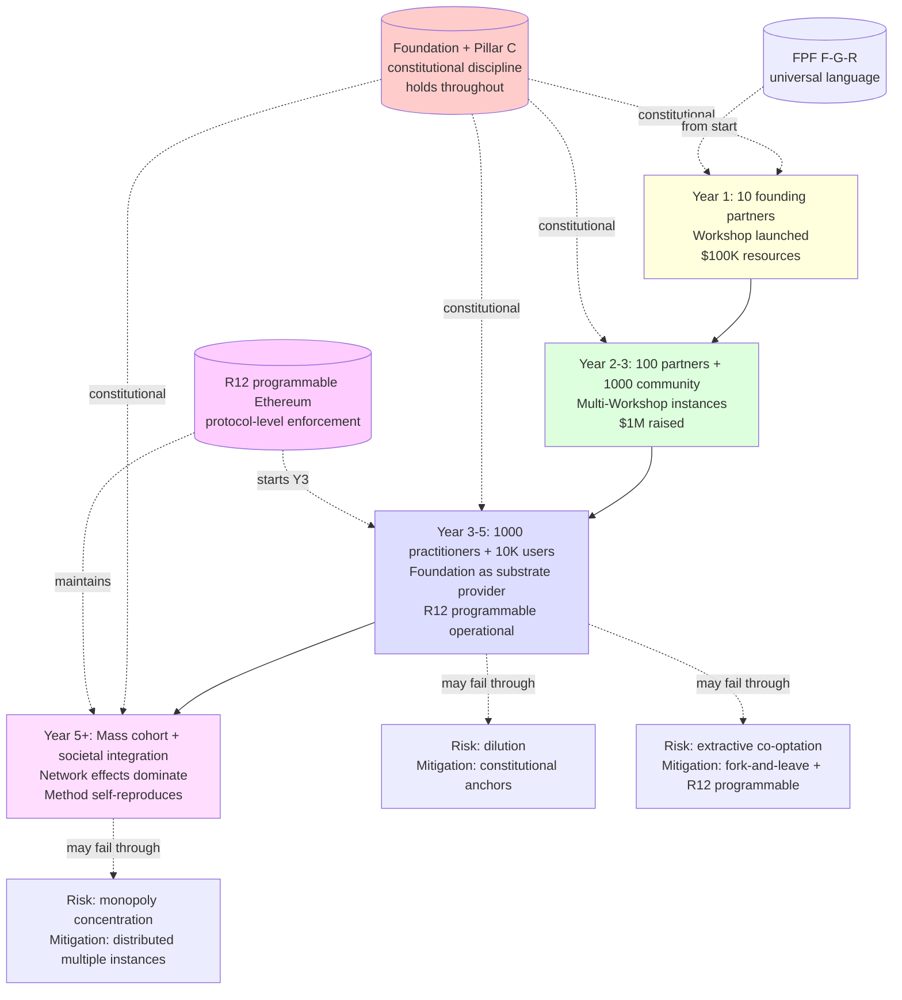

# Phase 14 — Метод в действии. Пять concrete примеров.

> **Что эта глава делает.** Phase 1-13 — структурный + теоретический материал.
> Phase 14 — **конкретные сценарии**, в которых метод **видно работающим**.
> Не abstract «так может быть»; **vivid stories** от реальной практики.

---

## §A Example 1 — Утро Руслана (метод жизни в действии)

**Сцена:** среда, 21 мая 2026, около 9:00. Берлин. Только проснулся.

### Цикл за цикл — sub-decisions

**9:02 — Wake up. Sense.**

Глаза открываются. Тело сигналит: энергия средняя, голова чистая, мышцы
немного дёргают (вчера засиделся за компьютером допоздна). Это **первый
sense** дня (Phase 2 петля обратной связи).

**Метод:** не открывать сразу Telegram. Это **выученный паттерн** —
немедленный input телефона разрушает morning calm. Установленный habit
(Phase 5 §C method library).

**9:05 — Voice memo.**

Берёт телефон. Открывает recorder. Говорит 4 минуты — про что подумал в
полусон. Идеи о Method V2, мысли про Дмитрия (потенциальный partner),
тревога о finansах. Voice memo → server CC → pipeline (Phase 10 exocortex
extension).

**Метод:** дать сырую информацию, не пытаться оценить в момент дачи. Это
**Phase 4 active consumption** — externalize мысли в substrate перед
переработкой.

**9:09 — Coffee + просмотр overnight server CC output.**

Параллельно с кофе — открывает Mac. Смотрит, что серверная Claude сделала
за ночь:
- Method V2 partial output (это другой prompt, не текущая Cloud Cowork
  session)
- DR-26 unit-econ deep dive update
- KA-03 CRM 169 records pull complete

**Cognitive distribution в действии (Phase 10 §E Hutchins).** Распределённая
cognition: пока спал, ROY swarm и server CC работали. Утренний catch-up =
sync с distributed processing.

**9:25 — Метод выбора методов на день (Phase 5 §J explicit).**

Сегодня **complex domain** (Phase 5 §B.4 Cynefin) — много активностей, не
ясно, какое наиболее value. Идёт на full **6-step мета-метод**:

- **Step 1: Какие системы влияют?** — time (есть 4-6 hours focused), energy
  (medium), commitments (Slack DR-33 review, Method V2 review, Дмитрий pitch
  draft, family evening). Это **inventory** перед выбором.
- **Step 2: Достаточно инфо?** Yes. Не нужно research больше — повседневный
  выбор, не stakes high. **Satisficing point** reached (Phase 5 §J.5).
- **Step 3: Process.** Method V2 review = high leverage (это **мой** prompt;
  если что-то off, влияет на 17-22h работы). DR-33 review = important но
  не urgent. Дмитрий pitch = depends on energy peak. Family — non-negotiable.
- **Step 4: Goal.** Cohesive output dosage — Method V2 substantive read +
  ack DR-33 + family evening **не пропустить**. (R12 self-extraction check:
  не overcommit; family time = priority over even work.)
- **Step 5: Selected method:** 90-min Method V2 read first (peak energy);
  60-min lunch; 60-min DR-33 review; 60-min Дмитрий pitch draft (если
  energy позволяет); family evening sacrosanct.
- **Step 6:** Adjust during day if signals appear (e.g., если energy
  крашится после lunch — postpone Дмитрий pitch к завтра).

Время на мета-метод: ~10 минут explicit. Через 38 дней practice — становится
**estimated** ~3-5 минут. Compound mastery (Phase 3 §F deliberate practice).

**9:35 — Start Method V2 read.**

Phone в away mode. Bluetooth headphones (соседи строят, нужна звуковая
изоляция). Open Foundation v1.0 LOCKED Tomes Part 1-11 + Pillar C + this
V2 doc → start reading.

**Flow state engaged (Phase 3 §E).** Задача — read и react substantively.
Уровень сложности — match'ит навык (4 года substrate awareness; new V2
material). Энергия в плюс — не выгорание, а **продуктивная concentration**.

### A.1 Что демонстрирует этот example

| Phase | Применённая концепция |
|---|---|
| 1 | Информация (voice memo → pipeline) |
| 2 | Sensor (wake-up state assessment) + adjustment (snooze Telegram) |
| 3 | Growth mindset (continuing despite late night yesterday); flow conditions |
| 4 | Active consumption (voice memo → externalize) + compound learning |
| 5 | Method selection 6-step (§J meta-method); OODA на micro level |
| 6 | Self-knowledge (reverse engineering own habits, e.g., Telegram pattern) |
| 7 | R12 self-extraction check (family time priority) |
| 9 | FPF F-G-R awareness inside voice memo |
| 10 | Exocortex (server CC distributed; Mac substrate access) |

**Все phases применяются concurrently**, не последовательно. Это **integrated
practice**.

---

## §B Example 2 — Hypothesis test cycle (метод развития в действии)

**Сцена:** идея пришла в голову — «может быть, лучше Workshop делать online
а не in-person для Phase 1». Как обработать через метод развития?

### B.1 Полный цикл

**Step 1: Voice memo / capture.**

Без воды на следующий день — voice memo: «думаю Workshop online может быть
лучше — geographic reach + lower cost; но social bonding слабее; нужно
hypothesize».

**Step 2: /hypothesis-add → active/**

Open Claude Code. Run `/hypothesis-add` skill. Brigadier scaffolds:

```yaml
---
id: hyp-workshop-online-vs-inperson-2026-05-22
title: Online Workshop format works ≥80% as well as in-person for Phase 1 first-cohort
F: F3
G: jetix-phase-1
R: R-low (speculative; needs test)
status: active
date_added: 2026-05-22
---

## Hypothesis statement
Online Workshop format (Zoom + collaborative document + breakout rooms)
delivers ≥80% of value of in-person Workshop for Phase 1 first-cohort
(measured by: completion rate, NPS, post-workshop activity).

## Refutation criteria
- Если в parallel test first 5 participants online vs 5 in-person:
  - Completion rate online <60% (in-person typically 90%+) → refuted
  - NPS online <30 (in-person typically 60+) → refuted
  - 30-day post-workshop activity online <50% in-person baseline → refuted

## Test design (R12 paired-frame)
- 10 candidates total, split 5/5 random
- Same content, same trainer, same duration
- Track 3 metrics для 30 days post
- Decision: confirm/refute by Day 30+ data

## Alpha-machinery (way-of-working)
- Recruit 10 candidates from KA-03 cohort
- Schedule 4 weeks
- Monitor weekly check-ins
```

**Step 3: Test design — R12 paired-frame check.**

Для каждого participant — explicit что они получают (Workshop access +
substrate) **и** что от них ожидается (4 weeks engagement + survey
participation + 30-day follow-up). R12 conformance — не «извлекаем из
participants для нашего обучения», а **mutual value exchange**.

**Step 4: Execute test.**

10 candidates через KA-03 outreach (Tier-1 ack queue currently имеет 14).
Random assignment. Run 4 weeks.

**Step 5: Measure.**

День 30 — data collected:
- Online cohort: 4/5 completed (80%); NPS 35; activity 60%
- In-person cohort: 5/5 completed (100%); NPS 70; activity 85%

**Step 6: Closure.**

Hypothesis **refuted** на NPS criterion (35 vs 60 baseline — well below). 
Completion ОК но retention quality clearly weaker.

**Step 7: Compound learning extraction.**

Update wiki/concepts/workshop-format.md §APPEND:

> 2026-06-22 — Online vs in-person test: hypothesis online ≥80% refuted.
> Specifically NPS gap (35 vs 60) significant. Completion gap (80 vs 100%)
> also material. Online может быть viable supplementary, не replacement.
> Re-test idea: **hybrid format** — kickoff in-person + 4-week online +
> closing in-person — might capture geographic reach без losing bonding.

Method library updated. Next iteration tests hybrid.

### B.2 Что демонстрирует этот example

- **Phase 2 self-management** в applied form: hypothesis = explicit setpoint;
  outcome = sensor; closure = adjustment
- **Phase 3 growth mindset**: refutation не «провал», a **valid информация**
- **Phase 4 compound learning**: each cycle adds to wiki + library
- **Phase 5 method anatomy**: full 7-step cycle (Plan → Execute → Learn →
  Reflection)
- **Phase 7 R12 paired-frame** explicit в test design
- **Phase 9 FPF F-G-R**: hypothesis carries F:G:R triple

Это **operational discipline**, не abstract concept. **38 дней** Ruslan'а
substrate содержит десятки таких циклов.

---

## §C Example 3 — Recipient learning Jetix-method (новичок)

**Сцена:** новый человек, узнал об Jetix через KA-03 outreach, заинтересован.
Как он переходит от curiosity к compound participation?

### C.1 Journey

**Step 0: Initial contact (DR-33 communication best practices).**

Outreach сообщение R12-paired-frame: «вижу overlap между твоей работой [X]
и моим substrate [Y]; интересны мне твои thoughts on [Z]; если interest есть,
30-min call?»

Не «купить мне», а **invitation в peer-level conversation**.

**Step 1: Read one-pager (5-min).**

Получает link на `decisions/strategic/ONE-PAGER-FPF-SUBSTRATE-2026-05-21.md`.
5-минутный elevator pitch — что Jetix, что offer, что ask. Self-paced.

**Step 2: Read this Method V2 (60-min — testing FPF universal language thesis).**

Если one-pager заинтересовал — следующий уровень. Method V2 ~30K-50K
consolidated. Заявленное reading time: **60 минут** для core understanding
(не 100% deep dive).

Phase 9 FPF thesis test: **может ли recipient понять core method за 60
минут**? Если да — universal language thesis holds. Если массово нет —
нужно refine.

**Step 3: Try /hypothesis-add для своей идеи.**

Self-application — recipient берёт **одну** свою idea и применяет hypothesis
arch format. Не «подписаться на Jetix», а **попробовать tool**.

Это **R12 conformant** — value to recipient независимо от того, продолжит
он или нет. Если идея refutes ему полезно. Если нет — он узнал, как
формализовать.

**Step 4: Use Wiki v2 для своих заметок.**

Может clone-ить Jetix wiki structure (it's open) и **adapt для своих
notes**. Substrate template = transferable.

**Step 5: Connect с community.**

Если интерес сохранён — joins community channel (Discord / Telegram /
TBD). Sees other participants. **Relatedness** (Phase 3 §C SDT).

**Step 6: 3-6 months hands-on.**

Participates в Workshop. Applies Jetix-method к своей жизни. Tests
hypotheses. Builds CRM. Updates substrate.

**Step 7: After 3-6 months — certified practitioner.**

«Сertified» — proxy для actual capability. Includes:
- Successful application of meta-method (Phase 5 §J) к ≥3 high-stakes decisions
- ≥10 hypothesis cycles completed (with closures)
- Substrate of own ≥10K words с FPF F-G-R discipline
- Community participation (helping ≥1 other practitioner)

**Step 8: Tier 3 — own meta-strategy.**

Дизайнит **свою** meta-strategy выбора методов (Phase 5 §J.6). Не «копия
Jetix», а **own adaptation**. Может разойтись с Jetix через fork-and-leave —
R12 protection. Может оставаться partner — voluntary.

### C.2 Что демонстрирует этот example

- **R12 conformance throughout**: value to recipient независимо от
  conversion; fork-and-leave protected
- **3-tier funnel** Phase 1 → 2 → 3 explicit
- **Phase 8 scale plan** Stage 2 → 3 mechanism
- **Phase 9 FPF universal language thesis** в test condition
- **Phase 4 compound learning** на recipient side

---

## §D Example 4 — Couple-of-founders coordination

**Сцена:** два founders с complementary expertise (один — technical / другой
— sales). Как координируются через Jetix-method?

### D.1 Setup

| Aspect | Person A (technical) | Person B (sales) |
|---|---|---|
| Domain expertise | Engineering, AI, system design | Customer development, partnerships, communications |
| Substrate visible | Both have access к shared wiki | Both update CRM, hypothesis arch |
| Roles | Engineering-lens + systems-lens | Mgmt-lens + investor-lens |

### D.2 ROY swarm pattern applied

Каждый founder operates as **2 expert lenses**:
- A applies engineering + systems lens to all major decisions
- B applies mgmt + investor lens to all major decisions
- Both contribute philosophy lens on demand (cross-trained)

When major decision arises (e.g., «do we accept this partnership»):
1. Both apply their lenses → produce independent perspectives
2. Brigadier role (rotating; or designated) synthesizes
3. AP-6 dissent atoms preserved — if A or B strongly disagrees, не
   suppressed
4. Final ack — collaborative с explicit minority view recorded

### D.3 Shared substrate as «memory»

Both founders contribute к same wiki + same CRM + same hypothesis arch.
**Loss of one founder ≠ loss of substrate** — Distributed cognition (Phase
10 §E Hutchins).

Backup discipline critical — если substrate damaged, partial cognitive
disability.

### D.4 Differences resolved через AP-6

Не «consensus or fight». **Dissent atom preservation** — disagreement
**recorded**, not erased. If A thinks B's decision wrong:
- A's perspective recorded в decision document
- B's decision proceeds (если в B's domain)
- 90-day review — was A's concern validated?

Это **R12 internal**. Founder не должен «победить» другого founder для
своего perspective being valid.

### D.5 Decisions via R1 sole strategist (per defined roles)

В Jetix top-level — Ruslan = R1 sole strategist. Когда couple-of-founders
apply Jetix-method, **они должны определить** свой R1:
- Один из них — sole strategist (asymmetric)
- Both — co-strategists с explicit conflict resolution mechanism
- Rotating — depending on domain
- External advisor — board structure

Это **constitutional choice**, не наивный «equal partnership». Нужно
**explicit governance design**.

### D.6 Что демонстрирует этот example

- **Phase 6 §H meta-control** — couple operates at L1-L2; не direct manage
  каждое поле
- **Phase 9 FPF** for shared language critical (избегает semantic drift)
- **Phase 10 distributed cognition** — both founders + substrate = unified
  cognitive system
- **Pillar C R1 / IP-1** — explicit strategist role
- **AP-6 dissent preservation** built into process

---

## §E Example 5 — Society-level method propagation

**Сцена:** через 5+ лет — как метод действительно стал **общественным
substrate**?

### E.1 Cascade timeline

**Year 1 (2026-2027):**
- Method articulated (this V2 doc + V1 architecture)
- Tested by 10 founding partners
- First-cohort Workshop launched
- $100K → possibly $1M resources

**Year 2-3 (2027-2028):**
- 100 active partners
- 1000 community members
- Refined через partner feedback (multiple Workshop iterations)
- Documented as **best-practice reference**
- First academic / research interest pickup

**Year 3-5 (2028-2030):**
- 1000+ certified practitioners
- 10K+ community users
- Multiple Workshop instances в different countries / languages
- Foundation as **substrate provider** для third-party Workshops
- R12 programmable Ethereum substrate operational

**Year 5+ (2030+):**
- Mass cohort с certified practitioners
- Method **integrated** в education curricula (если adoption follows pattern)
- Substrate **forks** create distinct adaptations
- **Network effects** dominate — method **самовоспроизводится**

### E.2 What this looks like in society

Imagine:
- A new tech worker entering field uses Jetix-method без знания о Jetix
  (term enters general vocabulary)
- Workshop format adapted by various educational institutions
- «Method of methods» / metacognitive layer 3 (Phase 5 §J) **mainstream**
- FPF F-G-R triple — common epistemic protocol в high-stakes coordination
- Hypothesis arch operational — standard practice в startup community
- R12 anti-extraction — recognized cooperative design pattern
- Solo founders с AI substrate — standard career path

Это **не утопия**. Это **plausible extrapolation** if Stage 2-4 cascade
executes.

### E.3 Failure modes at society scale

Equally possible:
- Method **dilutes** beyond recognition (cultural drift; semantic loss)
- Successful pieces co-opted by **extractive** alternatives (R12 dropped)
- Concentration в few large instances (vs distributed network)
- Forgotten — replaced by next-generation methods (this is OK; methods evolve)

Phase 8 §E failure modes apply at society scale.

### E.4 R12 protection через scale

Critical для society-level: **fork-and-leave** + programmable substrate
discipline. Without these, society-scale Jetix-method becomes vulnerable
к monopoly capture, just like every cooperative movement before.

Mondragón has lasted 70+ years because of constitutional discipline +
democratic governance. Wikipedia 25 years through similar mechanisms. Jetix-
method has new tool — programmable enforcement — but **same underlying
principle**.

### E.5 Что демонстрирует этот example

- **Phase 8 scale plan** Stage 4 manifested
- **Phase 12 §G positive virus** distribution model в действии
- **Phase 7 R12** structural protection critical
- **Phase 10 exocortex** integrated в commonplace tool kit

---

## §F Mermaid D25 — Example 1 morning (journey)



---

## §G Mermaid D26 — Example 2 hypothesis cycle (sequenceDiagram)



---

## §H Mermaid D27 — Example 5 society cascade (graph TD)



---

## §I Что отсюда следует

1. **Метод видно работающим в реальной практике.** Не abstract theory; 5
   concrete sценариев показывают integration multiple phases concurrently.

2. **Утро Руслана** = applied integration всех 10 phases в continuous
   practice. Это не «do steps 1-10»; это **way of being**.

3. **Hypothesis cycle** = applied falsifiability discipline. Refutation
   = learning, не «провал».

4. **Recipient journey** = 8-step path от curiosity до Tier 3 mastery, R12-
   conformant throughout.

5. **Couple-of-founders** = ROY swarm pattern transferable beyond Ruslan
   solo. Distributed cognition с shared substrate.

6. **Society-level** = realistic extrapolation 5-year horizon, **с
   explicit failure modes**.

Phase 15 (diagrams pass) проведёт audit все диаграммы в этом deliverable.
Phase 16 — assembly main deliverable + summary.

---

## §J Cross-cite

- Phase 5 §J — meta-method 6-step применён в Example 1
- Phase 4 — compound learning через Hypothesis cycle Example 2
- Phase 7 — R12 paired-frame в Example 2 + 3
- Phase 8 — scale plan manifested в Example 5
- Phase 9 — FPF universal language critical в Example 4
- Phase 10 — exocortex throughout Examples 1, 4
- Phase 12 — positive virus distribution Example 5

---

*Phase 14 closure 2026-05-21. brigadier-scribe; 5 examples с full phase
integration demonstration.*
