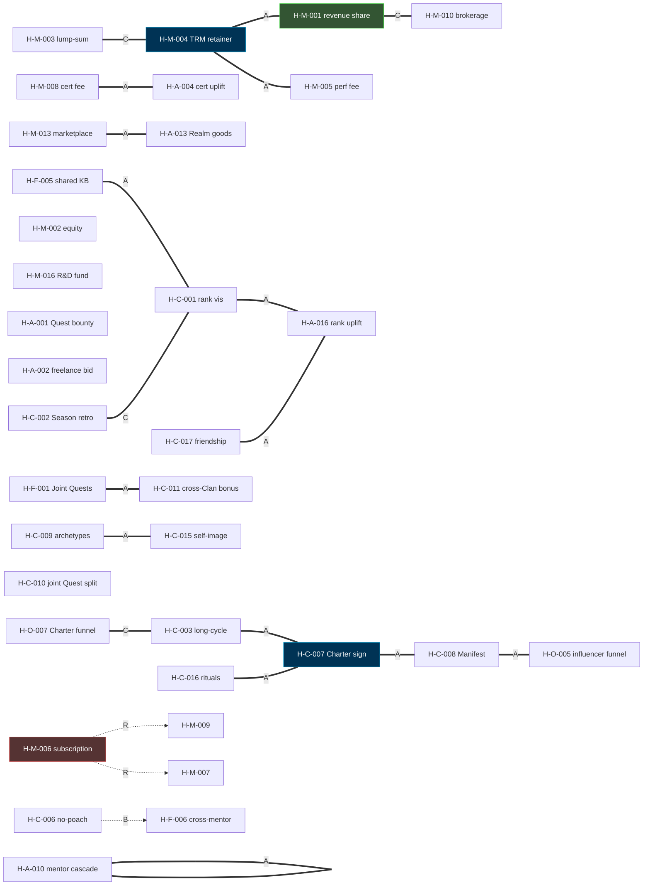

# Wave 2 — Cross-Pollination Matrix

> 148 total H (75 v0 + 73 sub-H from Q expansion).
> Full 148×148 matrix is 21,904 cells; condensed top-N format per prompt §3.
> Cell legend: **C** = Combines well · **N** = Neutral · **B** = Blocks/Conflicts · **A** = Amplifies (strong synergy) · **R** = Replaces

---

## §1 Matrix coverage strategy

Full pairwise (75 + 73)² / 2 = 10,952 unique pairs.  
Most pairs are **N (neutral)** — independent mechanisms.  
**Salience analysis:** ~5-10% of pairs are non-N (C / A / B / R). This file catalogues:
- Top 20 strongest C/A combinations (synergies)
- Top 10 strongest B/R conflicts
- Top 10 within-cluster amplifiers (per H-category)
- Mermaid graph of top-30 strongest edges

---

## §2 Top 20 strongest C/A combinations (synergies)

| # | H-X | H-Y | Type | Why |
|---|------|------|------|-----|
| 1 | H-M-004 (TRM retainer) | H-M-001 (revenue share) | **A** | Mgmt + perf classical hedge fund / PE structure; base + upside |
| 2 | H-M-005 (perf fee) | H-M-004 (TRM retainer) | **A** | Classical 1/20 hedge fund — Jetix model verbatim |
| 3 | H-C-001 (rank visibility) | H-A-016 (external rate uplift) | **A** | Realm rank → external market value (Toptal precedent) |
| 4 | H-C-003 (long-cycle commit) | H-C-007 (Charter signing) | **A** | Schelling commitment + Cialdini consistency stack |
| 5 | H-C-007 (Charter signing) | H-C-008 (Manifest pattern) | **A** | Identity affirmation + values filter combo |
| 6 | H-C-008 (Manifest) | H-O-005 (Influencer funnel) | **A** | Manifest filter → activation funnel; Phase 1 primary |
| 7 | H-F-001 (Joint Quests) | H-C-011 (cross-Clan bonus) | **A** | Bonus pool incentivizes cross-Clan participation |
| 8 | H-A-010 (mentor cascade) | H-A-011 (placement commission) | **A** | Mentor incentive aligned across stages |
| 9 | H-M-013 (marketplace fee) | H-A-013 (Realm goods) | **A** | Marketplace + creator supply side |
| 10 | H-C-009 (archetypes) | H-C-015 (self-image) | **A** | Schelling focal + Cialdini Unity identity |
| 11 | H-F-005 (shared KB) | H-C-012 (contribution rewards) | **A** | Network effect + contribution incentive (Wikipedia precedent) |
| 12 | H-C-002 (Season retro) | H-C-013 (rank decay) | **C** | Season boundary = rank update trigger |
| 13 | H-O-007 (Charter funnel) | H-C-003 (long-cycle) | **C** | L1 sign → 10-15y commitment via Charter |
| 14 | H-M-008 (cert fee) | H-A-004 (member rate uplift) | **A** | Cert supply + member market demand |
| 15 | H-O-010 (2h strategy session) | H-O-002 (discovery funnel) | **A** | 2h upgrade compounds discovery quality |
| 16 | H-C-016 (rituals) | H-F-004 (Realm-wide events) | **A** | Season events ARE the rituals |
| 17 | H-A-007 (joint ventures) | H-M-015 (Jetix-owned products) | **C** | Joint ventures can become Jetix products |
| 18 | H-C-017 (real friendships) | H-A-018 (network equity premium) | **A** | Dunbar friendship → external opportunity warmth |
| 19 | HQ-MM-001-A (5 core parallel) | H-O-002 (discovery funnel) | **A** | Multi-H deploy creates discovery funnel branching |
| 20 | HQ-WO-004-E (Cooperation Commandment) | H-C-008 (Manifest) | **A** | Commandment substrate aligns with Manifest values |

---

## §3 Top 10 strongest B/R conflicts

| # | H-X | H-Y | Type | Why conflict |
|---|------|------|------|--------------|
| 1 | H-M-017 (Standards Body) | Tier 2 R12 anchor | **B** | Monopoly violates R12; surfacing only |
| 2 | H-M-006 (subscription) | H-M-007 (progression fee) | **R** | Same audience double-charged → R12 concern |
| 3 | H-M-006 (subscription) | H-M-009 (rank premium) | **R** | Same gated content; pick one or unify |
| 4 | H-M-013 (marketplace fee) | H-M-009 (rank premium) | **B** | Marketplace member + premium tier = double monetization same flow |
| 5 | HQ-RC-011-E (native token) | Tier 2 §4.2 anti-pump | **B** | Native token violates «safe + adequate, not crypto-pump» |
| 6 | HQ-JL-014-B (Próspera) | §12 R12 anchor | **B** | Political fragility risks member protection |
| 7 | HQ-JL-014-C (Liberland) | §12 recognition | **B** | Unrecognized = legitimacy crisis |
| 8 | H-M-002 (equity) | H-M-004 (retainer) | **R** | Partner picks one or other; mutually exclusive |
| 9 | H-C-006 (no-poach) | H-F-006 (cross-Clan mentor) | **B** | Mentor cascade across signatories may functionally violate no-poach |
| 10 | H-M-017 + H-F-007 (Tribunal) | combined | **B** | Standards Body + Tribunal both monopoly risk; can't both |

---

## §4 Within-cluster strongest amplifiers

### H-M cluster (Jetix monetization)
- H-M-001 + H-M-004 + H-M-005 = TRM mgmt+perf+revenue-share core stack
- H-M-003 + H-M-004 = lump-sum + retainer agency funnel
- H-M-010 + H-M-013 = brokerage + marketplace fee non-overlapping streams

### H-A cluster (Audience monetization)
- H-A-001 + H-A-002 = Quest bounty + freelance bidding parallel revenue
- H-A-004 + H-A-016 + H-A-017 = cert + rank + speaking premium stack
- H-A-010 + H-A-011 + H-A-012 = mentor cascade × placement × cohort triplet

### H-C cluster (Cooperation)
- H-C-001 + H-C-002 + H-C-003 = M-A layer triad (visibility + retro + horizon)
- H-C-004 + H-C-005 = Clan + Faction reputation aggregation
- H-C-007 + H-C-008 + H-C-009 + H-C-015 + H-C-016 = identity layer pentagon

### H-F cluster (Federation)
- H-F-001 + H-F-003 + H-F-006 = cross-Clan triplet (Quest + partnership + mentor)
- H-F-005 + H-F-008 + H-F-010 = Realm-wide infrastructure triplet (KB + passport + leaderboard)

### H-O cluster (Onboarding)
- H-O-005 + H-O-007 + H-O-010 = L1 funnel triplet (influencer + Charter + 2h session)
- H-O-002 + H-O-003 + H-O-004 = discovery → workshop → TRM ladder

---

## §5 Mermaid graph — top 30 strongest edges

---

## §6 Phase-fit clustering

| Phase | H-X strongly fitting Phase |
|-------|----------------------------|
| Phase 1 (1-100 members) | H-M-001, H-M-003, H-M-004, H-M-010, H-C-001, H-C-002, H-C-003, H-C-007, H-C-008, H-C-009, H-C-010, H-A-001, H-A-002, H-A-016, H-O-002, H-O-005, H-O-007, H-O-010 |
| Phase 2 (100-10K) | + H-M-006, H-M-008, H-M-013, H-M-015, H-M-016, H-C-005, H-C-011, H-F-001, H-F-003, H-F-005 |
| Phase 3 (10K-100K) | + H-M-011, H-M-012, H-M-014, H-F-007, H-F-008, H-F-010 |
| Phase 4+ (100K+) | + H-M-017 (surface only / R12 risk), H-M-018 |

---

## §7 R12 audit propagation through matrix

Pairs where R12 audit on one H affects another:
- H-M-001 + H-M-005 — if attribution methodology unclear in H-M-001, propagates to H-M-005
- H-M-006 + H-M-007 + H-M-009 — three concurrent member-side fees compound R12 concern
- H-M-011 + H-M-008 — data licensing + cert programme touch member data; aggregate consent burden
- H-M-013 + H-M-014 — marketplace fee + TRM-trade fee total transaction cost on member
- HQ-RC-011-E + H-M-017 — token + Standards Body double extraction risk

**Phase 1 deployment with all 7 «concern» H-M simultaneously would create aggregate R12 violation risk — even though individual cards pass mitigated.** **Surface caveat, не recommend selection.**

---

## §8 Provenance

[src: 75 v0 H cards (this dir hypothesis-test-designs/) + 73 sub-H from q-expanded-as-hypotheses.md | commit eebdcc2]
