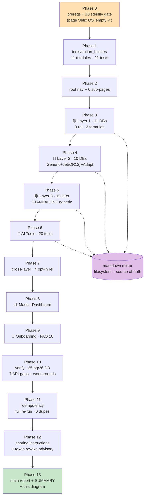

# 🏗️ Notion Build 2026-05-25 — INDEX

Реальная сборка Jetix-шаблонов в Notion через API. Стерильная песочница «Jetix OS».
F2 execution per v2 spec. R11 action class под Ruslan variant-A ack.

## Read order
1. [00-SUMMARY.md](00-SUMMARY.md) — quick read ≤700w
2. [Main report](../../decisions/strategic/NOTION-BUILD-REPORT-2026-05-25.md) — полный
3. Per-phase logs: [00-prereqs](00-prereqs-passed.md) · [01-module](01-helper-module.md) ·
   [02-root](02-root-page.md) · [03-L1](03-layer-1.md) · [04-L2](04-layer-2.md) ·
   [05-L3](05-layer-3.md) · [06-ai-tools](06-ai-tools.md) · [07-relations](07-relations.md) ·
   [08-dashboard](08-dashboard.md) · [09-onboarding](09-onboarding.md) ·
   [10-audit](10-verification-audit.md) · [11-idempotency](11-idempotency-check.md) ·
   [12-sharing](12-sharing-instructions.md)
4. Markdown mirror (source of truth): [notion-mirror/](notion-mirror/)

## Build flow

## Result

35 sub-pages · 36 databases · 235 props · 44 relations · 2 formulas. Idempotent.
Sterile-shell held (zero existing-data migration). Awaiting Ruslan UX walkthrough +
token revoke.
