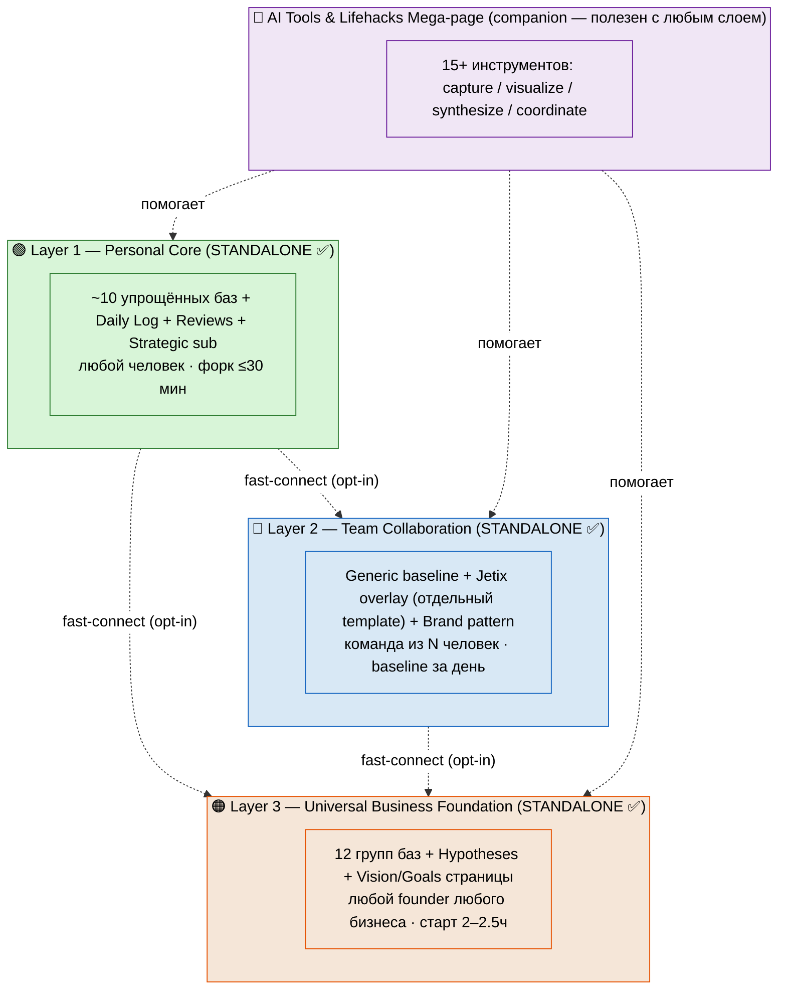
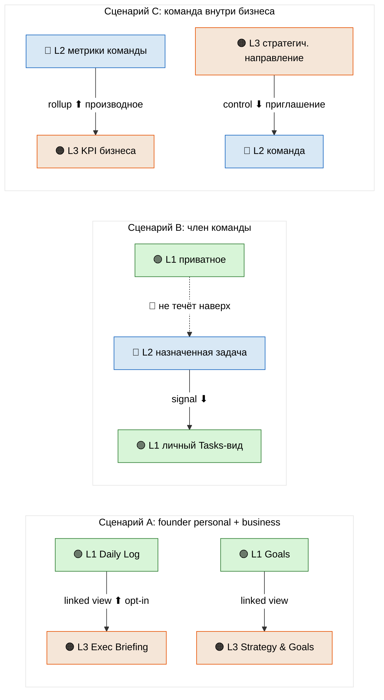

# Phase 1 — Обзор 3 слоёв + STANDALONE + fast-connect

> **Что в этой фазе.** Карта всей архитектуры на одной странице: 3 слоя, каждый
> **самодостаточен** (standalone), плюс механика опционального соединения (fast-connect).
> Портрет аудитории и fork-friendly заметки по каждому слою. Две схемы.

---

## §1 Три слоя в двух словах

| Слой | Что это | Для кого | Старт (simplified baseline) | Standalone? |
|---|---|---|---|---|
| 🟢 **Layer 1 Personal Core** | личная система: дневник, проекты, идеи, люди, гипотезы, цели, финансы | любой человек (форк за час) | ≤30 мин | ✅ да |
| 🔵 **Layer 2 Team Collaboration** | команда в общем workspace: роли, биржа навыков, Charter, честное деление, брифинг | команда из N человек | baseline за день / онбординг 1 неделя | ✅ да |
| 🟠 **Layer 3 Universal Business Foundation** | исполнительный взгляд: 12 групп баз (стратегия/финансы/люди/проекты/...) + Vision/Goals | **любой founder любого бизнеса** | 2–2.5 часа | ✅ да |

**Plus отдельный companion-документ:** 🤖 **AI Tools & Lifehacks Mega-page** — 15+ инструментов
для быстрой работы с информацией. Не слой, а спутник: полезен с любым слоем (Phase 5).

**Ключевое отличие от v1:** в v1 была строгая лестница L1→L2→L3 (каждый требовал предыдущего) +
standalone только L4. В v2 — **все три standalone**. Можно начать с любого. Соединение — опция.

---

## §2 ⭐ STANDALONE: каждый слой работает один

Это центральный мандат v2. Разберём по слоям — что значит «работает один».

**Layer 1 один.** Человек форкает Personal Core, заполняет Daily Log, ведёт проекты и идеи.
Ему не нужны команда или бизнес. Это законченный продукт «Personal OS». Аудитория: фрилансер,
студент, любой, кто хочет порядок. *Пример: Дмитрий-trial стартует именно с Layer 1 minimum.*

**Layer 2 один.** Команда (3–10 человек) форкает Team Collaboration, заводит роли и общий
workspace, координируется через брифинг и биржу навыков. Им **не нужен** Personal OS под капотом —
у каждого может быть свой Notion, свой Obsidian, вообще ничего. Layer 2 = «как нам работать
вместе честно». Аудитория: стартап-команда, кооператив, creator + ассистенты.

**Layer 3 один.** Founder форкает Universal Business Foundation, разворачивает minimum (стратегия
+ финансы + проекты + брифинг) за пару часов, видит весь бизнес с одной страницы. Ему **не нужны**
ни Layer 1, ни Layer 2 — это executive-взгляд сам по себе. Аудитория: founder консалтинга / SaaS /
агентства / кооператива.

**Следствие для дизайна:** ни один слой не должен в baseline-схеме *ссылаться* на существование
другого слоя. Связи (relations к чужим базам) появляются **только** если человек включил
fast-connect. По умолчанию каждый слой — замкнутый граф relations внутри себя.

---

## §3 🔌 Fast-connect: опциональное соединение

Standalone не значит «изолированы навсегда». Если человеку нужно — слои соединяются. Но это
**opt-in feature**, не дефолт. Три осмысленных сценария соединения:

### Сценарий A: Layer 1 + Layer 3 (founder personal + business)

Самый частый. Founder ведёт и личную жизнь (Layer 1), и бизнес (Layer 3). Хочет, чтобы:
- личный Daily Log подтягивал executive-брифинг бизнеса (одна утренняя рутина, не две);
- личные Goals (Layer 1 strategic) и бизнес-Goals (Layer 3 Strategy) были рядом;
- личные Projects (side-проекты) и бизнес-Projects Portfolio были видны вместе founder'у.

**Механика:** linked database views (Notion native) — не копирование, а «окно». Founder видит обе
базы; сотрудники бизнеса видят только Layer 3. Подробно в Phase 6.

### Сценарий B: Layer 1 + Layer 2 (член команды видит свой срез)

Член команды держит личную систему (Layer 1) и участвует в команде (Layer 2). Хочет, чтобы
назначенные ему командные задачи появлялись в личном Tasks-виде. **Механика:** Layer 2 публикует
задачу → linked view в личном Layer 1 (signal вниз). Личное наверх **не** течёт (изоляция).

### Сценарий C: Layer 2 + Layer 3 (команда внутри бизнеса)

Бизнес (Layer 3) содержит одну или несколько команд (Layer 2). Метрики команд сворачиваются
(rollup) в KPI бизнеса. **Механика:** агрегация вверх — поднимается *производное* (суммы, статусы),
не сырые данные команды. Подробно в Phase 6.

**Правило для всех трёх:** соединение поднимает наверх только **opt-in / производное**, вниз —
**сигнал / контроль**. Приватное (личный дневник, здоровье, личные финансы) не течёт никуда.

---

## §4 Портрет аудитории по слоям

| Слой | Кто это | Боль, которую решает | Что НЕ нужно для старта |
|---|---|---|---|
| 🟢 L1 | фрилансер / студент / любой человек; founder для личной части | «хаос в голове и задачах, теряю идеи и контакты» | команда, бизнес, оплата Notion |
| 🔵 L2 | стартап-команда / кооператив / creator+ассистенты | «работаем вместе, но непонятно кто что и как делим деньги» | Personal OS у каждого; Jetix-специфика |
| 🟠 L3 | founder / executive любого бизнеса | «не вижу весь бизнес целиком, всё в разных местах» | Layer 1/2; команда (можно solo founder) |

---

## §5 Fork-friendly заметки по слоям

- **Layer 1** — форк за час, адаптация под себя, использование без любой ассоциации с Jetix.
  Никаких следов «нашей» специфики в base.
- **Layer 2** — три пути форка: (1) взять **Generic baseline** чистым; (2) взять Generic +
  накатить **Jetix overlay** (отдельный template); (3) взять Generic + написать **свой overlay**
  по Brand-pattern (blogger / corporation / startup). R12-специфика живёт только в Jetix overlay.
- **Layer 3** — форк → адаптация под свой тип бизнеса (consulting / SaaS / agency / cooperative).
  Jetix overlay для Layer 3 = **next iteration** (не в этом run'е). Base нейтрален.

---

## §6 Схема ARCH-V2-1 — стек 3 слоёв (standalone-capable)

**Чтение схемы:** три слоя нарисованы как независимые блоки (не вложенные друг в друга — это
важно: они НЕ требуют друг друга). Пунктирные стрелки = fast-connect, **опциональные**. Companion
сверху помогает любому слою, но не является слоем.

---

## §7 Схема ARCH-V2-2 — fast-connect механика (3 сценария)

**Чтение схемы:** вверх (⬆) поднимается только opt-in/производное; вниз (⬇) — сигнал/контроль как
приглашение; приватное (🚫) физически не подключено. Это та же дисциплина приватности, что в Phase 0 §2.

---

## §8 Constitutional posture Phase 1

- **R1 surface only** — обзор + варианты; финальный состав слоёв выбирает Ruslan (§11 main).
- **R2 STRICT** — Foundation не тронут; ссылки на Part 2/4/9/10/11 как reference.
- **R11** — NO Notion API; NO sample real data; схемы = иллюстрации.
- **IP-1 STRICT** — слои = системы; роли = контейнеры; имена-примеры только в Jetix overlay (Phase 3).
- **STANDALONE + SIMPLIFICATION** — оба мандата отражены в таблицах (старт-время, «без чего работает»).

---

*Phase 1 closure. Три слоя = три standalone-системы; fast-connect = opt-in (3 сценария: founder
personal+business / член команды / команда в бизнесе). ARCH-V2-1 (стек standalone) + ARCH-V2-2
(fast-connect). Companion AI Tools — спутник, не слой. Дальше Phase 2 — Layer 1 Personal Core REVISED.*
