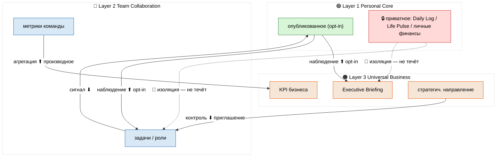
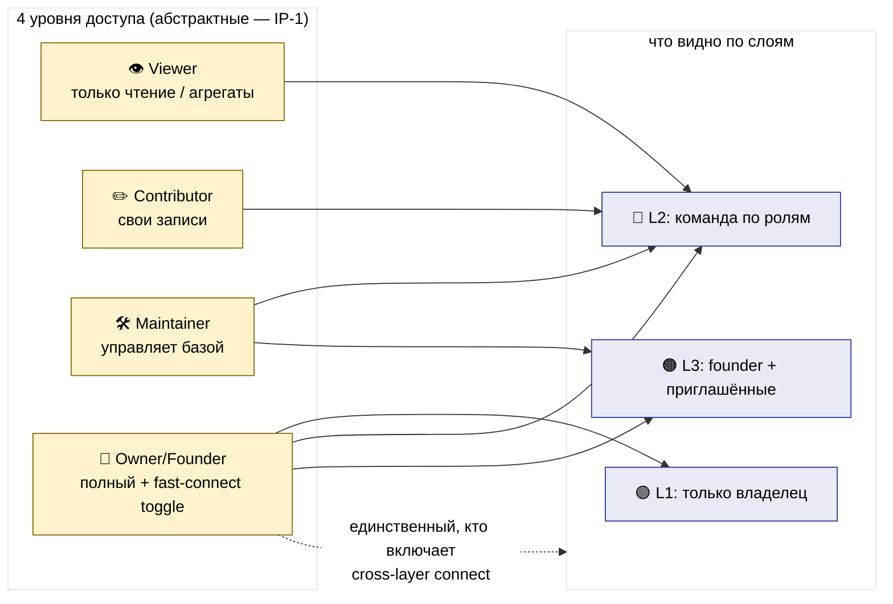

# Phase 6 — Cross-layer mechanics + STANDALONE

> **Что в этой фазе.** Как три слоя соединяются, **если** человек захочет (всё opt-in): потоки
> данных, права, синхронизация в Notion-native терминах. И — главное для v2 — **deep emphasis на
> STANDALONE**: по умолчанию слои НЕ соединены, каждый работает один. Две схемы.

---

## §1 ⭐ STANDALONE deep emphasis (read first)

Прежде чем описывать соединения — зафиксируем дефолт. **По умолчанию три слоя НЕ связаны.**

- Каждый слой = отдельный Notion workspace (или отдельная корневая страница). Внутри слоя relations
  замкнуты на свои базы.
- Ни одна baseline-схема не имеет relation к базе другого слоя «из коробки».
- Соединение (fast-connect) — это **отдельное действие пользователя**: он сам создаёт linked view
  или synced block. Это нельзя «случайно включить».

**Почему так (systems-expert + philosophy-expert линза):** связанность по умолчанию = скрытая
зависимость + хрупкость (изменил базу в одном слое → сломал другой). Несвязанность по умолчанию =
композируемость по требованию. Это Unix-философия: маленькие самодостаточные части, соединяемые
трубой только когда нужно. Поэтому всё ниже — это **меню опций**, не инструкция «соедини всё».

---

## §2 Потоки данных между слоями (все opt-in)

Три типа потока, унаследованные из FPF-линзы Phase 0 §2. Применяем к трём слоям.

| Поток | Откуда → Куда | Что течёт | Триггер | Foundation ref |
|---|---|---|---|---|
| **Наблюдение ⬆** | L1 → L2 / L1 → L3 / L2 → L3 | выбранное человеком (опубликованное) | opt-in publish | Part 2 |
| **Агрегация ⬆** | L2 → L3 | производное (суммы, статусы команд) | rollup formula | Part 2 |
| **Сигнал ⬇** | L2 → L1 / L3 → L2 | уведомления, назначения, @упоминания | событие | Part 2 |
| **Контроль ⬇** | L3 → L2 | стратегич. направление, аудит | решение founder | Part 11 |
| **Изоляция 🚫** | приватное никуда | личный дневник, здоровье, личные финансы | — (нет потока) | Pillar C |

**Красная линия (повтор из Phase 0, критично):** вверх — **только** opt-in / производное; вниз —
сигнал / контроль как приглашение, не приказ; приватное (Daily Log, Life Pulse, личные финансы)
**физически** не подключено к верхним слоям. Утечка архитектурно невозможна (раздельные workspace),
а не «по правилу».

**Конкретные fast-connect маршруты (если включить):**
- L1 Daily Log → L3 Executive Briefing (founder ведёт одну утреннюю рутину)
- L1 Goals → L3 Strategy & Goals (личные + бизнес-цели рядом)
- L1 Projects (личный scope) → L3 Projects Portfolio (бизнес scope)
- L2 назначенная задача → L1 личный Tasks-вид (член команды видит своё)
- L2 метрики команды → L3 KPI бизнеса (rollup)

---

## §3 Схема ARCH-V2-3 — потоки данных (3 слоя, opt-in)

**Чтение:** сплошные стрелки = opt-in потоки (включаются по желанию). Красный блок 🔒 + пунктир 🚫 =
приватное, которое физически не подключено. Вверх — производное/opt-in; вниз — сигнал/контроль.

---

## §4 Матрица прав (simplified — без Jetix-specific 10 ролей в base)

В base описываем **абстрактные категории доступа**, не конкретные роли (IP-1). User мапит свои роли
на категории. Упрощено до 4 уровней доступа × сущности.

| Сущность ↓ \ Доступ → | 👁 Viewer | ✏️ Contributor | 🛠 Maintainer | 👑 Owner/Founder |
|---|---|---|---|---|
| L1 личные базы | — | — | — | только сам владелец |
| L2 Project Catalog | видит | редактирует свои | управляет всеми | полный |
| L2 Charter / роли | видит | — | предлагает правки | утверждает |
| L2 финансы/деление | агрегат | — | видит детали | управляет |
| L3 Briefing / Strategy | по приглашению | — | редактирует | полный |
| L3 Financial | — | — | видит | полный |
| Cross-layer fast-connect | — | — | — | только founder включает |

**Принцип (упрощённый):** в base — 4 уровня (Viewer / Contributor / Maintainer / Owner). Конкретная
матрица 10×10 ролей = это Jetix overlay (Phase 3 Part B), не base. User любой команды мапит «у меня
3 роли» → 3 строки этой матрицы. SIMPLIFICATION: не заставляем разворачивать 100 ячеек на старте.

---

## §5 Схема ARCH-V2-4 — матрица прав (heat, упрощённая)

**Чтение:** 4 абстрактных уровня доступа (слева) проецируются на видимость по слоям (справа).
Owner/Founder — единственный, кто может включить cross-layer соединение. L1 личное видит только сам владелец.

---

## §6 Синхронизация (Notion-native, без кастомного кода)

Всё соединение строится на **родных механизмах Notion** — никакого API, никаких автоматизаций
сверх Notion. R11 Default-Deny: не зовём внешний код.

| Механизм Notion | Что делает | Где применяем |
|---|---|---|
| **Linked database view** | «окно» в базу из другого места (не копия) | L1 Daily Log → L3 Briefing; L2 задача → L1 |
| **Synced block** | один блок контента, синхронный в нескольких местах | Charter / Vision показать в нескольких слоях |
| **Rollup / relation** | сворачивает значения связанных записей | L2 метрики → L3 KPI (внутри connected setup) |
| **Shared view с фильтром** | один и тот же набор данных, разные фильтры по ролям | permissions по §4 |

**Важно:** linked view ≠ копирование. Данные живут в одном месте (source of truth); окна лишь
показывают их. Это держит приватность: убрал доступ к источнику → окно гаснет, копии не остаётся.

---

## §7 Constitutional posture Phase 6

- **R1 surface only** — механика соединения = меню опций; что включать, решает Ruslan/user.
- **R2 STRICT** — Foundation Part 2 / Part 11 / Pillar C — только ссылки.
- **R11 Default-Deny** — только Notion-native механизмы; NO API; NO кастомные автоматизации; NO sample data.
- **IP-1 STRICT** — матрица прав = абстрактные уровни доступа; 10 ролей = Jetix overlay, не base.
- **STANDALONE** — дефолт = не соединено; fast-connect = явное opt-in действие владельца.

---

*Phase 6 closure. Дефолт = три несвязанных standalone-слоя; соединение = opt-in меню (наблюдение ⬆ /
агрегация ⬆ / сигнал ⬇ / контроль ⬇ / изоляция 🚫). Права = 4 абстрактных уровня (IP-1), не 10 ролей.
Синк = Notion-native (linked view / synced block / rollup), без API. ARCH-V2-3 (потоки) + ARCH-V2-4
(права). Дальше Phase 7 — onboarding (уже готов), затем Phase 11 — полный mermaid suite.*
