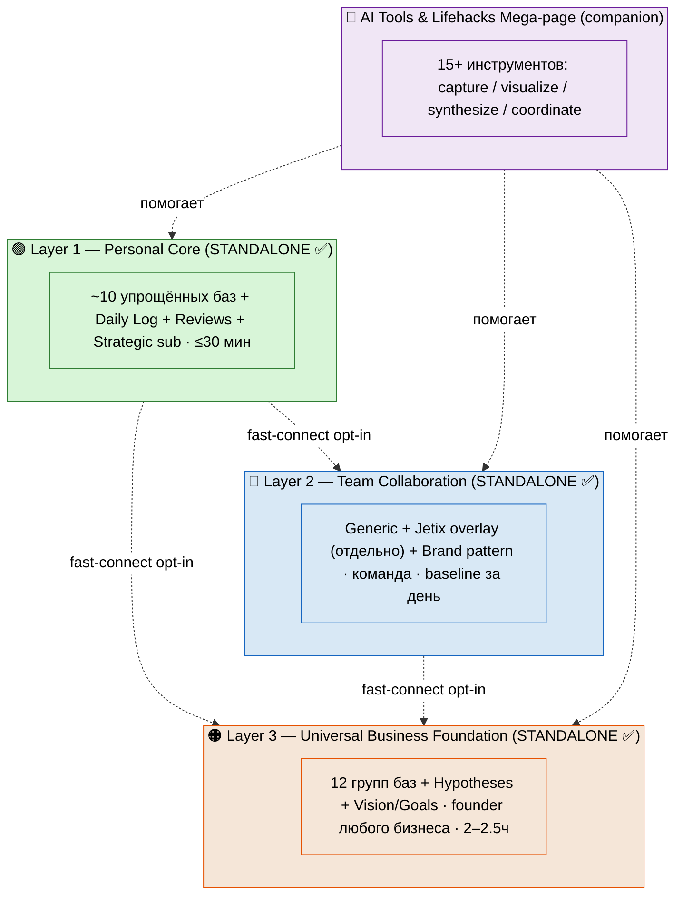
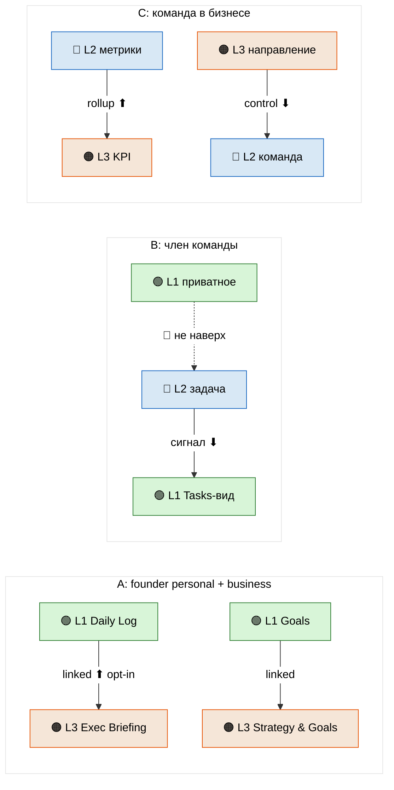
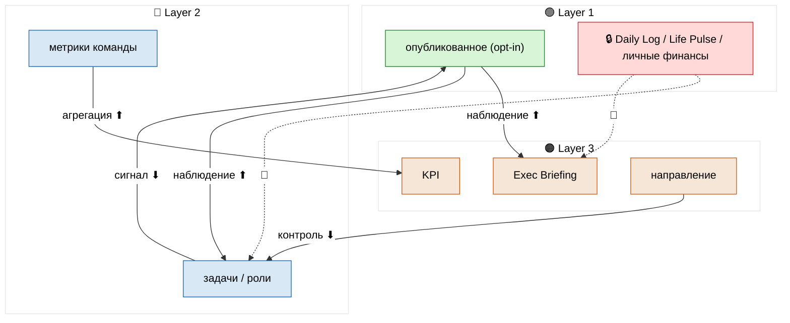
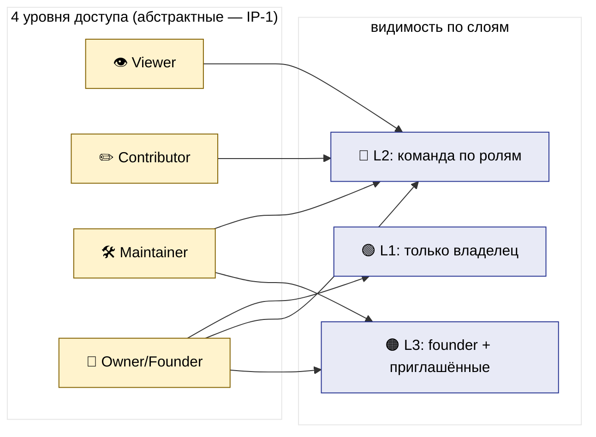
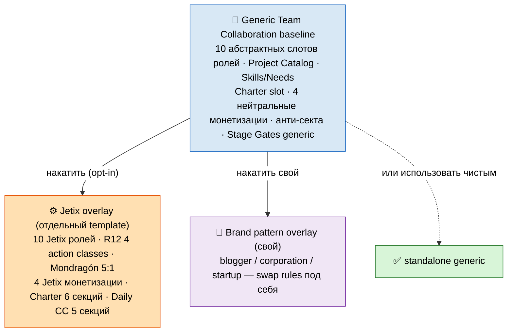
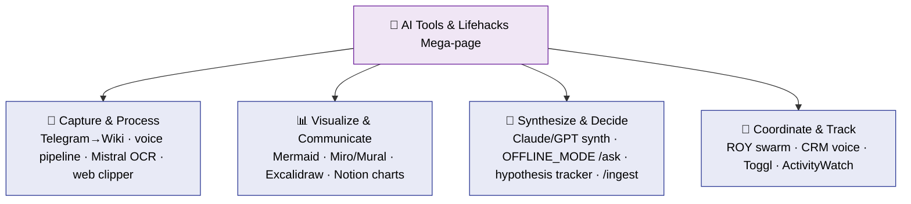
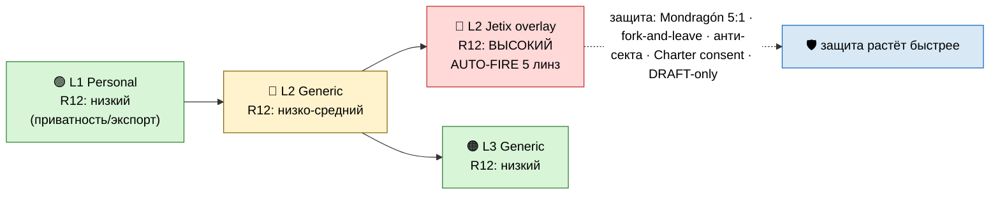
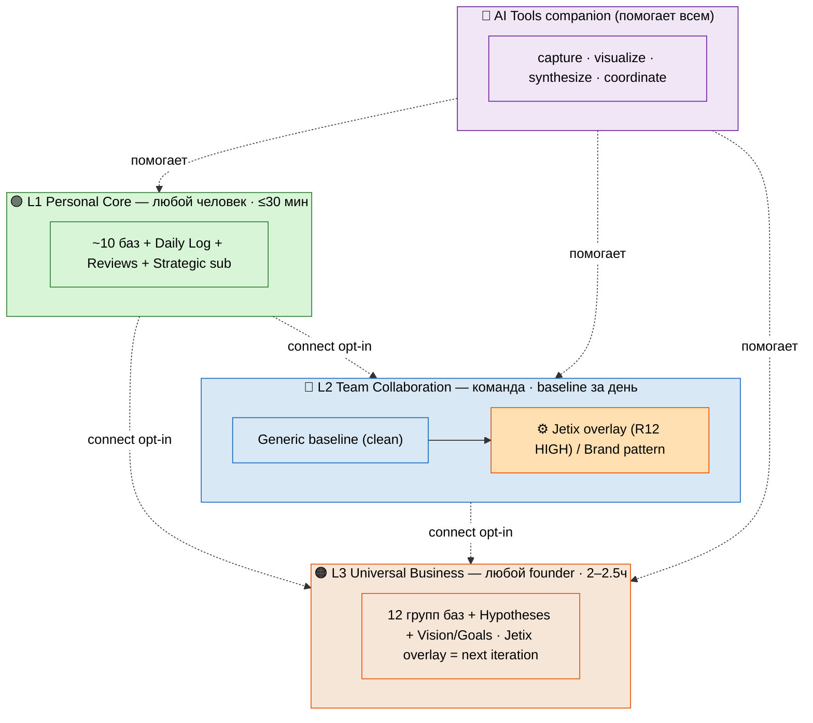

# Phase 11 — Architecture mermaid suite (ARCH-V2-1..ARCH-V2-9)

> **Что в этой фазе.** Полный каталог из 9 схем v2 в одном месте. ARCH-V2-1..4 уже введены в
> Phase 1 и Phase 6 (повторены здесь для полноты каталога); ARCH-V2-5..9 — новые. Единый
> theme-init (чёрный текст для читаемости в Notion / GitHub). Каждая схема + чтение в одну строку.

Каталог: `diagrams/_INDEX.md`. Все схемы встраиваются в main `§9`.

---

## ARCH-V2-1 — стек 3 слоёв (standalone-capable)

> 3 независимых блока (НЕ вложены — не требуют друг друга); пунктир = fast-connect opt-in; companion сверху.

---

## ARCH-V2-2 — fast-connect механика (3 сценария)

> Вверх ⬆ = opt-in/производное; вниз ⬇ = сигнал/контроль; приватное 🚫 не подключено.

---

## ARCH-V2-3 — потоки данных (3 слоя, opt-in)

> Сплошные = opt-in потоки; красный 🔒 + 🚫 = приватное, физически не подключено.

---

## ARCH-V2-4 — матрица прав (упрощённая, 4 уровня, IP-1)

> 4 абстрактных уровня доступа → видимость по слоям; Owner/Founder — единственный включает connect.

---

## ARCH-V2-5 — Layer 2: Generic baseline vs Jetix overlay (split)

> Generic = чистый (абстрактные роли, нейтральная монетизация); Jetix overlay = отдельный fork-able template поверх; Brand pattern = свой overlay.

---

## ARCH-V2-6 — implementation timeline (Build/Run/Scale)

> L1 first → L3 minimum → L2 demo; AI Tools companion параллельно; standalone = можно начать с любого.

```mermaid
%%{init: {'theme':'base', 'themeVariables': {'primaryTextColor':'#000000','textColor':'#000000','lineColor':'#333333','primaryBorderColor':'#333333','primaryColor':'#fafafa','noteTextColor':'#000000','noteBkgColor':'#fff8d5','edgeLabelBackground':'#ffffff'}}}%%
flowchart LR
    subgraph BUILD["🏗️ Build (w1-3)"]
        B1["🟢 L1 core (Дмитрий-trial)"]
        B3["🟠 L3 minimum (founder self)"]
        BAI["🤖 AI Tools companion"]
    end
    subgraph RUN["▶️ Run (w4-8)"]
        R2["🔵 L2 demo overlay (1 партнёр co-design)"]
        RC["первая когорта"]
    end
    subgraph SCALE["📡 Scale (~2027)"]
        SC["L3 Jetix overlay · multi-cohort · Ethereum overlay"]
    end
    B1 --> B3 --> R2 --> RC --> SC
    BAI -. параллельно .-> B1
    classDef build fill:#d8f5d8,stroke:#2e7d32,color:#000;
    classDef run fill:#fff3cd,stroke:#856404,color:#000;
    classDef scale fill:#f5e6d8,stroke:#e65100,color:#000;
    class B1,B3,BAI build;
    class R2,RC run;
    class SC scale;
```

---

## ARCH-V2-7 — AI Tools mega-page hub (4 кластера)

> Companion-документ: 4 кластера инструментов, помогает любому слою.

---

## ARCH-V2-8 — R12 risk overlay (растёт со слоем; AUTO-FIRE на Jetix overlay)

> Риск: L1 низкий → L2 generic низко-средний → L2 Jetix overlay ВЫСОКИЙ (AUTO-FIRE 5 линз) → L3 generic низкий.

---

## ARCH-V2-9 — master synthesis (3 слоя + AI Tools companion)

> Всё в одном кадре: 3 standalone-слоя, companion, fast-connect opt-in, R12 scope, audience.

---

## §Сводка suite

| ID | Тема | Введён в фазе |
|---|---|---|
| ARCH-V2-1 | стек 3 слоёв standalone | Phase 1 |
| ARCH-V2-2 | fast-connect 3 сценария | Phase 1 |
| ARCH-V2-3 | потоки данных opt-in | Phase 6 |
| ARCH-V2-4 | матрица прав 4 уровня | Phase 6 |
| ARCH-V2-5 | L2 Generic vs Jetix overlay split | Phase 11 |
| ARCH-V2-6 | implementation timeline Build/Run/Scale | Phase 11 |
| ARCH-V2-7 | AI Tools mega-page hub | Phase 11 |
| ARCH-V2-8 | R12 risk overlay | Phase 11 |
| ARCH-V2-9 | master synthesis | Phase 11 |

**Theme-init инвариант:** все 9 схем используют один блок `%%{init...}%%` с чёрным текстом —
читается в Notion (light) и GitHub. Палитра по слоям: 🟢 зелёный L1 / 🔵 синий L2 / 🟠 оранжевый L3 /
🟣 фиолетовый companion / 🔴 красный = приватность/R12-high.

---

*Phase 11 closure. 9 схем ARCH-V2-1..9 в одном каталоге; 1-4 повторены из Phase 1/6, 5-9 новые.
Единый theme-init. Дальше Phase 12 — main consolidated (схемы встроены в §9) + SUMMARY + per-layer
matrix + INDEX.*
