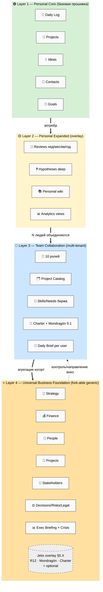
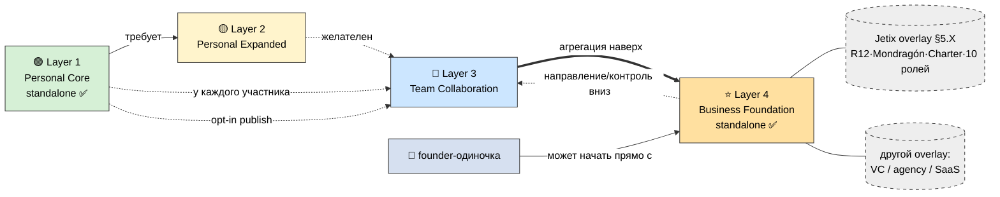

# Phase 1 — 4 слоя: обзор + матрица зависимостей

> **Что в этой фазе.** Объясняем простыми словами, что такое «4-слойная архитектура» и почему
> именно 4 (не 3, не 5). Кладём матрицу: какой слой от какого зависит, что наследуется, что
> наслаивается. Портрет аудитории каждого слоя. Две схемы — ARCH-1 (стек 4 слоёв) и ARCH-2
> (зависимости + наследование).

---

## §1 Что такое «4-слойная архитектура» простыми словами

Представь четыре концентрических круга, каждый шире предыдущего, и каждый **достраивается над
предыдущим, не ломая его**:

1. **🟢 Layer 1 — Personal Core.** Личная система одного человека. «Моя жизнь и работа в
   порядке». Это базовая прошивка: дневник, проекты, идеи, люди, цели. Любой может скопировать
   за час. Это минимум, без которого всё остальное — свалка.
2. **🟡 Layer 2 — Personal Expanded.** Тот же человек, но глубже: аналитика по своим данным,
   ревью недели/месяца/года, движок гипотез, личная вики понятий, AI-помощники для синтеза.
   Не новая система — наблюдательные контуры над Layer 1.
3. **🔵 Layer 3 — Team Collaboration.** Несколько людей со своими Layer 1+2 объединяются в
   команду с общим котлом. Появляются роли, общая биржа проектов и навыков, честное деление
   денег (Charter, Mondragón 5:1), ежедневный брифинг, право уйти с долей.
4. **⭐ Layer 4 — Universal Business Foundation.** Исполнительный взгляд на бизнес целиком.
   Стратегия + финансы + люди + проекты + стейкхолдеры + решения + риски + комплаенс +
   инструменты + документы + брифинг + кризис-плейбук. **Универсальный, fork-able** — любой
   founder любого бизнеса копирует и адаптирует. Jetix-специфика (R12 / Mondragón / Charter) =
   отдельный optional overlay сверху.

**Почему именно 4, а не 3 и не 5:**

- **Не 3** (нельзя слить Personal Core и Expanded): порог входа. Новичок должен скопировать
  лёгкую версию за 30 минут и не утонуть в аналитике. Expanded — это апгрейд, который человек
  делает, когда базовое уже работает. Слив их в один = отпугнём новичков (анти-fork-friendly).
- **Не 3** (нельзя слить Team и Business): это **разные оси**. Team = горизонталь (как N
  равных людей координируются и делят). Business = вертикаль (как один founder видит и
  управляет всем сверху). Команда без бизнес-обзора теряет стратегию; бизнес без команды —
  это просто дашборд одиночки. Им нужны разные базы, разные роли, разные права.
- **Не 5** (не выделяем «Community/Massa» в отдельный слой): массовое сообщество (Scale-этап)
  = это **Layer 3, размноженный N раз** (много когорт/кланов) + Layer 4, агрегирующий их.
  Отдельный 5-й слой плодил бы дубли. Масса = композиция существующих 4, не новая сущность.

Четыре слоя = две оси × два масштаба: **личное/командное × оперативное/управленческое.**

**ARCH-1 — стек 4 слоёв.** Каждый слой шире и достраивается над предыдущим; Jetix-overlay (пунктир) — опционален поверх Layer 4.

---

## §2 Cross-layer матрица: зависимости + наследование + overlay

Главный вопрос архитектуры: **что обязательно, что наследуется, что наслаивается, что
стоит само по себе.** Ключевая асимметрия: Layer 1→2→3 — это лестница (каждый требует
предыдущего), а **Layer 4 — standalone-capable**: founder может взять только Layer 4
(executive view) без Layer 1-3, если ему нужен лишь обзор бизнеса.

| Слой | Зависит от | Наследует (что берёт как есть) | Наслаивает (что добавляет) | Standalone? |
|---|---|---|---|---|
| **L1 Personal Core** | ничего | — | базовые 5-8 баз + дисциплина «файлы=правда» + DRAFT-only | ✅ да |
| **L2 Personal Expanded** | **L1 обязателен** | все базы L1 без изменений | аналитика, ревью, гипотезы deep, вики, AI-хелперы | ❌ нет (нужен L1) |
| **L3 Team Collab** | **L1 у каждого** (L2 желателен) | приватные базы каждого (~80% Personal OS) | shared workspace, 10 ролей, биржа, Charter, брифинг | ❌ нет (нужны N×L1) |
| **L4 Business Foundation** | **ничего** (опц. связь с L1-3) | при наличии — подтягивает данные L3 наверх (агрегация) | 12 групп exec-баз | ✅ **да** (можно один) |

**Три правила чтения матрицы:**

1. **Лестница 1→2→3 строгая.** Нельзя собрать Team OS без личных систем у участников —
   command-and-spoke рушится, если у людей нет своей базы. Layer 2 — апгрейд Layer 1, не замена.
2. **Layer 4 отвязан.** Это сознательное решение: founder одиночка может пользоваться только
   Layer 4 как личным executive-дашбордом бизнеса. Если потом появится команда — добавит Layer
   3, и Layer 4 начнёт агрегировать когорты снизу. Это даёт Ruslan-кейс: «сначала Layer 4
   minimum для себя, потом наращиваем низ».
3. **Overlay ≠ слой.** Jetix-overlay (§5.X) — это **не пятый слой**. Это набор дополнений
   поверх generic Layer 4 (и частично Layer 3), который включается только если бизнес выбрал
   кооперативную R12-модель. Generic base работает без него. Любой бизнес может написать свой
   overlay (VC-overlay, agency-overlay, etc.) — Jetix лишь один пример.

**ARCH-2 — зависимости + наследование + overlay.** Сплошные стрелки = жёсткая зависимость; пунктир = опциональная связь/overlay; жирная = агрегация.

---

## §3 Портрет аудитории по слоям (с RUSLAN-LAYER примерами — IP-1)

> Имена ниже — примеры ролей-типов (RUSLAN-LAYER binding), не назначения. Generic-схема их не содержит.

| Слой | Архетип | RUSLAN-LAYER пример | Что меняется под него |
|---|---|---|---|
| **L1** | новичок-гуманитарий | **Дмитрий** (T3-тестер, не-инженер) | центр = Daily Log + Life Pulse; Knowledge упрощён |
| **L1** | методолог | **Левенчук**-уровень | центр = Concepts/Knowledge (точные понятия) |
| **L2** | практик Method V2 | **Ruslan** сам | центр = Hypotheses deep + Reviews каскад |
| **L3** | партнёр-сооснователь | **Maxim** (T1-методолог) | роль PM/Mentor в проекте; со-создаёт |
| **L3** | R12-мост | **Прапион** | роль Steward/Advisor; проверяет Charter на анти-секту |
| **L3** | институт-партнёр | **Цэрэн** (МИМ) | роль Inv-Net/Advisor; канал аудитории |
| **L4** | founder/executive | **Ruslan** как основатель | executive view всего бизнеса + Jetix-overlay |
| **L4** | любой другой бизнес | владелец консалтинга / SaaS / агентства | generic base без Jetix-overlay |

---

## §4 Что унифицируется между слоями (общий словарь)

Чтобы 4 слоя были одной архитектурой, а не четырьмя разными продуктами, через все проходят
сквозные инварианты (наследуются от Layer 1 вверх):

- **Файлы = источник истины, Notion = витрина** (Pillar C / Global Rule 4) — на всех 4 слоях.
- **DRAFT-only для AI** — Claude Code/ассистент предлагает черновики, человек подтверждает; от
  голосового ввода Layer 1 до Daily Brief Layer 3 и Exec Briefing Layer 4.
- **Fork-and-leave** — на каждом слое человек может уйти со своими данными; на Layer 3+4 (с
  деньгами) добавляется 30-дневное окно + доля.
- **2-слойная структура форка** (универсальный фундамент + надстройка под себя) — повторяется
  внутри каждого слоя: Layer 4 base = «грамматика», extension points = «словарь».
- **Роль ≠ человек (IP-1)** — права привязаны к контейнеру роли, не к личности; multi-hat возможен.

---

## §5 Constitutional posture Phase 1

- **R1 surface only** — выбор LITE/STANDARD/FULL и порядка сборки = решения Ruslan (см. §11 main).
- **R6** — наследование баз и ролей привязано к Personal OS / Team OS планам (Phase 0 §5).
- **IP-1 STRICT** — аудитория-примеры = RUSLAN-LAYER bindings, generic-схема абстрактна.
- **Append-only** — новый файл; 2 mermaid встроены.

---

*Phase 1 closure. 4 слоя = две оси × два масштаба (личное/командное × оперативное/управленческое).
Лестница L1→L2→L3 строгая; L4 standalone-capable; Jetix-overlay ≠ слой. ARCH-1 (стек) + ARCH-2
(зависимости). Дальше Phase 2 — полный Notion-implementation-ready spec Layer 1 Personal Core.*
