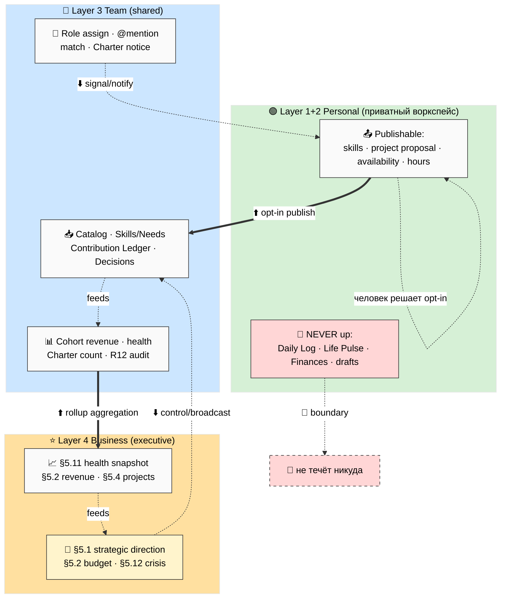

# Phase 6 — 🔄 Cross-layer data flows

> **Что в этой фазе.** Какие данные текут между 4 слоями: вверх (Personal → Team → Business),
> вниз (Business → Team → Personal), что **не течёт** (privacy boundary), и когда срабатывает
> синк (event/time/manual). Это кибернетическая карта потоков (systems-expert lens). ARCH-3 —
> диаграмма потоков (≥15 nodes).

---

## §1 Три типа потоков (повтор FPF-линзы Phase 0, применённый)

| Тип | Направление | Механизм | Пример |
|---|---|---|---|
| **Наблюдение/агрегация** | вверх ⬆️ | opt-in publish + rollup | Personal goal → Cohort cumulative → Business KPI |
| **Сигнал/контроль** | вниз ⬇️ | уведомления + broadcast | Business strategic direction → Team adopted → Personal opt-in |
| **Изоляция** | нет потока 🚫 | разрыв контура | личные финансы / Daily Log / Life Pulse |

**Закон асимметрии:** вверх — **только по решению человека** (opt-in, наблюдение). Вниз —
**сигнал и контроль** (уведомление, направление, аудит), но **не копирование** чужих приватных
данных. Это держит приватность при любом масштабе.

---

## §2 Потоки ВВЕРХ (Personal → Team → Business)

### §2.1 Personal → Team (opt-in publish)

Человек сам выбирает, что поднять из своей системы в командную:

| Что поднимается | Из (Layer 1/2) | В (Layer 3) | Триггер |
|---|---|---|---|
| Skills offer | Knowledge/Goals | Skills/Needs DB | manual (человек публикует) |
| Project proposal | Projects | Project Catalog (SG-1) | manual |
| Availability (ч/нед) | Life Pulse (производное, не сырое) | Skills/Needs | manual |
| Contribution (часы) | Tasks/Daily Log | Contribution Ledger | manual confirm |
| Decision vote | — | Decisions Queue | event (голосование открыто) |

**Важно:** поднимается **производное**, не сырое. Например, в команду уходит «доступно 10 ч/нед»,
но **не** сам Life Pulse (энергия/сон). Человек публикует факт, а не дневник.

### §2.2 Team → Business (агрегация когорт)

Метрики команды сворачиваются в KPI бизнеса (rollup):

| Что агрегируется | Из (Layer 3) | В (Layer 4) | Механизм |
|---|---|---|---|
| Cohort revenue | Revenue Accounting | §5.2 Financial (revenue stream) | rollup sum |
| Cohort health | Daily Brief + Stage Gates | §5.11 Briefing (health snapshot) | rollup |
| Charter signatures count | Charter DB | §5.X Charter compliance | count |
| Active projects | Project Catalog | §5.4 Projects Portfolio | rollup |
| R12 audit results | R12 Audit Log | §5.7 Risks (R12 category) | rollup |
| Member count / churn | Members | §5.3 People + §5.11 | count + delta |

**Это и есть «бизнес видит когорты снизу»:** когда founder включает Layer 3 под Layer 4, §5.4 и
§5.2 начинают подтягивать агрегаты команд. До этого Layer 4 standalone (founder вносит вручную).

### §2.3 Полный путь вверх (worked)

Personal goal-completion (Layer 1 Goal achieved) → засчитывается в Contribution Ledger (Layer 3,
если проект командный) → сворачивается в Cohort revenue/health (Layer 3) → агрегируется в Business
KPI (Layer 4 §5.11 health snapshot). Каждый переход = **opt-in или rollup**, никогда не
автоматическое раскрытие сырых личных данных.

---

## §3 Потоки ВНИЗ (Business → Team → Personal)

### §3.1 Business → Team (контроль/направление — Part 11)

| Что транслируется | Из (Layer 4) | В (Layer 3) | Тип |
|---|---|---|---|
| Strategic direction | §5.1 Goals/Strategy | Project Catalog (приоритеты) | broadcast (контроль) |
| R12 audit decision | §5.X / Steward | R12 Audit Log + Charter | control |
| Budget allocation | §5.2 Finance | Revenue Accounting (лимиты) | control |
| Crisis trigger | §5.12 Crisis | Steward escalation feed | signal |

### §3.2 Team → Personal (сигнал — Part 2)

| Что приходит | Из (Layer 3) | В (Layer 1/2) | Тип |
|---|---|---|---|
| Role assignment | Roles/Catalog | уведомление | signal |
| @mention / comment | любая общая база | Daily Log draft / notification | signal |
| Match suggestion | Daily Brief | Ideas draft (DRAFT) | signal |
| Charter change notice | Charter | уведомление + 30-day window | signal (важный) |

**Вниз идёт сигнал/ссылка, не копирование.** Назначение роли = уведомление + ссылка на проект;
данные проекта живут в общем пространстве (linked DB), не дублируются в личную систему.

### §3.3 Полный путь вниз (worked)

Founder задаёт strategic direction (Layer 4 §5.1) → она broadcast'ится приоритетами в Project
Catalog (Layer 3) → когда проект назначает человеку роль, тот получает уведомление (Layer 1) →
человек **сам решает** opt-in (вписаться или нет). Контроль доходит до человека как
**приглашение**, а не приказ — это R12 (нет принуждения).

---

## §4 Что НЕ течёт (privacy boundary — красные линии)

| Данные | Слой-источник | Куда НЕ течёт | Почему |
|---|---|---|---|
| Daily Log (сырой дневник) | Layer 1 | Team / Business | приватность мыслей |
| Life Pulse (энергия/сон/настроение) | Layer 1 | Team / Business | здоровье = личное |
| Personal Finances | Layer 1 | Team / Business | личный кошелёк ≠ бизнес-финансы |
| Hypotheses drafts (сырые) | Layer 1/2 | Team | незрелые идеи защищены |
| Idea drafts (Tier C) | Layer 1 | Team | сырое не публикуется молча |
| Чужая доля/ledger строка | Layer 3 | другой member | деньги видны только свои (кроме Steward OVERSIGHT) |
| Чужие приватные данные | любой | Daily Brief | брифинг одного не раскрывает данные другого |

**Реализация в Notion:** приватные базы Layer 1/2 живут в **приватном воркспейсе** человека,
который физически не подключён к Teamspace. Наверх идёт только то, что человек руками
скопировал/опубликовал в общую базу. Архитектурно невозможно «случайно» утечь.

---

## §5 Sync triggers (когда срабатывает синк)

| Тип триггера | Когда | Примеры |
|---|---|---|
| **Event-based** | при действии | publish skill → появляется на бирже; vote → в Decisions Queue; SG-переход → ре-аудит |
| **Time-based** | по расписанию | Daily Brief 1×/день; weekly digest; monthly KPI rollup в §5.11 |
| **Manual** | по решению человека | opt-in publish наверх; промоушен draft → боевая запись; fork-and-leave |

**Конфликт-резолюшн (Pillar C):** личные данные → личный файл главнее; общие → общее пространство;
спорное → `pending-review`, Steward смотрит. **Табу — молчаливая авто-перезапись** на любом уровне.

---

## §6 ARCH-3 — диаграмма cross-layer потоков

**ARCH-3 — потоки между слоями.** Жирные ⬆️ = наблюдение/агрегация (opt-in + rollup); пунктир ⬇️ = сигнал/контроль; красный 🚫 = privacy boundary (не течёт).

---

## §7 Constitutional posture Phase 6

- **R1 surface only** — степень агрегации и набор publishable-полей = выбор Ruslan.
- **R12 paired-frame** — контроль вниз доходит как приглашение (opt-in), не приказ; privacy
  boundary = anti-extraction (`non_consensual_distribution` невозможен архитектурно).
- **R6** — потоки наследуют Team OS §3 (изоляция) + Foundation Part 2 (signal) + Part 11 (direction).
- **systems-expert lens** — rollup только снизу вверх в брифинг (нет циклов пересчёта).

---

*Phase 6 closure. Cross-layer потоки: вверх = opt-in publish + rollup (производное, не сырое);
вниз = сигнал/контроль (приглашение, не приказ); privacy boundary = личные данные не текут
архитектурно. Триггеры: event/time/manual. ARCH-3. Дальше Phase 7 — permissions matrix.*
