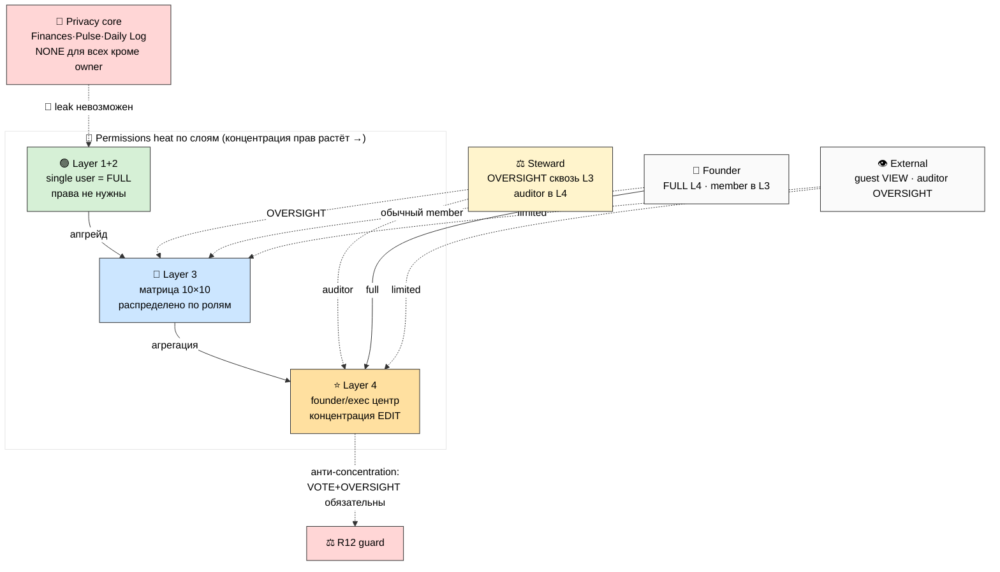

# Phase 7 — 🔐 Cross-layer permissions matrix

> **Что в этой фазе.** Полная матрица прав через все 4 слоя: кто что может (EDIT / COMMENT /
> VIEW / VOTE / OVERSIGHT / NONE / own). Особые случаи (Steward сквозной, Founder Layer 4,
> внешние гости). Privacy-правила (что никогда не cross-layer leaks). R12-комплаенс (fork-and-leave
> + 30-day + asset retrieval). ARCH-4 — heat matrix.

---

## §1 Легенда прав

| Право | Значит |
|---|---|
| **EDIT** | менять записи |
| **COMMENT** | комментировать, не менять |
| **VIEW** | читать |
| **VOTE** | право голоса в решениях |
| **OVERSIGHT** | надзор (видит всё для аудита, не правит контент) |
| **NONE** | нет доступа |
| **(own)** | только свои записи |

---

## §2 Права по слоям (общая логика)

Каждый слой имеет свою модель прав — они **не одинаковы**, потому что слои решают разные задачи:

| Слой | Модель прав | Почему так |
|---|---|---|
| **Layer 1** | single user = full access | один человек, нет ролей |
| **Layer 2** | single user = full access | то же + опционально share отдельных страниц |
| **Layer 3** | матрица 10 баз × 10 ролей | команда, разделение по ролям-контейнерам |
| **Layer 4** | founder/exec центр + делегирование | управленческий взгляд, концентрация (R12-риск) |

---

## §3 Layer 1+2 права

**Single user = full access.** Нет ролей. Внешний шеринг = ручной Notion share отдельных
страниц (показать проект другу) — вне схемы прав. Это снимает порог входа: новичок не думает о
правах. Приватные базы (Daily Log / Life Pulse / Finances) физически в приватном воркспейсе.

---

## §4 Layer 3 матрица (10 баз × 10 ролей) — каноническая

(Из Phase 4 §9; повторена здесь как часть полной cross-layer картины.)

| База \ Роль | PM | Inv-Cap | Inv-Time | Inv-Net | Contrib | Advisor | Facilit | Mentor | Observ | Steward |
|---|---|---|---|---|---|---|---|---|---|---|
| Project Catalog | EDIT(own) | V+C | V+C | VIEW | VIEW | VIEW | VIEW | VIEW | VIEW | EDIT |
| Skills/Needs | EDIT(own) | EDIT(own) | EDIT(own) | EDIT(own) | EDIT(own) | EDIT(own) | EDIT(own) | EDIT(own) | VIEW | VIEW |
| Project Workspaces | EDIT(own) | VIEW | EDIT(asgn) | VIEW | EDIT(asgn) | COMMENT | EDIT(sess) | COMMENT | VIEW | VIEW |
| Charter | VIEW | VIEW | VIEW | VIEW | VIEW | VIEW | VIEW | VIEW | VIEW | EDIT |
| Revenue Accounting | EDIT(own) | VIEW(own) | VIEW(own) | VIEW(own) | VIEW(own) | NONE | NONE | NONE | NONE | OVERSIGHT |
| Contribution Ledger | EDIT(own) | VIEW(own) | EDIT(own) | VIEW(own) | EDIT(own) | VIEW(own) | EDIT(own) | VIEW(own) | NONE | OVERSIGHT |
| Decisions Queue | EDIT(own) | VOTE | VOTE | VOTE | COMMENT | COMMENT | COMMENT | COMMENT | NONE | OVERSIGHT |
| R12 Audit Log | VIEW(own) | VIEW(own) | VIEW(own) | VIEW(own) | VIEW(own) | VIEW(own) | VIEW(own) | VIEW(own) | NONE | EDIT |
| Daily Brief | own | own | own | own | own | own | own | own | own | own |
| Onboarding/Guides | VIEW | VIEW | VIEW | VIEW | VIEW | VIEW | VIEW | VIEW | VIEW | EDIT |

**Три правила:** (1) PM силён только в своём проекте; (2) деньги видны только свои (полная картина
— только Steward OVERSIGHT); (3) Steward — сквозная роль, но не голосует и не берёт проектную долю.

---

## §5 Layer 4 права (founder/executive центр)

Layer 4 — управленческий слой; права концентрированнее (это его суть и его R12-риск). Базовые
роли Layer 4: **Founder/Owner**, **Executive/Co-lead**, **Manager** (per-area), **Member/Staff**,
**External (advisor/auditor)**.

| Группа базы \ роль L4 | Founder | Executive | Manager (area) | Member | External |
|---|---|---|---|---|---|
| §5.1 Strategy/Goals | EDIT | EDIT | COMMENT | VIEW | NONE |
| §5.2 Financial | EDIT | VIEW+ | VIEW(area) | NONE | NONE |
| §5.3 People/Roles | EDIT | EDIT | VIEW | VIEW(own) | NONE |
| §5.4 Projects | EDIT | EDIT | EDIT(area) | VIEW | VIEW(shared) |
| §5.5 Stakeholders | EDIT | EDIT | EDIT(own) | VIEW | NONE |
| §5.6 Decisions | EDIT | VOTE | COMMENT | VIEW | COMMENT(advisory) |
| §5.7 Risks | EDIT | EDIT | EDIT(area) | VIEW(own) | OVERSIGHT(auditor) |
| §5.8 Legal/Compliance | EDIT | VIEW | NONE | NONE | OVERSIGHT(auditor) |
| §5.9 Tools | EDIT | EDIT | EDIT(area) | VIEW | NONE |
| §5.10 Documents | EDIT | EDIT | EDIT(area) | VIEW(by access) | VIEW(public) |
| §5.11 Briefing | EDIT | VIEW | VIEW(area) | NONE | NONE |
| §5.12 Crisis | EDIT | EDIT | VIEW | NONE | NONE |

**Generic-замечание (R12 anti-concentration):** даже без Jetix-overlay полезно, чтобы §5.6
Decisions имела VOTE для Executive (не только Founder EDIT) — это встроенный анти-authoritarian
паттерн. В Jetix-overlay это становится строгим (Steward OVERSIGHT + Decisions Queue голосование).

---

## §6 Особые случаи (cross-layer)

| Кейс | Право |
|---|---|
| **Steward (Layer 3)** | видит **все** слои Layer 3 (OVERSIGHT) + R12 Audit (EDIT); в Layer 4 — auditor (OVERSIGHT §5.7/§5.8); НЕ видит приватные Layer 1/2 |
| **Founder (Layer 4)** | default full Layer 4; в Layer 3 — обычный member (своя роль в проектах, IP-1: founder ≠ авто-PM везде) |
| **Member (Layer 3)** | видит свои Layer 1+2 (full) + Layer 3 shared (по роли) + Layer 4 только §5.4 shared projects |
| **External guest** | opt-in специфичный share: VIEW публичных страниц Layer 3/4, отзывается в 1 клик |
| **External auditor** | OVERSIGHT §5.7/§5.8 + R12 Audit Log — без личных и финансовых деталей сверх аудита |

**IP-1 критично:** Founder в Layer 4 ≠ Founder-как-PM в каждом проекте Layer 3. Власть привязана
к роли-контейнеру на конкретном слое, не к личности сквозь все слои. Founder сильный в Layer 4
exec view, но в командном проекте — обычный участник со своей ролью.

---

## §7 Privacy rules (что НИКОГДА не cross-layer leaks)

| Данные | Невидимо для |
|---|---|
| Personal Finances (Layer 1) | Team / Business / любой другой человек |
| Life Pulse (энергия/сон) | Team / Business |
| Daily Log сырой (Layer 1) | Team / Business |
| Idea/Hypothesis drafts (Tier C) | Team |
| Чужая строка Contribution Ledger | другой member (только своя + Steward OVERSIGHT) |
| Чужие приватные данные в Daily Brief | другой member |
| Comp band отдельного человека (Layer 4 §5.3) | Member-роль (только Founder/Exec) |

**Реализация:** приватные базы — в приватном воркспейсе, физически не подключённом к Teamspace.
Notion permission model + раздельные воркспейсы = leak архитектурно невозможен, а не «по правилу».

---

## §8 R12-комплаенс прав (fork-and-leave preserved)

Права спроектированы так, чтобы **fork-and-leave работал на всех слоях**:

- **Personal OS data всегда у человека** — приватный воркспейс = его собственность; уход не
  трогает его Layer 1/2.
- **30-day notice** — при изменении Charter (Layer 3) или прав, затрагивающих member, — окно на
  выход без штрафа.
- **Asset retrieval** — экспорт своей строки Contribution Ledger + накопленной доли при выходе.
- **Нет lock-in через права** — никакой роли нельзя «забрать доступ к своим данным у уходящего».
  Попытка = `fork_prevention_attempt` → HALT (Steward).

**R12 paired-frame (influence-ethics AUTO-FIRE):** концентрация прав у Founder (Layer 4) = surface
authoritarian drift. Defensive-counter: (1) Decisions VOTE у Executive; (2) Steward OVERSIGHT
сквозной; (3) внешний auditor; (4) права не могут отключить fork-and-leave. Abuse-mode flag:
если Founder убирает VOTE/OVERSIGHT — это red flag в R12 sweep (Phase 12).

---

## §9 ARCH-4 — permissions heat matrix

**ARCH-4 — heat matrix прав.** Концентрация прав растёт L1→L4; Steward сквозной OVERSIGHT; privacy core недостижим; R12 guard требует VOTE+OVERSIGHT в Layer 4 (анти-authoritarian).

---

## §10 Constitutional posture Phase 7

- **R1 surface only** — точная раскладка Layer 4 ролей (Founder/Exec/Manager) = выбор Ruslan/бизнеса.
- **R12 paired-frame STRICT** — концентрация прав Layer 4 = anti-extraction surface; fork-and-leave
  preserved через все слои; права не могут отключить выход.
- **IP-1 STRICT** — права привязаны к роли-контейнеру на слое, не к личности сквозь слои.
- **R6** — Layer 3 матрица из Team OS §2; privacy из изоляции данных; Layer 4 generic exec model.

---

*Phase 7 closure. Полная матрица прав: L1/2 = single user full; L3 = 10×10; L4 = founder-центр с
анти-concentration guard (VOTE+OVERSIGHT). Особые случаи (Steward сквозной, Founder ≠ авто-PM,
external). Privacy core leak-proof архитектурно. fork-and-leave preserved во всех слоях. ARCH-4.
Дальше Phase 8 — sync mechanics.*
