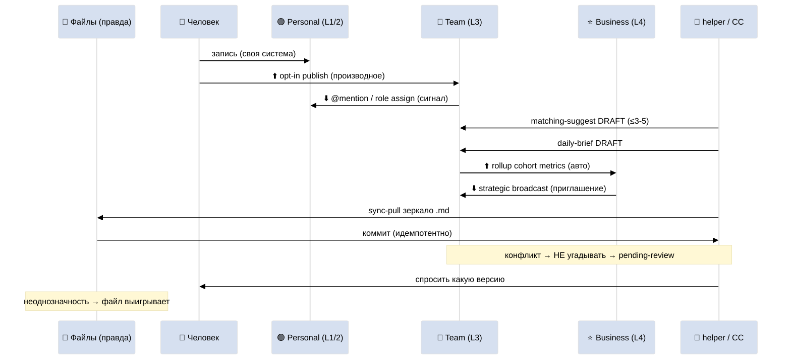

# Phase 8 — 🔁 Cross-layer sync mechanics

> **Что в этой фазе.** Как технически реализуется синхронизация между слоями. Какие родные
> возможности Notion используем. 4 направления синка. Правила разрешения конфликтов (файлы =
> правда). Спека 4-5 helper-скриптов (R11 — спека, НЕ код). ARCH-5.

---

## §1 Родные возможности Notion (минимум кода)

Принцип: **максимум родного Notion, минимум скриптов.** Скрипты только там, где Notion не может
(двусторонний файловый синк, авто-брифинг, матчинг).

| Возможность Notion | Для чего в архитектуре |
|---|---|
| **Teamspaces** | разделение приватного (Layer 1/2) и общего (Layer 3) пространств |
| **Linked databases** | общая запись видна в нескольких местах, живёт у владельца (нет дублей) |
| **Synced blocks** | Charter синхронизирован во все воркспейсы (один источник) |
| **Page/DB permissions** | права из матрицы Phase 7 (по роли) |
| **Comments + @mentions** | координация и сигналы вниз (Team → Personal) без правки данных |
| **Rollup + Relation** | агрегация вверх (Team → Business KPI) без копирования |
| **Database templates** | шаблоны записей (Daily Log, Reviews, Charter, Briefing) |
| **Notion API** | только helper-скрипты (file mirror, brief, match) — R11: spec, не auto-run |

**Что НЕ делаем родным Notion:** двусторонний синк с файлами на диске (Notion API), генерацию
брифинга (Claude Code), матчинг биржи (скрипт). Это helper'ы §4.

---

## §2 Четыре направления синка

| # | Направление | Тип потока | Механизм | Кто инициирует |
|---|---|---|---|---|
| 1 | **Personal → Team** | наблюдение ⬆️ | opt-in publish (человек копирует в общую базу) | человек |
| 2 | **Team → Personal** | сигнал ⬇️ | @mention / уведомление / role assignment / linked DB | система/команда |
| 3 | **Team → Business** | агрегация ⬆️ | rollup (cohort metrics → §5.2/§5.4/§5.11) | авто (rollup) |
| 4 | **Business → Team** | контроль ⬇️ | broadcast приоритетов / R12 audit / Steward decision | founder/Steward |

### §2.1 Personal → Team (opt-in shares)

Человек выбирает запись в своей Layer 1/2 → жмёт «опубликовать в команду» → helper создаёт
linked-запись в общей базе (Skills/Needs / Project Catalog). **Только производное** (skill,
proposal), не сырое (Daily Log). Файловое зеркало: запись появляется и в `.md` общего пространства.

### §2.2 Team → Personal (notifications/mentions)

Назначение роли / @mention / match suggestion → Notion notification + (опц.) draft-запись в
личном Daily Log (флаг draft). **Не копирует** данные проекта — даёт ссылку (linked DB). Человек
opt-in решает.

### §2.3 Team → Business (cohort aggregation)

Rollup'ы Layer 3 сворачиваются в Layer 4 §5.11 health snapshot + §5.2 revenue + §5.4 projects.
Авто (Notion rollup по relation), без скрипта, если Layer 3 и Layer 4 в одном Teamspace; если в
разных — helper `kpi_rollup.py` (опц.).

### §2.4 Business → Team (strategic broadcast)

Founder меняет §5.1 strategic direction → broadcast'ится приоритетами в Project Catalog (поле
priority) + уведомление PM'ам. R12 audit decision (Steward) → запись в R12 Audit Log + Charter
notice. Контроль доходит как **сигнал-приглашение**, не приказ.

---

## §3 Conflict resolution (файлы = источник истины)

Сквозной принцип Pillar C / Global Rule 4: **файлы на диске = правда, Notion = витрина.**

| Конфликт | Кто выигрывает | Что делаем |
|---|---|---|
| Личные данные (Layer 1/2) | **личный файл** | при расхождении — версия файла; Notion обновляется из файла |
| Общие данные (Layer 3) | **общее пространство** | для shared записей источник = Teamspace-файл |
| Бизнес-данные (Layer 4) | **бизнес-файл** | exec-данные в своём файловом зеркале |
| Неоднозначность | **не угадывать** | → `pending-review`, спросить какую версию; Steward смотрит спорное в Layer 3 |

**Табу — молчаливая авто-перезапись** на любом уровне. Это главное правило синка: при сомнении
helper **останавливается и спрашивает**, не перезаписывает боевую запись.

**Идемпотентность:** все helper'ы безопасны к повторному запуску (re-run не создаёт дублей, не
теряет данные) — наследие company-as-code (`/crm-rebuild-index` safe to re-run).

---

## §4 Спека 5 helper-скриптов (R11 — спека, НЕ код)

> Это **спецификация функций**, не код. Скрипты config-driven, идемпотентные, ключи в `private/`,
> НЕ запускаются автоматически в рамках этого prompt'а (R11 Default-Deny).

### §4.1 `sync-pull` (файловое зеркало, двусторонний)

- **Вход:** Notion воркспейс (по слою) + локальная директория `.md` зеркала.
- **Делает:** pull правок из Notion → `.md` (по frontmatter ключу); push изменений файлов → Notion.
- **Конфликт:** не угадывать → `pending-review` + спросить.
- **Идемпотентность:** re-run сверяет хэши, не дублирует.
- **Слои:** работает per-layer (приватный для L1/2, общий для L3, exec для L4).

### §4.2 `invite-flow` (онбординг + права)

- **Вход:** новый участник + назначаемая роль.
- **Делает:** создаёт guest/member доступ в Teamspace + применяет permission profile роли (Phase 7
  матрица) + создаёт онбординг-чеклист (7 дней).
- **Защита:** требует подтверждённого согласия (Part 10); нет согласия → стоп.

### §4.3 `matching-suggest` (биржа, DRAFT)

- **Вход:** Skills/Needs DB + Project Catalog.
- **Делает:** сопоставляет offer × wanted → черновик 3-5 матчей в Daily Brief каждого (DRAFT).
- **Лимит:** ≤3-5 на секцию (анти пере-матчинг, R12).
- **Никогда:** не назначает автоматически — только предлагает.

### §4.4 `daily-brief-generator` (брифинг, DRAFT)

- **Вход:** личная система (топ проекты/гипотезы/skills) + командное + общее + интернет (opt-in).
- **Делает:** собирает 5 секций → черновик в Daily Brief (Layer 3) / Executive Briefing (Layer 4).
- **DRAFT-only:** не пишет сообщения, не меняет данные, не отправляет наружу.
- **Каденс:** 1×/день (time-based trigger).

### §4.5 `r12-audit-runner` (надзор, аудит)

- **Вход:** Revenue Accounting + Contribution Ledger + Charter + Decisions.
- **Делает:** прогоняет 4 action classes + Mondragón 5:1 check + 8 paired-frame questions →
  записи в R12 Audit Log; нарушение → флаг Steward HALT (F2/F4/F8 grade).
- **Только при включённом R12-overlay** (Jetix-style); generic Layer 4 не запускает.

**Маппинг к Team OS 4 скриптам:** sync-pull ↔ `team_os_sync.py`; invite-flow ↔ `team_os_invite.py`;
matching-suggest ↔ `team_os_marketplace_match.py`; daily-brief ↔ `team_os_daily_brief.py`;
r12-audit-runner = новый (Layer 4 R12-overlay).

---

## §5 Степень автоматизации (R1 — выбор Ruslan/бизнеса)

| Режим | Что | Кому |
|---|---|---|
| **A — ручной** | Notion руками, CC только подсказывает в чате | старт / нетехнический форк |
| **B — скрипты** | полный синк через helper'ы + Notion API | технический форк / Ruslan |
| **C — гибрид** | голос/брифинг авто (DRAFT), остальное руками | **рекомендуемый старт** |

---

## §6 ARCH-5 — sync mechanics

**ARCH-5 — механика синка.** Родной Notion (linked DB / rollup / mention) + 5 helper'ов; файлы = правда; конфликт → спросить, не перезаписать.

---

## §7 Constitutional posture Phase 8

- **R1 surface only** — режим A/B/C автоматизации = выбор Ruslan.
- **R11 Default-Deny** — 5 helper'ов = спека функций, НЕ код; Notion API не зовётся в рамках prompt.
- **R12 paired-frame** — matching/brief лимит 3-5 (анти FOMO); r12-audit-runner только при overlay.
- **R6** — наследует Team OS §3 (4 скрипта) + Pillar C (файлы=правда) + company-as-code (идемпотентность).
- **systems/engineering lens** — нет циклов синка; rollup только вверх; helper'ы идемпотентны.

---

*Phase 8 closure. Синк = максимум родного Notion (Teamspaces / linked DB / synced blocks / rollup)
+ 5 helper-скриптов (спека R11): sync-pull / invite-flow / matching-suggest / daily-brief /
r12-audit-runner. 4 направления; файлы=правда; конфликт→спросить. Режим A/B/C. ARCH-5. Дальше
Phase 9 — onboarding по слоям.*
