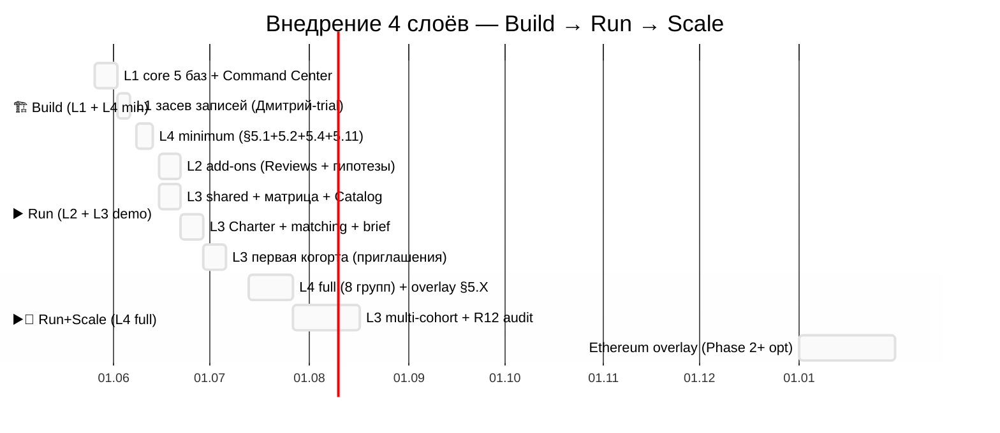

# Phase 11 — 📅 Implementation roadmap + dependencies

> **Что в этой фазе.** Порядок сборки 4 слоёв: что когда, какие базы первыми (critical path),
> зависимости, выравнивание с этапами платформы Build/Run/Scale, решения по апгрейду Notion-плана,
> оценка затрат. ARCH-6 — таймлайн. Baseline: `PLATFORM-LIFECYCLE-STAGES-PLAN-2026-05-25.md`.

---

## §1 Порядок реализации (общий)

Естественный порядок: **Layer 1 first → Layer 2 add-ons → Layer 3 multi-tenant → Layer 4 universal
foundation**. НО есть важное исключение (зависимости §2): Layer 4 standalone-capable, и для
founder-кейса (Ruslan) полезно собрать **Layer 4 minimum параллельно** с Layer 1.

| Очередь | Слой | Что собираем | Зачем сейчас |
|---|---|---|---|
| 1 | **L1 core** | 5 баз + Command Center | для Дмитрий-trial (тестер) |
| 2 | **L4 minimum** | §5.1+§5.2+§5.4+§5.11 + хаб | для Ruslan personal executive use |
| 3 | **L2 add-ons** | Reviews + гипотезы deep + аналитика | после недели работы L1 |
| 4 | **L3 demo** | shared workspace + матрица + Catalog + Skills | для 1 партнёр co-design |
| 5 | **L4 full** | остальные 8 групп + overlay | по мере роста бизнеса |
| 6 | **L3 multi-cohort** | масштаб когорт | Scale-этап |

---

## §2 Зависимости (critical path)

| Слой | Требует | Standalone? | Critical-path базы (первыми) |
|---|---|---|---|
| **L1** | — | ✅ | Daily Log → Projects → Contacts → Goals → Command Center |
| **L2** | L1 работает | ❌ | Reviews (база + 8 шаблонов) → Hypotheses deep |
| **L3** | L1 у каждого участника | ❌ | shared workspace → Permissions matrix → Project Catalog → Skills/Needs |
| **L4** | **ничего** | ✅ | §5.2 Financial (runway) → §5.1 Goals → §5.4 Projects → §5.11 Briefing |

**Ключевое:** Layer 4 generic base FIRST → Jetix overlay (§5.X) SECOND как optional add-on.
Founder может стартовать прямо с Layer 4 (executive view) без Layer 1-3, если хочет только обзор
бизнеса. Когда появляется команда — добавляет Layer 3 снизу, и Layer 4 начинает агрегировать.

**Dependency-граф:** L1 → {L2, L3}; L3 → L4(агрегация, опц.); L4 standalone. Нет циклов.

---

## §3 Build/Run/Scale alignment (per Platform Lifecycle Plan §8)

Слои внедряются по этапам платформы. Сейчас (25.05) = **Build, средняя часть**.

| Этап | Окно | Какие слои | Кто пользуется |
|---|---|---|---|
| **🏗️ Build week 1-2** | ~26.05-07.06 | Layer 1 core 5 баз | Дмитрий-trial (тестер T3) |
| **🏗️ Build week 3** | ~08-14.06 | Layer 4 executive minimum | Ruslan personal use |
| **▶️ Run week 4-8** | ~15.06-июль | Layer 3 demo overlay | 1 партнёр co-design (Maxim/Прапион) |
| **▶️ Run + 📡 Scale** | авг 2026+ | Layer 2 expanded + Layer 4 full + Layer 3 multi-cohort | когорта 5-50 + multi-clan |

**R12-защита растёт с этапом (Platform Lifecycle сквозной закон):** Build низкий R12-риск (нет
денег) → Run средний (деньги текут, Layer 3 монетизация) → Scale высокий (масса, нужны
механические защиты, Ethereum overlay). **Защита должна расти быстрее системы.**

**Триггеры перехода Build → Run (из Platform Lifecycle §8):** ≥1 T1 confirmed · ≥3 T3 активны ·
Charter проверен R12-экспертом · Notion внедрён для multi-user · звонок отрепетирован ≥5 раз.
Для архитектуры: Layer 1 + Layer 4 minimum внедрены = часть Build exit.

---

## §4 Notion plan upgrade decisions (per layer)

| План Notion | Когда нужен | Какой слой требует | Стоимость (ориентир) |
|---|---|---|---|
| **Free** | старт, один человек | Layer 1 + Layer 2 (личное) | $0 |
| **Plus (ex-Personal Pro)** | один человек, больше блоков/гостей | Layer 1+2 + Layer 4 standalone (founder) | ~$10-12/мес |
| **Business** | команда + расширенные права + Teamspaces | Layer 3 multi-tenant + Layer 4 с командой | ~$15-18/user/мес |
| **Enterprise** | масштаб, аудит, SSO, advanced security | Scale: multi-cohort + R12 audit + compliance | по запросу |

**Решения (R1 — выбор Ruslan):**
- Layer 1+2 + Layer 4 standalone — стартуют на **Free/Plus** (один человек, бесплатно/дёшево).
- **Team plan upgrade — когда?** Build week 2-3 (под Layer 3 demo) или Run (когда нужен real
  multi-tenant)? Вариант: апгрейд в Build week 2-3 под Team OS demo (per Platform Lifecycle R1 #4).
- Enterprise — только Scale (multi-cohort), не раньше.

---

## §5 Cost estimates

| Статья | Build | Run | Scale |
|---|---|---|---|
| Notion subscription | $0-12/мес (1 user) | $15-18×N users/мес | Enterprise (по запросу) |
| Helper-скрипты (разработка) | ~time, не $ (Claude Code) | поддержка | масштабирование |
| Notion API (helper'ы) | бесплатно (личный) | бесплатно | rate limits → возможно платно |
| Voice pipeline (Wispr/Groq) | существующий | — | — |
| Ethereum overlay (Phase 2+) | $0 (текстовый) | $0 | $75-150K audit (V10, только Scale) |

**Главное:** Build + Run стартовая часть = **почти бесплатно** (Notion Plus + Claude Code). Дорогие
вещи (Enterprise, smart-contract audit) = только Scale, через ~2 года. Не тратим рано.

---

## §6 Per-layer implementation detail (что внутри слоя первым)

**Layer 1 (Build week 1-2):** Command Center хаб ИЛИ 5 баз первыми (R1 порядок) → Daily Log
(первая запись) → Projects (3 активных) → Contacts (5 топ) → Goals (POINT A). Add-ons week 2.

**Layer 4 minimum (Build week 3):** §5.2 Financial (cash + burn → runway) → §5.1 Goals (3-5 целей)
→ §5.4 Projects (активные) → §5.11 Briefing (первый weekly) → §5.13 Command Center. ~2.5 часа.

**Layer 2 (Run week 4-5):** Reviews база + 8 шаблонов → первое недельное ревью → Hypotheses deep →
аналитика → AI Helpers (DRAFT).

**Layer 3 demo (Run week 4-8):** shared Teamspace → permissions matrix → Project Catalog (3 проекта
из существующих) → Skills/Needs → Charter draft (Ruslan = первый член) → matching helper → Daily
Brief → первые приглашения (первая когорта).

**Layer 4 full + overlay (Run+Scale):** остальные 8 групп (§5.3, §5.5-§5.10, §5.12) → Jetix-overlay
§5.X (если кооператив) → агрегация Layer 3 снизу.

---

## §7 ARCH-6 — implementation timeline

**ARCH-6 — таймлайн.** Build: L1 + L4 minimum (почти параллельно); Run: L2 + L3 demo; Run+Scale: L4 full + overlay + multi-cohort. Ethereum — только Scale (~2027).

---

## §8 Анти-паттерны реализации

- ❌ Собрать все 4 слоя сразу — паралич; иди по очереди.
- ❌ Layer 3 без Layer 1 у участников — command-and-spoke рушится.
- ❌ Layer 4 full до minimum — начни с 4 ядра, нарасти.
- ❌ Team plan upgrade до того, как есть multi-user need — лишние $.
- ❌ Ethereum overlay в Build/Run — это Scale-механика (~2 года).
- ❌ Jetix-overlay перед generic base — base FIRST, overlay SECOND.
- ❌ Перфекционизм шаблона до Дмитрий-trial — итерируй на черновом.

---

## §9 Constitutional posture Phase 11

- **R1 surface only** — порядок старта, Team plan timing, что в Build vs Run = решения Ruslan.
- **R6** — Build/Run/Scale из Platform Lifecycle §8; зависимости из Phase 1 матрицы.
- **R11** — реализация не запускается; это roadmap, не auto-build.
- **investor-expert lens** — затраты минимальны Build/Run; дорогое (Enterprise/audit) только Scale.

---

*Phase 11 closure. Порядок: L1 core → L4 minimum (параллельно, Build) → L2 + L3 demo (Run) → L4
full + overlay + multi-cohort (Run+Scale). L4 standalone-capable (founder может первым). Notion:
Free/Plus → Business (Team) → Enterprise (Scale). Затраты минимальны до Scale. Build/Run/Scale
alignment + R12 растёт с этапом. ARCH-6. Дальше Phase 12 — R12 sweep всех слоёв.*
