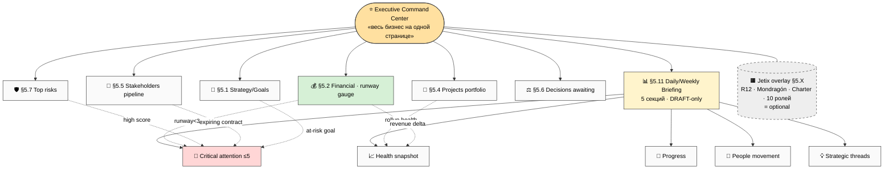
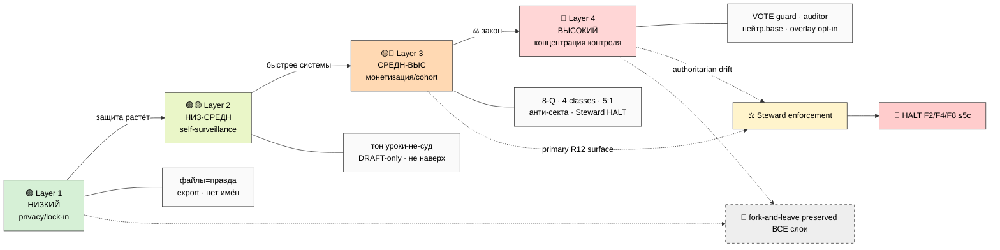
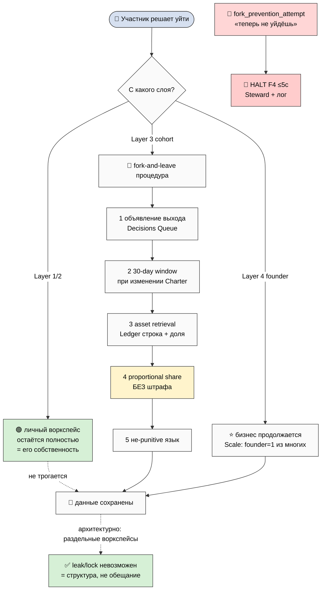
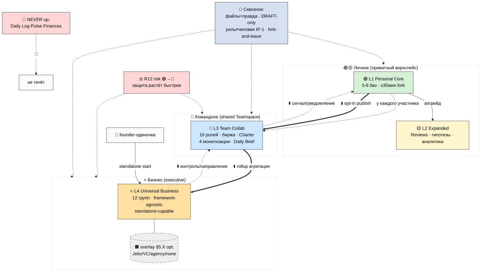

# Phase 13 — 📐 Architecture mermaid suite (ARCH-1..ARCH-10)

> **Что в этой фазе.** Консолидированный каталог 10 схем. ARCH-1..ARCH-6 встроены в Phase 1/6/7/8/11
> (ссылки ниже); ARCH-7..ARCH-10 авторизованы здесь. Каждая ≥10-15 nodes, light bg theme.

---

## Каталог 10 схем

| # | Схема | Где тело | Тип |
|---|---|---|---|
| ARCH-1 | 4 layers stack | Phase 1 (02-overview) | graph TB |
| ARCH-2 | cross-layer dependencies + inheritance | Phase 1 (02-overview) | graph LR |
| ARCH-3 | cross-layer data flows | Phase 6 (07-data-flows) | graph TB |
| ARCH-4 | permissions heat matrix | Phase 7 (08-permissions) | graph TB |
| ARCH-5 | sync mechanics | Phase 8 (09-sync) | sequenceDiagram |
| ARCH-6 | implementation timeline | Phase 11 (12-roadmap) | gantt |
| ARCH-7 | Layer 4 executive dashboard layout | **здесь** | graph TB |
| ARCH-8 | R12 risk heat overlay per layer | **здесь** | graph LR |
| ARCH-9 | fork-and-leave preservation flow | **здесь** | graph TD |
| ARCH-10 | master synthesis diagram | **здесь** | graph TB |

---

## ARCH-7 — Layer 4 Executive Dashboard layout


**ARCH-7.** Executive Command Center: 6 групп + брифинг (5 секций); критичные сигналы (runway/risk/contract/goal) текут в Critical attention; Jetix-overlay опционален.

---

## ARCH-8 — R12 risk heat overlay per layer


**ARCH-8.** R12-риск растёт L1→L4; защита растёт быстрее; L3+L4 = primary surfaces → Steward HALT; fork-and-leave сквозной.

---

## ARCH-9 — Fork-and-leave preservation flow


**ARCH-9.** Fork-and-leave: L1/2 данные остаются; L3 = 5-шаговая процедура (объявление→30day→asset→доля→нейтрально); L4 founder exit = бизнес продолжается; fork_prevention → HALT; гарантия архитектурна.

---

## ARCH-10 — Master synthesis (вся архитектура одной схемой)


**ARCH-10 — master synthesis.** 4 слоя × 2 оси (личное/командное/бизнес); потоки ⬆️opt-in/rollup ⬇️контроль/сигнал; privacy core не течёт; сквозные дисциплины (файлы=правда / DRAFT / IP-1 / fork-leave); R12 растёт; overlay опционален; founder может стартовать с L4.

---

## §1 Mermaid theme (для всех 10)

```
{'theme':'base', 'themeVariables': {'primaryTextColor':'#000','textColor':'#000',
'lineColor':'#333','primaryBorderColor':'#333','primaryColor':'#fafafa'}}
```
Light bg, чёрный текст, читаемо в Notion light mode + при экспорте.

---

*Phase 13 closure. 10 схем ARCH-1..ARCH-10: 1-6 встроены в фазы, 7-10 авторизованы здесь
(executive dashboard / R12 heat / fork-leave flow / master synthesis). Каждая ≥10-15 nodes, light
theme. Дальше Phase 14 — Main consolidated + 00-SUMMARY + per-layer matrix + INDEX (final push).*
