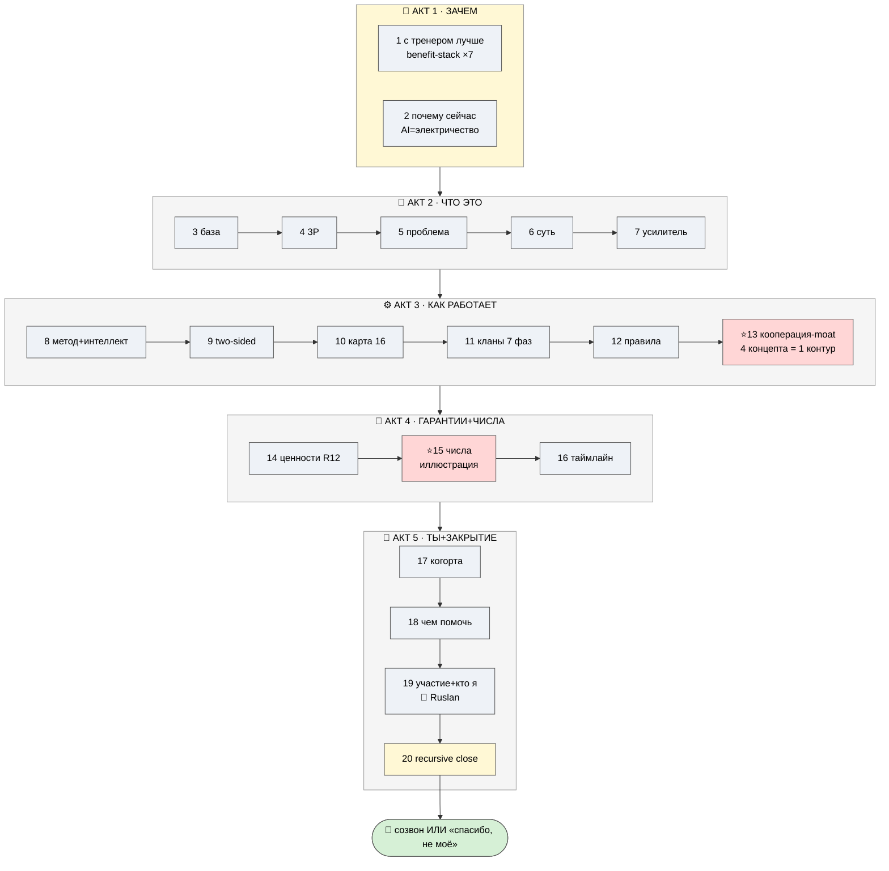

# D1 — Нарративная дуга (WHY-first → recursive-close)

> Светлая тема. Жёлтый = вход/выход (зацепить/закрыть) · красный = кульминация/гарантии · синий = «как».

**Чтение.** Сдвиг vs пакета: ведём «зачем» (S1-2) ПЕРВЫМ, потом «что это» (S3-7). Кульминация «как» =
S13 (moat). Числа (S15) идут после того, как партнёр поверил в идею. Закрытие = рекурсивная петля +
просьба об обратной связи (не подписи).
