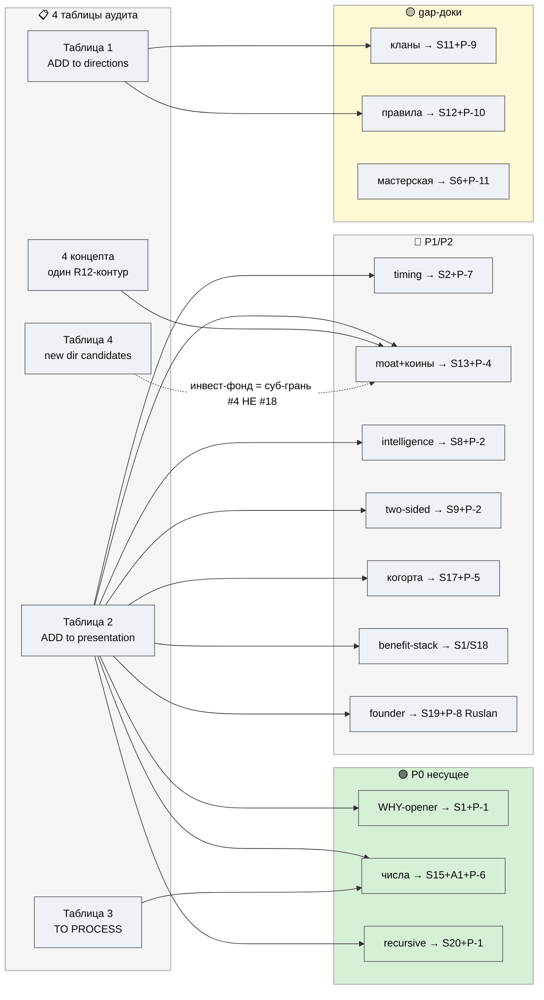

# D2 — Покрытие picks (ничего не потеряно)

> Светлая тема. Зелёный = P0 (несущее) · жёлтый = gap-доки · синий = P1/P2.

**Чтение.** Все P0 (WHY/числа/recursive) → несущие слайды. gap-доки (P-9/10/11) закрывают «невидимые»
направления #14/#9/#12. 4 концепта = один R12-контур → S13 (не 4 разрозненных). Таблица 4: инвест-фонд =
**суб-грань #4**, НЕ новое #18 в V4 (R2 STRICT). Ничего не потеряно.
