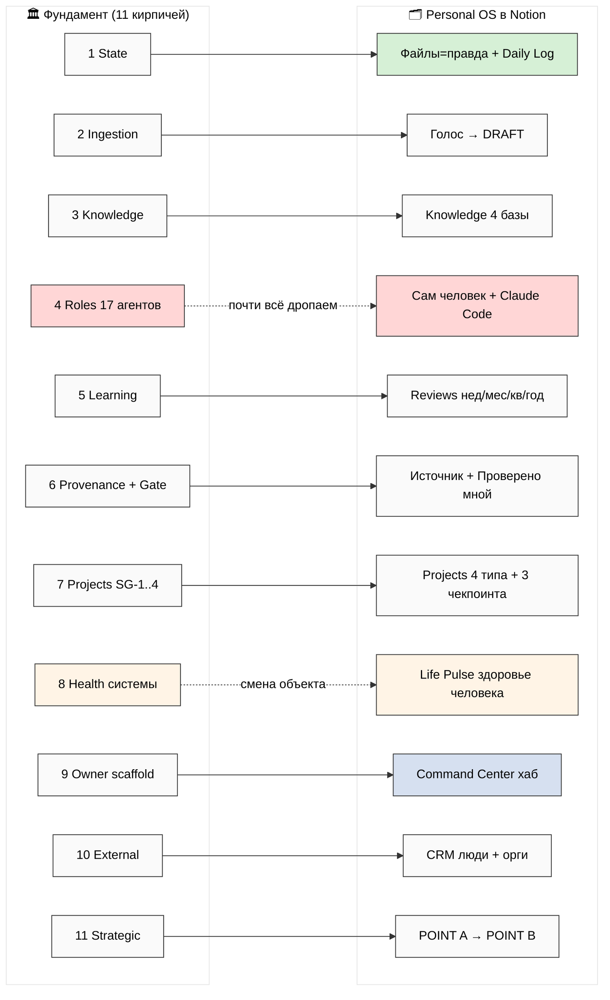
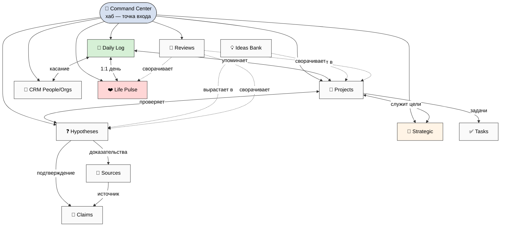
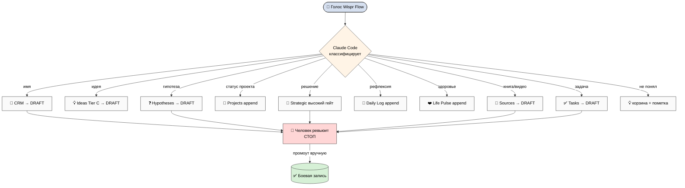
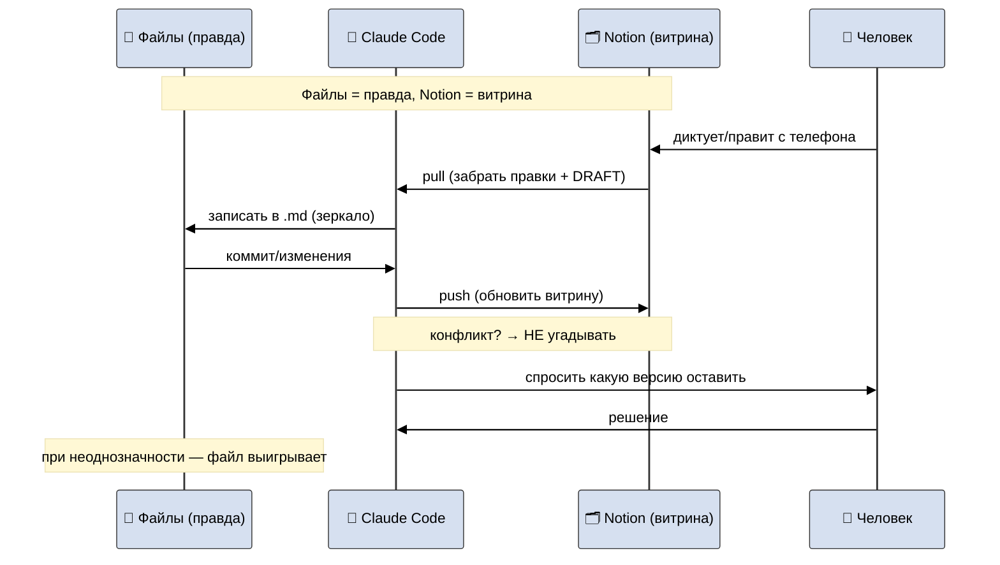
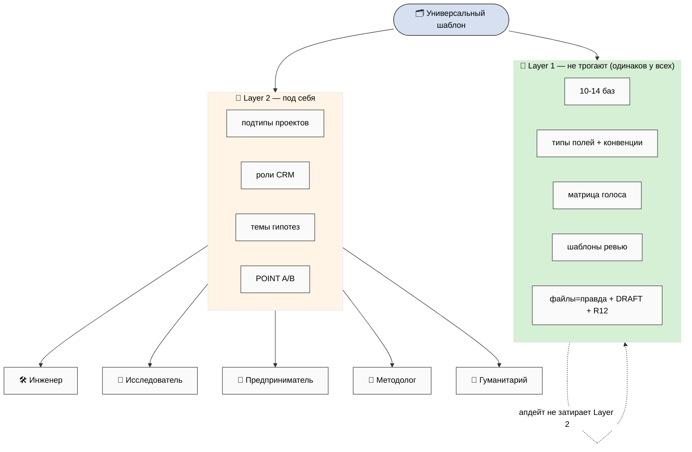
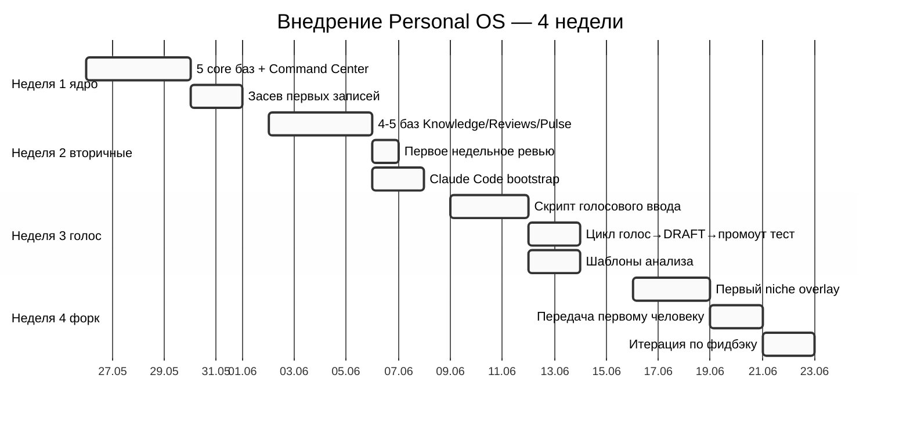
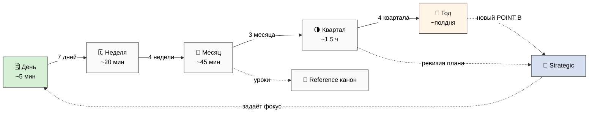

# Phase 8 — 7 схем (mermaid)

> Светлый фон, тёмный текст, читаются без расширений. 10-20 узлов на схему, без жаргона.
> Каталог — `diagrams/_INDEX.md`.

---

## NT-1 — Фундамент из 11 кирпичей → облегчённая Notion-версия

---

## NT-2 — Структура воркспейса (базы + Command Center + связи)

---

## NT-3 — Голос → распределение по базам

---

## NT-4 — Claude Code ↔ Notion синхронизация (кто главный)

---

## NT-5 — Форк: универсальный слой + ниша

---

## NT-6 — Дорожная карта внедрения (Неделя 1 → 4)

---

## NT-7 — Каскад ревью (день → год)

---

*Phase 8 (схемы) closure 2026-05-24. 7 mermaid: NT-1 мэппинг / NT-2 структура / NT-3
голос / NT-4 синк / NT-5 форк / NT-6 дорожная карта / NT-7 каскад ревью. Светлый фон,
читаемы без расширений.*
