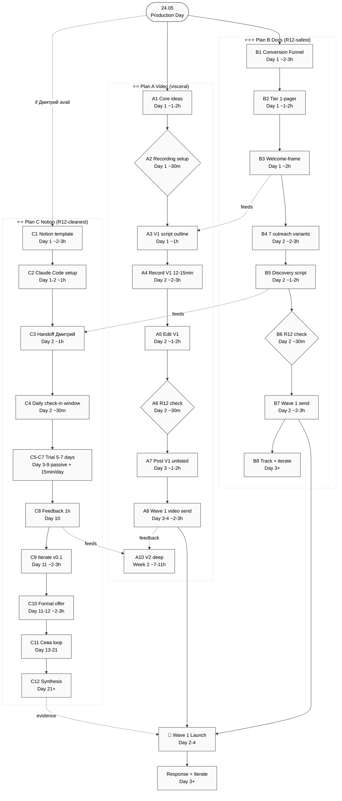

# PD01 — 3-Plan Flow Comparison

Plan B / Plan A / Plan C sequences side-by-side с key milestones.

---

## Key milestones

- **Day 2 (25.05):** Plan B Wave 1 send (B7) + Plan A V1 record (A4)
- **Day 3-4:** Plan A Wave 1 video send (A8) + Plan C handoff (C3)
- **Day 10-12:** Plan C feedback + formal offer (C8+C10) + Plan A V2 (A10)
- **Day 21+:** Plan C synthesis (C12) → Wave 1 substrate evidence

## Cross-plan feeds

- B3 Welcome-frame → A3 V1 script (Block 5 R12 paired-frame)
- B5 Discovery script → C3 handoff structure
- C8 feedback → A10 V2 (refined claims)

---

*PD01 closure 2026-05-24.*
