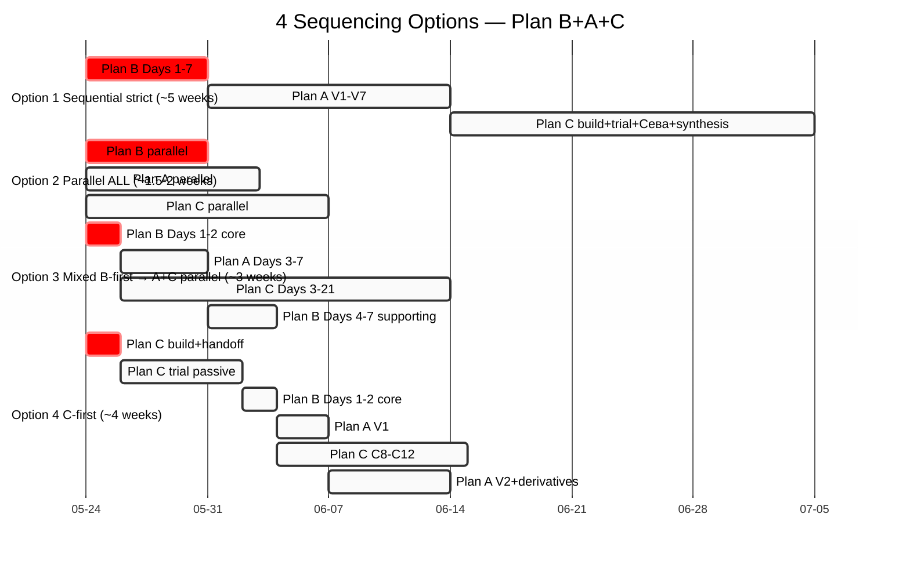

# PD02 — 4 Sequencing Options visual

Visual comparison Option 1/2/3/4 timelines.

---

## Per-option Wave-1 launch day

| Option | Wave 1 launch |
|---|---|
| Option 1 Sequential strict | Day 7+ |
| Option 2 Parallel ALL | Day 2 |
| **Option 3 Mixed (default)** | **Day 2** |
| Option 4 C-first | Day 10-12 |

## Per-option focus characteristic

- **Option 1:** Lowest risk; lowest energy; slowest Wave 1
- **Option 2:** Highest speed; highest risk (focus dilution)
- **Option 3:** Best compound (B→A→C cross-feed); balanced
- **Option 4:** Real-test evidence first; highest credibility; slowest

---

*PD02 closure 2026-05-24.*
