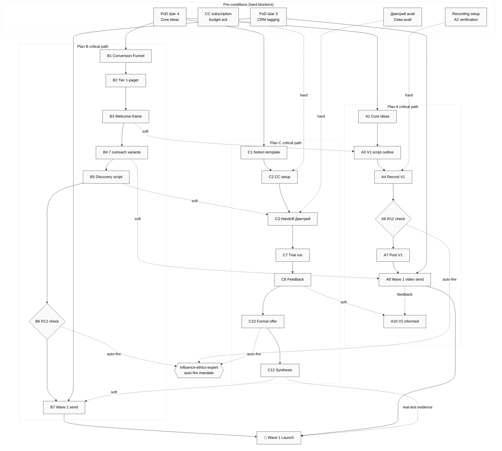

# PD03 — Dependency Graph

Inter-plan + intra-plan dependencies.

---

## Hard dependencies (blocking)

| Dependency | Blocks |
|---|---|
| Recording setup (A2) | Plan A entire chain |
| Дмитрий avail | Plan C C3+ chain |
| CC subscription budget | Plan C C2+ chain |
| PoD Шаг 4 core ideas | All 3 plans content |
| PoD Шаг 3 CRM tagging | Wave 1 send (B7/A8) |
| R12 check (B6/A6) | Wave 1 send (B7/A8) |

## Soft dependencies (informing)

- B3 Welcome-frame → A3 V1 script (parallel-developable)
- B4 outreach variants → A8 video Wave 1 send (cross-ref)
- B5 Discovery script → C3 handoff (parallel-developable)
- C8 feedback → A10 V2 (V2 delayed if no C8)
- C12 synthesis → B7 iterate (Wave 1 evidence enrichment)

---

*PD03 closure 2026-05-24.*
