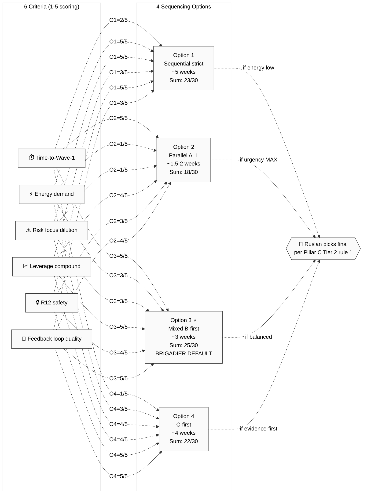

# PD04 — Decision Matrix

6-criterion scoring across 4 sequencing options.



---

## Decision tree

```
Recording setup ready (A2)?
   ├── NO → Plan B first; Options 1, 3, 4 (без Plan A initial)
   └── YES → continue

Дмитрий + Сева avail?
   ├── NO → Plan C archive; Options 1, 2, 3 (без Plan C)
   └── YES → continue

Speed urgency?
   ├── YES → Option 2 (Parallel) OR Option 3 (Mixed)
   └── NO → continue

Real-test evidence priority?
   ├── YES → Option 4 (C-first)
   └── NO → continue

Energy unclear / unsustainable parallel?
   ├── YES → Option 1 (Sequential strict)
   └── NO → DEFAULT Option 3 (Mixed)
```

---

## Per-criterion priority weighting

User re-weighting examples:
- **Speed urgent:** Time × 2 → Option 2/3 favored
- **Energy preservation:** Energy × 2 → Option 1 favored
- **Authority > speed:** Leverage + R12 × 2 → Option 3/4 favored
- **Real-test evidence priority:** Feedback × 2 → Option 4 favored

---

*PD04 closure 2026-05-24.*
