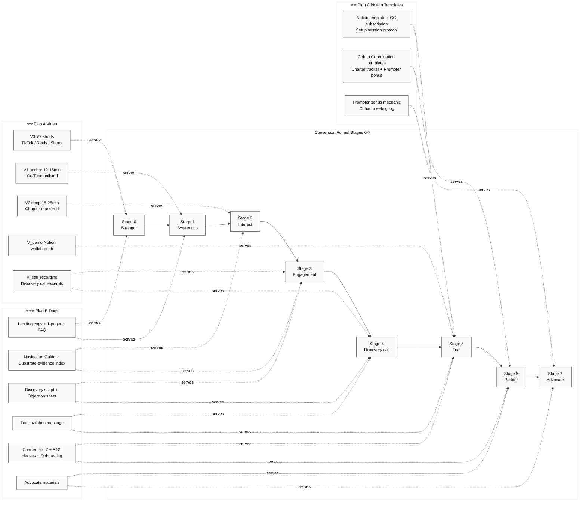

# PD05 — Funnel Coverage

PoD 24.05 Stages 0-7 × Plan B/A/C contribution mapping.

---

## Coverage matrix

| Stage | Plan B contribution | Plan A contribution | Plan C contribution |
|---|---|---|---|
| **Stage 0 Stranger** | Landing + 1-pager + FAQ | V3-V7 shorts | – |
| **Stage 1 Awareness** | Landing + 1-pager | V1 anchor | – |
| **Stage 2 Interest** | Navigation Guide + substrate-evidence index | V1 anchor + V2 deep | – |
| **Stage 3 Engagement** | Substrate evidence + CTA | V2 deep + V_call_recording | – |
| **Stage 4 Discovery** | Discovery script + objection sheet | V_call_recording | – |
| **Stage 5 Trial** | Trial invitation message + Charter L5/L6 templates | V_demo | Notion template + CC setup + handoff protocol |
| **Stage 6 Partner** | Charter L4/L5/L6/L7 + Onboarding | – | Cohort Coordination templates + Charter tracker |
| **Stage 7 Advocate** | Advocate materials | – | Promoter bonus + Cohort meeting log |

## Plan coverage strength

| Plan | Primary stages | Secondary stages | Coverage strength |
|---|---|---|---|
| **Plan B Docs** | 0-7 (broadest coverage) | All stages | ⭐⭐⭐ (complete funnel) |
| **Plan A Video** | 0-4 (top of funnel) | 5 (V_demo) | ⭐⭐ (top-funnel emphasis) |
| **Plan C Notion** | 5-7 (bottom of funnel) | – | ⭐⭐ (trial+partner emphasis) |

## Combined coverage

3 plans together = **complete Stage 0-7 funnel coverage** с redundancy на Stages 2-5 (most-critical engagement stages).

---

*PD05 closure 2026-05-24.*
