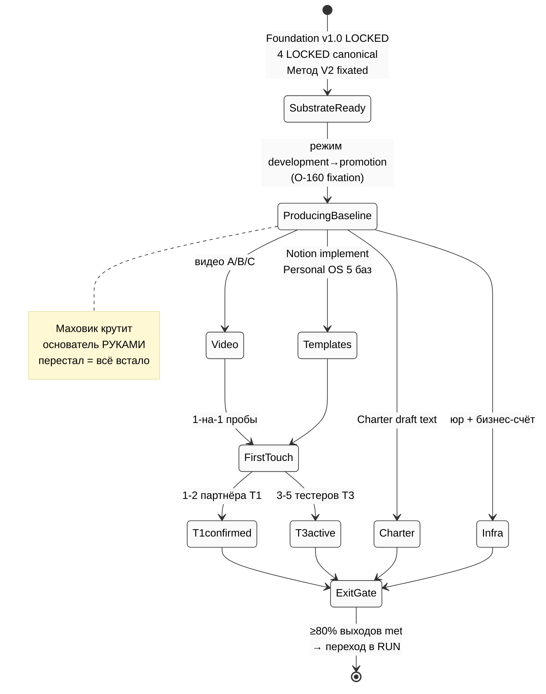
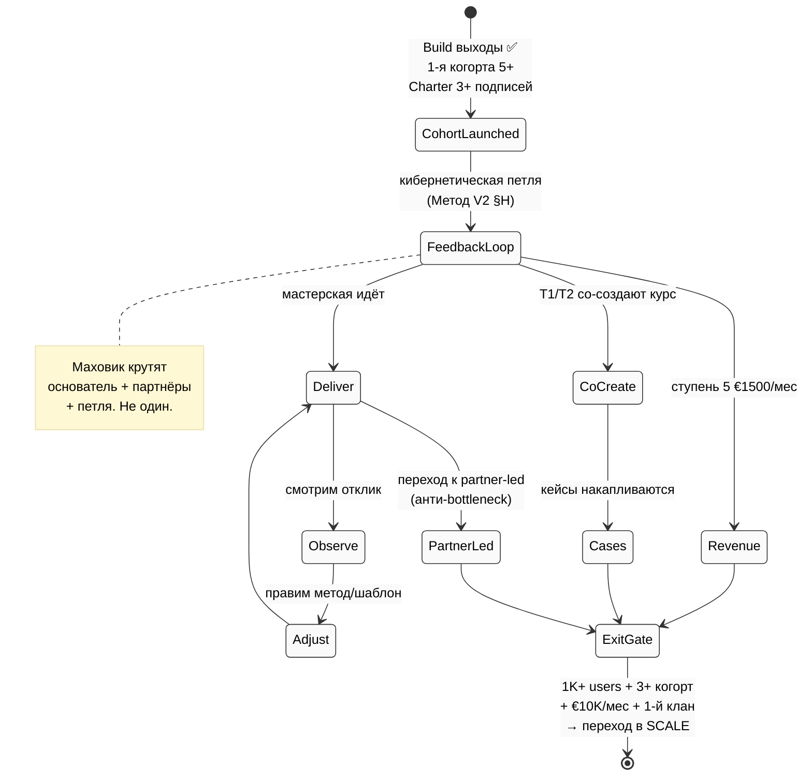
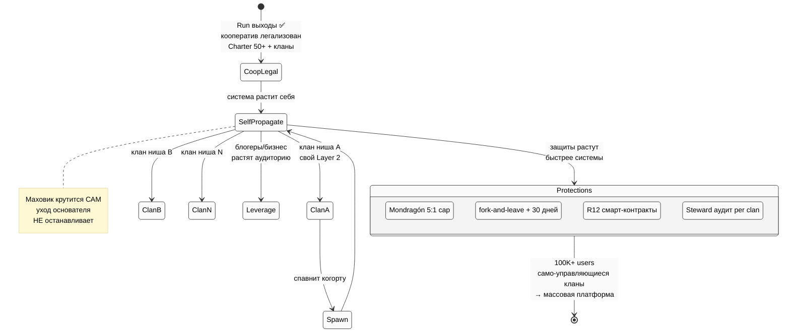

# 🏗️▶️📡 Phase 2 — Три этапа платформы: Build / Run / Scale

> **Зачем эта фаза.** Это сердцевина всего плана. Здесь определяем три этапа так, чтобы их
> нельзя было перепутать: по каким **видимым признакам** я понимаю, на каком этапе нахожусь;
> что должно быть **зафиксировано на входе**; что нужно **достичь для перехода дальше**; и
> какие **ловушки** маскируются под этап. Главный закон уже из Phase 0: этап определяется
> не числом людей, а тем, **кто крутит маховик системы.**

---

## §A 🏗️ Build Stage — строим фундамент

### Определение (FPF)

**System-under-construction.** Система собирается руками. Основатель — главный и почти
единственный механизм. Методология зафиксирована на бумаге (Метод V2 LOCKED), но ещё **не
проверена третьими людьми.** Идут первые пробы 1-на-1. Доход = 0 или из своих сбережений.

### Видимые признаки (что я вижу, когда я в Build)

- Большая часть работы — основатель **один.**
- Разговоры с партнёрами — **1-на-1**, не группой.
- Доход = 0 или личные сбережения; платящих участников нет.
- Методология лежит на бумаге, её **никто снаружи ещё не прогнал** на себе.
- Notion-шаблоны = дизайн-уровень, не рабочие копии у пользователей.
- Маховик крутит руками основатель: перестал крутить → всё встало.

### Вход в Build (что должно быть зафиксировано, чтобы войти) — ✅ уже выполнено

- Foundation v1.0 LOCKED ✅ (28.04.2026)
- 4 LOCKED canonical существуют ✅
- Метод V2 зафиксирован ✅
- Решение основателя делать проект ✅

Иначе говоря — **мы уже внутри Build, в его средней части.** Вход пройден ещё в апреле-мае.

### Выход из Build (что достичь, чтобы перейти в Run)

1. 3-5 видео записано (A метод / B как учим / C платформа)
2. Notion-шаблоны **внедрены** (Personal OS ядро 5 баз + Team OS demo-воркспейс)
3. Charter — готов текст для подписи
4. 1-2 партнёра T1 подтверждены (методология проверена снаружи)
5. 3-5 тестеров T3 активны (Дмитрий / Сева / ближний круг)
6. Discovery-звонок отрепетирован (≥5 раз)
7. Юр. оформление начато (решение Einzelunternehmen/GmbH/UG сделано, документы поданы)
8. Базовая финансовая система (бизнес-счёт + начало bookkeeping)

### Анти-паттерны (что путают с Build / ловушки этапа)

- **«Накопление substrate = прогресс».** Нет. Накопление — это вход в Build, а **выход = к
  исполнению.** Ещё одна вики/книга/документ не приближает к Run. (Это и есть фиксация O-160:
  режим development закончен → продвижение.)
- **«Идеализирую методологию».** Перфекционизм. Потолок — «достаточно хорошо → выпускаем».
- **«Жду идеального партнёра».** Ловушка ожидания. 1 подтверждённый > 10 рассматриваемых.
- **«Записать все 5 шаблонов сразу».** Нет. Сделай шаблон Дмитрия + скрипт звонка — хватит,
  чтобы начать; остальные — по мере того как живые люди упираются в реальность.

[src: execution-plan §3 + §6 + §7; consolidated-hl §8 «сейчас»; Point B §2;
O-160 development→promotion `wiki/concepts/development-promotion-mode-transition.md`;
personal-os §10 Week 1]

### Mermaid — Build stage state diagram

---

## §B ▶️ Run Stage — платформа работает как цикл

### Определение (FPF)

**Operating-system с активной обратной связью.** Кибернетическая петля включена (Метод V2 §H
meta-control): делаем → смотрим отклик → правим → снова. Когорта 5-50 первых основателей.
Доход течёт. Методологию проверяют несколько человек одновременно. Charter подписан.

### Видимые признаки

- Мастерская идёт **с участниками**, не только с основателем.
- Доход течёт: ступень 5 (≈€1500/мес) — первые начали платить.
- Когорта 5-50 основателей в активной пробе.
- Charter подписан несколькими участниками.
- Методологию тестируют N человек **одновременно** (не последовательно 1-на-1).
- 1-2 партнёра T1/T2 активно **со-создают** (курс, контент).
- Маховик крутят основатель + первые партнёры + петля обратной связи. Основатель **уже не
  единственный** движок.

### Вход в Run

- Все выходы из Build ✅
- + 1-я когорта мастерской запущена (5+ участников)
- + Charter подписан ≥3 участниками
- + Первый доход собран

### Выход из Run (что достичь, чтобы перейти в Scale)

1. 1K+ пользователей (потребители substrate, не все основатели)
2. Несколько когорт параллельно (3+)
3. Доход €10K/мес+ стабильно
4. Методология имеет 100+ задокументированных кейсов
5. Появился первый клан / суб-сообщество органически
6. Programmable Ethereum overlay (Phase 2+) внедрён — **если выбран этот путь**
7. Часть когорты-основателей перешла в роли консультант/ментор (T4 активен)

### Анти-паттерны

- **«Бесконечно жду идеальную методологию».** Блокер. Выпускай на 80%.
- **«Только сам веду мастерские».** Бутылочное горло основателя. Переход к partner-led
  обязателен — иначе Run не масштабируется в Scale.
- **«Закрытое сообщество избранных».** Нарушение R12. Fork-and-leave должен сохраняться.
- **«Признание = превосходство».** Тонкая грань: «когорта-основатель 2026» как признание —
  хорошо; как «элитарный клуб» — семя секты.

[src: consolidated-hl §8 «конец 2026 + 2027»; Method V2 §H meta-control; execution-plan §5;
partner-offering §3 L5/L6; Point B §4 cohort growth L4→L7]

### Mermaid — Run stage state diagram

---

## §C 📡 Scale Stage — система растит сама себя

### Определение (FPF)

**Self-propagating system.** Несколько кланов параллельно. Кооперативное управление
(Mondragón). R12 anti-extraction защищён (механически, если включён Ethereum overlay).
Fork-and-leave сохранён. Траектория кланы → массовая платформа.

### Видимые признаки

- Несколько кланов/суб-сообществ параллельно — **не один центр.**
- Аудитория растёт через **блогеров/предпринимателей** (leverage), не через рассылки
  основателя.
- Доход распределяется по revenue-share шаблонам (Economic V10).
- Потолок неравенства Mondragón 5:1 — соблюдается.
- Programmable Ethereum overlay в работе (если включён).
- Основатель — **один из многих хранителей**, не единоличная власть.
- Маховик крутится **сам**; уход одного человека (включая основателя) его не останавливает.

### Вход в Scale

- Все выходы из Run ✅
- + Кооперативное управление легализовано
- + Charter массово подписан (50+)
- + Несколько кланов активны

### Выход из Scale (трансформация в следующее — mega-corp / массовая платформа)

1. 100K+ пользователей
2. Само-управляющиеся кланы без надзора основателя
3. Рекурсивный спавн когорт (когорта порождает когорту)
4. Траектория к огромной капитализации заякорена

### Анти-паттерны (на Scale они самые опасные)

- **«Основатель удерживает контроль».** Коррупция кооператива (Mondragón нарушен). Основатель
  обязан стать одним из многих, иначе это обычная корпорация с диктатором.
- **«Скрытые шорткаты ради быстрого роста».** Нарушение R12 + риск секты.
- **«Все кланы одинаковые».** Монокультура; нет разнообразия ниш. Layer 2 должен быть разный.
- **«Запереть юридически».** Lock-in через legal trap — прямое нарушение fork-and-leave.

[src: consolidated-hl §8 «2028+»; Economic V10 Mondragón 5:1 + R12 overlay;
CLAUDE.md §4.2 R12 programmable Ethereum 4 action classes; partner-offering §7]

### Mermaid — Scale stage state diagram + защиты Mondragón/R12

---

## §D Один взгляд: чем три этапа отличаются (сводная)

| Признак | 🏗️ Build | ▶️ Run | 📡 Scale |
|---|---|---|---|
| **Кто крутит маховик** | основатель руками | основатель + партнёры + петля | сам, без основателя |
| **Люди** | 1-на-1 пробы | когорта 5-50 | 1K-100K+ в кланах |
| **Деньги** | 0 / сбережения | €1.5-15K/мес | распределённый кооператив |
| **Методология** | на бумаге, не проверена | проверяется N людьми | форкается под кланы |
| **Основатель** | главный механизм | переходит к guidance | один из хранителей |
| **R12-риск** | низкий | средний | **высокий ⚠️** |
| **Главная задача** | выпустить baseline | включить петлю + partner-led | защитить от секты/диктатуры |
| **Когда (направление)** | сейчас — июль 2026 | конец 2026 — 2027 | 2028+ |

---

## §E ⭐ Mermaid PL-1 — три этапа: прогресс Build → Run → Scale с входами/выходами

```mermaid
%%{init: {'theme':'base', 'themeVariables': {'primaryTextColor':'#000000','textColor':'#000000','lineColor':'#333333','primaryBorderColor':'#333333','primaryColor':'#fafafa','noteTextColor':'#000000','noteBkgColor':'#fff8d5'}}}%%
graph LR
    subgraph BUILD[🏗️ BUILD — строим руками]
        B_in[ВХОД ✅<br/>Foundation LOCKED<br/>4 canonical<br/>Метод V2]
        B_work[основатель solo<br/>видео A/B/C<br/>5 шаблонов<br/>1-на-1 пробы]
        B_out[ВЫХОД<br/>видео готовы<br/>Notion implemented<br/>1-2 T1 + 3-5 T3<br/>Charter draft<br/>юр + счёт]
        B_in --> B_work --> B_out
    end
    subgraph RUN[▶️ RUN — работает как цикл]
        R_in[ВХОД<br/>+ когорта 5+<br/>+ Charter 3+ подписей<br/>+ первый доход]
        R_work[кибернетич. петля<br/>когорта 5-50<br/>€1.5-15K/мес<br/>T1/T2 со-создают<br/>partner-led переход]
        R_out[ВЫХОД<br/>1K+ users<br/>3+ когорт<br/>€10K/мес+<br/>100+ кейсов<br/>1-й клан + T4]
        R_in --> R_work --> R_out
    end
    subgraph SCALE[📡 SCALE — растит сама себя]
        S_in[ВХОД<br/>+ кооператив legal<br/>+ Charter 50+<br/>+ кланы]
        S_work[N кланов parallel<br/>блогер/бизнес leverage<br/>Mondragón 5:1<br/>основатель = 1 из многих]
        S_out[→ массовая платформа<br/>100K+ users<br/>само-управление<br/>рекурсивный спавн]
        S_in --> S_work --> S_out
    end
    B_out ==>|≥80% выходов| R_in
    R_out ==>|1K + 3 когорты + €10K| S_in
    B_work -.анти: накопление substrate.-> TRAP1[🚫 ловушка Build]
    R_work -.анти: founder bottleneck.-> TRAP2[🚫 ловушка Run]
    S_work -.анти: founder удерживает контроль.-> TRAP3[🚫 ловушка Scale]
    style BUILD fill:#d6f0d6,color:#000
    style RUN fill:#cce6ff,color:#000
    style SCALE fill:#ffe0a0,color:#000
    style TRAP1 fill:#ffcccc,color:#000
    style TRAP2 fill:#ffcccc,color:#000
    style TRAP3 fill:#ffcccc,color:#000
```

---

*Phase 2 closure. 3 этапа определены: FPF-определение + видимые признаки + входы/выходы +
анти-паттерны + 3 state diagrams + PL-1. F2-F3 derivative. R1 surface only. NO LOCK modified.*
