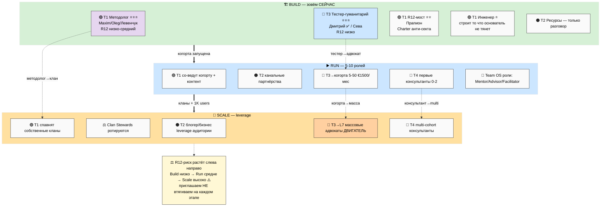

# 🤝 Phase 3 — Кого зовём на каждом этапе

> **Зачем эта фаза.** «Партнёры» — это не толпа. На каждом этапе нужны **разные люди для
> разных функций.** Здесь три матрицы: (A) 4 типа партнёров × этапы, (B) 6 архетипов × этапы,
> (C) лесенка вовлечённости L1-L7 × этапы. И прямой ответ: кого зовём в Build **сейчас**,
> кого в Run, кого в Scale.
>
> **R12 paired-frame (influence-ethics auto-fire).** Везде где речь про «зовём / пишем /
> приглашаем» — это касание человека. Поэтому в каждой матрице есть колонка R12-риска, и
> правило одно: **приглашаем, не втягиваем.** IP-1: имена ниже = примеры ролей-типов, не
> назначенные исполнители.

---

## §A Матрица 1 — 4 типа партнёров × этапы (4 × 3)

| Тип | 🏗️ Build | ▶️ Run | 📡 Scale |
|---|---|---|---|
| **T1 Методология** | **YES, приоритет.** Со-создание метода, отзыв на курс, проверка substrate. #: 1-2 confirmed. R12: низко-средний (споры о терминах + соблазн присвоить вклад). Примеры: Maxim/Oleg/Левенчук/Прапион | **YES.** Со-ведёт когорту, создаёт контент курса, расширяет метод. #: 2-3. R12: средний (со-авторство → споры о долях) | **YES.** Ведёт собственный клан, рекурсивный форк метода. #: N. R12: средний (clan governance) |
| **T2 Ресурсы** | **разговор, не сделка.** Доступ к аудитории (но не доим), капитал на runway (€2-5K). #: 1 разговор начат. R12: средний (соблазн выжать чужую базу) | **YES.** Канальные партнёрства, со-бренд. #: 1-2. R12: средний-высокий (revenue flow = больше соблазнов) | **YES, leverage.** Блогеры/бизнес растят аудиторию (приглашают, не extract). R12: высокий ⚠️ |
| **T3 Аудитория** | **YES.** Тестеры: 1-2ч времени + честный отзыв + черновик Charter. #: 3-5 активны. R12: низко (всё бесплатно, fork-and-leave) | **становятся когортой.** €1500/мес ступень 5+ + участие + органичная адвокатура. #: 5-50. R12: средний (теперь платят) | **массовые адвокаты.** Органичное распространение + создание контента. #: 1K-100K. R12: высокий (масса = риск секты) |
| **T4 Консультанты** | **НЕ активен** (слой доставки рано). | **появляется.** Доставка консультаций + ведение суб-когорт. #: 0-2. R12: высоко ⚠️ (ближе всего к соблазнам) | **multi-cohort.** Масштабированная доставка через много кланов. R12: высоко ⚠️ |

**Чтение матрицы.** Build = T1 + T3 (методологи проверяют метод, тестеры ломают инструмент);
T2 только начинаем разговор; T4 молчит. Run = все четыре включаются, T4 рождается из T1+T3.
Scale = T1 спавнят кланы, T2 = leverage аудитории, T3 = масса, T4 = multi-cohort. **R12-риск
по всем типам растёт слева направо** — это сквозной закон.

[src: execution-plan §5 T1-T4 + сводная таблица; outreach-content §8.2 per-stage R12;
partner-offering §3 тиры]

### R12 8-вопросов — применение к Build-акторам (пример T1 × Build)

1. Цена ≤ польза? — методолог тратит время на pre-validation систему без гарантий → честно
   об этом говорим.
2. Конкретно? — Build = недоделанная система; честность про pre-MVP состояние.
3. Соразмерно отношениям? — методологу **не суём долю немедленно**; тестерам не доим время.
4. По ступени? — T1 знают, что метод pre-validation; T3 знают, что инструмент — черновик.
5. Канал уместен? — Telegram/email + голосовой звонок для T1.
6. Не доим / не запираем? — T2-аудиторию НЕ extract; fork-and-leave сохранён.
7. Нет манипуляции? — никакой фейк-срочности («осталось 3 места»); честное «строим — будь
   среди первых».
8. Стоп-сигнал готов? — actor говорит «нет» → drop без давления.

[src: execution-plan §4 «8 вопросов»; outreach-content §8.1 R12 action classes]

---

## §B Матрица 2 — 6 архетипов × этапы (6 × 3)

Архетип = по специальности человека. Колонка = на каком этапе входит, через какой CTA, какой
размер, какой leverage.

| Архетип | 🏗️ Build | ▶️ Run | 📡 Scale |
|---|---|---|---|
| **Инженер (Karpathy-tier)** | вход CTA-05 разбор → CTA-10 L4. Размер: 1-2. Leverage: строит инструмент/код платформы (то что основатель сам не делает). R12 низкий | со-создаёт MVP, compound builder. 2-3 | архитектор само-распр. систем; смарт-контракты overlay. N |
| **Исследователь** | вход CTA-11 co-create + CTA-09. Размер: 1-2. Leverage: провенанс, методологическая строгость, SOTA. R12 низкий | валидирует метод научно, пишет кейсы | академический мост к университетам; масштаб доверия |
| **YouTuber / Creator** | вход CTA-09 L5. Размер: 0-1. Leverage: **аудитория** (главный множитель в Scale). R12 **высокий** (сеть = MLM-риск) | приводит первых тестеров из аудитории (приглашает, не extract) | **главный двигатель Scale** — leverage охвата; R12 STRICT анти-MLM |
| **Методолог (Левенчук-tier)** | вход CTA-10 L4. Размер: 1-2. Leverage: канонический источник метода; substrate готов. R12 **высокий** (присвоение лексики + cross-tradition) | со-ведёт когорту, расширяет метод | спавнит метод-клан с собственной школой |
| **Предприниматель** | вход CTA-09/CTA-10. Размер: 1. Leverage: запуск + ресурсы + runway. R12 средне-высокий (extract-Jetix-model + ROI-давление) | строит бизнес-направление когорты | масштабирует клан как предприятие; revenue-share |
| **(опц.) Гуманитарий (Дмитрий-style)** | вход CTA-09 relational. Размер: 1-2 (Дмитрий ✅, Сева). Leverage: проверка на не-инженере (работает для него → для многих). R12 средне-высокий (cult-frame, story extraction) | амбассадор для гуманитарной аудитории | мост к массовой не-технической аудитории |

**Чтение.** В Build приоритет — **методолог + инженер** (проверяют метод и строят то, что
основатель сам не тянет) **+ гуманитарий-тестер** (Дмитрий — проверка на не-инженере). YouTuber
и предприниматель — их главная ценность (аудитория, масштаб) разворачивается в Run/Scale, не в
Build. Поэтому звать их в Build = рано тратить дорогой контакт.

[src: outreach-content §6.1 + OC-04 per-archetype voice; execution-plan §4 направление B]

---

## §C Матрица 3 — лесенка вовлечённости L1-L7 × этапы (7 × 3)

L1-L7 здесь = **лесенка вовлечённости** (параллельна Bloom-ступеням): L1 Любопытный → L7
Массовый адвокат. Это «насколько глубоко человек внутри».

| Уровень | Что значит (Bloom-эквивалент) | 🏗️ Build | ▶️ Run | 📡 Scale |
|---|---|---|---|---|
| **L1 Любопытный** | услышал (Awareness) | основатель сам + ближний круг видят черновики | приходят с видео/лендинга | приходят массово через блогеров |
| **L2 Заинтересованный** | понимает (Interest) | редкие 1-на-1 | читатели материалов | масса читателей |
| **L3 Применяющий** | применяет (Engagement) | Дмитрий/Сева пробуют шаблон | первые когорты применяют | тысячи применяют |
| **L4 Диагностирующий** | анализирует (Discovery) | разбор-звонок отрепетирован основателем | разбор-звонки идут с участниками | массово-обученные консультанты ведут |
| **L5 Оценивающий** | оценивает (Trial) | — (нет ещё trial-когорты) | ступень 5 €1500/мес активна | trial-когорты во всех кланах |
| **L6 Создающий** | создаёт (Partner) | 1-2 партнёра T1 (ранние со-создатели) | партнёры со-создают курс/контент | со-создатели в каждом клане |
| **L7 Массовый адвокат** | передаёт (Advocate) | — | первые адвокаты | **двигатель Scale** — адвокаты растят сами |

**Чтение.** В Build реально достижимы **L1-L4 + точечно L6** (1-2 ранних со-создателя). L5
(платящая trial-когорта) и L7 (массовые адвокаты) — это уже Run/Scale. Попытка «сразу набрать
L7-адвокатов» в Build = анти-паттерн Bloom-violation (premature commitment) → R12 флаг.

[src: outreach-content §4 Bloom + §5.2 per-stage CTA matrix; Point B §10 D7 funnel;
prompt §3 Phase 3 §C]

---

## §D Кого зовём на каждом этапе — прямой ответ

### 🏗️ Build (сейчас) — 3-5 конкретных ролей

| Роль (тип) | Зачем именно сейчас | Приоритет outreach | Пример |
|---|---|---|---|
| **Методолог-партнёр (T1)** | проверить метод снаружи + найти со-создателя | ⭐⭐⭐ P1 | Maxim / Oleg / Левенчук |
| **Тестер-гуманитарий (T3)** | проверка инструмента на не-инженере | ⭐⭐⭐ P1 (уже идёт) | Дмитрий ✅ |
| **Тестер-другой-домен (T3)** | другой взгляд (крипто) | ⭐⭐ P2 | Сева |
| **R12-мост / методолог-этик (T1)** | проверить Charter на анти-секту | ⭐⭐ P2 | Прапион |
| **Инженер-строитель (T1)** | строить то, что основатель сам не тянет | ⭐ P3 (по триггеру) | Ilshat / Ivan |

**Не зовём в Build:** массовых адвокатов, платящие когорты, консультантов T4, блогеров ради
охвата. Рано — дорогие контакты сгорят на недоделанной системе.

### ▶️ Run — 5-10 ролей

Со-ведущие когорту (T1 facilitators) + канальные партнёры (T2) + первая платящая когорта 5-50
(T3→L5) + первые консультанты T4 (из T1+T3) + ментор/советник роли (Team OS). Профили целевой
когорты — per `cohort-target-profile-ontology` (добровольный opt-in, demographic-agnostic).

### 📡 Scale — leverage-роли

Блогер/инфлюенсер/предприниматель (T2 leverage аудитории) + clan steward роли (ротируются) +
массовые адвокаты (T3→L7) + multi-cohort консультанты (T4). Двигатель роста смещается с
outreach основателя на leverage чужих аудиторий.

[src: execution-plan §3 «чего не делает сам» + §5; Point B §3-4 cohort; consolidated-hl §8]

---

## §E ⭐ Mermaid PL-2 — карта акторов по этапам

---

*Phase 3 closure. 3 матрицы акторов (T1-T4 × stages / 6 архетипов × stages / L1-L7 × stages)
+ кого зовём per stage + R12 8-Q + PL-2. R12 paired-frame STRICT (приглашаем не втягиваем).
IP-1 STRICT (имена = примеры). F2-F3 derivative. R1 surface only.*
